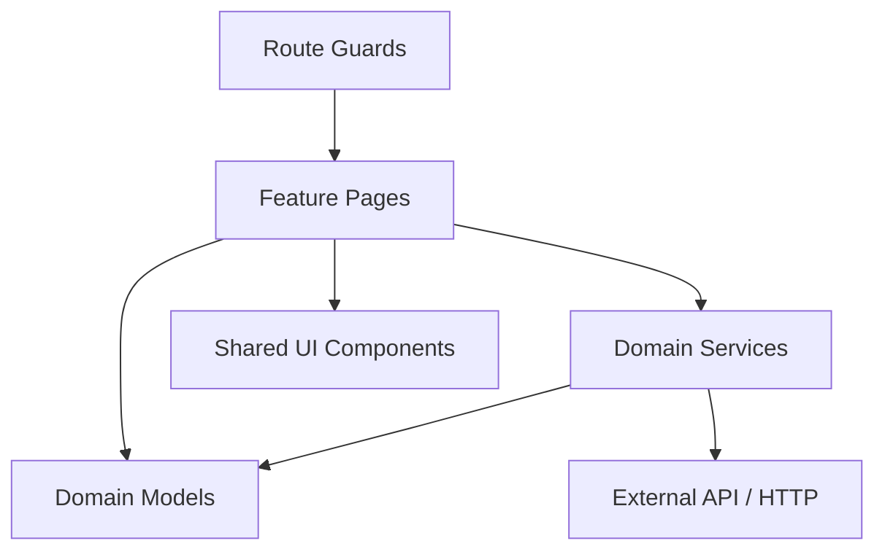

<!-- SpecDriven:managed:start -->
# Architecture Overview

## High-Level Architecture
This application is an Angular 20+ standalone application following a domain-driven architectural approach. It organizes code physically by feature sub-domains while sharing generic UI constructs in a central location.

## Dependency and System Boundaries

## Domains
The core bounded contexts align with user activities:
- `auth`: Login, registration, permissions
- `app`: Main authenticated shell and features (campaigns, rankings, achievements)

Everything is strictly modular at the folder level, using `standalone` components rather than `NgModules` to compose tree structures dynamically.
<!-- SpecDriven:managed:end -->
