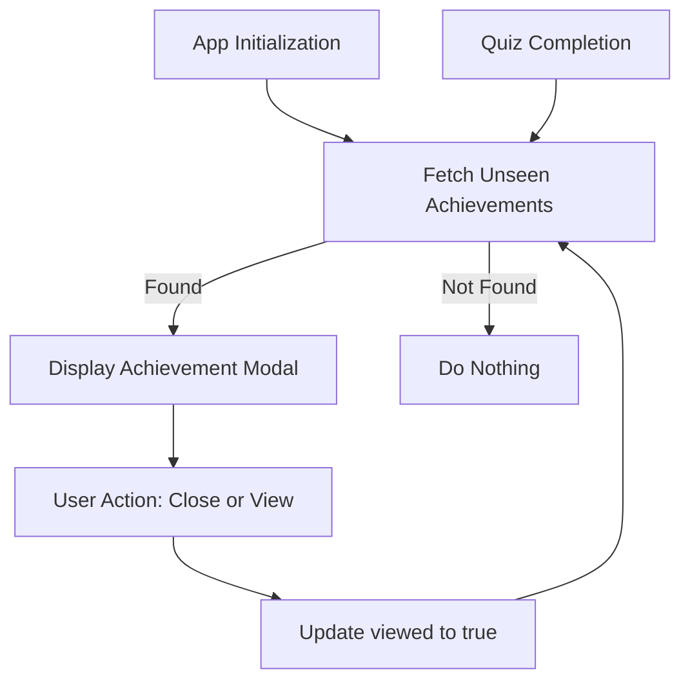
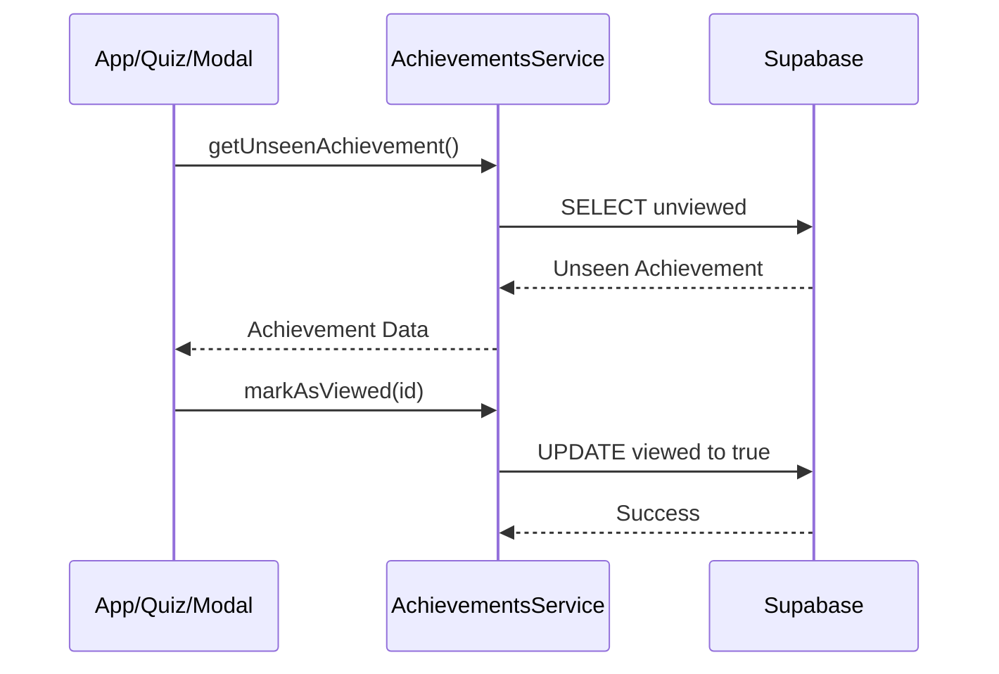
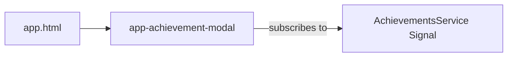
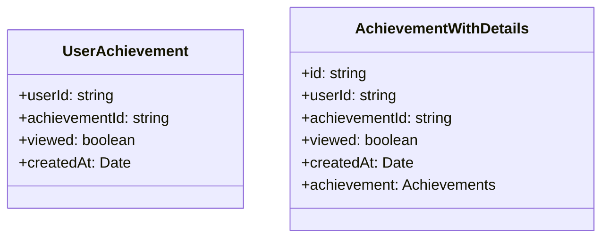

# Design Document

## Overview

The application will present a newly earned achievement to the user through a modal overlay (`AchievementModalComponent`). This modal checks for unviewed achievements both when the user opens the application (`App` component initialization) and when they successfully complete a quiz (`Quiz` component). The modal handles the presentation of the achievement details and ensures the `viewed` state is updated in Supabase upon interaction (closing or navigating to the achievements page).

### Change Type

enhancement

### Design Goals

1. Create an isolated, reusable modal component for displaying achievements.
2. Ensure the check for new achievements occurs seamlessly at key user journey points (app start, quiz completion).
3. Implement a recursive checking mechanism to display multiple unviewed achievements sequentially.

### References

- **REQ-1**: Check for Unseen Achievements
- **REQ-2**: Display Achievement Modal
- **REQ-3**: Handle Modal Closure

## System Architecture

### DES-1: Achievement Modal Component

A standalone Angular component (`src/app/components/achievement-modal/achievement-modal.ts`) responsible for rendering the achievement alert. It uses Tailwind CSS for the layout, glassmorphism overlay, and entry/exit animations. It maintains an internal state using Signals to toggle its visibility and store the currently displayed achievement data. It listens for unviewed achievements and updates the Supabase table when closed.

_Implements: REQ-2.1, REQ-2.2, REQ-2.3, REQ-2.4, REQ-2.5_

### DES-2: Achievement Service Extensions

The `AchievementsService` will be extended with methods to:
1. Fetch the first unviewed achievement for the logged-in user (`getUnseenAchievement()`), joining with the `achievements` table to retrieve image, name, and requirements.
2. Mark an achievement as viewed (`markAsViewed(userAchievementId)`).

_Implements: REQ-1.1, REQ-1.2, REQ-3.1, REQ-3.3, REQ-3.4_

### DES-3: Application Integration Hooks

The modal check will be integrated in two places:
1. `src/app/app.ts`: OnInit lifecycle hook checks for unseen achievements upon app load.
2. `src/app/pages/app/quiz/quiz.ts`: `continueQuiz` method checks for unseen achievements when the quiz is successfully completed and passed.
To avoid duplicating the modal HTML, the `<app-achievement-modal>` will be placed in the root `app.html`, and it will react to a global Signal in the `AchievementsService`.

_Implements: REQ-1.1, REQ-1.2, REQ-3.2_

## Code Anatomy

| File Path | Purpose | Implements |
|-----------|---------|------------|
| src/app/components/achievement-modal/ | Standalone modal component, UI, and animation logic | DES-1 |
| src/app/services/achievements.ts | Data fetching and updating for unseen achievements | DES-2 |
| src/app/app.ts | Trigger unseen check on app load | DES-3 |
| src/app/app.html | Global placement of the modal component | DES-3 |
| src/app/pages/app/quiz/quiz.ts | Trigger unseen check on quiz completion | DES-3 |

## Data Models

## Traceability Matrix

| Design Element | Requirements |
|----------------|--------------|
| DES-1 | REQ-2.1, REQ-2.2, REQ-2.3, REQ-2.4, REQ-2.5 |
| DES-2 | REQ-1.1, REQ-1.2, REQ-3.1, REQ-3.3, REQ-3.4 |
| DES-3 | REQ-1.1, REQ-1.2, REQ-3.2 |
