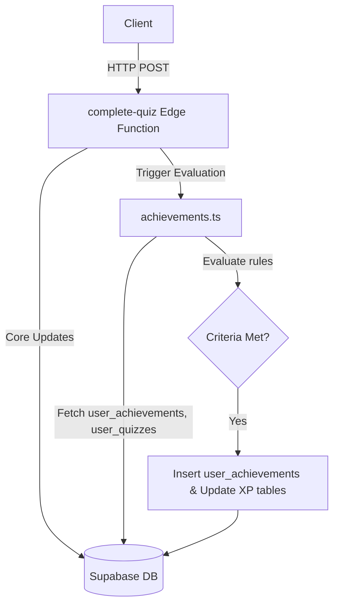
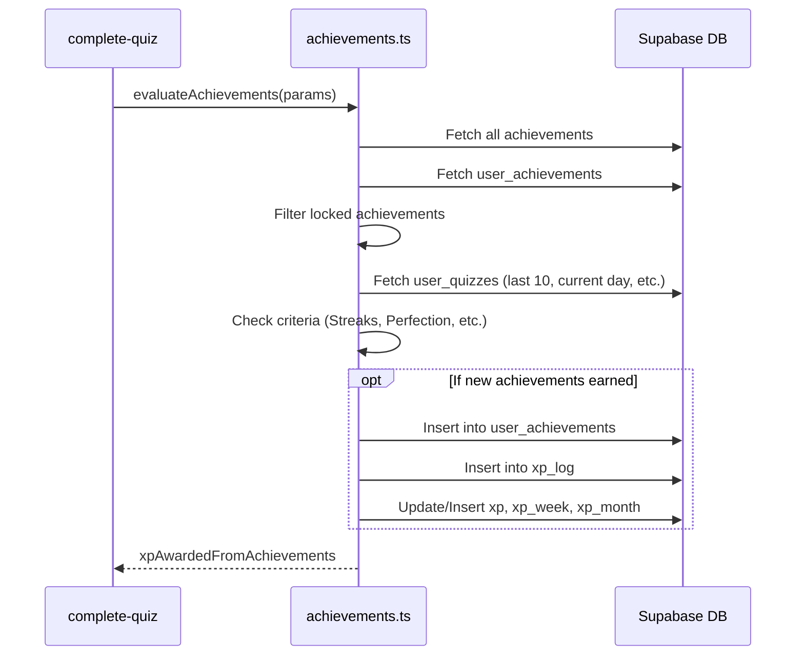

# Design Document

## Overview

The purpose of this change is to implement the achievement evaluation and granting logic within the quiz completion flow. The existing `complete-quiz` Supabase Edge Function is already responsible for evaluating quizzes, marking submodules/modules as complete, and awarding XP. 

To prevent `complete-quiz` from becoming monolithic, the achievement logic will be extracted into a separate helper module (`achievements.ts`) within the `complete-quiz` function directory. The main function will invoke this helper after successfully evaluating a quiz and performing its core updates. The helper will check all achievement criteria, verify if the user already has them, award the new achievements, and update all necessary XP tables.

### Change Type

enhancement

### Design Goals

1. Modularity: Separate achievement logic from core quiz completion logic.
2. Correctness: Ensure users only receive achievements once, and XP is tracked accurately across all tables (`xp`, `xp_log`, `xp_week`, `xp_month`).
3. Performance: Minimize database calls where possible by fetching necessary data in bulk or leveraging existing state from the quiz completion process.

### References

- **REQ-1**: Achievement Eligibility Check
- **REQ-2**: Granting Achievements
- **REQ-3**: XP Awarding for Achievements
- **REQ-4**: Module Completion Achievements
- **REQ-5**: Streak Achievements
- **REQ-6**: Daily Volume Achievement
- **REQ-7**: Perfection Achievements
- **REQ-8**: Improvement Achievement
- **REQ-9**: Milestone Achievements

## System Architecture

### DES-1: Achievement Evaluator Module

The `complete-quiz` edge function will delegate achievement checking to a new module `achievements.ts`. This module will receive the database client, the user's ID, the completed quiz details (including score), and the status of module completions (e.g., if HTML, CSS, or JS modules were just completed).

_Implements: REQ-1.1, REQ-2.1, REQ-3.1, REQ-3.2, REQ-3.3, REQ-3.4_

### DES-2: Rule Evaluation Logic

Each achievement requirement will be implemented as a specific rule within `achievements.ts`. The module will first query the `achievements` table to map identification keys to IDs and XP values. Then, it will query the user's existing `user_achievements` to filter out already earned achievements. For the remaining locked achievements, it will evaluate the specific conditions using the user's quiz history and the current quiz result.

_Implements: REQ-4.1, REQ-4.2, REQ-4.3, REQ-5.1, REQ-5.2, REQ-6.1, REQ-7.1, REQ-7.2, REQ-8.1, REQ-9.1, REQ-9.2, REQ-9.3_

## Code Anatomy

| File Path | Purpose | Implements |
|-----------|---------|------------|
| supabase/functions/complete-quiz/index.ts | Invokes the achievement evaluator and aggregates total XP returned | DES-1 |
| supabase/functions/complete-quiz/achievements.ts | Contains the core rule evaluations, checks for existing achievements, and XP updates | DES-1, DES-2 |

## Traceability Matrix

| Design Element | Requirements |
|----------------|--------------|
| DES-1 | REQ-1.1, REQ-2.1, REQ-3.1, REQ-3.2, REQ-3.3, REQ-3.4 |
| DES-2 | REQ-4.1, REQ-4.2, REQ-4.3, REQ-5.1, REQ-5.2, REQ-6.1, REQ-7.1, REQ-7.2, REQ-8.1, REQ-9.1, REQ-9.2, REQ-9.3 |
