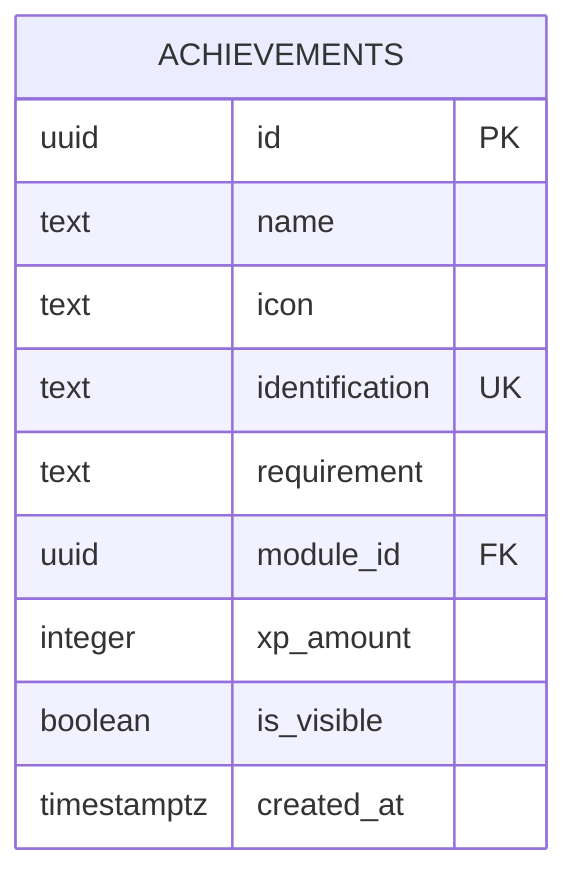
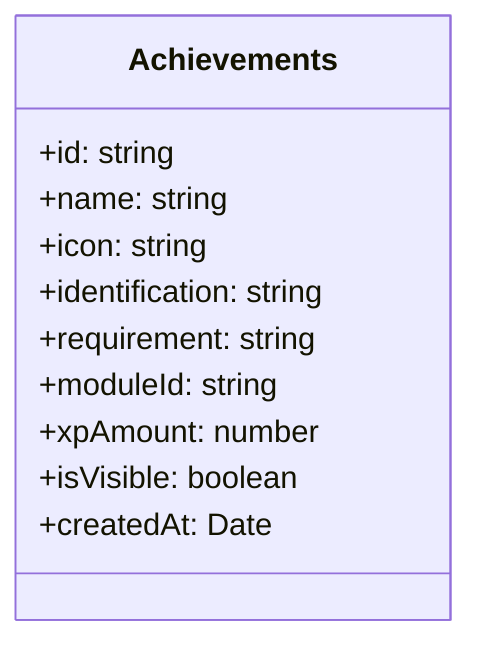
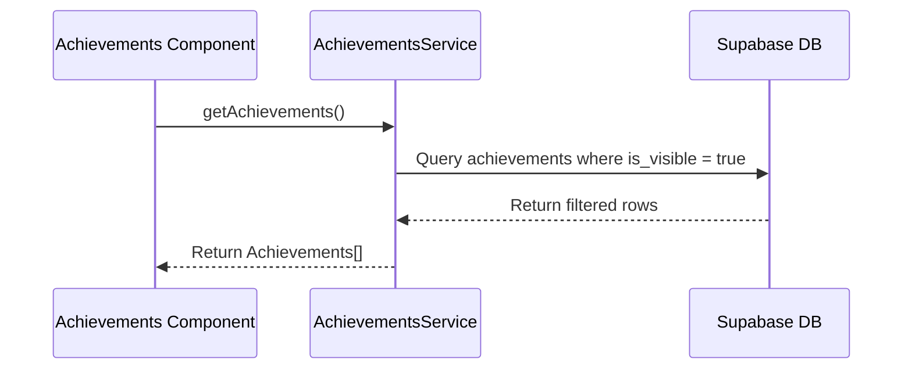
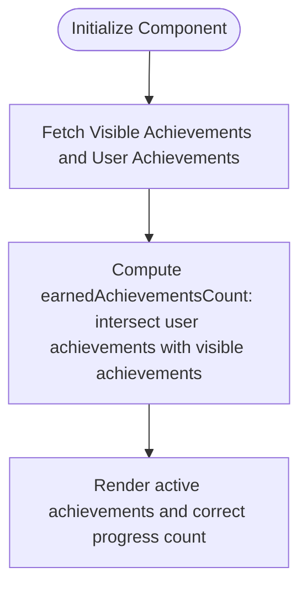

# Design Document

## Overview
This document describes the technical design for introducing a visibility toggle for achievements on the Semeando Devs platform.
By adding an `is_visible` flag in the `achievements` database table, administrators can control which achievements are active.
The achievements service and frontend page will be updated to fetch and display only these active achievements.

### Change Type
enhancement

### Design Goals
1. Add a visibility column to the database structure for achievements.
2. Update the TypeScript model to represent the visibility flag.
3. Update the query in the achievements service to retrieve only active achievements.
4. Ensure the achievements screen counters and list display only active achievements.

### References
- **REQ-1**: Database Achievement Visibility Flag
- **REQ-2**: Filter Achievements Retrieval
- **REQ-3**: Hide Inactive Achievements in UI

## System Architecture

### DES-1: Database Schema Update
A new column `is_visible` of type boolean, defaulting to `true` and not null, will be added to the `public.achievements` table.

_Implements: REQ-1.1, REQ-1.2_

### DES-2: Achievements Model Update
The `Achievements` class in the frontend model will be updated to include the `isVisible` field, mapping the database's `is_visible` column.

_Implements: REQ-1.1_

### DES-3: Achievements Service Retrieval
The `getAchievements()` query in `AchievementsService` will filter achievements, returning only those where `is_visible` is true.

_Implements: REQ-2.1_

### DES-4: UI Filtering and Stats
The Achievements page will display the retrieved visible achievements, and the unlocked/earned counter will be computed based only on active/visible achievements.

_Implements: REQ-3.1_

## Code Anatomy

| File Path | Purpose | Implements |
|-----------|---------|------------|
| supabase/migrations/20260612211000_add_is_visible_to_achievements.sql | Database migration to add the new column | DES-1 |
| src/models/achievements/achievements.ts | Domain model mapping achievements data | DES-2 |
| src/app/services/achievements.ts | Service fetching and filtering achievements | DES-3 |
| src/app/pages/app/achievements/achievements.ts | Component managing achievements display state | DES-4 |

## Data Models

## Impact Analysis

| Affected Area | Impact Level | Notes |
|---------------|--------------|-------|
| `achievements` table | Low | Database schema change with a backward-compatible default value |
| `Achievements` model | Low | Simple addition of a boolean field |
| `AchievementsService` | Low | Update to the Supabase select query |
| Achievements UI | Low | Filtered counts and list items |

### Testing Requirements

| Test Type | Coverage Goal | Notes |
|-----------|---------------|-------|
| Unit Test | Verify Achievements service | Ensure the achievements service correctly queries and filters |
| Unit Test | Verify Achievements page | Ensure the template correctly renders only active achievements and shows correct progress counts |

## Traceability Matrix

| Design Element | Requirements |
|----------------|--------------|
| DES-1 | REQ-1.1, REQ-1.2 |
| DES-2 | REQ-1.1 |
| DES-3 | REQ-2.1 |
| DES-4 | REQ-3.1 |
