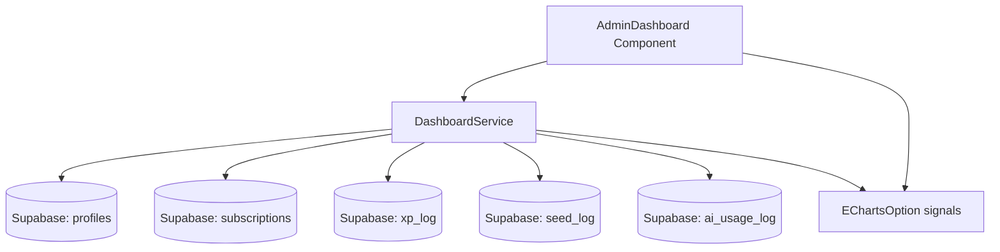
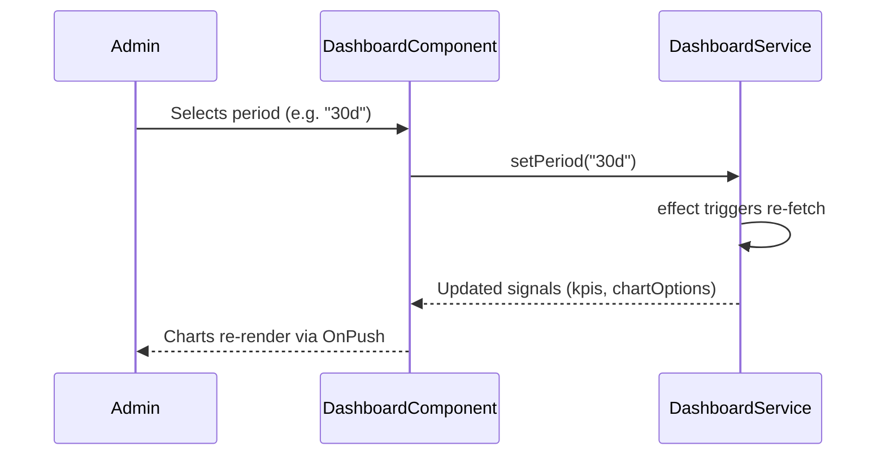
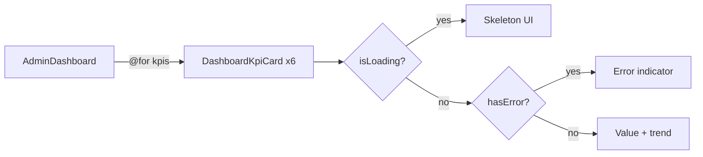
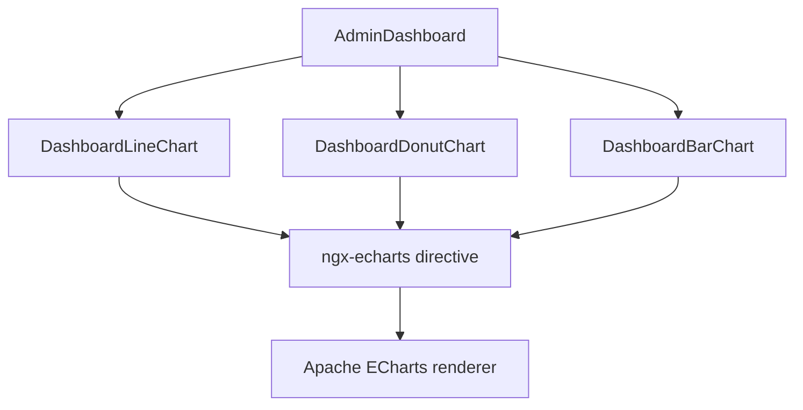
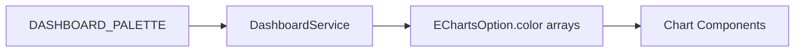
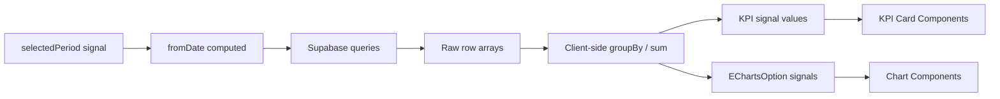
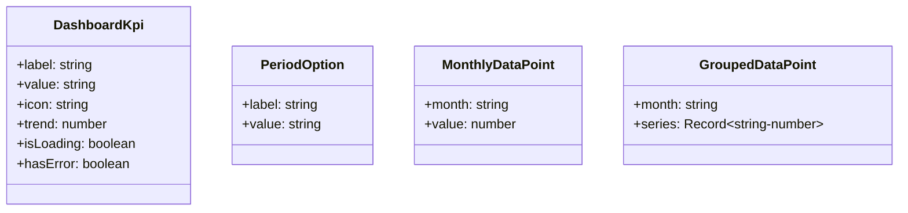

# Design Document

## Overview

The admin dashboard is a new read-only Angular feature page built on top of the existing admin shell (`AdminApp`). It introduces a dedicated `DashboardService` that queries Supabase directly for aggregated metrics, and composes those metrics into a set of KPI cards and ECharts-powered visualizations rendered inside the existing `AdminDashboard` component.

The charting layer is provided by `ngx-echarts` (wrapping Apache ECharts), which is installed as a new dependency. All chart configuration objects are produced inside `DashboardService` so components remain thin. The period filter is a shared reactive signal held in the service and consumed by all child chart components via Angular's `inject()`.

No new Supabase tables, RPC functions, or migrations are needed. All aggregation is performed client-side by grouping query results after fetching date-filtered rows. The dashboard is strictly additive — no existing pages, services, or route configuration change.

### Change Type

new-feature

### Design Goals

1. Keep all data-fetching and chart-config logic inside `DashboardService`; components only bind signals to `ngx-echarts` directives.
2. Re-use the existing design system color tokens for all chart palettes and card styling.
3. Load each dashboard section independently so a single failed query does not block the entire view.
4. Maintain full compatibility with Angular 20+ `OnPush` change detection using signals throughout.

### References

- **REQ-1**: KPI Summary Cards
- **REQ-2**: User Growth Chart
- **REQ-3**: PRO vs. Free Users Distribution Chart
- **REQ-4**: Subscription Status Distribution Chart
- **REQ-5**: Monthly Revenue Chart
- **REQ-6**: Billing Cycle Distribution Chart
- **REQ-7**: XP Distribution Over Time Chart
- **REQ-8**: AI Usage Activity Chart
- **REQ-9**: Seed Distribution Over Time Chart
- **REQ-10**: Period Filter
- **REQ-11**: Accessibility and Visual Design

---

## System Architecture

### DES-1: DashboardService — Data Aggregation Layer

`DashboardService` is a root-scoped singleton that owns all dashboard data. It exposes a reactive `selectedPeriod` signal (defaulting to `30d`) and a family of async methods that fetch raw rows from Supabase and return typed aggregates. Each method uses the `selectedPeriod` signal to derive a `fromDate` cutoff.

The service also exposes `computed()` signals for KPI values derived from raw data, and produces ECharts `EChartsOption` objects for each chart. This keeps every template to a pure binding against a signal — no template-level data transformation.

_Implements: REQ-1.1, REQ-1.2, REQ-1.3, REQ-2.1, REQ-3.1, REQ-4.1, REQ-5.1, REQ-7.1, REQ-8.1, REQ-9.1, REQ-10.1, REQ-10.2, REQ-10.3_

---

### DES-2: Period Filter — Global Reactive State

The period filter is a `signal<'7d' | '30d' | '90d' | '12m'>` held in `DashboardService`. The `AdminDashboard` component renders a period selector UI that calls `service.setPeriod()`. An `effect()` in the service watches `selectedPeriod` and re-executes all fetch methods when the period changes, updating each data signal and therefore every chart.

_Implements: REQ-10.1, REQ-10.2, REQ-10.3_

---

### DES-3: KPI Cards — Presentation Component

`DashboardKpiCardComponent` is a small standalone presentational component that receives `label`, `value`, `icon`, `trend` (percentage delta), `isLoading`, and `hasError` inputs. It renders a skeleton placeholder while loading and an error indicator on failure, without affecting sibling cards.

_Implements: REQ-1.1, REQ-1.2, REQ-1.3, REQ-1.4_

---

### DES-4: Chart Components — ECharts Binding Layer

Each chart is a small standalone component that receives an `EChartsOption` signal as an input and binds it to the `ngx-echarts` directive. Charts are organized into two sub-directories under `dashboard/`:

- `charts/line/` — User Growth (REQ-2) and AI Usage (REQ-8)
- `charts/donut/` — PRO vs Free (REQ-3) and Subscription Status (REQ-4)
- `charts/bar/` — Monthly Revenue (REQ-5), Billing Cycle (REQ-6), XP (REQ-7), Seeds (REQ-9)

Each component passes an `aria-label` attribute on its host `<figure>` element describing the chart purpose.

_Implements: REQ-2.1, REQ-2.2, REQ-2.3, REQ-3.1, REQ-3.2, REQ-4.1, REQ-4.2, REQ-4.3, REQ-5.1, REQ-5.2, REQ-5.3, REQ-6.1, REQ-6.2, REQ-7.1, REQ-7.2, REQ-7.3, REQ-8.1, REQ-8.2, REQ-9.1, REQ-9.2, REQ-11.2_

---

### DES-5: Color Palette & Design System Integration

A `DASHBOARD_PALETTE` constant maps the design system tokens to ECharts-compatible hex values. This constant is imported by `DashboardService` when constructing chart options, ensuring all chart series colors derive exclusively from the design system.

_Implements: REQ-11.1, REQ-11.3_

---

### DES-6: Responsive Layout

`AdminDashboard` uses a Tailwind CSS responsive grid: KPI cards use `grid-cols-1 sm:grid-cols-2 lg:grid-cols-3`, and chart sections use `grid-cols-1 lg:grid-cols-2`. This collapses to a single column on narrow viewports without any JS involvement.

_Implements: REQ-11.4_

---

## Data Flow

---

## Code Anatomy

| File Path | Purpose | Implements |
|-----------|---------|------------|
| `src/app/services/dashboard.ts` | Root singleton — data fetching, aggregation, EChartsOption factories, period signal | DES-1, DES-2, DES-5 |
| `src/app/pages/admin/admin-app/dashboard/dashboard.ts` | Page shell — injects service, renders period selector, KPI grid, chart grid | DES-2, DES-6 |
| `src/app/pages/admin/admin-app/dashboard/dashboard.html` | Page template | DES-3, DES-4, DES-6 |
| `src/app/pages/admin/admin-app/dashboard/dashboard.scss` | Page-level layout overrides | DES-6 |
| `src/app/pages/admin/admin-app/dashboard/kpi-card/kpi-card.ts` | Presentational KPI card — inputs: label, value, icon, trend, isLoading, hasError | DES-3 |
| `src/app/pages/admin/admin-app/dashboard/kpi-card/kpi-card.html` | KPI card template with skeleton and error states | DES-3 |
| `src/app/pages/admin/admin-app/dashboard/charts/line-chart/line-chart.ts` | Reusable line chart — input: EChartsOption, ariaLabel | DES-4 |
| `src/app/pages/admin/admin-app/dashboard/charts/donut-chart/donut-chart.ts` | Reusable donut chart — input: EChartsOption, ariaLabel | DES-4 |
| `src/app/pages/admin/admin-app/dashboard/charts/bar-chart/bar-chart.ts` | Reusable bar chart — input: EChartsOption, ariaLabel | DES-4 |
| `src/app/pages/admin/admin-app/dashboard/constants/palette.ts` | `DASHBOARD_PALETTE` color constant mapping design tokens to hex | DES-5 |

---

## Data Models

---

## Error Handling

| Error Condition | Response | Recovery |
|-----------------|----------|----------|
| Supabase query fails for a KPI | Sets `hasError = true` on that KPI's signal; other KPIs unaffected | User sees inline error icon; can retry via period re-select |
| Supabase query fails for a chart | Sets chart option signal to an empty-state option with a "Sem dados" label | Other charts continue to render normally |
| `ngx-echarts` render error | Error boundary catches via Angular error handler; chart container shows fallback message | No page-level crash |

---

## Impact Analysis

| Affected Area | Impact Level | Notes |
|---------------|--------------|-------|
| `package.json` | Low | Adds `ngx-echarts` and `echarts` as runtime dependencies |
| `src/app/pages/admin/admin-app/dashboard/dashboard.ts` | Medium | Existing stub component is replaced with full implementation |

### Dependencies

| Dependency | Type | Impact |
|------------|------|--------|
| `echarts` | Runtime | Peer dependency of `ngx-echarts`; ~1MB bundle, loaded lazily |
| `ngx-echarts` | Runtime | Angular wrapper for Apache ECharts; standalone-component compatible |

### Testing Requirements

| Test Type | Coverage Goal | Notes |
|-----------|---------------|-------|
| Unit | `DashboardService` aggregation methods | Verify groupBy, sum, and period-filter logic against mock Supabase responses |
| Unit | `DashboardKpiCardComponent` | Verify skeleton, error, value, and trend rendering |
| Unit | `AdminDashboard` | Verify period selector triggers service re-fetch |

---

## Traceability Matrix

| Design Element | Requirements |
|----------------|--------------|
| DES-1 | REQ-1.1, REQ-1.2, REQ-1.3, REQ-2.1, REQ-3.1, REQ-4.1, REQ-5.1, REQ-7.1, REQ-8.1, REQ-9.1, REQ-10.1, REQ-10.2, REQ-10.3 |
| DES-2 | REQ-10.1, REQ-10.2, REQ-10.3 |
| DES-3 | REQ-1.1, REQ-1.2, REQ-1.3, REQ-1.4 |
| DES-4 | REQ-2.1, REQ-2.2, REQ-2.3, REQ-3.1, REQ-3.2, REQ-4.1, REQ-4.2, REQ-4.3, REQ-5.1, REQ-5.2, REQ-5.3, REQ-6.1, REQ-6.2, REQ-7.1, REQ-7.2, REQ-7.3, REQ-8.1, REQ-8.2, REQ-9.1, REQ-9.2, REQ-11.2 |
| DES-5 | REQ-11.1, REQ-11.3 |
| DES-6 | REQ-11.4 |
