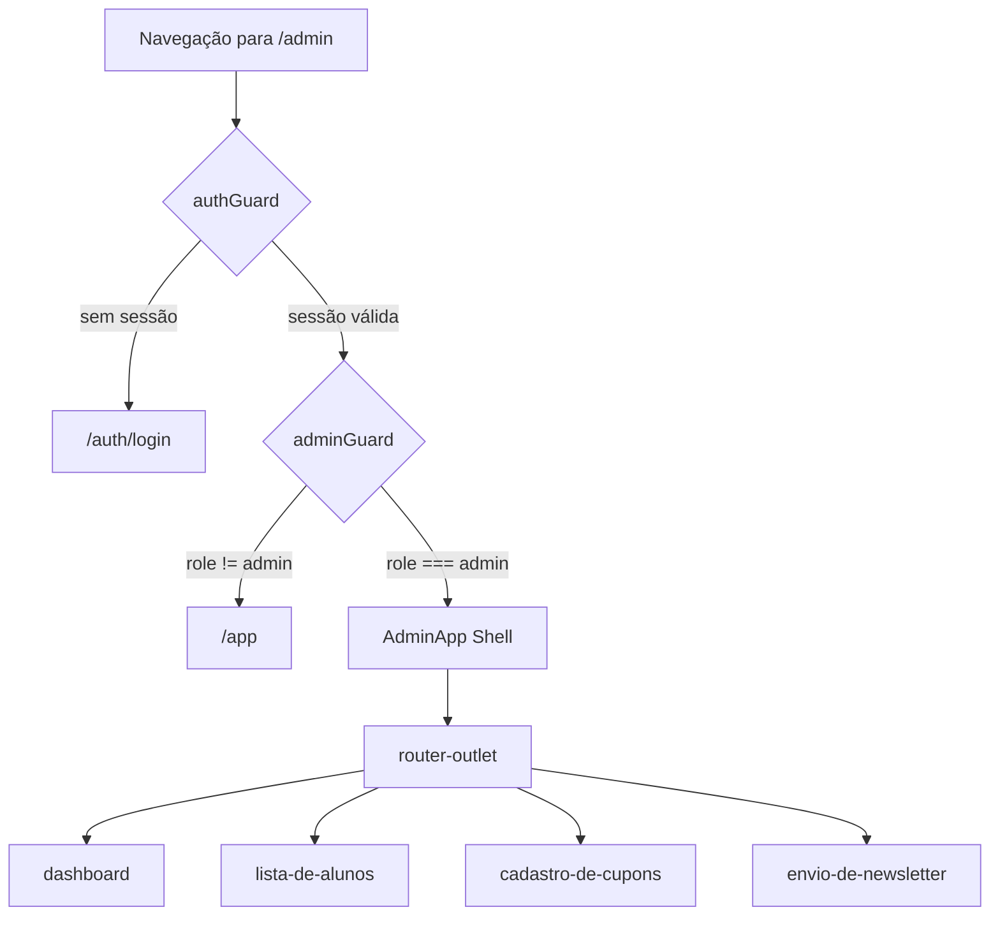
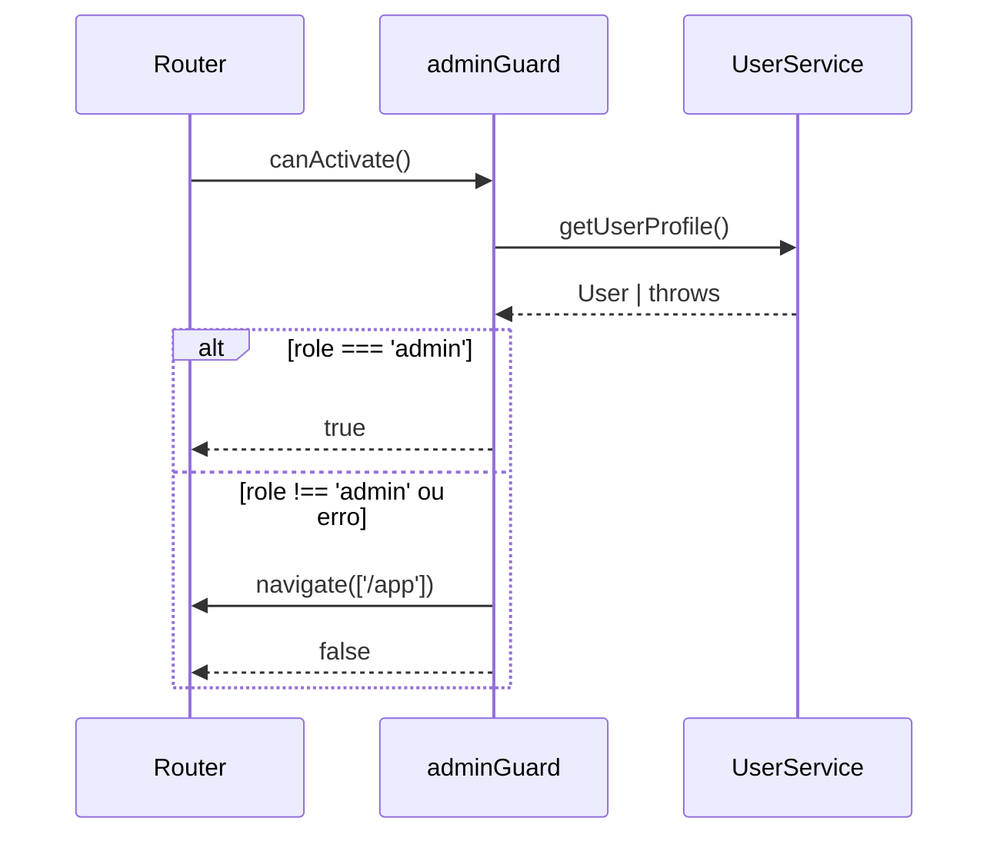
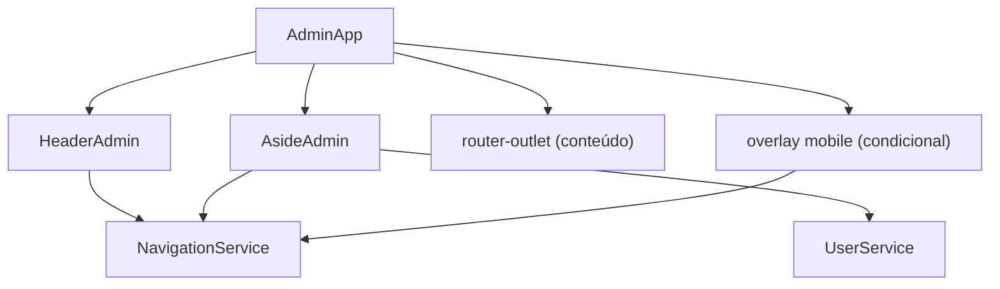
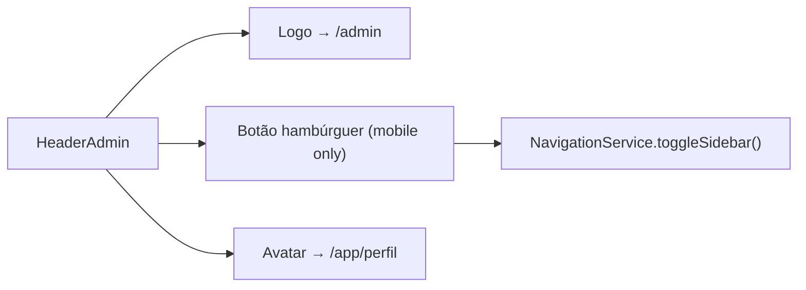
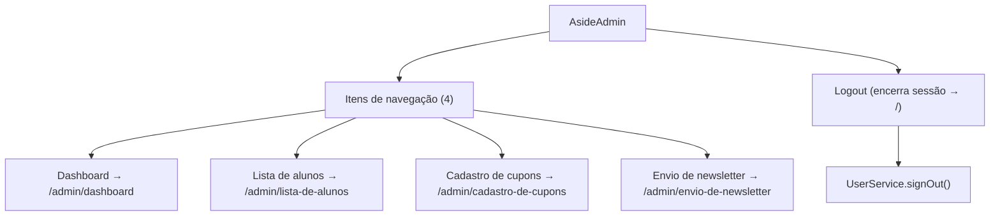
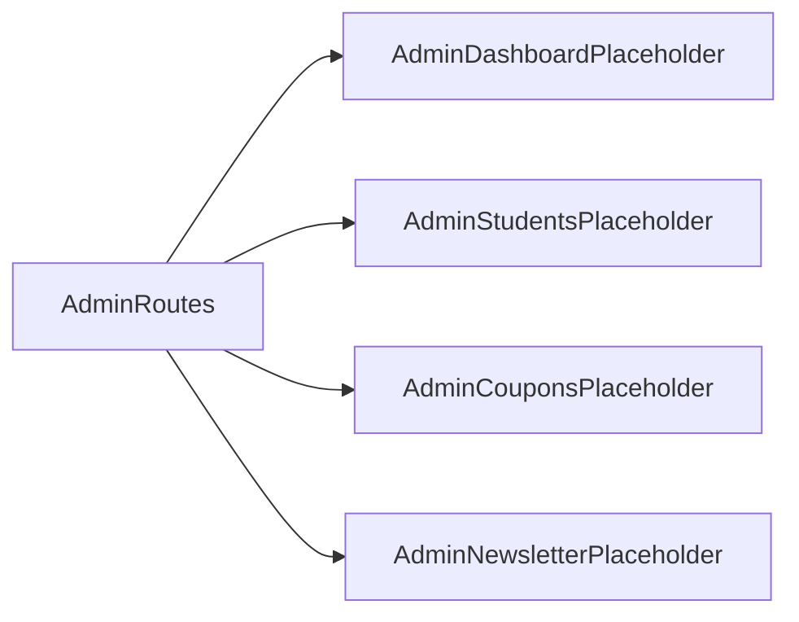

# Design Document

## Overview

Esta feature implementa o **Admin Shell** do Painel Administrativo da plataforma Semeando Devs. Trata-se de um novo domínio de rota (`/admin`) composto por: um `adminGuard` exclusivo, um componente shell que encapsula o layout (header + sidebar + `<router-outlet>`), e quatro sub-rotas com componentes placeholder.

O design segue os mesmos padrões arquiteturais do domínio `professor` já existente no projeto, reutilizando os serviços `UserService` e `NavigationService` sem modificações. O layout do Admin Shell é estruturalmente idêntico ao `ProfessorApp`, removendo apenas o bloco do modal de termos de uso e substituindo a sidebar por uma com itens de navegação específicos do contexto administrativo.

O `adminGuard` é criado como um guard independente (não compartilhado com `teacherGuard`) para manter responsabilidade única e permitir evolução independente das políticas de acesso de cada papel.

### Change Type

`new-feature`

### Design Goals

1. Espelhar o padrão arquitetural do domínio `professor` para manter consistência e curva de aprendizado zero para quem mantém o projeto.
2. Criar um guard independente que verifica estritamente `role === 'admin'`, sem acoplamento com a lógica de professor.
3. Fornecer sub-rotas registradas e navegáveis desde o início, com componentes placeholder, para que futuras features sejam integradas com mudança mínima.
4. Não introduzir nenhum serviço, modelo ou estado novo — reutilizar `UserService` e `NavigationService` como estão.

### References

- **REQ-1**: Rota protegida para o Painel Administrativo
- **REQ-2**: Admin Guard exclusivo para o perfil admin
- **REQ-3**: Header do Painel Administrativo
- **REQ-4**: Sidebar de navegação do Painel Administrativo
- **REQ-5**: Overlay móvel da sidebar
- **REQ-6**: Placeholder pages para sub-rotas do painel
- **REQ-7**: Ausência de modal de termos de uso no Painel Administrativo

---

## System Architecture

### DES-1: Registro de Rota e Proteção via Guards

A rota `/admin` é registrada em `app.routes.ts` como uma rota pai com lazy-loading do componente `AdminApp`. Dois guards são aplicados em sequência: o `authGuard` existente (verifica sessão ativa) e o novo `adminGuard` (verifica `role === 'admin'`).

A rota redireciona `/admin` para `/admin/dashboard` por padrão. Cada sub-rota possui um `title` descritivo seguindo o padrão `<Nome> - Semeando Devs`.

_Implements: REQ-1.1, REQ-1.2, REQ-1.3, REQ-1.4, REQ-6.1, REQ-6.3_

---

### DES-2: Admin Guard

O `adminGuard` é uma função `CanActivateFn` que injeta `UserService` e `Router`. Ele chama `userService.getUserProfile()` para obter o perfil atual e verifica se `role === 'admin'`. Em caso de falha ou role diferente, redireciona para `/app`.

_Implements: REQ-2.1, REQ-2.2_

---

### DES-3: Admin Shell — Layout Principal

O `AdminApp` é o componente raiz do domínio administrativo. Ele compõe `HeaderAdmin`, `AsideAdmin` e `<router-outlet>`. Não possui lógica de termos de uso. Injeta `NavigationService` para controlar o overlay de sidebar mobile.

_Implements: REQ-1.1, REQ-3.1, REQ-3.2, REQ-3.3, REQ-4.4, REQ-4.5, REQ-5.1, REQ-5.2, REQ-7.1_

---

### DES-4: Header do Painel Administrativo

O `HeaderAdmin` é um componente standalone que exibe o logo da plataforma com link para `/admin` e o avatar do usuário com link para `/app/perfil`. Em viewport móvel, exibe o botão hambúrguer que aciona `navigationService.toggleSidebar()`. O componente segue a estrutura e classes Tailwind do `HeaderProfessor` existente.

_Implements: REQ-3.1, REQ-3.2, REQ-3.3_

---

### DES-5: Sidebar de Navegação do Painel Administrativo

O `AsideAdmin` é um componente standalone que exibe quatro itens de navegação com `routerLink` e `routerLinkActive` para destaque visual. Na base da sidebar há o item de logout. Em mobile a sidebar é ocultada por padrão e aciona o fechamento via `navigationService.closeSidebar()` ao navegar. Em desktop permanece fixa via classes Tailwind.

_Implements: REQ-4.1, REQ-4.2, REQ-4.3, REQ-4.4, REQ-4.5, REQ-4.6_

---

### DES-6: Placeholder Pages

Quatro componentes placeholder são criados, um por sub-rota. Cada placeholder exibe uma mensagem visual indicando que a funcionalidade está em construção. São componentes mínimos, standalone, sem lógica de negócio, prontos para serem substituídos por implementações reais nas tarefas futuras.

_Implements: REQ-6.2_

---

## Code Anatomy

| File Path | Purpose | Implements |
|-----------|---------|------------|
| `src/app/components/guards/admin.guard.ts` | Guard que verifica `role === 'admin'` | DES-2 |
| `src/app/components/guards/admin.guard.spec.ts` | Testes unitários do adminGuard | DES-2 |
| `src/app/pages/admin/admin-app/admin-app.ts` | Componente shell raiz do painel admin | DES-3 |
| `src/app/pages/admin/admin-app/admin-app.html` | Template do shell (header + overlay + aside + outlet) | DES-3 |
| `src/app/pages/admin/admin-app/admin-app.scss` | Estilos do shell | DES-3 |
| `src/app/pages/admin/admin-app/admin-app.spec.ts` | Testes do componente shell | DES-3 |
| `src/app/pages/admin/components/header-admin/header-admin.ts` | Componente header do painel admin | DES-4 |
| `src/app/pages/admin/components/header-admin/header-admin.html` | Template do header | DES-4 |
| `src/app/pages/admin/components/header-admin/header-admin.scss` | Estilos do header | DES-4 |
| `src/app/pages/admin/components/aside-admin/aside-admin.ts` | Componente sidebar do painel admin | DES-5 |
| `src/app/pages/admin/components/aside-admin/aside-admin.html` | Template da sidebar com 4 itens + logout | DES-5 |
| `src/app/pages/admin/components/aside-admin/aside-admin.scss` | Estilos da sidebar | DES-5 |
| `src/app/pages/admin/admin-app/dashboard/dashboard.ts` | Placeholder para Dashboard | DES-6 |
| `src/app/pages/admin/admin-app/students/students.ts` | Placeholder para Lista de Alunos | DES-6 |
| `src/app/pages/admin/admin-app/coupons/coupons.ts` | Placeholder para Cadastro de Cupons | DES-6 |
| `src/app/pages/admin/admin-app/newsletter/newsletter.ts` | Placeholder para Envio de Newsletter | DES-6 |
| `src/app/app.routes.ts` | Adição da rota `/admin` com guards e sub-rotas | DES-1 |

---

## Impact Analysis

| Affected Area | Impact Level | Notes |
|---------------|--------------|-------|
| `src/app/app.routes.ts` | Low | Adição de bloco de rota `/admin`; não altera rotas existentes |
| `src/app/components/guards/` | Low | Novo arquivo `admin.guard.ts`; guards existentes não são modificados |

### Testing Requirements

| Test Type | Coverage Goal | Notes |
|-----------|---------------|-------|
| Unit | `adminGuard` | Verificar redirecionamento para `/app` quando `role !== 'admin'` e para `/auth/login` sem sessão |
| Unit | `AdminApp` shell | Verificar que o overlay aparece/desaparece via `navigationService` |

---

## Traceability Matrix

| Design Element | Requirements |
|----------------|--------------|
| DES-1 | REQ-1.1, REQ-1.2, REQ-1.3, REQ-1.4, REQ-6.1, REQ-6.3 |
| DES-2 | REQ-2.1, REQ-2.2 |
| DES-3 | REQ-1.1, REQ-3.1, REQ-3.2, REQ-3.3, REQ-4.4, REQ-4.5, REQ-5.1, REQ-5.2, REQ-7.1 |
| DES-4 | REQ-3.1, REQ-3.2, REQ-3.3 |
| DES-5 | REQ-4.1, REQ-4.2, REQ-4.3, REQ-4.4, REQ-4.5, REQ-4.6 |
| DES-6 | REQ-6.2 |
