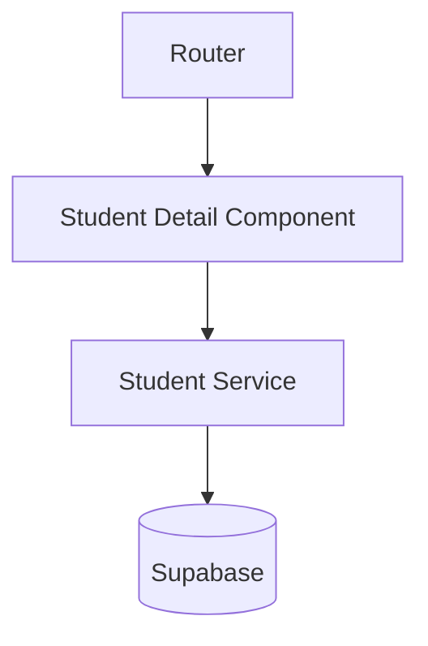
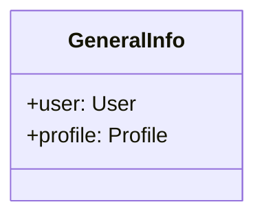
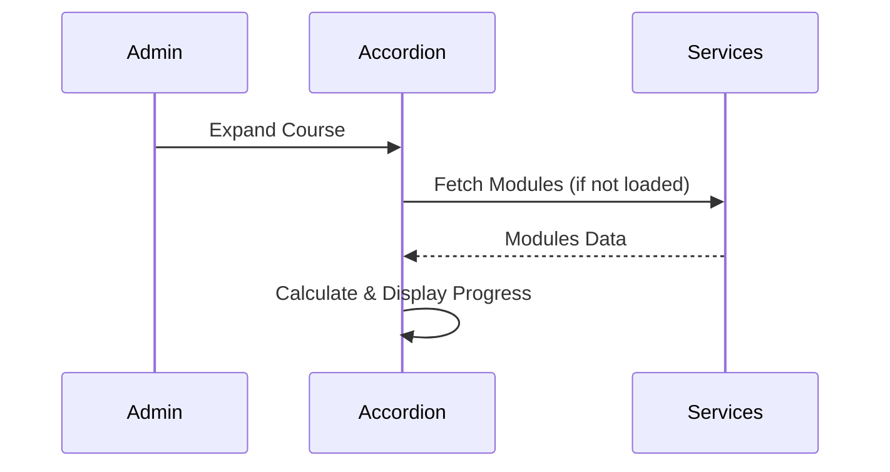
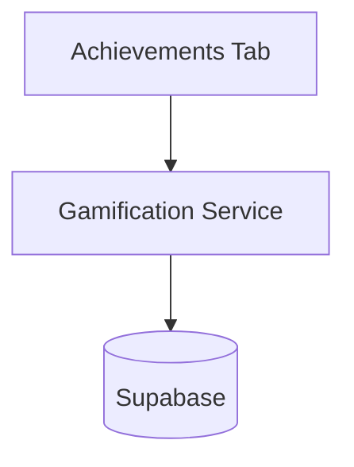

# Design Document

## Overview

The Admin Student Detail feature introduces a new route and component in the admin section to display comprehensive information about a specific student. This includes general profile data and a detailed, lazy-loaded breakdown of their course progress. The design leverages Angular's standalone components, signal-based reactivity (where applicable), and existing domain services to fetch progress data.

### Change Type

new-feature

### Design Goals

1. Provide a clean, tabbed interface to separate general information from detailed progress tracking.
2. Implement efficient lazy loading for hierarchical course progress to minimize initial payload.
3. Reuse existing progress calculation logic available in the platform's services.

### References

- **REQ-1**: Navigation to Student Detail
- **REQ-2**: Tabbed Interface
- **REQ-3**: General Information Tab
- **REQ-4**: Course Progress Accordion
- **REQ-5**: Lazy Loading of Progress Data
- **REQ-6**: Achievements Tab

## System Architecture

### DES-1: Student Detail Page Component

The main routed component for the student detail view. It extracts the student ID from the route parameters, fetches the base user/profile data, and orchestrates the tabbed layout.

_Implements: REQ-1.1, REQ-2.1_

### DES-2: General Information Tab

A section (or sub-component) within the detail page that renders the `User` and `Profile` data. It focuses purely on presentation using the design system's aesthetic guidelines (e.g., specific typography and surface layers).

_Implements: REQ-3.1_

### DES-3: Progress Accordion Component

A stateful component responsible for rendering the course progress hierarchy. It tracks the expansion state of courses, modules, and submodules. When an item is expanded, it delegates to the appropriate service (e.g., `CourseService`, `ModuleService`) to fetch child data if it hasn't been loaded yet.

_Implements: REQ-4.1, REQ-4.2, REQ-4.3, REQ-4.4, REQ-4.5, REQ-5.1, REQ-5.2, REQ-5.3_

### DES-4: Achievements Tab Component

A component mirroring the `achievements` page view (`src/app/pages/app/achievements`). It fetches the student's XP, current level, and unlocked achievements, displaying them in a visually consistent layout with the gamification system.

_Implements: REQ-6.1_

## Code Anatomy

| File Path | Purpose | Implements |
|-----------|---------|------------|
| src/app/pages/admin/admin-app/students/student-detail/student-detail.ts | Main routed component, tab state, and base data fetching | DES-1, DES-2, DES-4 |
| src/app/pages/admin/admin-app/students/student-detail/student-detail.html | Template containing tabs and layout | DES-1, DES-2, DES-3, DES-4 |
| src/app/pages/admin/admin-app/students/students.html | Update to include navigation link to the detail page | DES-1 |

## Traceability Matrix

| Design Element | Requirements |
|----------------|--------------|
| DES-1 | REQ-1.1, REQ-2.1 |
| DES-2 | REQ-3.1 |
| DES-3 | REQ-4.1, REQ-4.2, REQ-4.3, REQ-4.4, REQ-4.5, REQ-5.1, REQ-5.2, REQ-5.3 |
| DES-4 | REQ-6.1 |
