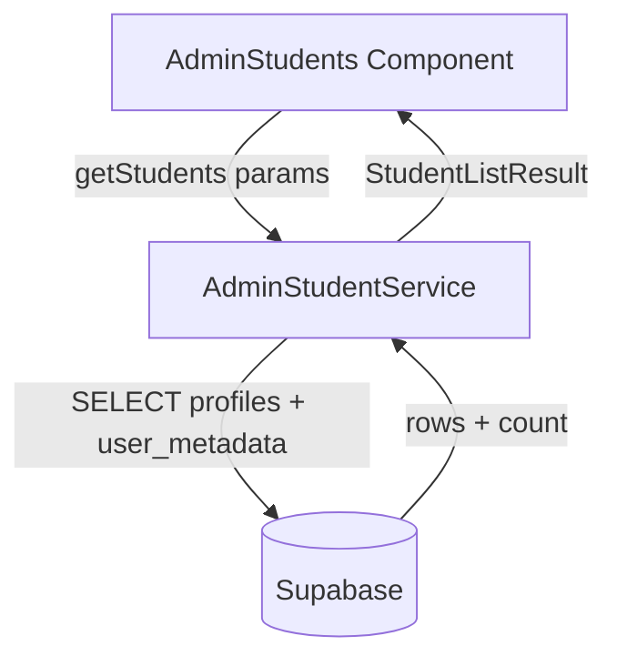
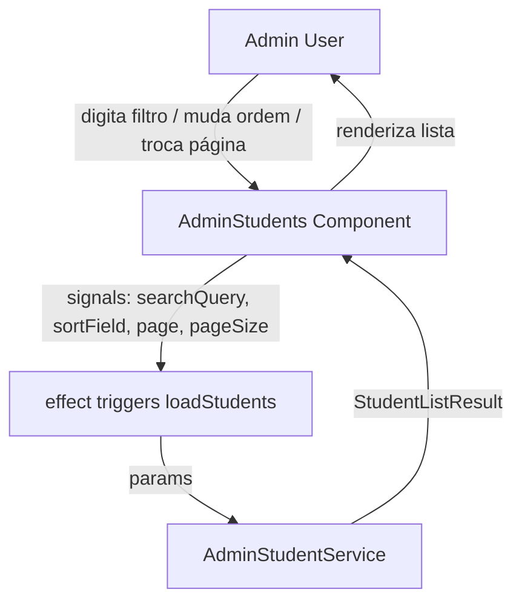
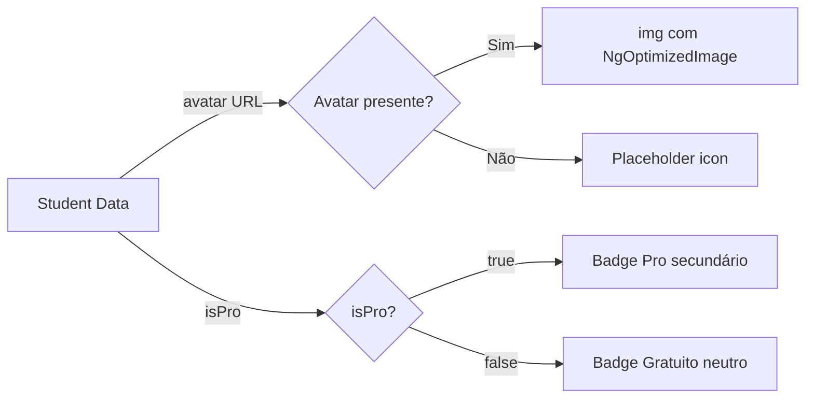
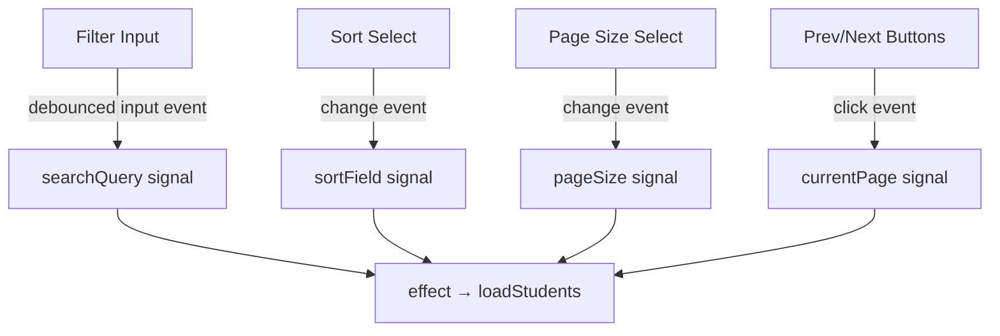
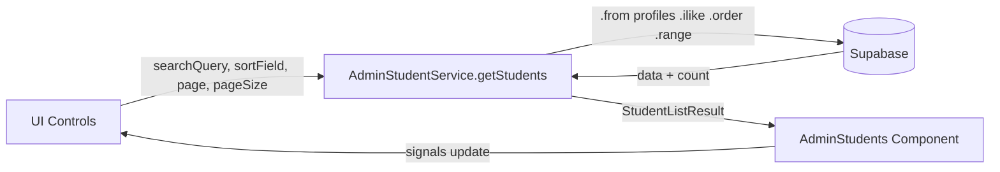
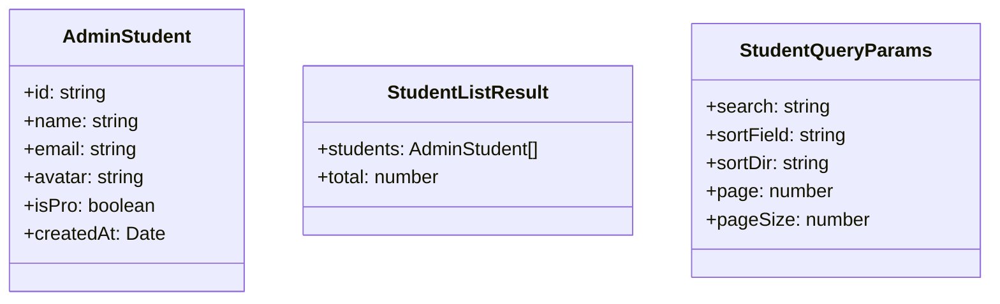

# Design Document

## Overview

A funcionalidade de **Lista de Alunos** é uma nova tela no painel administrativo do Semeando Devs. Ela expõe, de forma paginada e filtrável, todos os usuários com `role = 'student'` armazenados no Supabase.

A arquitetura segue o padrão já estabelecido no projeto: um **Service Angular** centraliza toda a comunicação com o Supabase (tabela `profiles` + `auth.users` via view/rpc), enquanto o **componente de listagem** (`AdminStudents`) consome esse serviço via `inject()` e mantém o estado local com `signal()`. A paginação, ordenação e filtragem são realizadas no lado do servidor (Supabase), garantindo eficiência mesmo com grandes volumes de alunos. A tela de detalhe (`AdminStudentDetail`) é implementada como componente placeholder, com a rota registrada em `app.routes.ts`.

Não há alterações em contratos compartilhados, guards ou modelos existentes além da adição de um novo `AdminStudent` model e do `AdminStudentService`.

### Change Type

new-feature

### Design Goals

1. Buscar alunos eficientemente no lado do servidor com filtragem, ordenação e paginação delegadas ao Supabase.
2. Manter o estado de UI (filtro, ordenação, página atual, tamanho de página) em sinais reativos Angular (`signal`, `computed`), seguindo os padrões existentes no projeto.
3. Criar a estrutura de rotas filho (`lista-de-alunos` e `lista-de-alunos/:id-aluno`) de forma lazy-loaded.
4. Exibir informações ricas por aluno (avatar, nome, email, data de cadastro, badge Pro) seguindo o design system "Neon Terminal".
5. Garantir acessibilidade WCAG AA e navegação por teclado.

### References

- **REQ-1**: Listagem de Alunos Paginada
- **REQ-2**: Ordenação da Lista
- **REQ-3**: Filtro por Nome ou E-mail
- **REQ-4**: Informações por Aluno na Listagem
- **REQ-5**: Navegação para Detalhes do Aluno
- **REQ-6**: Acessibilidade da Lista

---

## System Architecture

### DES-1: AdminStudentService – Consulta Paginada ao Supabase

O `AdminStudentService` é responsável por toda a comunicação com o Supabase para buscar alunos. Ele expõe um único método assíncrono `getStudents(params)` que recebe filtro, ordenação, página atual e tamanho de página e retorna o conjunto de resultados mais o total de registros.

A consulta é feita sobre a tabela `profiles` (para campos `role`, `is_pro`, `created_at`) cruzada com `auth.users` (para `email`, `name`, `avatar`). O Supabase suporta essa junção via a view `user_profiles` que combina dados de `profiles` e `auth.users` usando `user_id`. Se essa view não existir, a consulta pode ser feita em duas etapas: listar profiles filtrados e enriquecer com metadata de auth.

O serviço usa `.range()` do Supabase para paginação server-side, `.ilike()` para filtragem case-insensitive e `.order()` para ordenação.



_Implements: REQ-1.1, REQ-1.2, REQ-1.3, REQ-1.4, REQ-1.5, REQ-2.1, REQ-2.2, REQ-2.3, REQ-3.2, REQ-3.3_

---

### DES-2: AdminStudents Component – Estado Reativo e Controles de UI

O componente `AdminStudents` gerencia o estado da listagem por meio de sinais Angular:

- `searchQuery` – string de filtro atual
- `sortField` – campo de ordenação (`'name'` ou `'created_at'`)
- `currentPage` – página atual (base 0)
- `pageSize` – tamanho da página (10, 25, 50, 100)
- `students` e `totalCount` – resultado carregado do serviço
- `isLoading` e `error` – estados de carregamento e falha

Um `effect()` observa `searchQuery`, `sortField`, `currentPage` e `pageSize` e dispara `loadStudents()` automaticamente a cada mudança. A filtragem faz reset de `currentPage` para 0 (REQ-3.3).

O template usa controle de fluxo Angular nativo (`@if`, `@for`) e não usa `*ngIf`/`*ngFor`.



_Implements: REQ-1.2, REQ-1.3, REQ-1.4, REQ-1.5, REQ-2.1, REQ-2.2, REQ-2.3, REQ-3.1, REQ-3.2, REQ-3.3, REQ-3.4, REQ-4.1, REQ-4.2, REQ-4.3, REQ-4.4, REQ-6.1, REQ-6.2, REQ-6.3_

---

### DES-3: Student Row / Card – Apresentação Visual do Aluno

Cada aluno é renderizado como um card (desktop: linha de tabela; mobile: card responsivo) exibindo:

- **Avatar**: `` com `NgOptimizedImage` quando a URL estiver disponível; placeholder (`<span class="material-symbols-outlined">person</span>`) quando ausente.
- **Nome e Email**: tipografia da hierarquia do design system (`font-headline` para nome, `font-label` para email).
- **Data de Cadastro**: formatada com `DatePipe` (`'dd MMM yyyy'`, locale `pt-BR`).
- **Badge Pro**: badge glassmórfico com cor `secondary` (#fe69ac) para alunos Pro; badge neutro `surface_container` para não-Pro.

O clique no card navega para `/admin/lista-de-alunos/:id` via `Router.navigate`.



_Implements: REQ-4.1, REQ-4.2, REQ-4.3, REQ-4.4, REQ-5.1_

---

### DES-4: Paginação e Controles de Busca – Componente de UI

Os controles de busca, ordenação e paginação são parte do template do `AdminStudents`:

- **Input de Filtro**: `<input id="student-search-input">` vinculado a `searchQuery` signal com debounce de 300ms.
- **Select de Ordenação**: `<select id="student-sort-select">` com opções "Nome (A-Z)" e "Data de Cadastro".
- **Select de Tamanho de Página**: `<select id="student-page-size-select">` com opções 10, 25, 50, 100.
- **Controles de Página**: botões "Anterior" e "Próxima" com `id` únicos e `aria-label` descritivos. Exibem o contador de resultados ("1–10 de 87 alunos").

Todos os elementos interativos possuem `id` únicos e são focáveis por teclado (`tabindex` natural do HTML).



_Implements: REQ-1.3, REQ-1.4, REQ-1.5, REQ-2.2, REQ-2.3, REQ-3.1, REQ-3.3, REQ-3.4, REQ-6.1, REQ-6.3_

---

### DES-5: AdminStudentDetail – Placeholder de Detalhes do Aluno

O componente `AdminStudentDetail` é um placeholder inline que exibe uma mensagem de "em construção". Ele é registrado na rota `/admin/lista-de-alunos/:id-aluno` via lazy loading no `app.routes.ts`.

```mermaid
flowchart TD
    A[Admin clica no card] -->|Router.navigate| R[/admin/lista-de-alunos/:id-aluno]
    R -->|lazy load| D[AdminStudentDetail Component]
    D -->|renderiza| P[Placeholder UI]
```

_Implements: REQ-5.1, REQ-5.2_

---

## Data Flow



---

## Data Models

O novo model `AdminStudent` é uma projeção de leitura para exibição na listagem, distinto do model `User` existente (que representa o usuário autenticado atual).



_Implements: REQ-4.1, REQ-4.4_

---

## Error Handling

| Error Condition | Response | Recovery |
|-----------------|----------|----------|
| Falha na consulta ao Supabase | O componente exibe uma mensagem de erro inline com opção de retentar | O admin clica em "Tentar novamente" para chamar `loadStudents()` |
| Nenhum aluno encontrado para o filtro | Exibe estado vazio com ícone e mensagem "Nenhum aluno encontrado" | O admin pode limpar o filtro |
| Avatar URL inválida ou quebrada | `onerror` do `` reverte para o placeholder visual | Sem ação necessária do usuário |

---

## Code Anatomy

| File Path | Purpose | Implements |
|-----------|---------|------------|
| `src/models/admin-student/admin-student.ts` | Model `AdminStudent` e `StudentListResult` | DES-1, DES-5 |
| `src/app/services/admin-student.ts` | `AdminStudentService` – consultas paginadas ao Supabase | DES-1 |
| `src/app/services/admin-student.spec.ts` | Testes unitários do service | DES-1 |
| `src/app/pages/admin/admin-app/students/students.ts` | `AdminStudents` – componente de listagem (substituir placeholder) | DES-2, DES-3, DES-4 |
| `src/app/pages/admin/admin-app/students/students.html` | Template da listagem | DES-2, DES-3, DES-4 |
| `src/app/pages/admin/admin-app/students/students.scss` | Estilos específicos da listagem | DES-3, DES-4 |
| `src/app/pages/admin/admin-app/students/student-detail/student-detail.ts` | `AdminStudentDetail` – placeholder de detalhe | DES-5 |
| `src/app/app.routes.ts` | Adicionar rota `lista-de-alunos/:id-aluno` como child de `admin` | DES-5 |

---

## Impact Analysis

| Affected Area | Impact Level | Notes |
|---------------|--------------|-------|
| `src/app/app.routes.ts` | Low | Adição de rota child `lista-de-alunos/:id-aluno` |
| `src/app/pages/admin/admin-app/students/students.ts` | Medium | Substituição do componente placeholder existente |

### Testing Requirements

| Test Type | Coverage Goal | Notes |
|-----------|---------------|-------|
| Unit | `AdminStudentService` métodos de query | Mockar o cliente Supabase; verificar parâmetros de filtro, ordenação e paginação |
| Unit | `AdminStudents` lógica de signals | Verificar reset de página ao filtrar, reação a mudança de sort |

---

## Traceability Matrix

| Design Element | Requirements |
|----------------|--------------|
| DES-1: AdminStudentService | REQ-1.1, REQ-1.2, REQ-1.3, REQ-1.4, REQ-1.5, REQ-2.1, REQ-2.2, REQ-2.3, REQ-3.2, REQ-3.3 |
| DES-2: AdminStudents Component | REQ-1.2, REQ-1.3, REQ-1.4, REQ-1.5, REQ-2.1, REQ-2.2, REQ-2.3, REQ-3.1, REQ-3.2, REQ-3.3, REQ-3.4, REQ-4.1, REQ-4.2, REQ-4.3, REQ-4.4, REQ-6.1, REQ-6.2, REQ-6.3 |
| DES-3: Student Row / Card | REQ-4.1, REQ-4.2, REQ-4.3, REQ-4.4, REQ-5.1 |
| DES-4: Pagination and Search Controls | REQ-1.3, REQ-1.4, REQ-1.5, REQ-2.2, REQ-2.3, REQ-3.1, REQ-3.3, REQ-3.4, REQ-6.1, REQ-6.3 |
| DES-5: AdminStudentDetail Placeholder | REQ-5.1, REQ-5.2 |
