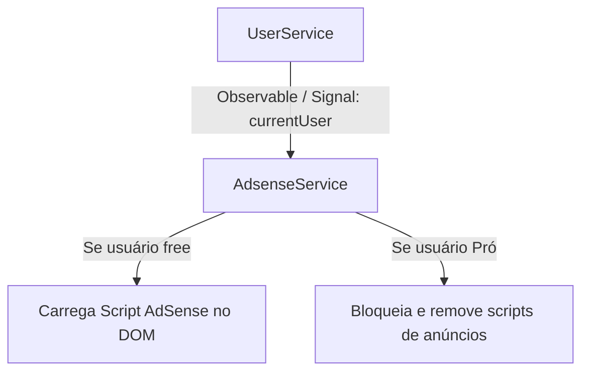
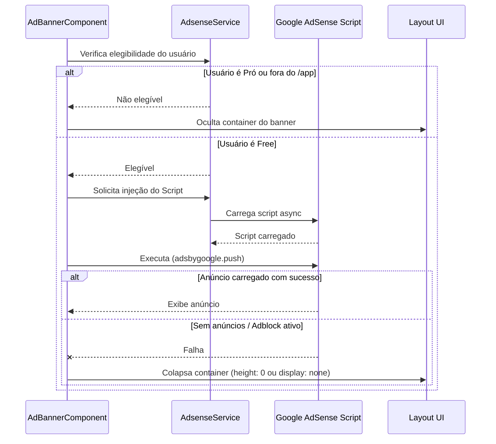

# Design Document

## Overview

Este documento descreve o design técnico para a integração do Google AdSense na plataforma Semeando Devs. A exibição de anúncios deve ser restrita apenas a usuários do plano gratuito, preservando a experiência dos usuários do plano Pró livre de anúncios. Os anúncios serão exibidos de forma discreta em cabeçalhos (headers) e rodapés (footers) dentro da área interna da aplicação (rotas sob `/app`).

### Change Type

`new-feature`

### Design Goals

1. **Carregamento Condicional e Assíncrono:** Garantir que o script do Google AdSense e suas tags correspondentes sejam injetadas apenas para usuários que não possuem assinatura Pró, evitando sobrecarga na performance da plataforma para usuários pagantes.
2. **Resiliência e Fallback:** Tratar de forma robusta cenários onde o AdSense esteja bloqueado por extensões (AdBlockers) ou quando não existam anúncios disponíveis na rede, garantindo que o layout colapse sem gerar espaços vazios desagradáveis ou quebrar a usabilidade.
3. **Responsividade Estrita:** Assegurar que os anúncios se adaptem automaticamente aos dispositivos móveis e desktops.

### References

- **REQ-1**: Integração e Carregamento Assíncrono do Google AdSense
- **REQ-2**: Controle de Exibição por Tipo de Usuário e Rota
- **REQ-3**: Posicionamento dos Banners e Responsividade
- **REQ-4**: Resiliência de Layout e Fallback

---

## System Architecture

### DES-1: Serviço de Inicialização do Google AdSense (`AdsenseService`)

O `AdsenseService` gerencia o ciclo de vida do script do Google AdSense. Ele verifica o estado do usuário logado através do `UserService`. Se o usuário estiver no plano gratuito, o serviço insere o script do AdSense de forma assíncrona no DOM e expõe métodos para notificar quando o carregamento foi concluído, além de disparar a inicialização de blocos de anúncios específicos de forma segura.

_Implements: REQ-1.1, REQ-1.2, REQ-2.1_

### DES-2: Componente Reutilizável de Anúncio (`AdBannerComponent`)

O `AdBannerComponent` encapsula a tag `<ins class="adsbygoogle">` do AdSense e gerencia a inicialização interna via `adsbygoogle.push()`. Ele escuta o estado de carregamento do `AdsenseService` e o estado do usuário. Em caso de falha de carregamento ou detecção de adblocker, o componente entra em estado de colapso, ocultando o container para não comprometer a usabilidade da página.

_Implements: REQ-2.2, REQ-2.3, REQ-3.1, REQ-3.2, REQ-3.3, REQ-4.1, REQ-4.2_

---

## Code Anatomy

| File Path | Purpose | Implements |
|-----------|---------|------------|
| [adsense.service.ts](file:///home/developer/workspace-pessoal/semeandodevsapp/src/app/services/adsense/adsense.service.ts) | Serviço responsável por carregar dinamicamente o script principal do AdSense e coordenar o pushing de anúncios. | DES-1 |
| [ad-banner.component.ts](file:///home/developer/workspace-pessoal/semeandodevsapp/src/app/components/ad-banner/ad-banner.component.ts) | Componente standalone que renderiza o banner de anúncio de forma responsiva, tratando fallbacks. | DES-2 |
| [internal-header.html](file:///home/developer/workspace-pessoal/semeandodevsapp/src/app/components/internal-header/internal-header.html) | Inserção do `AdBannerComponent` no cabeçalho interno da aplicação para usuários gratuitos. | DES-2 |
| [app.html](file:///home/developer/workspace-pessoal/semeandodevsapp/src/app/pages/app/app.html) | Inserção do `AdBannerComponent` no rodapé da área de conteúdo interno. | DES-2 |

---

## Error Handling

| Error Condition | Response | Recovery |
|-----------------|----------|----------|
| Script do AdSense bloqueado por AdBlocker | `adsbygoogle.push()` lança erro ou falha silenciosamente | O `AdBannerComponent` captura o erro em bloco `try/catch`, marca o estado de carregamento como falho e oculta o container de anúncio para não quebrar o layout. |
| Sem inventário de anúncios (No Fill) | O elemento `<ins>` do AdSense não é preenchido com iframe e fica vazio | O componente monitora o carregamento (via checagem de altura do elemento ou escuta de eventos do AdSense se disponíveis) e recolhe o container (`height: 0`). |

---

## Impact Analysis

| Affected Area | Impact Level | Notes |
|---------------|--------------|-------|
| `src/app/pages/app/app.html` | Low | Posicionamento do banner de rodapé de maneira que não obstrua o conteúdo das lições. |
| `src/app/components/internal-header/internal-header.html` | Low | Espaço no cabeçalho deve acomodar um banner pequeno horizontal sem prejudicar o alinhamento da barra de XP e Seeds. |

### Testing Requirements

| Test Type | Coverage Goal | Notes |
|-----------|---------------|-------|
| Unit Test | Cobertura do `AdsenseService` e `AdBannerComponent` | Validar comportamento de inicialização condicional baseado em `currentUser()?.isPro`. |
| Manual Test | Inspeção visual | Testar comportamento simulando usuário gratuito com e sem bloqueador de anúncios, garantindo que o layout da plataforma não quebre. |

---

## Traceability Matrix

| Design Element | Requirements |
|----------------|--------------|
| DES-1 (AdsenseService) | REQ-1.1, REQ-1.2, REQ-2.1 |
| DES-2 (AdBannerComponent) | REQ-2.2, REQ-2.3, REQ-3.1, REQ-3.2, REQ-3.3, REQ-4.1, REQ-4.2 |
