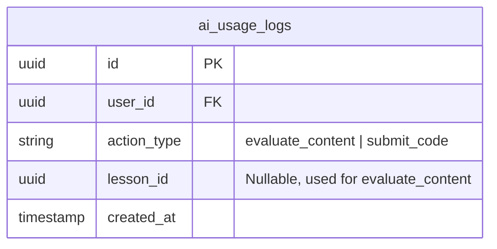
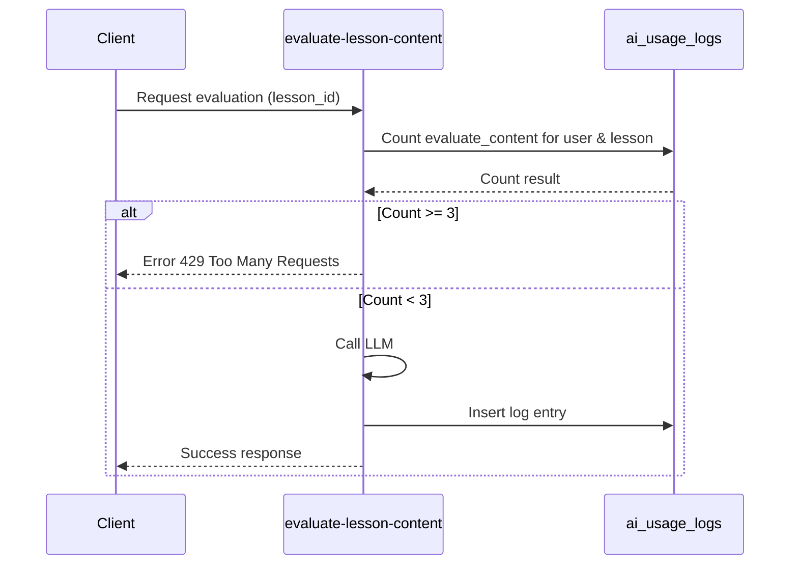
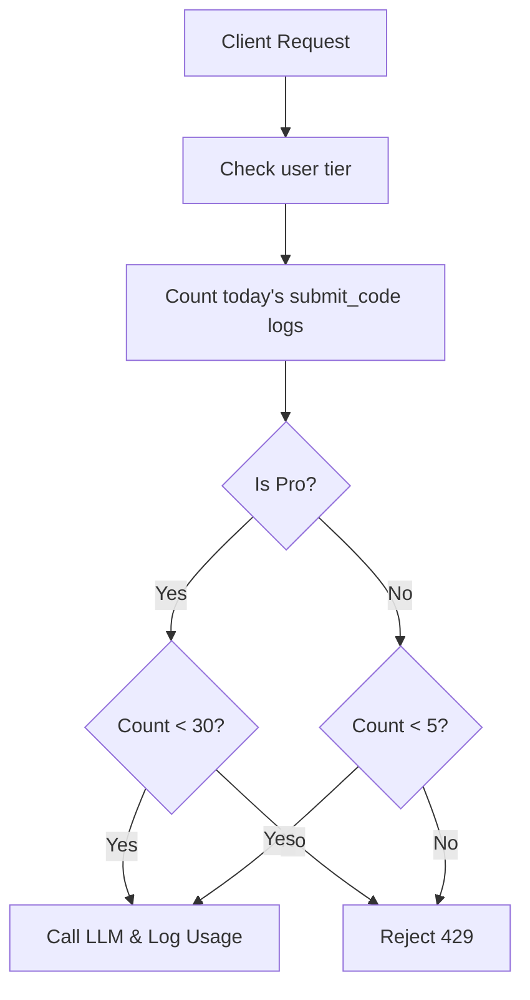
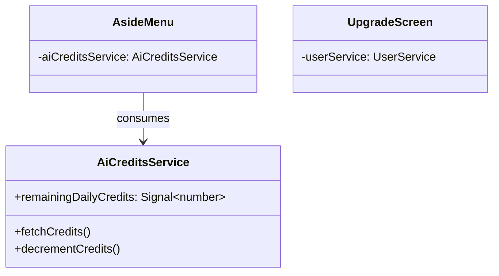
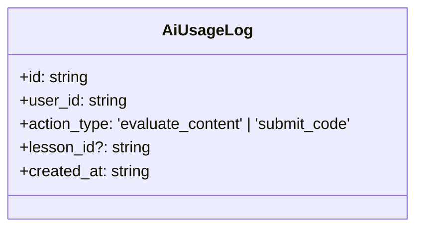

# Design Document

## Overview

This document outlines the technical design for enforcing rate limits on AI-assisted actions ("Avaliar conteúdo com IA" and "Enviar código") to control AI credit consumption. The design introduces a new database table to track AI usage events, updates the relevant Supabase edge functions to enforce the limits based on user tier (Free vs. Pro) and context, and modifies the Angular frontend to display remaining credits and rate limit information.

### Change Type

enhancement

### Design Goals

1. Effectively prevent abuse of AI endpoints by enforcing hard limits at the backend.
2. Provide a clear, real-time indication of remaining AI credits to the user in the sidebar.
3. Use rate limits as an upselling point on the upgrade screen.
4. Maintain a fast, reliable check without introducing significant latency to AI evaluations.

### References

- **REQ-1**: Enforce Rate Limit for Evaluate Content Action
- **REQ-2**: Enforce Rate Limit for Submit Code Action
- **REQ-3**: Display AI Credits in Aside Menu
- **REQ-4**: Display Rate Limit Information on Upgrade Screen

## System Architecture

### DES-1: AI Usage Tracking Table

A new table `ai_usage_logs` will be created in the Supabase database. This table will act as an append-only ledger recording every successful (or attempted) AI evaluation action. This allows accurate counting per day or per lesson.

_Implements: REQ-1.1, REQ-2.1, REQ-2.2_

### DES-2: Content Evaluation Rate Limit Enforcement

The `evaluate-lesson-content` edge function will be updated to verify the usage limits before calling the LLM. It will query `ai_usage_logs` for `evaluate_content` actions by the user for the specific `lesson_id`. If the count is >= 3, it rejects the request. On success, it inserts a new log entry.

_Implements: REQ-1.1, REQ-1.2_

### DES-3: Code Submission Rate Limit Enforcement

The `evaluate-challenge` edge function will enforce the daily rate limits for code submission. It queries the user's `is_pro` status and the count of `submit_code` actions in `ai_usage_logs` for the current UTC day. If the user exceeds 5 (Free) or 30 (Pro) submissions, it rejects the request.

_Implements: REQ-2.1, REQ-2.2, REQ-2.3_

### DES-4: Frontend AI Credits Display & State

A new service or an update to an existing service (e.g., `AiCreditsService`) will fetch the user's remaining daily `submit_code` credits and the `evaluate_content` credits for the active lesson. The `AsideMenu` component will subscribe to this state and display the remaining daily credits below the "Atualizar para Pro" button. The upgrade screen will statically display the rate limit rules for Free users.

_Implements: REQ-3.1, REQ-3.2, REQ-3.3, REQ-4.1, REQ-4.2_

## Code Anatomy

| File Path | Purpose | Implements |
|-----------|---------|------------|
| supabase/migrations/[timestamp]_ai_usage_logs.sql | Create usage table and RLS | DES-1 |
| supabase/functions/evaluate-lesson-content/index.ts | Enforce lesson limit | DES-2 |
| supabase/functions/evaluate-challenge/index.ts | Enforce daily limit | DES-3 |
| src/app/services/ai-credits/ai-credits.service.ts | State management for credits | DES-4 |
| src/app/components/aside-menu/aside-menu.ts | Display remaining credits | DES-4 |
| src/app/pages/app/upgrade/upgrade.html | Show rate limit upsell info | DES-4 |

## Data Models

## Traceability Matrix

| Design Element | Requirements |
|----------------|--------------|
| DES-1 | REQ-1.1, REQ-2.1, REQ-2.2 |
| DES-2 | REQ-1.1, REQ-1.2 |
| DES-3 | REQ-2.1, REQ-2.2, REQ-2.3 |
| DES-4 | REQ-3.1, REQ-3.2, REQ-3.3, REQ-4.1, REQ-4.2 |
