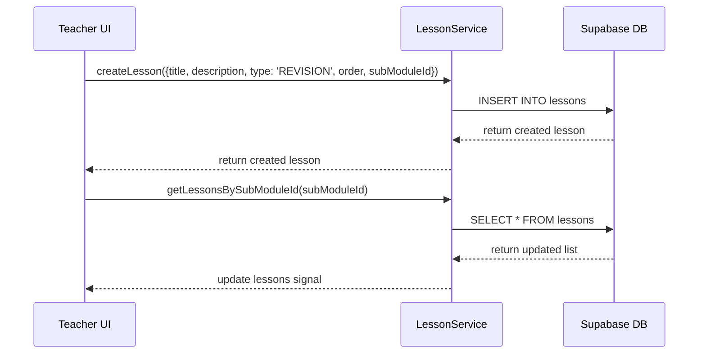
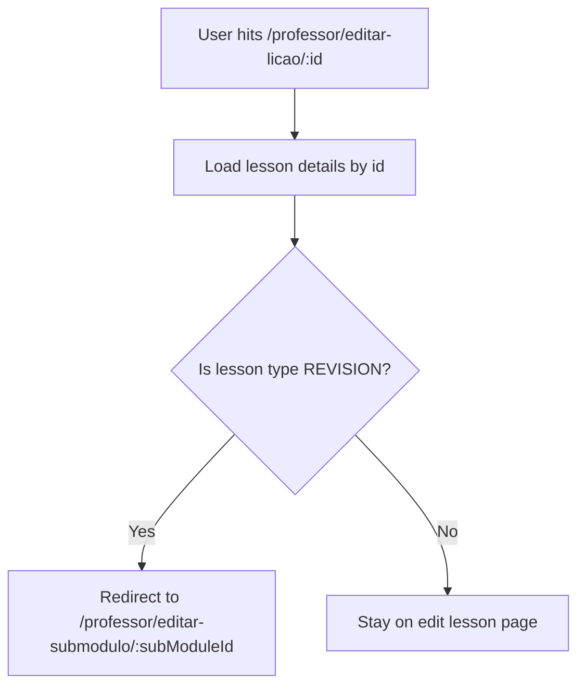

# Design Document

## Overview
This document describes the technical design for introducing `REVISION` type lessons in the Semeando Devs platform. The implementation consists of two parts: enabling the creation of revision lessons in a single-click from the submodule edit screen, and blocking the editing interface for revision lessons, redirecting any direct URL edit attempts back to the submodule page.

### Change Type
- `enhancement`

### Design Goals
1. Provide a quick creation mechanism for `REVISION` lessons.
2. Prevent modification of revision lessons by hiding edit access and redirecting direct access attempts.

### References
- **REQ-1**: Create Revision Button in Submodule Page
- **REQ-2**: Prevent Editing of Revision Lessons

## System Architecture

### DES-1: Quick Revision Creation flow
The submodule edit page will contain a new action button to create a revision lesson. When clicked, this button triggers a creation call to the `LessonService` using the submodule's ID and name to construct the predefined lesson details. Once successfully created, the lesson list is reloaded.

_Implements: REQ-1.1, REQ-1.2, REQ-1.3_

### DES-2: Edit Guard and Redirection flow
To ensure revisions cannot be edited, the edit button (pencil icon) is hidden in the lessons list if the lesson's type is `REVISION`. If a user manually inputs the URL of the edit page for a revision lesson, the page's controller loads the lesson details via `LessonService.getLessonById` and redirects the user to the submodule edit page.

_Implements: REQ-2.1, REQ-2.2, REQ-2.3_

## Code Anatomy

| File Path | Purpose | Implements |
|-----------|---------|------------|
| [create-submodule.html](file:///home/developer/workspace-pessoal/semeandodevsapp/src/app/pages/professor/professor-app/create-submodule/create-submodule.html) | Add Create Revision button and conditionally hide edit button for revisions | DES-1, DES-2 |
| [create-submodule.ts](file:///home/developer/workspace-pessoal/semeandodevsapp/src/app/pages/professor/professor-app/create-submodule/create-submodule.ts) | Handle creation request for REVISION lessons and state updates | DES-1 |
| [create-lesson.ts](file:///home/developer/workspace-pessoal/semeandodevsapp/src/app/pages/professor/professor-app/create-lesson/create-lesson.ts) | Intercept and redirect when trying to edit a REVISION lesson | DES-2 |

## Error Handling

| Error Condition | Response | Recovery |
|-----------------|----------|----------|
| Revision creation fails | Alert the error message to the user | Keep list state, keep loading state false |
| Direct edit check fails | Log error to console | Do not redirect, allow default behavior if data is loaded |

## Impact Analysis

| Affected Area | Impact Level | Notes |
|---------------|--------------|-------|
| Submodule Edit Screen | Low | Extra button added, list elements conditionally hide edit icon |
| Create Lesson Screen | Low | Checks lesson type on load and redirects if it is a revision |

### Testing Requirements

| Test Type | Coverage Goal | Notes |
|-----------|---------------|-------|
| Unit Test | Check quick creation method and order logic | Verify correct payload sent to LessonService |
| Unit Test | Check redirection logic in CreateLesson | Verify Router.navigate is called with correct path when lesson type is REVISION |

## Traceability Matrix

| Design Element | Requirements |
|----------------|--------------|
| DES-1 | REQ-1.1, REQ-1.2, REQ-1.3 |
| DES-2 | REQ-2.1, REQ-2.2, REQ-2.3 |
