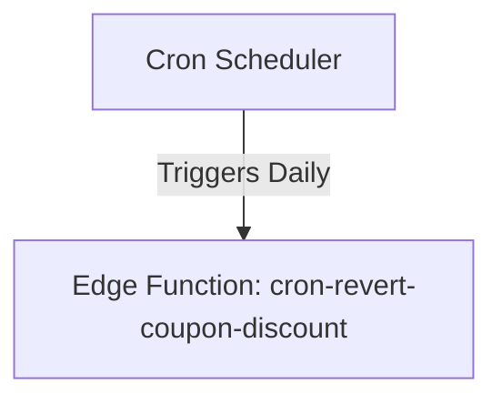
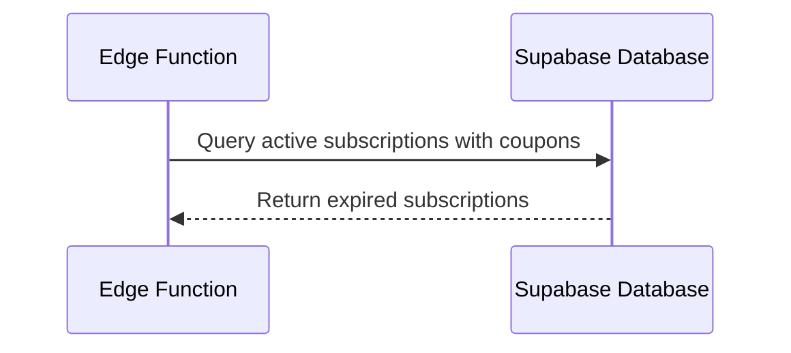
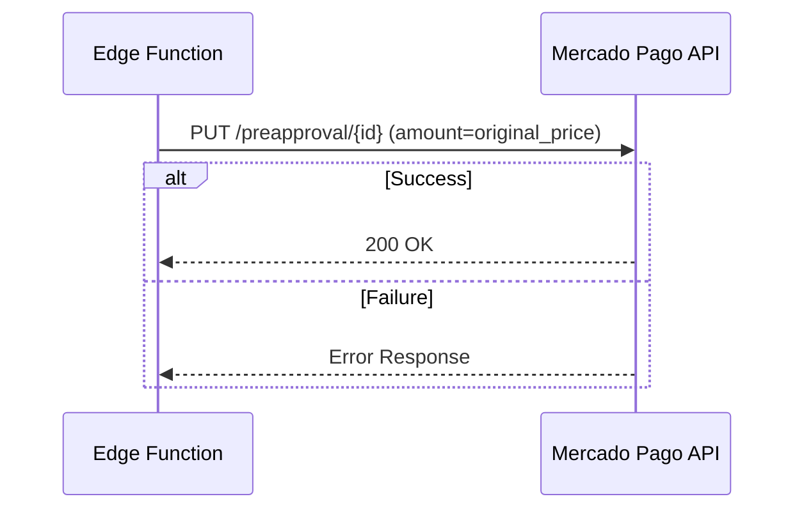
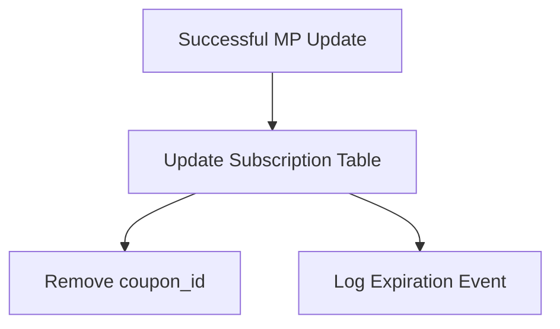

# Design Document

## Overview

This document outlines the technical design for a scheduled process that reverts the transaction amount of Mercado Pago preapprovals when their associated temporary discount coupons expire. The process involves a Supabase Edge Function, invoked periodically (e.g., via pg_cron), which identifies expired subscriptions, updates their billing amount via the Mercado Pago API, and synchronizes the local database state.

### Change Type

new-feature

### Design Goals

1. Ensure atomic and reliable updates to Mercado Pago to avoid revenue loss.
2. Maintain data consistency between the local Supabase database and Mercado Pago's billing engine.
3. Provide an isolated execution environment via Edge Functions to securely interact with the external API.

### References

- **REQ-1**: Identify Expired Coupons
- **REQ-2**: Revert Transaction Amount in Mercado Pago
- **REQ-3**: Update Subscription State in Database

## System Architecture

### DES-1: Scheduled Job Execution

The system utilizes a scheduled mechanism (e.g. pg_cron or Edge Function scheduling) to periodically invoke the background task that processes coupon expirations.

_Implements: REQ-1.1_

### DES-2: Expired Coupon Retrieval

The Edge Function queries the Supabase database to fetch active subscriptions that possess a `coupon_id` and whose calculated expiration date (`created_at` + coupon duration) is in the past.

_Implements: REQ-1.1, REQ-1.2_

### DES-3: Mercado Pago Integration

For each expired subscription, the Edge Function sends a PUT request to the Mercado Pago Preapproval API to update the `transaction_amount` to the original plan price. Failures are logged for review.

_Implements: REQ-2.1, REQ-2.2_

### DES-4: Database State Synchronization

Upon receiving a successful response from Mercado Pago, the Edge Function updates the local subscription record by setting `coupon_id` to null (or expired) and records the event.

_Implements: REQ-3.1, REQ-3.2_

## Code Anatomy

| File Path | Purpose | Implements |
|-----------|---------|------------|
| supabase/functions/cron-revert-coupon-discount/index.ts | Core orchestration for the cron job, MP API interactions, and DB updates | DES-1, DES-2, DES-3, DES-4 |

## Traceability Matrix

| Design Element | Requirements |
|----------------|--------------|
| DES-1 | REQ-1.1 |
| DES-2 | REQ-1.1, REQ-1.2 |
| DES-3 | REQ-2.1, REQ-2.2 |
| DES-4 | REQ-3.1, REQ-3.2 |
