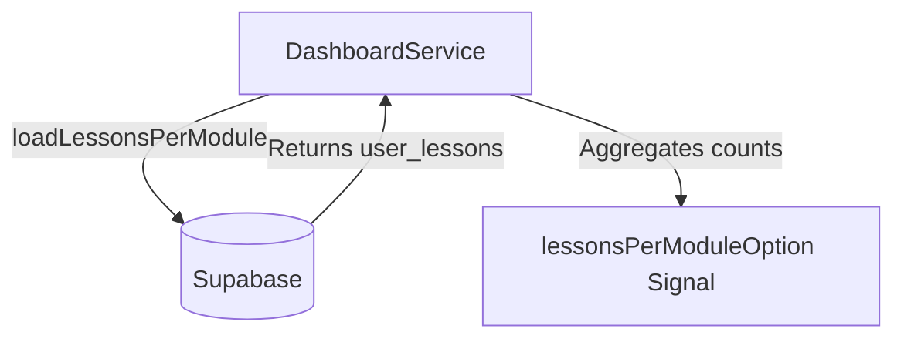
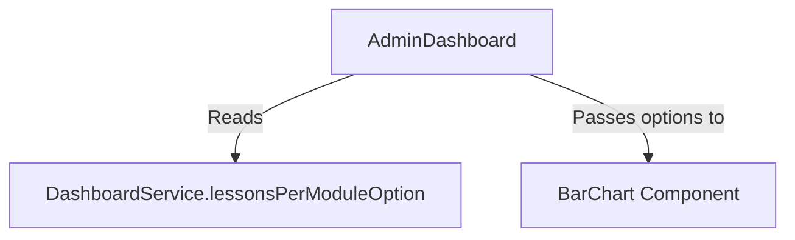

# Design Document

## Overview

We will add a new chart to the admin dashboard that visualizes the total number of completed lessons grouped by module. This involves fetching the completed user lessons, joining the related lesson and module information, aggregating the counts by module, and displaying the results using a BarChart component.

### Change Type

new-feature

### Design Goals

1. Fetch and aggregate completed lessons per module from the database.
2. Display the aggregated data using an ECharts option signal within the `DashboardService`.
3. Render the chart in the `AdminDashboard` UI.

### References

- **REQ-1**: Display Completed Lessons Chart

## System Architecture

### DES-1: Dashboard Service Extension

The `DashboardService` will be updated to include a new signal `lessonsPerModuleOption` (type `EChartsOption`). A new method `loadLessonsPerModule()` will be added to query the database. It will fetch records from `user_lessons` where `completed` is true, performing a join through `lesson` -> `sub_module` -> `module` to retrieve the module's name. The data will be aggregated to count completed lessons per module and format it for the chart.

_Implements: REQ-1.1, REQ-1.2, REQ-1.3_

### DES-2: Dashboard UI Update

The `AdminDashboard` component will consume the `lessonsPerModuleOption` signal from the `DashboardService`. A new `<app-bar-chart>` component will be added to the dashboard's HTML template, receiving the generated ECharts options to display the data.

_Implements: REQ-1.1_

## Code Anatomy

| File Path | Purpose | Implements |
|-----------|---------|------------|
| `src/app/services/dashboard.ts` | Fetch and aggregate data, exposing it via a signal | DES-1 |
| `src/app/pages/admin/admin-app/dashboard/dashboard.ts` | Pass the chart option to the template | DES-2 |
| `src/app/pages/admin/admin-app/dashboard/dashboard.html` | Render the BarChart component | DES-2 |

## Traceability Matrix

| Design Element | Requirements |
|----------------|--------------|
| DES-1 | REQ-1.1, REQ-1.2, REQ-1.3 |
| DES-2 | REQ-1.1 |
