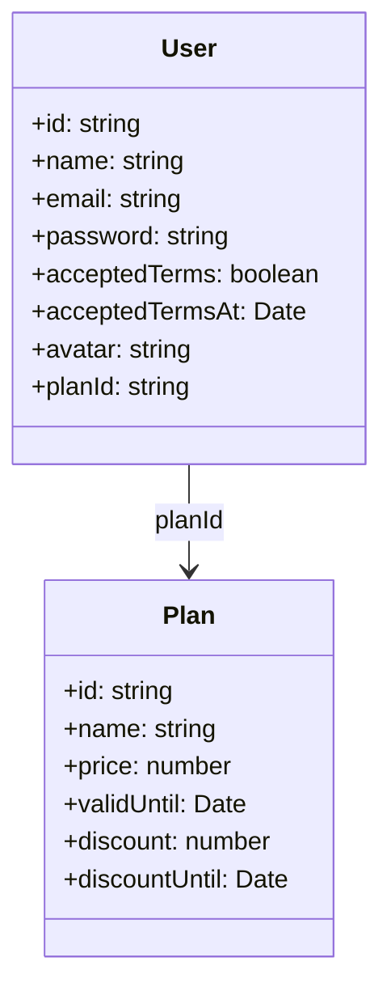
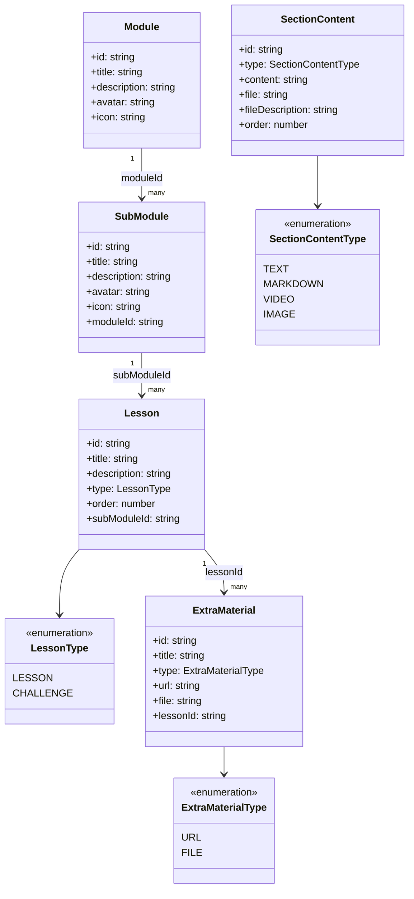
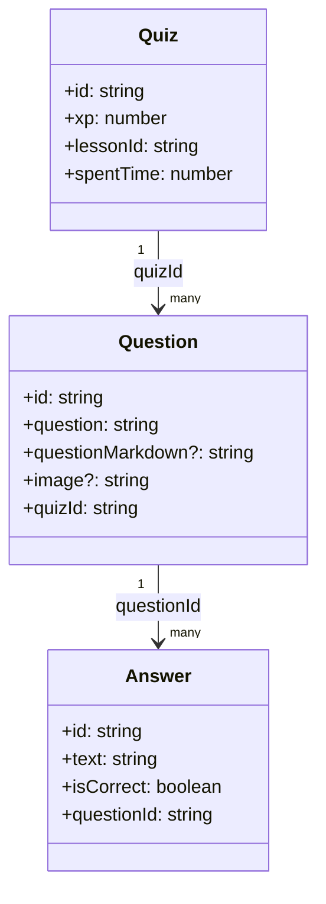
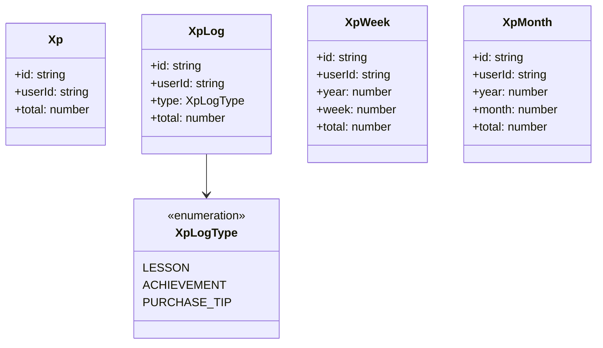
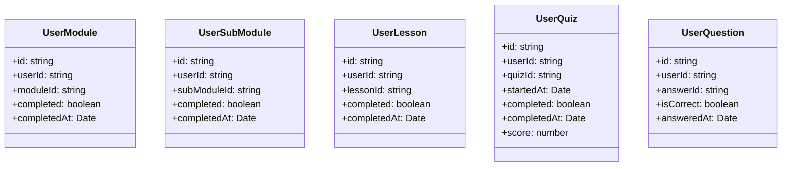
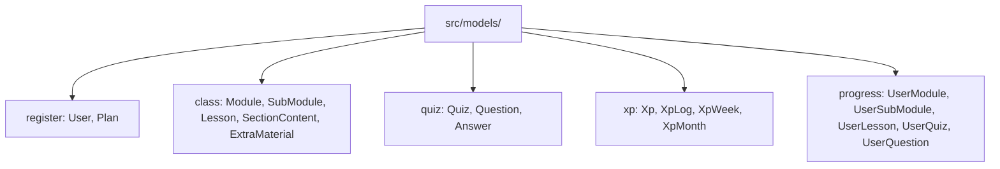

# Design Document

## Overview

This design establishes a flat, file-based TypeScript model layer for the Semeando Devs Angular application. Each domain entity from the ERD becomes a standalone TypeScript file exporting one `interface` and, where relevant, one `enum`. No classes, services, or Angular decorators are used — models are pure TypeScript value shapes.

The model layer lives entirely under `src/models/` using a one-entity-per-folder convention (`src/models/<entity-name>/<entity-name>.ts`) that mirrors the existing Angular project structure for services and components. This makes models easy to discover and import by path, and prevents circular dependencies between layers.

Entities with enum-valued fields export both the interface and the enum from the same file, keeping the import surface small. Foreign key fields use the `string` type (matching the back-end's UUID-based PKs), date fields use native `Date`, and pivot/junction entities (`Lesson_SectionContent`, `Quiz_SectionContent`) are omitted as they represent internal join tables with no front-end use case.

### Change Type

new-feature

### Design Goals

1. Provide a single source of truth for all domain entity shapes consumed by services and components.
2. Keep model files dependency-free (no Angular, no RxJS, no external libraries).
3. Co-locate enum types with their owning interface to minimize import indirection.
4. Follow kebab-case folder/file naming that matches the Angular CLI convention.

### References

- **REQ-1**: User Model
- **REQ-2**: Plan Model
- **REQ-3**: Module Model
- **REQ-4**: SubModule Model
- **REQ-5**: Lesson Model
- **REQ-6**: SectionContent Model
- **REQ-7**: ExtraMaterial Model
- **REQ-8**: Quiz Model
- **REQ-9**: Question Model
- **REQ-10**: Answer Model
- **REQ-11**: Xp Model
- **REQ-12**: XpLog Model
- **REQ-13**: XpWeek Model
- **REQ-14**: XpMonth Model
- **REQ-15**: UserModule Model
- **REQ-16**: UserSubModule Model
- **REQ-17**: UserLesson Model
- **REQ-18**: UserQuiz Model
- **REQ-19**: UserQuestion Model

## System Architecture

### DES-1: Register Domain Models

The `register` domain contains the core identity entities: `User` and `Plan`. `User` references `Plan` via `planId: string`. These two models are the root of all user-scoped relationships.

_Implements: REQ-1.1, REQ-1.2, REQ-2.1, REQ-2.2_

### DES-2: Class Domain Models

The `class` domain covers the learning hierarchy: `Module → SubModule → Lesson`. Each level references its parent via a foreign key string. `Lesson` carries a `LessonType` enum (`LESSON | CHALLENGE`). `SectionContent` represents typed content blocks (`TEXT | MARKDOWN | VIDEO | IMAGE`) attached to lessons. `ExtraMaterial` provides supplementary resources per lesson.

_Implements: REQ-3.1, REQ-3.2, REQ-4.1, REQ-4.2, REQ-5.1, REQ-5.2, REQ-5.3, REQ-6.1, REQ-6.2, REQ-6.3, REQ-7.1, REQ-7.2, REQ-7.3_

### DES-3: Quiz Domain Models

The `quiz` domain covers `Quiz`, `Question`, and `Answer`. A `Quiz` belongs to a `Lesson`. A `Question` belongs to a `Quiz` and may have an optional image. `Answer` options belong to a `Question`.

_Implements: REQ-8.1, REQ-8.2, REQ-9.1, REQ-9.2, REQ-10.1, REQ-10.2_

### DES-4: XP Domain Models

The `progress` domain's XP models track experience points earned by a user. `Xp` holds the running total. `XpLog` records each earning event with a `XpLogType` enum (`LESSON | ACHIEVEMENT | PURCHASE_TIP`). `XpWeek` and `XpMonth` store pre-aggregated weekly and monthly totals for leaderboard and dashboard use.

_Implements: REQ-11.1, REQ-11.2, REQ-12.1, REQ-12.2, REQ-12.3, REQ-13.1, REQ-13.2, REQ-14.1, REQ-14.2_

### DES-5: User Progress Models

User progress models track completion state for each learning entity. `UserModule`, `UserSubModule`, and `UserLesson` follow the same shape: `userId`, the relevant entity FK, `completed: boolean`, and `completedAt: Date`. `UserQuiz` extends this with `startedAt`, `score`, and `completedAt`. `UserQuestion` records the user's chosen `answerId` and `isCorrect`.

_Implements: REQ-15.1, REQ-15.2, REQ-16.1, REQ-16.2, REQ-17.1, REQ-17.2, REQ-18.1, REQ-18.2, REQ-19.1, REQ-19.2_

## Code Anatomy

| File Path | Purpose | Implements |
|-----------|---------|------------|
| `src/models/user/user.ts` | `User` interface | DES-1 |
| `src/models/plan/plan.ts` | `Plan` interface | DES-1 |
| `src/models/module/module.ts` | `Module` interface | DES-2 |
| `src/models/sub-module/sub-module.ts` | `SubModule` interface | DES-2 |
| `src/models/lesson/lesson.ts` | `Lesson` interface + `LessonType` enum | DES-2 |
| `src/models/section-content/section-content.ts` | `SectionContent` interface + `SectionContentType` enum | DES-2 |
| `src/models/extra-material/extra-material.ts` | `ExtraMaterial` interface + `ExtraMaterialType` enum | DES-2 |
| `src/models/quiz/quiz.ts` | `Quiz` interface | DES-3 |
| `src/models/question/question.ts` | `Question` interface | DES-3 |
| `src/models/answer/answer.ts` | `Answer` interface | DES-3 |
| `src/models/xp/xp.ts` | `Xp` interface | DES-4 |
| `src/models/xp-log/xp-log.ts` | `XpLog` interface + `XpLogType` enum | DES-4 |
| `src/models/xp-week/xp-week.ts` | `XpWeek` interface | DES-4 |
| `src/models/xp-month/xp-month.ts` | `XpMonth` interface | DES-4 |
| `src/models/user-module/user-module.ts` | `UserModule` interface | DES-5 |
| `src/models/user-sub-module/user-sub-module.ts` | `UserSubModule` interface | DES-5 |
| `src/models/user-lesson/user-lesson.ts` | `UserLesson` interface | DES-5 |
| `src/models/user-quiz/user-quiz.ts` | `UserQuiz` interface | DES-5 |
| `src/models/user-question/user-question.ts` | `UserQuestion` interface | DES-5 |

## Data Models

All models are pure TypeScript interfaces with no inheritance or Angular decorators. Enums are defined using the TypeScript `enum` keyword in the same file as their owning interface. Optional fields (`questionMarkdown`, `image` on `Question`) use the `?` optional property syntax.

## Traceability Matrix

| Design Element | Requirements |
|----------------|--------------|
| DES-1 | REQ-1.1, REQ-1.2, REQ-2.1, REQ-2.2 |
| DES-2 | REQ-3.1, REQ-3.2, REQ-4.1, REQ-4.2, REQ-5.1, REQ-5.2, REQ-5.3, REQ-6.1, REQ-6.2, REQ-6.3, REQ-7.1, REQ-7.2, REQ-7.3 |
| DES-3 | REQ-8.1, REQ-8.2, REQ-9.1, REQ-9.2, REQ-10.1, REQ-10.2 |
| DES-4 | REQ-11.1, REQ-11.2, REQ-12.1, REQ-12.2, REQ-12.3, REQ-13.1, REQ-13.2, REQ-14.1, REQ-14.2 |
| DES-5 | REQ-15.1, REQ-15.2, REQ-16.1, REQ-16.2, REQ-17.1, REQ-17.2, REQ-18.1, REQ-18.2, REQ-19.1, REQ-19.2 |
