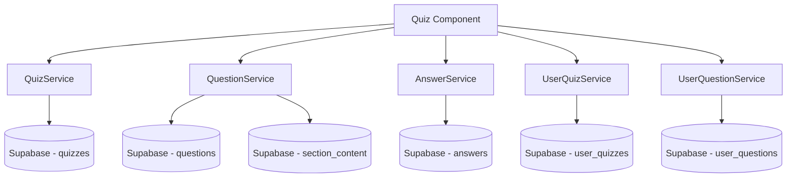
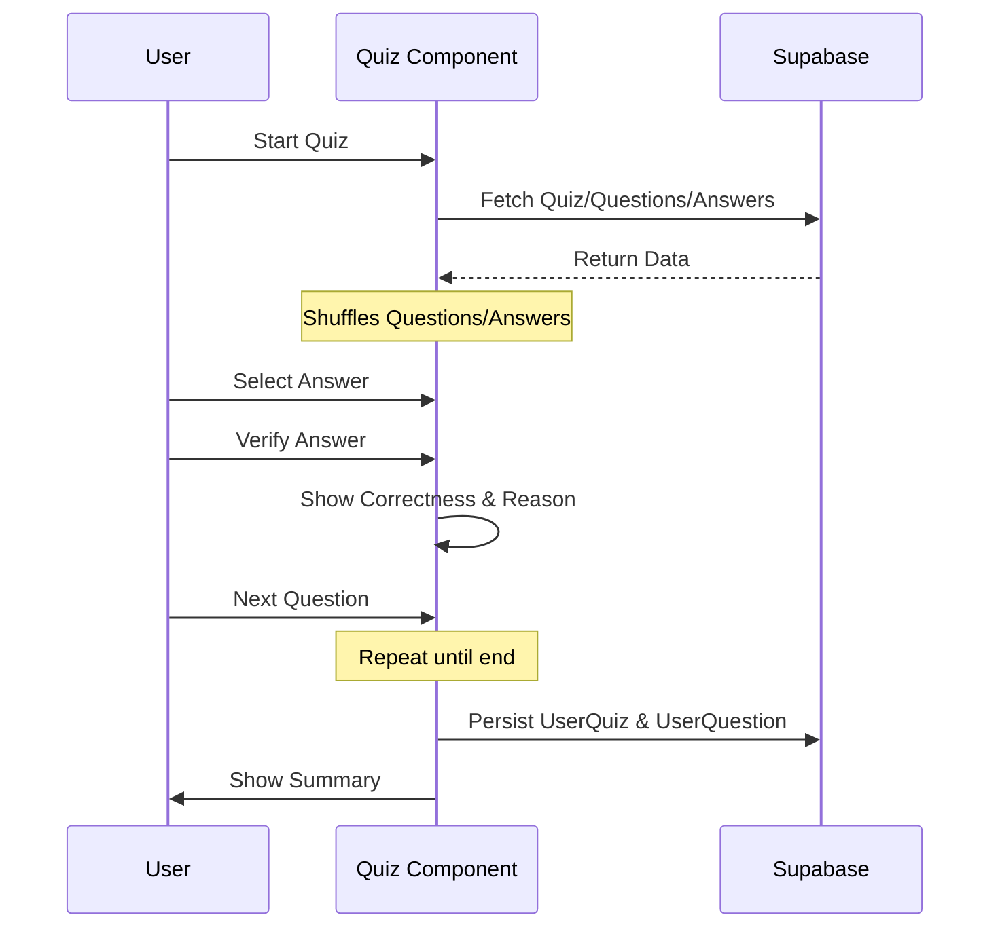
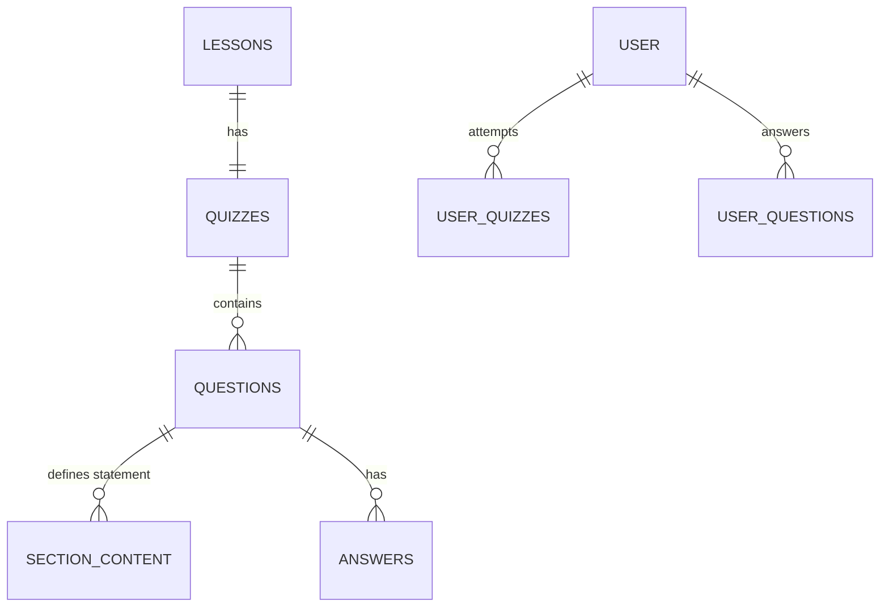
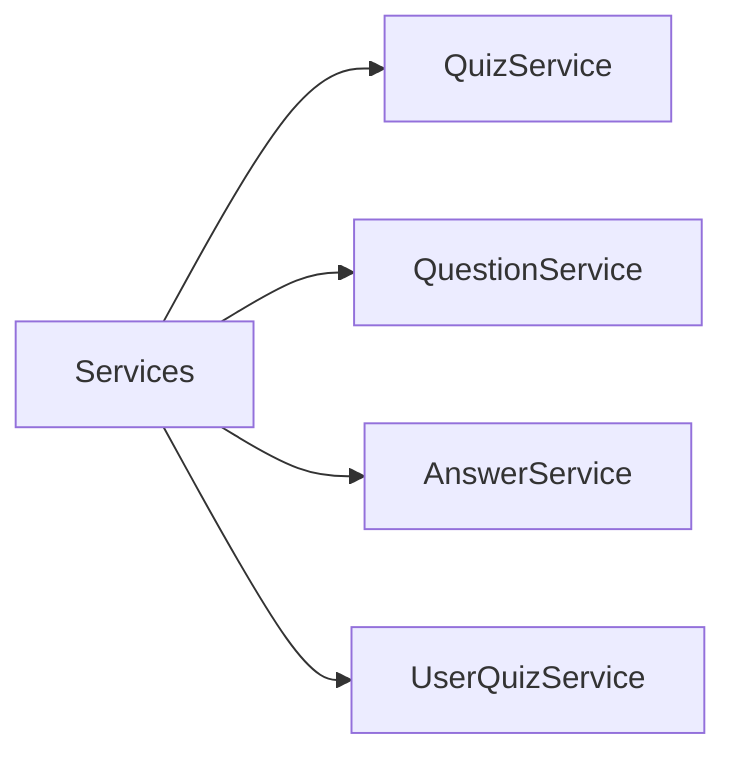
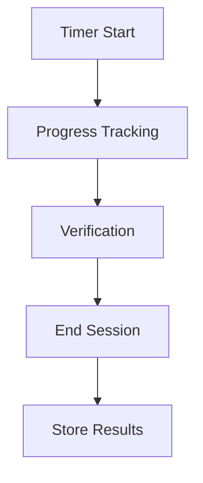

# Design Document

## Overview

This document outlines the technical design for the dynamic quiz system in the Semeando Devs application. It replaces the current static content with data stored in Supabase, allowing for specific quizzes per lesson with rich content and performance tracking.

### Change Type

new-feature

### Design Goals

1.  Replace static quiz data with a dynamic Supabase-driven system.
2.  Maintain high visual quality (Neon Terminal design) with reactive data.
3.  Track user progress and performance (score, time spent).

### References

- **REQ-1**: Database Schema (Supabase)
- **REQ-2**: Angular Services
- **REQ-3**: Quiz UI Logic
- **REQ-4**: Summary View

## System Architecture

### DES-1: Quiz Data Management System

The system orchestrates quiz data retrieval and result persistence through specialized services. It utilizes Supabase as the single source of truth for quizzes, questions, and answers.

_Implements: REQ-1.1, REQ-1.2, REQ-1.3, REQ-1.4, REQ-1.5, REQ-2_

### DES-2: Reactive Quiz Interaction Loop

The quiz page leverages Angular Signals to manage the session state. It tracks the current question, user selection, verification status, and time elapsed. Shuffling logic ensures a varied experience.

_Implements: REQ-3.1, REQ-3.2, REQ-3.3, REQ-3.4, REQ-3.5, REQ-4_

### DES-3: Database Schema Migration

A migration SHALL establish the quiz ecosystem, extending existing content models and creating tracking tables.

_Implements: REQ-1.1, REQ-1.2, REQ-1.3, REQ-1.4, REQ-1.5_

### DES-4: Angular Service Layer

Specialized services SHALL handle Supabase interactions for each domain entity.

_Implements: REQ-2.1, REQ-2.2, REQ-2.3, REQ-2.4_

### DES-5: Session State and Timer logic

Reactive signals SHALL track session progress and duration.

_Implements: REQ-3.2, REQ-3.4, REQ-4.2_

## Code Anatomy

| File Path | Purpose | Implements |
|-----------|---------|------------|
| src/app/services/quiz.service.ts | Orchestrates quiz retrieval | DES-4 |
| src/app/services/question.service.ts | Fetches question details and rich content | DES-4 |
| src/app/services/answer.service.ts | Manages answer retrieval | DES-4 |
| src/app/pages/app/quiz/quiz.ts | Main logic and state management for the quiz UI | DES-2, DES-5 |
| src/models/ | Domain models for Quiz, Question, and Answer entities | DES-3 |

## Traceability Matrix

| Design Element | Requirements |
|----------------|--------------|
| DES-1          | REQ-1, REQ-2 |
| DES-2          | REQ-3, REQ-4 |
| DES-3          | REQ-1 |
| DES-4          | REQ-2 |
| DES-5          | REQ-3, REQ-4 |

## Verification Plan

### Automated Tests
- `npm test`: Run service unit tests.
- `ng lint`: Ensure compliance with Angular Style Guide.

### Manual Verification
1.  **Dynamic Loading**: Navigate to a lesson quiz and verify content is fetched from Supabase.
2.  **Verification Flow**: Select an answer, verify feedback (correctness + reason) is correct.
3.  **Timer Persistence**: Complete a quiz and verify `spent_time` is correctly recorded in `user_quizzes`.
4.  **Summary calculation**: Cross-check displayed metrics (success %) with actual results.
