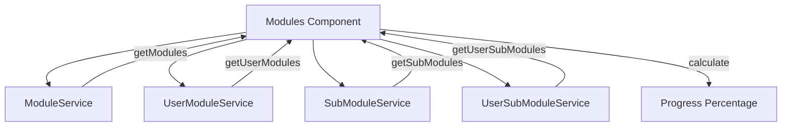
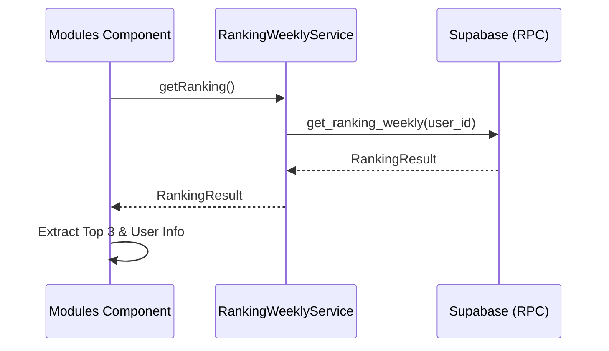
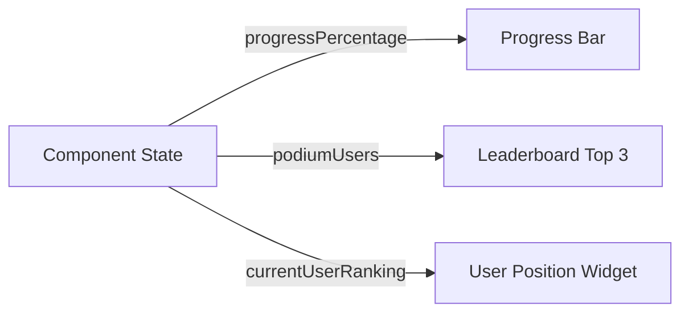
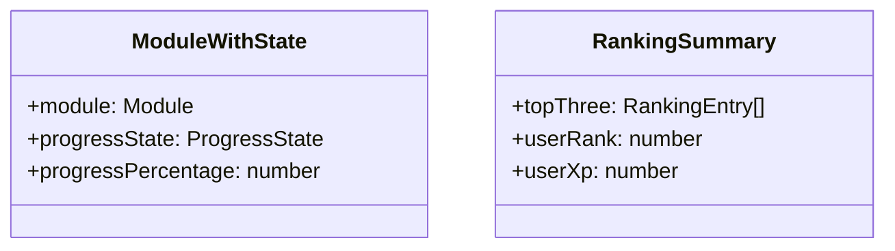

# Design Document

## Overview
This design document describes the transition from hardcoded module progress and ranking displays to a dynamic, data-driven approach on the modules dashboard. The implementation involves aggregating submodule completion data and integrating the existing weekly ranking service.

### Change Type
enhancement

### Design Goals
1. Provide accurate, real-time progress tracking for each module.
2. Display live weekly leaderboard data to encourage community engagement.
3. Maintain high performance by minimizing redundant database queries.

### References
- **REQ-1**: Dynamic Module Progress Calculation
- **REQ-2**: Dynamic Weekly Ranking Display

## System Architecture

### DES-1: Dynamic Module Progress Provider
The `Modules` component will act as the data aggregator for module progress. It will leverage `SubModuleService` and `UserSubModuleService` to calculate completion percentages.

_Implements: REQ-1.1, REQ-1.2, REQ-1.3, REQ-1.4_

### DES-2: Weekly Ranking Integration
The `Modules` component will integrate with `RankingWeeklyService` to fetch the top performers and the current user's relative position.

_Implements: REQ-2.1, REQ-2.2, REQ-2.3_

### DES-3: UI Binding Strategy
The modules template will be updated to use the calculated progress and fetched ranking data.

_Implements: REQ-1.2, REQ-2.2, REQ-2.3_

## Code Anatomy

| File Path | Purpose | Implements |
|-----------|---------|------------|
| [modules.ts](file:///home/developer/workspace-pessoal/semeandodevsapp/src/app/pages/app/modules/modules.ts) | Orchestrates data fetching and progress calculation logic. | DES-1, DES-2 |
| [modules.html](file:///home/developer/workspace-pessoal/semeandodevsapp/src/app/pages/app/modules/modules.html) | Displays dynamic progress bars and weekly ranking cards. | DES-3 |

## Data Models

The following fields will be added to the internal state of the `Modules` component:

## Traceability Matrix

| Design Element | Requirements |
|----------------|--------------|
| DES-1 | REQ-1.1, REQ-1.2, REQ-1.3, REQ-1.4 |
| DES-2 | REQ-2.1, REQ-2.2, REQ-2.3 |
| DES-3 | REQ-1.2, REQ-2.2, REQ-2.3 |
