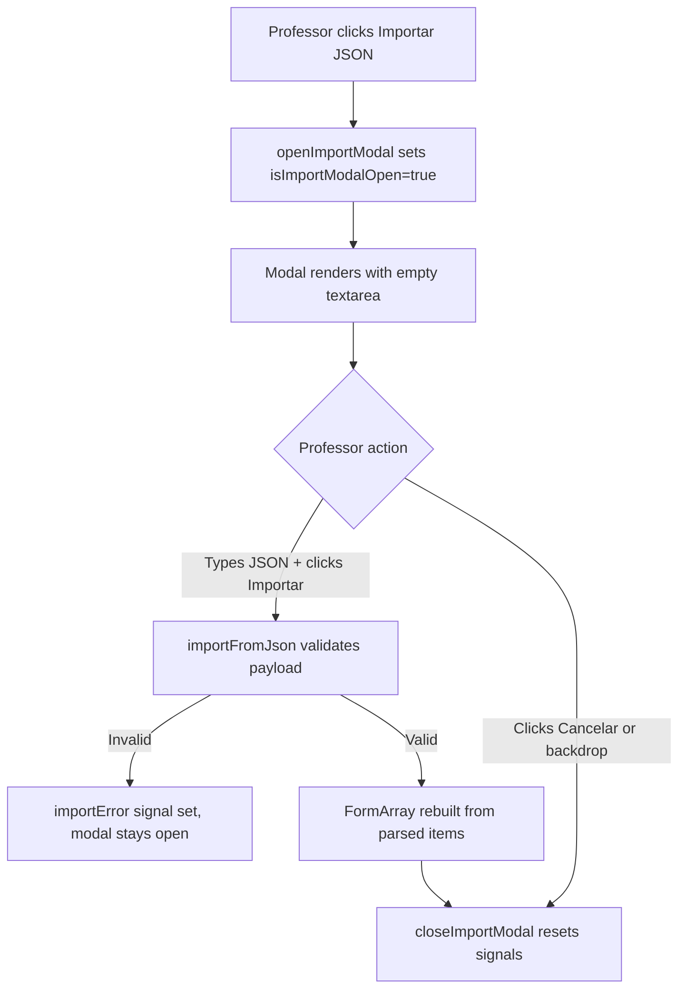
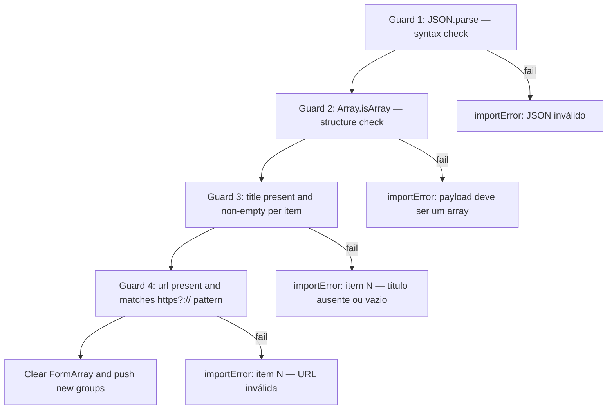
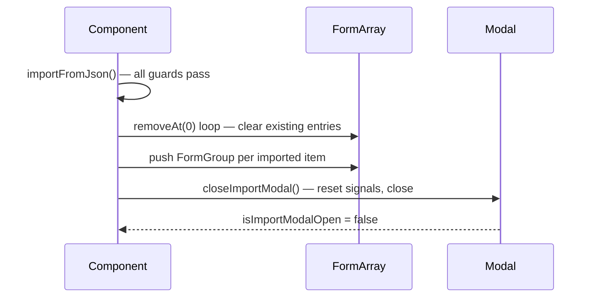
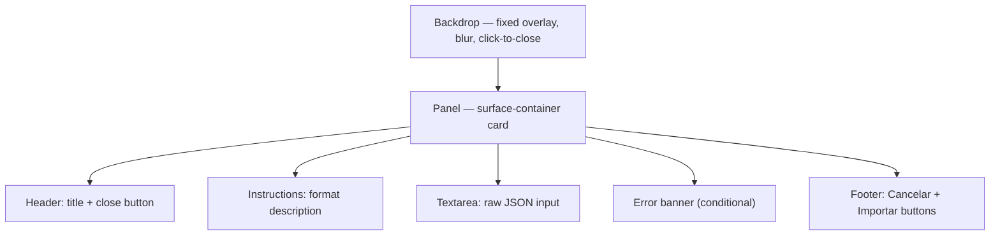
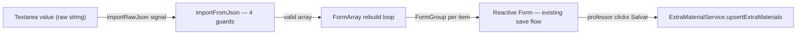
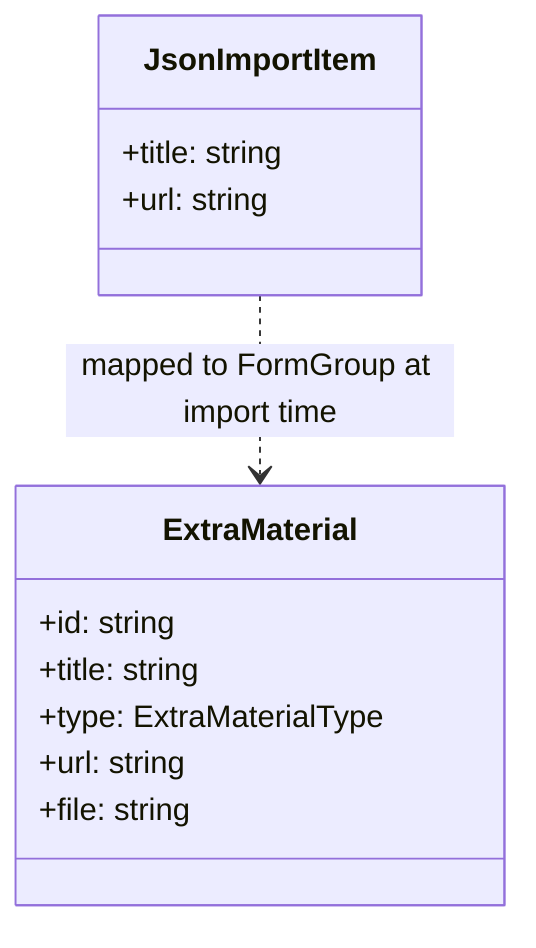

# Design Document

## Overview

This feature extends the `TabExtraMaterial` Angular standalone component with a JSON bulk-import capability, mirroring the pattern already established in `TabQuiz`. The change is entirely self-contained within the component's TypeScript, HTML, and SCSS files — no new services, routes, or data model fields are required.

When the professor clicks "Importar JSON", a modal overlay appears. The professor pastes a JSON array into a plain `<textarea>`. On submit, the component validates the payload inline (no server call) and, if valid, replaces the current `FormArray` entries with new reactive form groups built from the imported items. The modal closes and the professor can review, edit, or delete each entry before pressing the existing "Salvar Materiais" button to persist to the database.

The UI pattern for the modal follows the design system defined in `STYLEGUIDE.md`: glassmorphic overlay (`backdrop-blur`, `surface_bright` at 70% opacity), `surface_container` panel, no border lines, and `secondary` accent for the import action. Validation errors are shown inline inside the modal using the existing `error` color token.

### Change Type

enhancement

### Design Goals

1. Reuse the existing modal interaction pattern from `TabQuiz` (open/close signals, inline error signal, backdrop-click dismissal).
2. Keep the import entirely in-memory so no new service calls or model changes are needed.
3. Preserve the existing materials list when the professor cancels or closes the modal without importing.

### References

- **REQ-1**: Open Import JSON Modal
- **REQ-2**: Validate and Import JSON Payload
- **REQ-3**: Post-Import Form State
- **REQ-4**: Close and Reset Modal

## System Architecture

### DES-1: Import Modal State and Trigger (Component Logic)

The `TabExtraMaterial` component class gains three new signals and a local interface to manage modal lifecycle:

- `isImportModalOpen: Signal<boolean>` — controls modal visibility.
- `importError: Signal<string | null>` — holds the validation error message shown inside the modal.
- `importRawJson: Signal<string>` — holds the current textarea value as the professor types.

A `JsonImportItem` interface (`{ title: string; url: string }`) defines the expected shape of each array element and is used only inside the component for type narrowing during validation.

Three methods are added: `openImportModal()`, `closeImportModal()`, and `importFromJson()`. `openImportModal()` records a snapshot of the current `FormArray` length as a safeguard; `closeImportModal()` resets all import signals regardless of the caller; `importFromJson()` validates the payload, rebuilds the `FormArray`, and calls `closeImportModal()` on success.

_Implements: REQ-1.1, REQ-1.2, REQ-4.1, REQ-4.2, REQ-4.3_

### DES-2: JSON Validation Pipeline

`importFromJson()` applies four sequential guards before touching the `FormArray`. Each guard sets `importError` and returns early on failure, leaving the modal open so the professor can correct the input.

_Implements: REQ-2.1, REQ-2.2, REQ-2.3, REQ-2.4_

### DES-3: FormArray Rebuild and Post-Import State

When all guards pass, the component clears the existing `FormArray` and pushes one `FormGroup` per imported item. Each group follows the same schema as `addMaterial()` — `id` (new `crypto.randomUUID()`), `title`, `type` (defaulting to `ExtraMaterialType.URL`), and `url` — so the imported entries are indistinguishable from manually added ones and benefit from all existing validators.

The `loadedMaterialIds` set is **not** modified during an import because imported entries are treated as new (not yet persisted). The `materialsToDelete` signal is also left untouched, preserving any pending deletions the professor had queued before opening the modal.

_Implements: REQ-2.5, REQ-3.1, REQ-3.2_

### DES-4: Modal Overlay UI

The modal is rendered inline in `tab-extra-material.html` using an `@if (isImportModalOpen())` block, identical in structure to the quiz import modal. Layout layers:

- **Backdrop**: `fixed inset-0` with `bg-surface/70 backdrop-blur-xl`; click handler calls `closeImportModal()`.
- **Panel**: `relative` container, `bg-surface-container`, `max-w-lg`, `rounded-2xl`; stops click propagation.
- **Header**: title + close button (calls `closeImportModal()`).
- **Instructions**: one-line description of the expected JSON format, using `font-mono text-xs text-on-surface-variant`.
- **Textarea**: `w-full`, `bg-surface-container-lowest`, `rounded-xl`, `min-h-[200px]`, `resize-y`; bound to `importRawJson` via two-way binding.
- **Error banner**: `@if (importError())` block styled with `bg-error/10 border-l-4 border-error text-error`.
- **Footer**: "Cancelar" ghost button + "Importar" gradient button (primary style) with `aria-busy` binding.

The modal relies on the component's own SCSS for the `glass-alert` glassmorphic style; no new CSS classes are needed.

_Implements: REQ-1.2, REQ-2.1, REQ-2.2, REQ-2.3, REQ-2.4, REQ-4.1, REQ-4.2, REQ-4.3_

## Data Flow

## Data Models

The existing `ExtraMaterial` interface and `ExtraMaterialType` enum remain unchanged. A lightweight local interface is introduced inside the component file only:

## Error Handling

| Error Condition | Response | Recovery |
|-----------------|----------|----------|
| Syntactically invalid JSON | Set `importError` to "JSON inválido. Verifique a sintaxe." | Modal stays open; professor corrects input |
| Valid JSON but not an array | Set `importError` to "O payload deve ser um array." | Modal stays open |
| Item missing or empty `title` | Set `importError` identifying item index | Modal stays open |
| Item missing `url` or invalid URL | Set `importError` identifying item index | Modal stays open |
| Import succeeds but `FormArray` rebuild throws | `importError` shows generic error; modal stays open | Professor retries |

## Code Anatomy

| File Path | Purpose | Implements |
|-----------|---------|------------|
| `src/app/pages/professor/professor-app/create-lesson/tab-extra-material/tab-extra-material.ts` | Adds import signals, `JsonImportItem` interface, and modal methods | DES-1, DES-2, DES-3 |
| `src/app/pages/professor/professor-app/create-lesson/tab-extra-material/tab-extra-material.html` | Adds "Importar JSON" button in header and modal overlay block | DES-4 |
| `src/app/pages/professor/professor-app/create-lesson/tab-extra-material/tab-extra-material.scss` | No new styles required; existing `.glass-alert`, `.btn-primary`, `.btn-secondary` cover modal needs | DES-4 |

## Traceability Matrix

| Design Element | Requirements |
|----------------|--------------|
| DES-1 | REQ-1.1, REQ-1.2, REQ-4.1, REQ-4.2, REQ-4.3 |
| DES-2 | REQ-2.1, REQ-2.2, REQ-2.3, REQ-2.4 |
| DES-3 | REQ-2.5, REQ-3.1, REQ-3.2 |
| DES-4 | REQ-1.2, REQ-2.1, REQ-2.2, REQ-2.3, REQ-2.4, REQ-4.1, REQ-4.2, REQ-4.3 |
