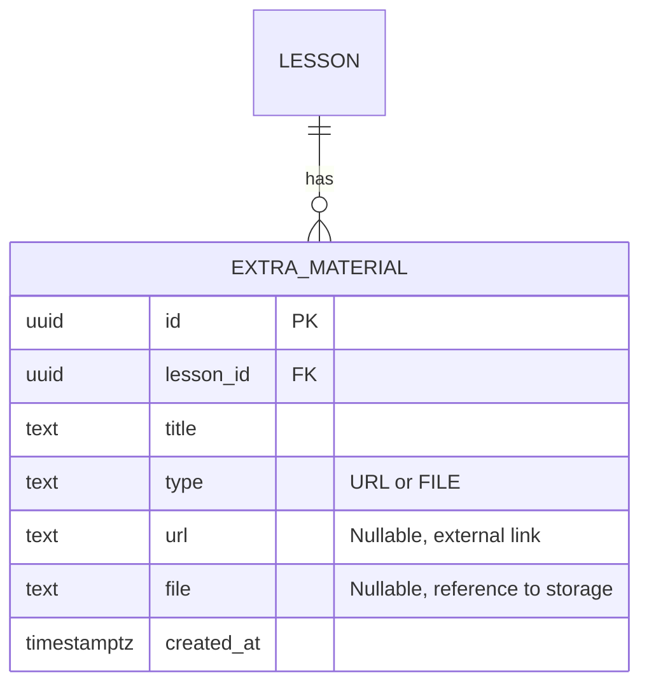
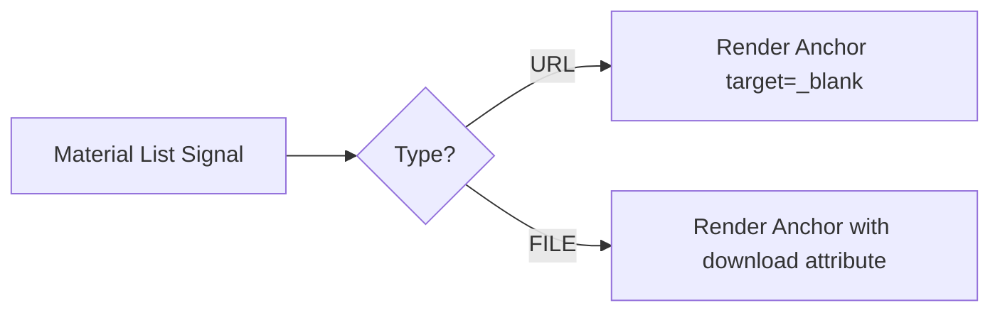

# Design Document

## Overview

This document outlines the technical design for introducing Extra Materials to lessons in the Semeando Devs application. Extra materials allow instructors to provide supplementary links (URLs) or downloadable files to students within the context of a lesson.

To achieve this, we will introduce a new `extra_material` table in Supabase, create an Angular service (`ExtraMaterialService`) to fetch this data, and integrate it into the existing `Lesson` component to render the materials interactively using signals.

### Change Type

new-feature

### Design Goals

1. Seamlessly integrate the retrieval of extra materials into the existing lesson data loading flow (`Lesson` component).
2. Ensure accurate representation of URL vs. FILE types on the frontend, using appropriate semantic HTML and interactive behaviors (e.g. `target="_blank"` vs download attributes).
3. Establish a robust database schema supporting both external links and internal bucket files.

### References

- **REQ-1**: Display Extra Materials
- **REQ-2**: File-based Extra Material Access
- **REQ-3**: URL-based Extra Material Access

## System Architecture

### DES-1: Extra Material Data Storage

The `extra_material` table in the Supabase database will store metadata for each extra material block associated with a lesson. It relies on the `lesson_id` as a foreign key to the `lessons` table.



_Implements: REQ-1.1_

### DES-2: Extra Material Service Integration

An Angular service `ExtraMaterialService` will communicate with the Supabase MCP to retrieve `ExtraMaterial` objects linked to the currently active lesson ID. This service will be injected into the `Lesson` component and queried alongside existing assets (like `SectionContent`).

```mermaid
flowchart TD
    A[Lesson Component] -->|injects| B[ExtraMaterialService]
    B -->|getExtraMaterialsByLessonId| C[(Supabase db)]
    C -->|returns| B
    B -->|returns ExtraMaterial[]| A
```

_Implements: REQ-1.1_

### DES-3: Lesson UI Presentation

The `Lesson` component template will iterate over the fetched `ExtraMaterial` list. A conditional switch (or `@if` control flow) over the material type will render the correct `href`, `target`, and `download` attributes for the item to satisfy UI requirements. Materials will be displayed inside the "Resources Card" sidebar block.



_Implements: REQ-1.2, REQ-2.1, REQ-3.1_

## Code Anatomy

| File Path | Purpose | Implements |
|-----------|---------|------------|
| `supabase/migrations/*_create_extra_material_table.sql` | DDL for the ExtraMaterial table | DES-1 |
| `src/app/services/extra-material/extra-material.service.ts` | Orchestrates fetching from Supabase | DES-2 |
| `src/app/pages/app/lesson/lesson.ts` | Loads extra materials via service, exposes signal | DES-2, DES-3 |
| `src/app/pages/app/lesson/lesson.html` | UI changes to display the materials dynamically | DES-3 |

## Traceability Matrix

| Design Element | Requirements |
|----------------|--------------|
| DES-1 | REQ-1.1 |
| DES-2 | REQ-1.1 |
| DES-3 | REQ-1.2, REQ-2.1, REQ-3.1 |
