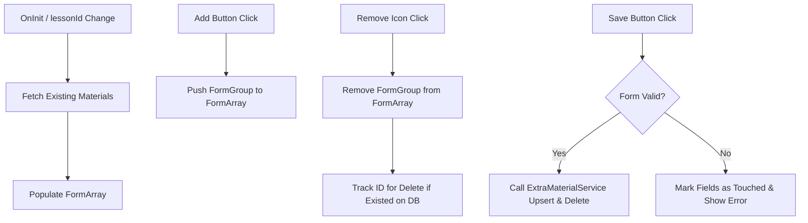
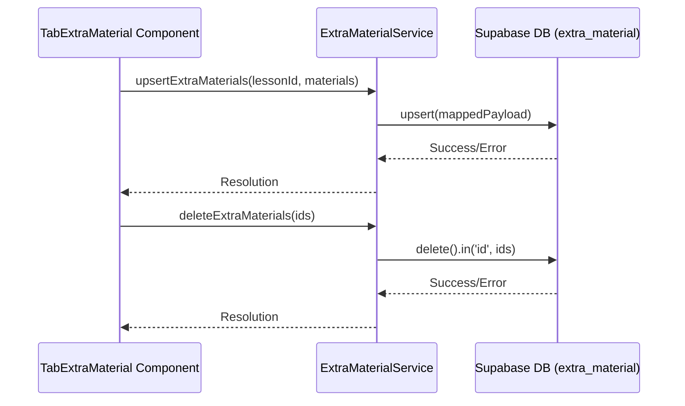
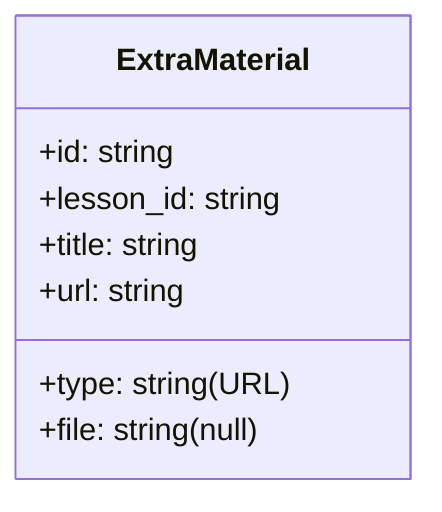

# Design Document

## Overview
This document specifies the technical design for implementing the "Extra Materials" management interface and integration in the professor's lesson creation dashboard.

The feature utilizes Angular v20+ standalone components, Reactive Forms (via `FormBuilder` and `FormArray`), and signals for state management. Persistence is handled through Supabase using the existing PostgreSQL `extra_material` table structure, with all operations encapsulated in the `ExtraMaterialService` to ensure a clean separation of concerns.

### Change Type
enhancement

### Design Goals
1. Provide a highly responsive and reactive authoring experience for managing supporting URLs.
2. Ensure strict data validation (non-empty titles and valid URLs) prior to sending requests to Supabase.
3. Align visual design strictly with the *Neon Terminal* style guide, leveraging deep midnight background contrasts and absolute avoiding of 1px solid borders.

### References
- **REQ-1**: Extra Materials List
- **REQ-2**: Add and Modify Extra Materials
- **REQ-3**: Persist Extra Materials

## System Architecture

### DES-1: TabExtraMaterial Component View & Local Form State

The `TabExtraMaterial` component manages the frontend state and layout for the extra materials of the active lesson. It accepts the `lessonId` input signal from the parent component, loads any existing extra materials from the backend on init, and binds the list of materials to an Angular `FormArray` within a Reactive Form.

The component allows adding a new material row locally, validating inputs, tracking deleted items, and calling the persistence service when the professor clicks "Salvar".

_Implements: REQ-1.1, REQ-1.2, REQ-1.3, REQ-2.1, REQ-2.2, REQ-2.3, REQ-3.2, REQ-3.3_

### DES-2: ExtraMaterialService Database Gateway

The `ExtraMaterialService` encapsulates all interactions with the Supabase `extra_material` table. It exposes methods to fetch materials by lesson ID, upsert an array of materials (with automatic column mappings like `lesson_id`), and delete a list of materials by their primary keys.

_Implements: REQ-3.1_

## Code Anatomy

| File Path | Purpose | Implements |
|-----------|---------|------------|
| [extra-material.ts](file:///home/developer/workspace-pessoal/semeandodevsapp/src/models/extra-material/extra-material.ts) | Model defining the database representation and typescript type of extra material records. | DES-1, DES-2 |
| [extra-material.ts](file:///home/developer/workspace-pessoal/semeandodevsapp/src/app/services/extra-material.ts) | Service containing database fetch, upsert, and delete operations. | DES-2 |
| [tab-extra-material.ts](file:///home/developer/workspace-pessoal/semeandodevsapp/src/app/pages/professor/professor-app/create-lesson/tab-extra-material/tab-extra-material.ts) | Logic and reactive state management for adding, listing, validating, and submitting extra materials. | DES-1 |
| [tab-extra-material.html](file:///home/developer/workspace-pessoal/semeandodevsapp/src/app/pages/professor/professor-app/create-lesson/tab-extra-material/tab-extra-material.html) | Component HTML template displaying inputs, lists, buttons, and state indicators with Neon Terminal styling. | DES-1 |
| [tab-extra-material.scss](file:///home/developer/workspace-pessoal/semeandodevsapp/src/app/pages/professor/professor-app/create-lesson/tab-extra-material/tab-extra-material.scss) | Styles applying the Neon Terminal design tokens (no 1px borders, surface container low/high background depth shifts, transitions). | DES-1 |
| [create-lesson.html](file:///home/developer/workspace-pessoal/semeandodevsapp/src/app/pages/professor/professor-app/create-lesson/create-lesson.html) | Passes the `lessonId` input to `<app-tab-extra-material>` to sync active lesson context. | DES-1 |

## Data Models

The implementation references the `ExtraMaterial` model, using a type-safe subset for state and payloads.

## Error Handling

| Error Condition | Response | Recovery |
|-----------------|----------|----------|
| Invalid Form (Empty fields or invalid URL) | Block saving operation | Highlight invalid inputs and display validation error message |
| Network or Supabase DB Error on Fetch | Log error and update signal state | Show error alert message in UI and prompt to reload |
| Network or Supabase DB Error on Save | Re-enable save button and display error alert | Keep local state intact to allow retrying without losing changes |

## Impact Analysis

| Affected Area | Impact Level | Notes |
|---------------|--------------|-------|
| `create-lesson.html` | Low | Wire input `[lessonId]="lessonId()"` to `app-tab-extra-material` to bind the active lesson. |
| `ExtraMaterialService` | Medium | Extending service to support `upsert` and `delete` operations. |

### Testing Requirements

| Test Type | Coverage Goal | Notes |
|-----------|---------------|-------|
| Unit Test | TabExtraMaterial logic and form validation | Verify items can be added, deleted, form validates correctly, and service functions are called on submit. |

## Traceability Matrix

| Design Element | Requirements |
|----------------|--------------|
| DES-1 | REQ-1.1, REQ-1.2, REQ-1.3, REQ-2.1, REQ-2.2, REQ-2.3, REQ-3.2, REQ-3.3 |
| DES-2 | REQ-3.1 |
