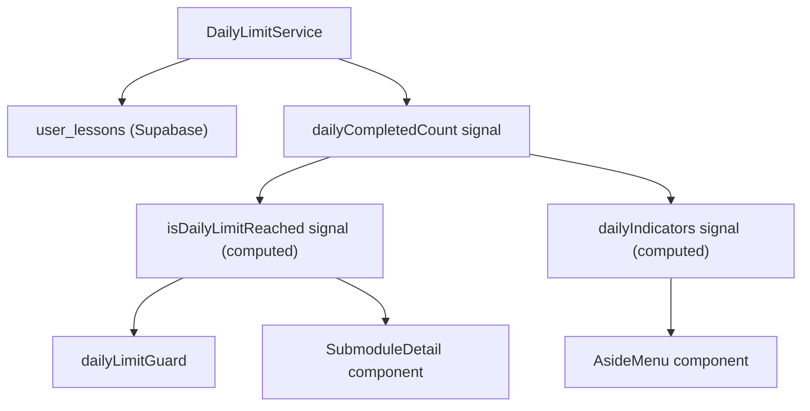
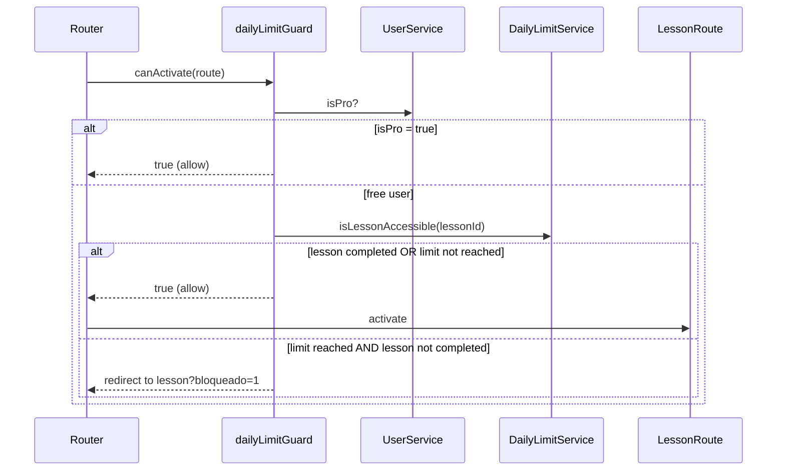
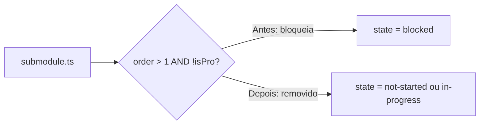
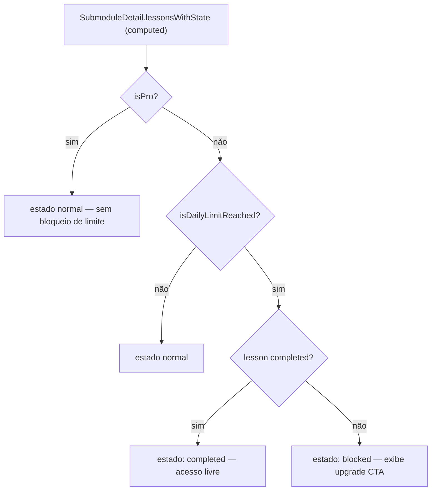
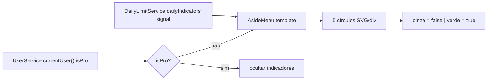
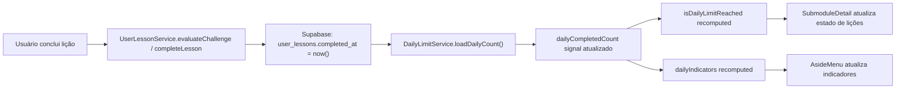
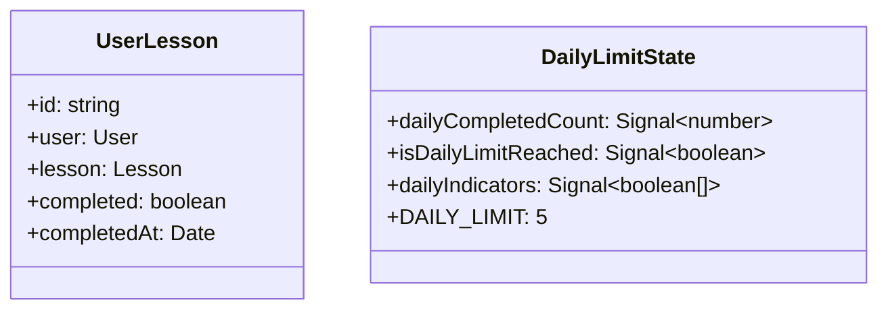

# Design Document

## Overview

Esta mudança introduz um modelo de limite diário para usuários do plano free, substituindo o bloqueio por ordem de submódulo. A lógica de controle de acesso é centralizada em um novo serviço (`DailyLimitService`) que consulta a tabela existente `user_lessons` para calcular quantas lições foram concluídas no dia corrente. Nenhuma nova tabela é necessária.

O acesso a lições é protegido em duas camadas: (1) uma **Angular Route Guard** (`dailyLimitGuard`) que bloqueia a navegação antes mesmo de o componente ser carregado, cobrindo acesso direto por URL, deep links e rotas de quiz/challenge; e (2) a **interface de listagem de lições** (`SubmoduleDetail`) que exibe visualmente quais lições estão disponíveis ou bloqueadas com base no estado do limite diário. O menu lateral (`AsideMenu`) exibe os 5 indicadores circulares de progresso, consumindo o mesmo sinal reativo do serviço.

A verificação de `isPro` já existe no `UserService`, portanto usuários Pró ignoram completamente a lógica do limite. O design é orientado a sinais Angular (signals) para garantir reatividade e performance com `OnPush`.

### Change Type

enhancement

### Design Goals

1. Centralizar a lógica de limite diário em um serviço singleton reutilizável por guard, componentes e menu lateral.
2. Proteger as rotas de lição, quiz e challenge de forma declarativa via Angular Route Guard, sem depender de validação exclusivamente no template.
3. Remover o bloqueio por ordem de submódulo (`order > 1`) preservando o fluxo de progresso sequencial de lições dentro de cada submódulo.
4. Exibir os 5 indicadores de progresso diário de forma reativa no menu lateral, atualizando-se automaticamente após cada conclusão.
5. Reutilizar a tabela `user_lessons` com `completed_at` como fonte de verdade, sem criar novas tabelas.

### References

- **REQ-1**: Remoção do bloqueio por submódulo para usuários free
- **REQ-2**: Limite diário de 5 lições concluídas para usuários free
- **REQ-3**: Bloqueio efetivo ao atingir o limite diário
- **REQ-4**: Reset automático do contador diário
- **REQ-5**: Indicadores de progresso diário no menu lateral
- **REQ-6**: Acesso livre a lições já concluídas

---

## System Architecture

### DES-1: DailyLimitService — Fonte de verdade do limite diário

O `DailyLimitService` é um serviço singleton (`providedIn: 'root'`) responsável por calcular e expor o estado do limite diário do usuário free. Ele consulta `user_lessons` filtrando por `user_id`, `completed = true` e `completed_at` dentro do dia corrente (UTC-3). O resultado é armazenado em um signal reativo (`dailyCompletedCount`) que outros elementos consomem sem realizar novas requisições.

O serviço expõe:
- `dailyCompletedCount: Signal<number>` — contagem de lições concluídas hoje
- `isDailyLimitReached: Signal<boolean>` — computed: `dailyCompletedCount() >= DAILY_LIMIT`
- `dailyIndicators: Signal<boolean[]>` — computed: array de 5 booleanos (true = verde, false = cinza)
- `loadDailyCount(userId: string): Promise<void>` — carrega ou recarrega a contagem do dia
- `isLessonAccessible(lessonId: string): Promise<boolean>` — retorna true se a lição já está concluída ou se o limite não foi atingido

A data de referência é calculada no fuso UTC-3 usando `Date` e deslocamento de offset para isolar o dia calendário corrente.

_Implements: REQ-2.1, REQ-2.3, REQ-4.1, REQ-5.1, REQ-5.2_

---

### DES-2: dailyLimitGuard — Proteção declarativa de rotas

Um Angular functional guard (`CanActivateFn`) aplicado nas rotas de lição, quiz e challenge no arquivo `app.routes.ts`. O guard injeta `DailyLimitService` e `UserService` para:

1. Se `isPro = true` → permite acesso imediatamente.
2. Se a lição já foi concluída pelo usuário → permite acesso (REQ-6).
3. Se `isDailyLimitReached = true` e a lição não está concluída → bloqueia e redireciona para a URL da lição com um query param `?bloqueado=1`, que o componente de lição usa para exibir o estado de bloqueio sem renderizar o conteúdo.

O guard cobre as três rotas filhas do contexto de lição:
- `.../lesson/:lessonId`
- `.../lesson/:lessonId/quiz`
- `.../lesson/:lessonId/challenge`

_Implements: REQ-3.1, REQ-3.2, REQ-3.3, REQ-3.4, REQ-6.1_

---

### DES-3: Remoção do bloqueio por submódulo em SubmoduleComponent

O componente `Submodule` (`submodule.ts`) contém a lógica que força `state = 'blocked'` quando `(sm.order ?? 0) > 1 && !isPro`. Essa condicional será removida. O estado de submódulo passa a depender exclusivamente do progresso sequencial do usuário (completou o anterior ou não), sem distinção de plano.

A página de listagem de submódulos (`submodule.html`) e a de listagem de lições (`submodule-detail.ts`) não precisam de alterações estruturais para REQ-1, apenas a remoção do guard de ordem.

_Implements: REQ-1.1, REQ-1.2_

---

### DES-4: Estado de bloqueio diário em LessonComponent e SubmoduleDetail

**LessonComponent** (`lesson.ts`): Detecta o query param `?bloqueado=1` na rota. Quando presente, exibe o estado de bloqueio com a mensagem definida em REQ-3.1, sem carregar o conteúdo da lição. Quando ausente, comporta-se normalmente.

**SubmoduleDetail** (`submodule-detail.ts`): Ao calcular `lessonsWithState`, injeta `DailyLimitService` e marca lições como `blocked` quando: (a) o limite foi atingido E (b) a lição não está concluída. Lições já concluídas permanecem acessíveis. O template exibe o CTA de upgrade quando a lição está no estado `blocked` por limite diário.

_Implements: REQ-3.1, REQ-3.4, REQ-6.1_

---

### DES-5: Indicadores de progresso diário no AsideMenu

O componente `AsideMenu` injeta `DailyLimitService` e `UserService`. Para usuários free, exibe uma faixa com 5 indicadores circulares renderizados a partir do signal `dailyIndicators` (array de 5 booleanos). O signal é reativo: quando `loadDailyCount` é chamado após uma lição ser concluída, os indicadores atualizam-se automaticamente sem reload.

A faixa é visível apenas quando `!isPro`. Para usuários Pró, o bloco é omitido via `@if`.

_Implements: REQ-5.1, REQ-5.2, REQ-5.3, REQ-5.4_

---

## Data Flow

---

## Code Anatomy

| File Path | Purpose | Implements |
|-----------|---------|------------|
| `src/app/services/daily-limit/daily-limit.ts` | Serviço singleton com signals de limite diário e consulta à `user_lessons` | DES-1 |
| `src/app/components/guards/daily-limit.guard.ts` | Guard funcional que protege rotas de lição/quiz/challenge | DES-2 |
| `src/app/app.routes.ts` | Adiciona `dailyLimitGuard` nas rotas de lição, quiz e challenge | DES-2 |
| `src/app/pages/app/submodule/submodule.ts` | Remove bloqueio por ordem de submódulo para usuários free | DES-3 |
| `src/app/pages/app/submodule-detail/submodule-detail.ts` | Integra `DailyLimitService` para marcar lições como `blocked` por limite diário | DES-4 |
| `src/app/pages/app/submodule-detail/submodule-detail.html` | Exibe estado de bloqueio e CTA de upgrade para lições bloqueadas por limite diário | DES-4 |
| `src/app/pages/app/lesson/lesson.ts` | Detecta `?bloqueado=1` e exibe estado de bloqueio sem carregar conteúdo | DES-4 |
| `src/app/pages/app/lesson/lesson.html` | Template condicional para estado de bloqueio com mensagem e CTA de upgrade | DES-4 |
| `src/app/components/aside-menu/aside-menu.ts` | Injeta `DailyLimitService` e expõe `dailyIndicators` | DES-5 |
| `src/app/components/aside-menu/aside-menu.html` | Renderiza 5 indicadores circulares com estado dinâmico | DES-5 |

---

## Data Models

O modelo `UserLesson` existente já possui os campos necessários. Apenas o mapeamento no `UserLessonService.getUserLessonsForUser` precisa incluir `completed_at` para permitir filtragem por data no `DailyLimitService`.

---

## Error Handling

| Error Condition | Response | Recovery |
|-----------------|----------|----------|
| Falha ao consultar `user_lessons` no `DailyLimitService` | `dailyCompletedCount` permanece 0, acesso é liberado | Log do erro; comportamento degradado permite o acesso (fail-open) |
| Guard não consegue verificar `isLessonAccessible` | Permite acesso (fail-open) para evitar bloqueio indevido | Log do erro; o guard não bloqueia por precaução |
| `completed_at` nulo em registro com `completed = true` | Registro ignorado na contagem diária | Contagem reflete apenas registros com data válida |

---

## Impact Analysis

| Affected Area | Impact Level | Notes |
|---------------|--------------|-------|
| `submodule.ts` | Alto | Remoção da lógica de bloqueio por ordem — afeta todos os usuários free existentes |
| `submodule-detail.ts` | Médio | Novo estado de bloqueio por limite diário; integração com novo serviço |
| `lesson.ts` / `lesson.html` | Médio | Novo estado de bloqueio condicional via query param |
| `aside-menu.ts` / `aside-menu.html` | Baixo | Adição de bloco visual de indicadores; não altera fluxo existente |
| `app.routes.ts` | Baixo | Adição de guard nas 3 rotas de lição; não altera estrutura de rotas |
| `user_lessons` (Supabase) | Nenhum | Nenhuma alteração de schema; apenas novo padrão de consulta com filtro por data |

### Testing Requirements

| Test Type | Coverage Goal | Notes |
|-----------|---------------|-------|
| Unit | `DailyLimitService` | Testar cálculo de contagem diária com datas no limite de virada de dia UTC-3 |
| Unit | `dailyLimitGuard` | Testar os 3 cenários: isPro, lição já concluída, limite atingido |
| Unit | `SubmoduleDetail.lessonsWithState` | Verificar computed com limite atingido e não atingido |
| Component | `AsideMenu` | Verificar renderização dos 5 indicadores em estados 0/3/5 completados |

### Risk Assessment

| Risk | Likelihood | Impact | Mitigation |
|------|------------|--------|------------|
| Usuário free perde acesso a submódulos que antes estavam liberados (order=1) | Baixo | Médio | REQ-1 garante que todos os submódulos ficam acessíveis |
| Acesso indevido por falha no guard (fail-open) | Baixo | Baixo | Comportamento intencional para evitar falsos bloqueios; aceito por design |
| `completed_at` com timezone incorreto causar contagem errada | Médio | Médio | Normalizar a comparação de datas sempre em UTC e aplicar offset de -3h explicitamente |

---

## Traceability Matrix

| Design Element | Requirements |
|----------------|--------------|
| DES-1: DailyLimitService | REQ-2.1, REQ-2.3, REQ-4.1, REQ-5.1, REQ-5.2 |
| DES-2: dailyLimitGuard | REQ-3.1, REQ-3.2, REQ-3.3, REQ-3.4, REQ-6.1 |
| DES-3: Remoção do bloqueio por submódulo | REQ-1.1, REQ-1.2 |
| DES-4: Estado de bloqueio diário em Lesson e SubmoduleDetail | REQ-3.1, REQ-3.4, REQ-6.1 |
| DES-5: Indicadores de progresso no AsideMenu | REQ-5.1, REQ-5.2, REQ-5.3, REQ-5.4 |
