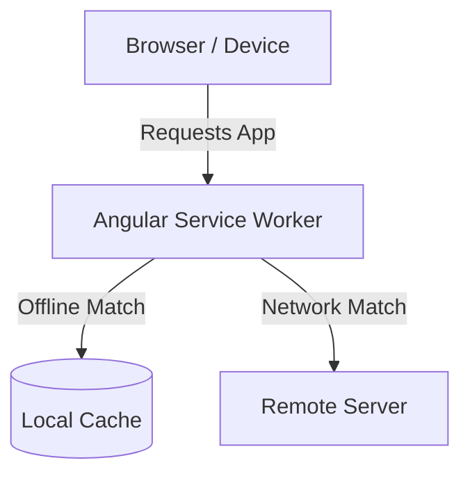
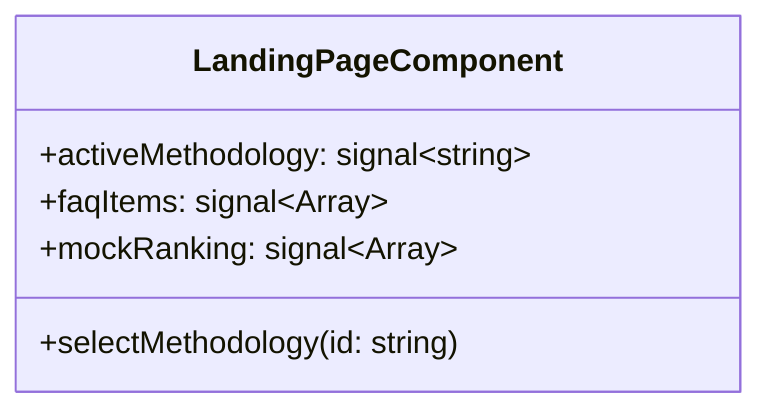
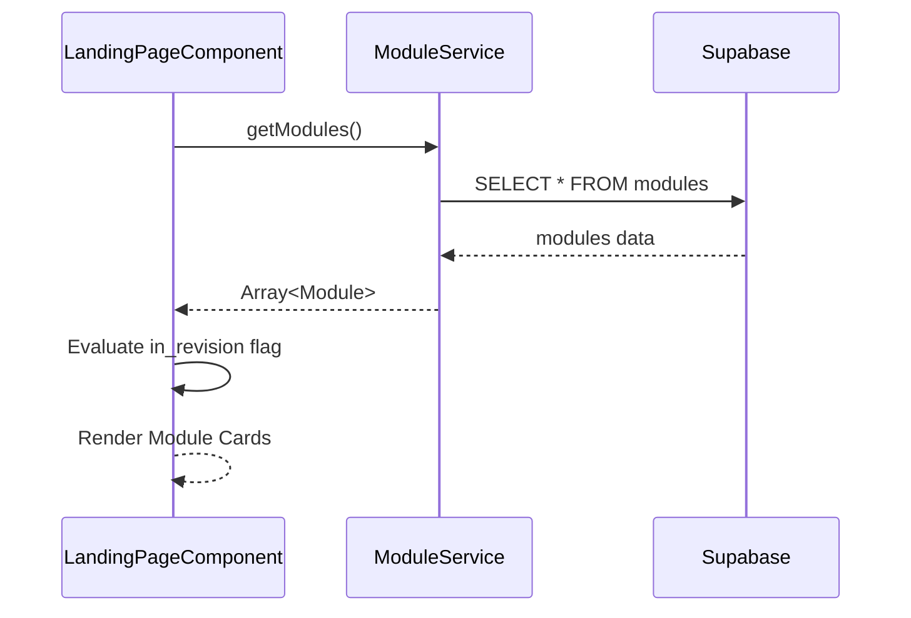
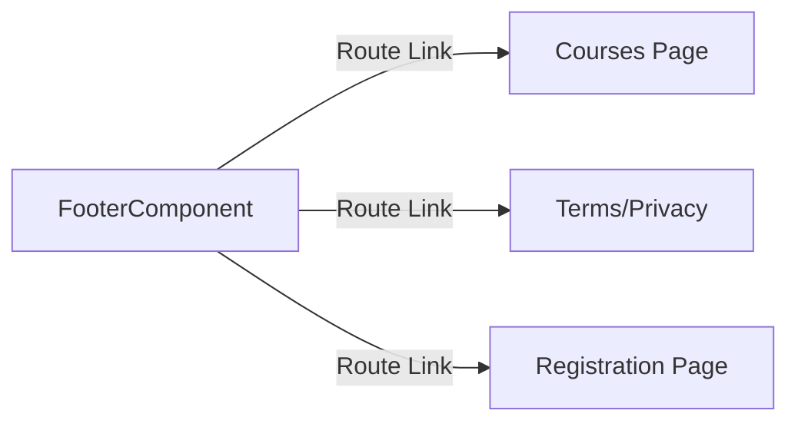
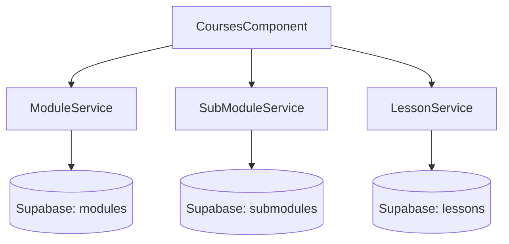

# Design Document

## Overview

This design outlines the technical approach to upgrade the application into a Progressive Web App (PWA) and revamp the landing page. It introduces dynamic data fetching for learning modules on the landing page, interactive methodology cards, a mock progression ranking, and a new dedicated Courses page. The design leverages the existing Supabase service layer to hydrate both the landing page and the new Courses page, while ensuring the UI is highly responsive and adheres to the established design system constraints.

### Change Type

enhancement

### Design Goals

1. Seamlessly integrate standard Angular PWA features for offline access and installability.
2. Ensure UI components on the landing page are dynamic and driven by the existing Supabase service layer.
3. Build a scalable Courses page that reuses existing data models and components.

### References

- **REQ-1**: Progressive Web App Conversion
- **REQ-2**: Landing Page Hero Section Adjustments
- **REQ-3**: Dynamic Learning Modules Display
- **REQ-4**: Interactive Methodology Cards
- **REQ-5**: Progression Ecosystem Mock Ranking
- **REQ-6**: Landing Page FAQ Section
- **REQ-7**: Global Footer Updates
- **REQ-8**: Dedicated Courses Page

## System Architecture

### DES-1: PWA Integration

The application will be configured as a Progressive Web App using the standard `@angular/pwa` package. This involves generating the necessary manifest file and configuring the Angular Service Worker (`ngsw-config.json`) to cache core application assets, enabling offline loading and installation capabilities across devices.

_Implements: REQ-1.1, REQ-1.2_

### DES-2: Landing Page Layout and State Updates

The Landing Page component will be updated to handle the new static text, CTAs, interactive methodology states, mock ranking, and the expandable FAQ section. Local component state (using Angular Signals) will track the currently selected methodology card to dynamically update the displayed image. A static array will be initialized for the FAQ content to allow structural rendering and future expansion.

_Implements: REQ-2.1, REQ-2.2, REQ-2.3, REQ-2.4, REQ-4.1, REQ-4.2, REQ-4.3, REQ-4.4, REQ-5.1, REQ-6.1, REQ-6.2_

### DES-3: Dynamic Modules Integration on Landing Page

The Landing Page will inject the `ModuleService` to fetch available learning modules from Supabase. The component will process this data, evaluating the new `in_revision` flag (defaulting to true) to determine the visual styling (active vs. disabled/greyed out) of each module card.

_Implements: REQ-3.1, REQ-3.2, REQ-3.3_

### DES-4: Global Footer Component Update

The shared Footer component will be updated to accurately reflect the new navigation structure. This includes removing deprecated documentation links, combining the legal links (Terms of Use / Privacy Policy), and adding a direct routing link to the new Courses page.

_Implements: REQ-7.1, REQ-7.2, REQ-7.3, REQ-7.4_

### DES-5: Dedicated Courses Page Architecture

A new `CoursesComponent` will be created to list all courses and their structured content. It will orchestrate calls to `ModuleService`, `SubModuleService`, and `LessonService` to fetch the complete hierarchy. The UI will progressively reveal content (Course -> Submodule -> Lessons of type `LESSON`), applying the established design system for a premium visual experience.

_Implements: REQ-8.1, REQ-8.2, REQ-8.3, REQ-8.4_

### DES-6: Public Database Access for Course Metadata

The Row Level Security (RLS) policies for `modules`, `submodules`, and `lessons` tables in Supabase will be verified and updated if necessary. A policy allowing `SELECT` operations for the `anon` or `public` role will be ensured so that unauthenticated visitors can view the course catalog on the Landing Page and Courses Page.

_Implements: REQ-9.1_

## Code Anatomy

| File Path | Purpose | Implements |
|-----------|---------|------------|
| angular.json / ngsw-config.json | PWA configuration and service worker setup | DES-1 |
| src/app/pages/landing-page/landing-page.ts | State management for interactions, FAQ, and module fetching | DES-2, DES-3 |
| src/app/pages/landing-page/landing-page.html | UI implementation for hero, methodology, ranking, FAQ, and modules | DES-2, DES-3 |
| src/app/components/footer/footer.html | Updated navigation links | DES-4 |
| src/app/pages/courses/courses.ts | Orchestration of courses, submodules, and lessons | DES-5 |
| src/app/pages/courses/courses.html | Visual hierarchy and content rendering for courses | DES-5 |
| src/app/models/module/module.ts | Update model to include `in_revision` field | DES-3 |
| supabase/migrations/*_public_course_access.sql | Update RLS policies to allow public select on course tables | DES-6 |

## Traceability Matrix

| Design Element | Requirements |
|----------------|--------------|
| DES-1 | REQ-1.1, REQ-1.2 |
| DES-2 | REQ-2.1, REQ-2.2, REQ-2.3, REQ-2.4, REQ-4.1, REQ-4.2, REQ-4.3, REQ-4.4, REQ-5.1, REQ-6.1, REQ-6.2 |
| DES-3 | REQ-3.1, REQ-3.2, REQ-3.3 |
| DES-4 | REQ-7.1, REQ-7.2, REQ-7.3, REQ-7.4 |
| DES-5 | REQ-8.1, REQ-8.2, REQ-8.3, REQ-8.4 |
| DES-6 | REQ-9.1 |
