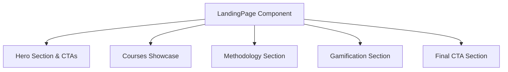
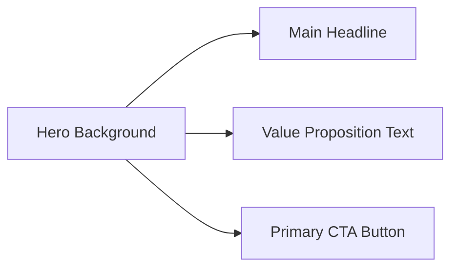
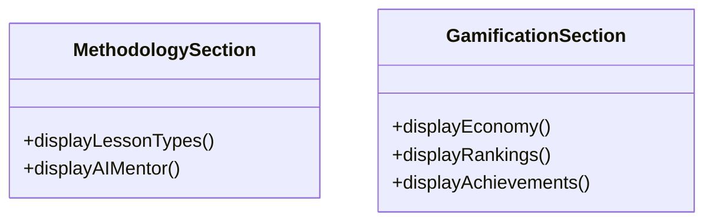

# Design Document

## Overview

This design addresses the restructuring of the `landing-page` component to better communicate the platform's value proposition. The landing page will be divided into clear semantic sections using the Luminescent Blueprint design system (Tailwind classes, glassmorphism, no solid borders). We will introduce visual blocks for Courses, Methodology (Lesson types & AI Mentor), Gamification (XP, Seeds, Ranking, Achievements), and prominent CTAs for onboarding.

### Change Type

enhancement

### Design Goals

1. Improve communication of core features (courses, methodology, gamification).
2. Adhere to the Luminescent Blueprint design system for the new UI blocks.
3. Keep the implementation within the `LandingPage` standalone component, updating its template and styles.

### References

- **REQ-1**: Presentation of Courses and Trilha
- **REQ-2**: Presentation of Learning Methodology
- **REQ-3**: Presentation of Gamification Mechanics
- **REQ-4**: Call to Action and Onboarding

## System Architecture

### DES-1: Landing Page Layout Structure

The `landing-page.html` will be restructured into sequential `<section>` blocks. Each block will be responsible for a specific domain of information.

_Implements: REQ-1.1, REQ-1.2, REQ-2.1, REQ-2.2, REQ-3.1, REQ-3.2, REQ-3.3, REQ-4.1_

### DES-2: Hero and CTA

The Hero section will be updated to be more direct, explaining the value proposition and containing the primary Call-To-Action.

_Implements: REQ-4.1_

### DES-3: Methodology and Gamification UI

These sections will utilize the `surface_container` layers and `glass-card` classes to display content about lessons, AI mentor, XP, Seeds, rankings, and achievements without using solid borders, following the `STYLEGUIDE.md` specifications.

_Implements: REQ-2.1, REQ-2.2, REQ-3.1, REQ-3.2, REQ-3.3_

## Code Anatomy

| File Path | Purpose | Implements |
|-----------|---------|------------|
| src/app/pages/landing-page/landing-page.html | Updated template with the new sections | DES-1, DES-2, DES-3 |
| src/app/pages/landing-page/landing-page.scss | Updated styles for the new structure adhering to design system | DES-1, DES-2, DES-3 |
| src/app/pages/landing-page/landing-page.ts | Component logic (mostly static, but routing links for CTAs) | DES-2 |

## Traceability Matrix

| Design Element | Requirements |
|----------------|--------------|
| DES-1 | REQ-1.1, REQ-1.2, REQ-2.1, REQ-2.2, REQ-3.1, REQ-3.2, REQ-3.3, REQ-4.1 |
| DES-2 | REQ-4.1 |
| DES-3 | REQ-2.1, REQ-2.2, REQ-3.1, REQ-3.2, REQ-3.3 |
