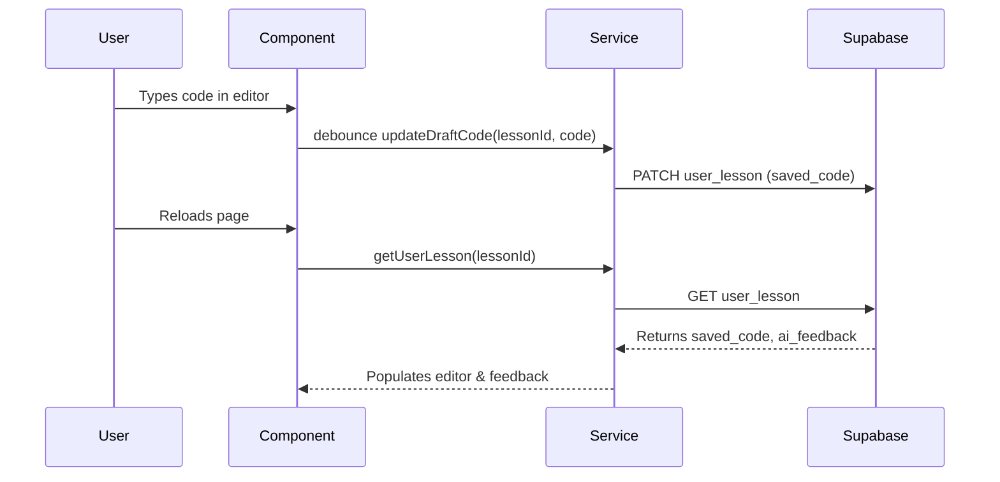
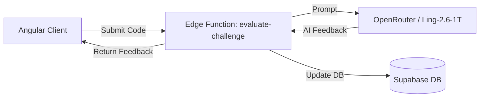
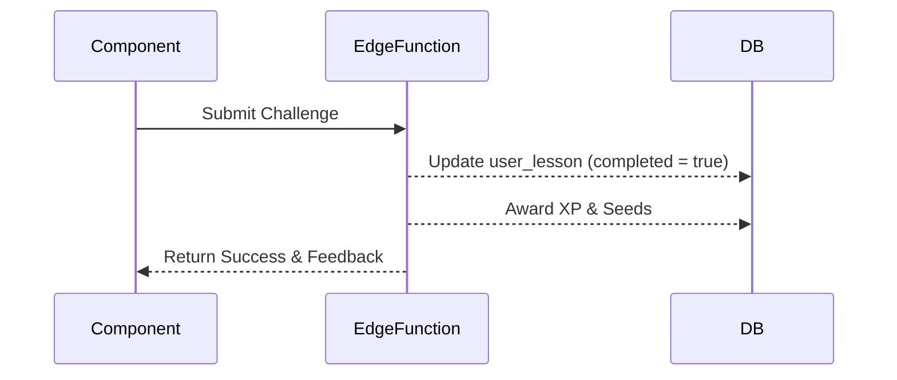
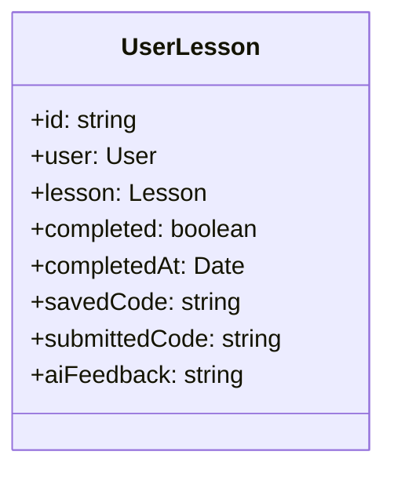

# Design Document

## Overview
This design implements the "Challenge" lesson feature. It introduces a new `Challenge` Angular standalone component under the lesson module, providing a code editor (`@ngstack/code-editor`) and problem description rendering (`section-contents`). The design extends the existing `UserLesson` model to store the student's code and AI feedback. Finally, it leverages a new Supabase Edge Function to integrate with OpenRouter (Ling-2.6-1T model) for evaluating the submitted code and providing textual feedback, seamlessly plugging into the existing lesson completion, XP, and seeds reward flow.

### Change Type
new-feature

### Design Goals
1. Provide an integrated, in-browser code editing experience that persists student progress.
2. Interface securely with OpenRouter via a backend Edge Function to generate AI feedback.
3. Align the challenge completion behavior with the existing lesson progression and reward system.

### References
- **REQ-1**: Access Challenge Lesson
- **REQ-2**: Persist Challenge State
- **REQ-3**: Submit Code for Correction
- **REQ-4**: Complete Challenge Lesson

## System Architecture

### DES-1: Challenge Component and Routing
A new standalone Angular component (`ChallengeComponent`) will be created and mapped to the route `s/:slug/ss/:slugSubmodule/lesson/:lessonId/challenge`. This component will orchestrate fetching the lesson details, rendering the description via `section-contents`, and hosting the `@ngstack/code-editor`.

```mermaid
flowchart TD
    Router[App Router] -->|Navigates to challenge| ChallengeComp[Challenge Component]
    ChallengeComp --> SectionContents[Section Contents Component]
    ChallengeComp --> CodeEditor[@ngstack/code-editor]
    ChallengeComp --> UserLessonSvc[UserLesson Service]
```
_Implements: REQ-1.1, REQ-1.2, REQ-1.3_

### DES-2: Challenge State Persistence
The `UserLesson` data model will be extended to include `savedCode`, `submittedCode`, and `aiFeedback` fields. The `UserLessonService` will be updated with methods to periodically save the draft code (`savedCode`) and fetch it when the component initializes, ensuring students do not lose their work.


_Implements: REQ-2.1, REQ-2.2_

### DES-3: AI Evaluation Integration
A new Supabase Edge Function `evaluate-challenge` will be created. It will receive the challenge description and the student's submitted code, query the OpenRouter API (Ling-2.6-1T), and return textual feedback. The `UserLessonService` will orchestrate this call, update the `UserLesson` table with `submittedCode` and `aiFeedback`, and trigger lesson completion.


_Implements: REQ-3.1, REQ-3.2, REQ-3.3_

### DES-4: Completion and Rewards
Once the edge function returns successful AI feedback, the frontend service (or the edge function itself) will mark the `user_lesson` as completed. The existing XP and Seeds allocation logic (typically triggered on lesson completion) will execute, ensuring the student is rewarded for their effort.


_Implements: REQ-4.1, REQ-4.2_

## Data Models



## Code Anatomy

| File Path | Purpose | Implements |
|-----------|---------|------------|
| `src/app/app.routes.ts` | Route definition for the challenge view | DES-1 |
| `src/app/pages/app/lesson/challenge/` | Standalone component for the challenge UI | DES-1 |
| `src/models/user-lesson/user-lesson.ts` | Model extension for challenge state | DES-2 |
| `src/app/services/user-lesson.ts` | Logic to save drafts and invoke evaluation | DES-2, DES-3 |
| `supabase/functions/evaluate-challenge/` | Edge function for OpenRouter AI integration | DES-3, DES-4 |

## Traceability Matrix

| Design Element | Requirements |
|----------------|--------------|
| DES-1 | REQ-1.1, REQ-1.2, REQ-1.3 |
| DES-2 | REQ-2.1, REQ-2.2 |
| DES-3 | REQ-3.1, REQ-3.2, REQ-3.3 |
| DES-4 | REQ-4.1, REQ-4.2 |
