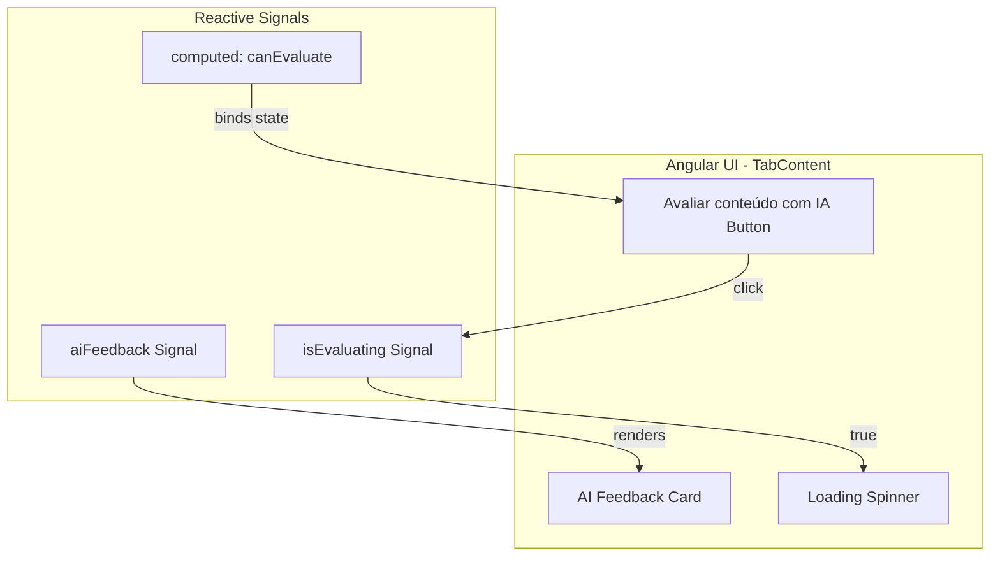
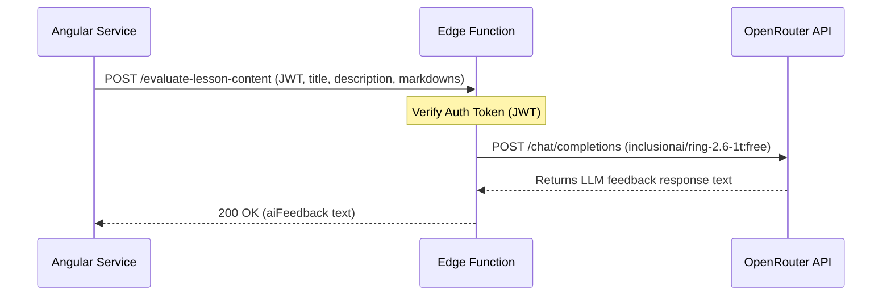
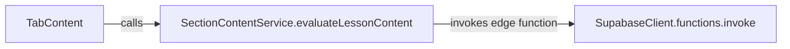
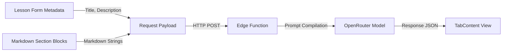
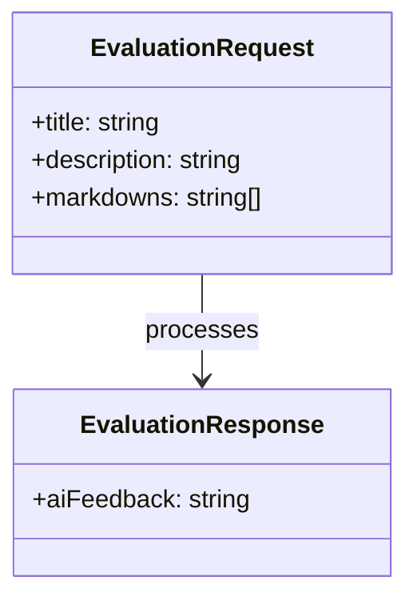

# Design Document

## Overview

This document designs the AI-powered lesson content evaluation feature in the Semeando Devs platform. The feature allows teachers to trigger an AI review of all markdown content blocks within a lesson. 

The architecture consists of:
1. **Frontend UI additions** in `TabContent` component, exposing a disabled/enabled "Avaliar conteúdo com IA" button, an active loading spinner, and an elegant, glassmorphic feedback display section.
2. **Angular Service method** in `SectionContentService` to orchestrate calls to the Supabase serverless backend.
3. **Supabase Edge Function** (`evaluate-lesson-content`) executing in Deno to authenticate the teacher, extract the lesson data, call the OpenRouter API with model `"inclusionai/ring-2.6-1t:free"`, and safely return quality feedback.

This implementation aligns with the Neon Terminal style guide (tonal shifts instead of borders, rounded buttons, and glowing glassmorphism).

### Change Type

`new-feature`

### Design Goals

1. Expose a non-obtrusive, high-visibility feedback trigger for teachers in the lesson editing tab.
2. Ensure secure, authorized calls to the LLM backend via Supabase JWT verification.
3. Render AI suggestions beautifully using standard markdown presentation.
4. Adhere strictly to the "No-Line" visual policy, utilizing tonal shifts and glassmorphic depth.

### References

- **REQ-1**: AI Evaluation Trigger and State
- **REQ-2**: AI Evaluation API Function
- **REQ-3**: Feedback Display Section

---

## System Architecture

### DES-1: AI Evaluation UI Component

The `TabContent` component will host the interactive button "Avaliar conteúdo com IA" and the rendering section for the feedback. The UI state is reactive, tracking whether the lesson contains any `MARKDOWN` blocks to dynamically enable or disable the button.

_Implements: REQ-1.1, REQ-1.2, REQ-1.3, REQ-1.4, REQ-3.1, REQ-3.2, REQ-3.3_

### DES-2: Supabase Edge Function API

A new Supabase Edge Function `evaluate-lesson-content` will process the evaluation request. It parses the incoming payload, validates authorization headers, constructs the dynamic LLM system and user prompt context, and performs a POST request to OpenRouter.

_Implements: REQ-2.1, REQ-2.2, REQ-2.3, REQ-2.4_

### DES-3: Angular Service Layer Integration

`SectionContentService` will handle the communications with the Supabase client, retrieving the user session, appending authorization headers, and invoking the Serverless Function.

_Implements: REQ-1.4, REQ-2.1_

---

## Data Flow

The data flow ensures that lesson metadata is coupled with content blocks so the LLM is supplied with full context.

---

## Code Anatomy

| File Path | Purpose | Implements |
|-----------|---------|------------|
| `src/app/pages/professor/professor-app/create-lesson/tab-content/tab-content.ts` | Frontend component controller hosting the signals and the evaluate action. | DES-1 |
| `src/app/pages/professor/professor-app/create-lesson/tab-content/tab-content.html` | Template providing the triggers, spinners, and feedback markdown container. | DES-1 |
| `src/app/services/section-content.ts` | Angular service responsible for invoking the `evaluate-lesson-content` edge function. | DES-3 |
| `supabase/functions/evaluate-lesson-content/index.ts` | Deno edge function handling auth, request routing, LLM prompts, and OpenRouter calls. | DES-2 |

---

## Data Models

Request and response contracts for the Edge Function:

---

## Error Handling

| Error Condition | Response | Recovery |
|-----------------|----------|----------|
| User token missing or expired | 401 Unauthorized | Display authentication error, hide loading spinner |
| Missing required parameters (title, markdowns) | 400 Bad Request | Display validation message, re-enable button |
| OpenRouter API failure or timeout | 500 Internal Error | Display fallback message: "Não foi possível gerar o feedback no momento.", re-enable button |

---

## Impact Analysis

| Affected Area | Impact Level | Notes |
|---------------|--------------|-------|
| `src/app/pages/professor/.../tab-content` | Low | UI visual additions; does not modify existing creation or save flows. |
| `src/app/services/section-content.ts` | Low | Isolated addition of a new helper method `evaluateLessonContent`. |
| `supabase/functions/` | Low | Completely isolated serverless endpoint. |

### Dependencies

| Dependency | Type | Impact |
|------------|------|--------|
| OpenRouter | Runtime | External model endpoint availability. |

### Testing Requirements

| Test Type | Coverage Goal | Notes |
|-----------|---------------|-------|
| Unit Test | Verify component signals | Confirm `canEvaluate` reacts properly to markdown content presence. |
| Integration | Verify API call | Confirm Edge function is invoked with correct parameters. |

---

## Traceability Matrix

| Design Element | Requirements |
|----------------|--------------|
| DES-1 | REQ-1.1, REQ-1.2, REQ-1.3, REQ-1.4, REQ-3.1, REQ-3.2, REQ-3.3 |
| DES-2 | REQ-2.1, REQ-2.2, REQ-2.3, REQ-2.4 |
| DES-3 | REQ-1.4, REQ-2.1 |
