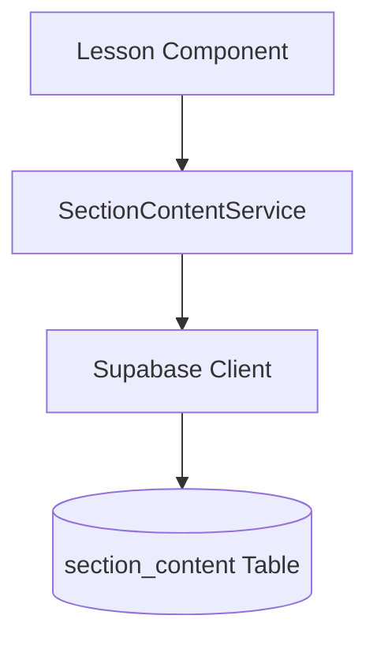
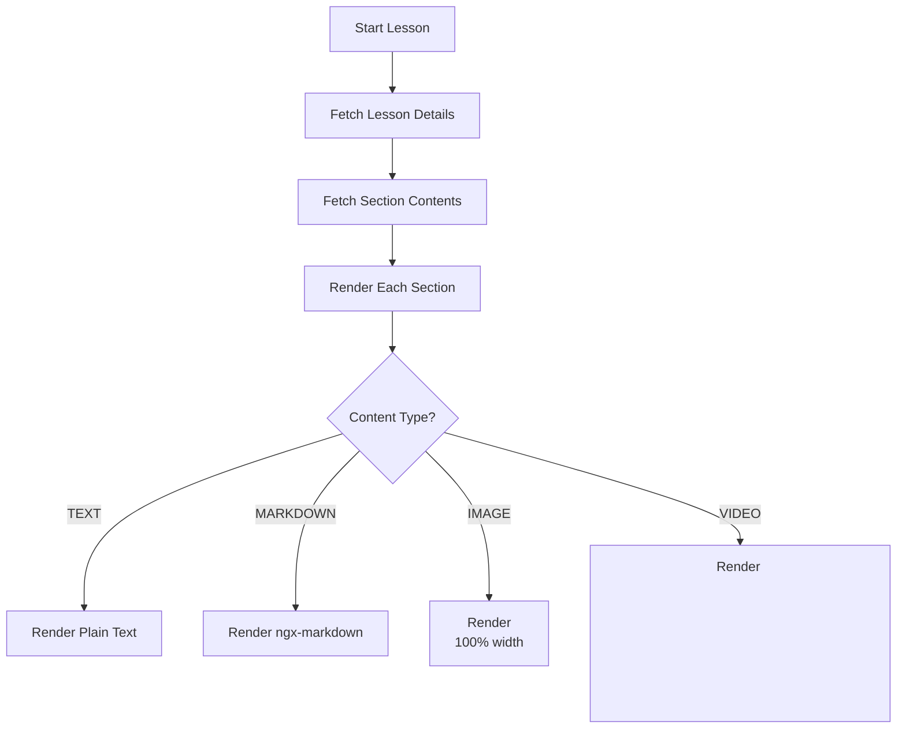
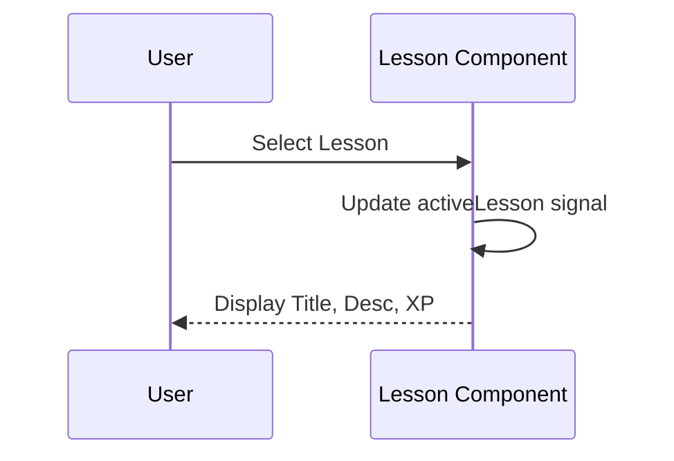
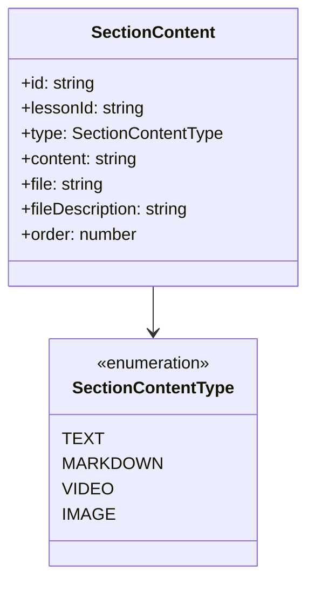

# Design Document

## Overview
This design outlines the technical approach for displaying lesson content in the Semeando Devs application. It focuses on the dynamic rendering of various content sections (Text, Markdown, Images, and Videos) associated with a lesson, along with a prominent header displaying the lesson's metadata (title, description, and XP). The implementation will leverage Angular Signals for reactive state management and a dedicated service to interface with the Supabase `section_content` table.

### Change Type
new-feature

### Design Goals
1. Provide a dedicated service for fetching lesson section contents efficiently.
2. Implement a responsive and visually appealing lesson content area following the "Neon Terminal" design system.
3. Support dynamic rendering of multiple content types (TEXT, MARKDOWN, IMAGE, VIDEO) in the correct sequence.
4. Ensure the display of lesson metadata (title, description, XP) is clear and prominent.

### References
- **REQ-1**: Lesson Header Display
- **REQ-2**: Content Section Fetching
- **REQ-3**: Content Type Rendering

## System Architecture

### DES-1: SectionContentService
A dedicated Angular service responsible for all CRUD operations related to lesson section contents. For this phase, its primary responsibility is fetching sections for a given lesson ID, ordered by their `order` field.

_Implements: REQ-2.1, REQ-2.2_

### DES-2: Dynamic Content Rendering Logic
The `Lesson` component will orchestration the fetching and display of content. It will use the `SectionContentService` to retrieve sections and then use Angular's control flow (`@for` and `@if`) to render each section according to its type.

_Implements: REQ-3.1, REQ-3.2, REQ-3.3, REQ-3.4_

### DES-3: Lesson Header UI
A premium header component/section within the lesson page that displays the lesson title, description, and XP value. The XP value will be highlighted using the system's primary or secondary colors to emphasize gamification.

_Implements: REQ-1.1, REQ-1.2, REQ-1.3_

## Code Anatomy

| File Path | Purpose | Implements |
|-----------|---------|------------|
| src/app/services/section-content.ts | Service to fetch section content data from Supabase | DES-1 |
| src/app/pages/app/lesson/lesson.ts | Component logic for orchestration and state management | DES-2, DES-3 |
| src/app/pages/app/lesson/lesson.html | Template for displaying lesson header and content sections | DES-2, DES-3 |
| src/models/section-content/section-content.ts | Interface and Enum for section content entity (already exists) | DES-1, DES-2 |

## Data Models

## Traceability Matrix

| Design Element | Requirements |
|----------------|--------------|
| DES-1 | REQ-2.1, REQ-2.2 |
| DES-2 | REQ-3.1, REQ-3.2, REQ-3.3, REQ-3.4, REQ-3.5 |
| DES-3 | REQ-1.1, REQ-1.2, REQ-1.3 |
