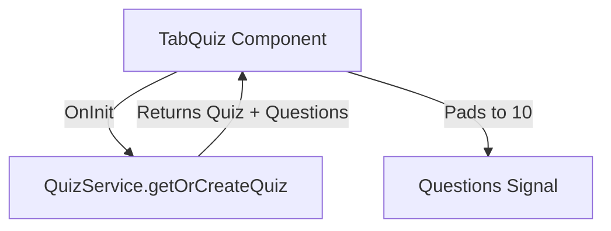
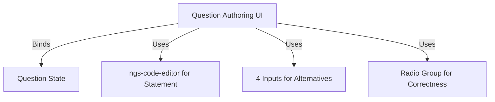
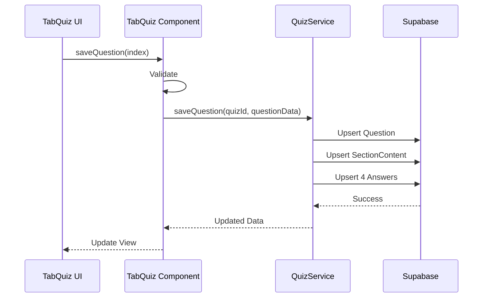
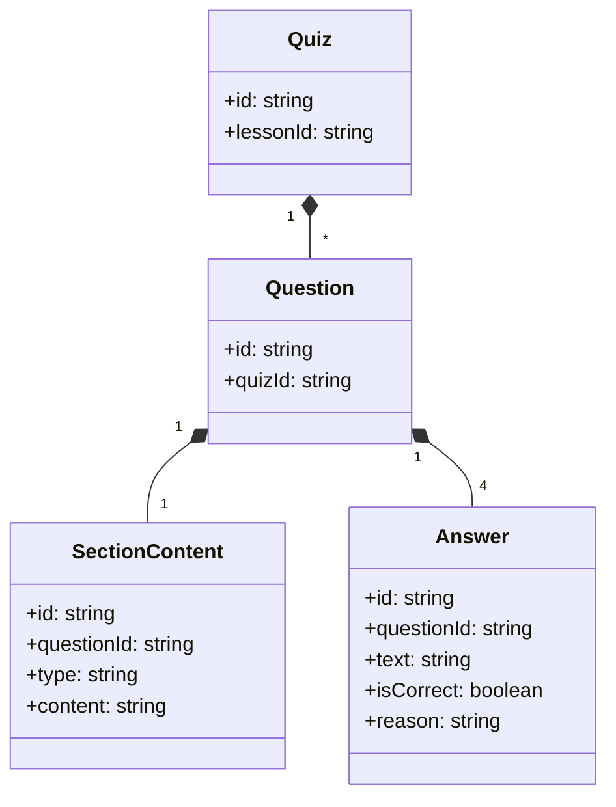

# Design Document

## Overview

This design outlines the architecture for the quiz authoring feature inside the `TabQuiz` component of the professor app. It uses Angular reactive forms or signals to manage the state of 10 questions, their markdown statements, and alternatives. A `QuizService` will handle interactions with Supabase to load and save Quizzes, Questions, SectionContents, and Answers.

### Change Type

new-feature

### Design Goals

1. Ensure robust state management for a fixed set of 10 complex question objects.
2. Provide a seamless save experience per question.
3. Keep the UI aligned with the Neon Terminal design system.

### References

- **REQ-1**: Quiz Initialization
- **REQ-2**: Question Set Provisioning
- **REQ-3**: Question Statement Editing
- **REQ-4**: Alternatives Configuration
- **REQ-5**: Question Saving

## System Architecture

### DES-1: Quiz Component State Management

The `TabQuiz` component manages the local state for the quiz and its 10 questions. It uses Angular Signals to track loading states, the active quiz ID, and the questions array. When the component loads, it fetches the existing quiz or creates a new one via the `QuizService`. It ensures that the array always has 10 elements, padding with empty question objects if necessary.

_Implements: REQ-1.1, REQ-1.2, REQ-2.1, REQ-2.2_

### DES-2: Question Authoring Form

For each of the 10 slots, a sub-form or bound template is rendered. It uses `ngs-code-editor` for the `SectionContent` statement and standard inputs for the 4 `Answer` alternatives. A specific radio group manages the correct answer selection.

_Implements: REQ-3.1, REQ-4.1, REQ-4.2, REQ-4.3, REQ-4.4_

### DES-3: Question Save Flow

Each question has an individual save button. When clicked, it validates the local state (ensuring 1 correct answer and no empty text) before calling the `QuizService.saveQuestion`. The service performs an upsert of the `Question`, its linked `SectionContent` (type `MARKDOWN`), and the 4 `Answers`.

_Implements: REQ-3.2, REQ-5.1, REQ-5.2, REQ-5.3, REQ-5.4_

## Code Anatomy

| File Path | Purpose | Implements |
|-----------|---------|------------|
| src/app/pages/professor/professor-app/create-lesson/tab-quiz/tab-quiz.ts | State management and validation | DES-1, DES-2, DES-3 |
| src/app/pages/professor/professor-app/create-lesson/tab-quiz/tab-quiz.html | UI rendering, ngs-code-editor, loops | DES-2, DES-3 |
| src/app/services/quiz.service.ts | Supabase interactions for quiz domain | DES-1, DES-3 |

## Data Models

## Traceability Matrix

| Design Element | Requirements |
|----------------|--------------|
| DES-1 | REQ-1.1, REQ-1.2, REQ-2.1, REQ-2.2 |
| DES-2 | REQ-3.1, REQ-4.1, REQ-4.2, REQ-4.3, REQ-4.4 |
| DES-3 | REQ-3.2, REQ-5.1, REQ-5.2, REQ-5.3, REQ-5.4 |
