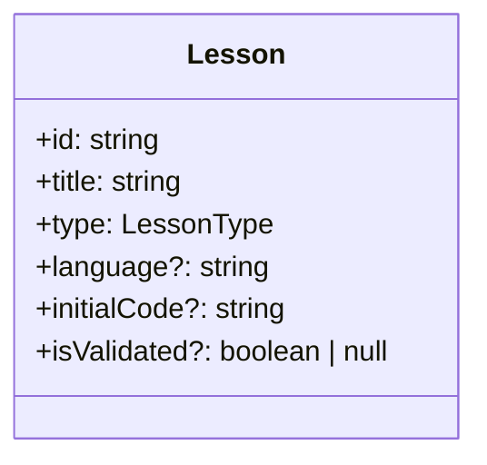
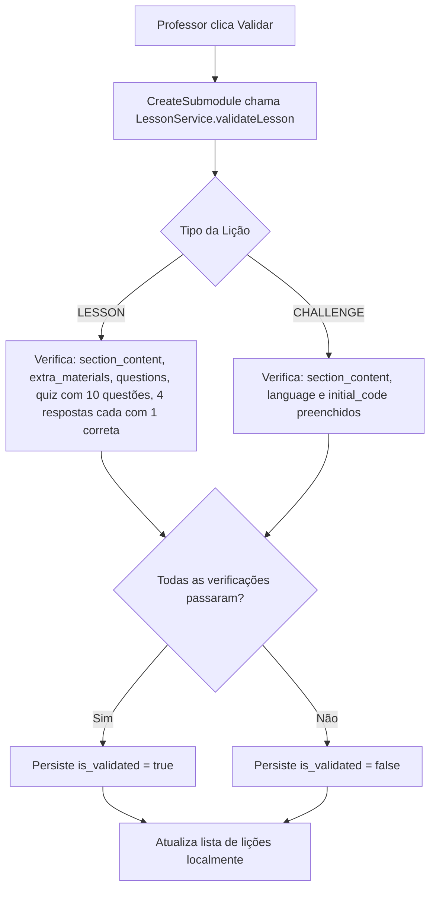
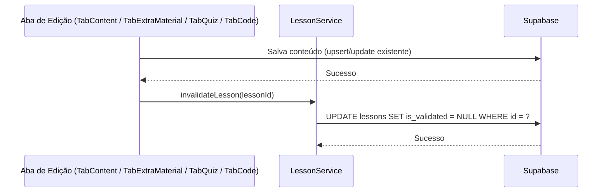
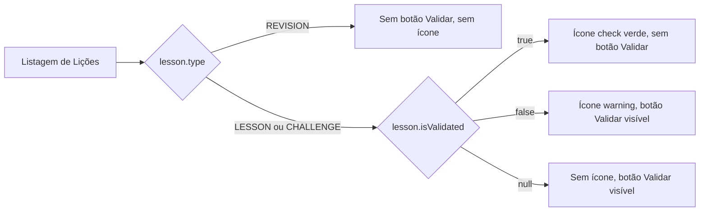
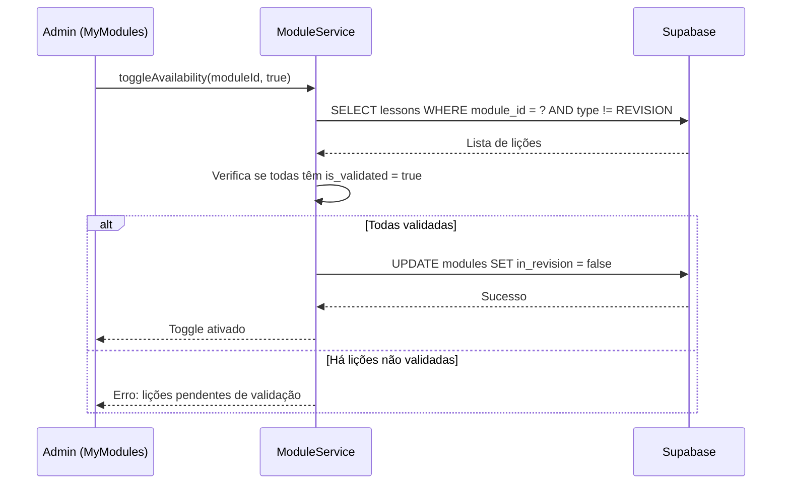
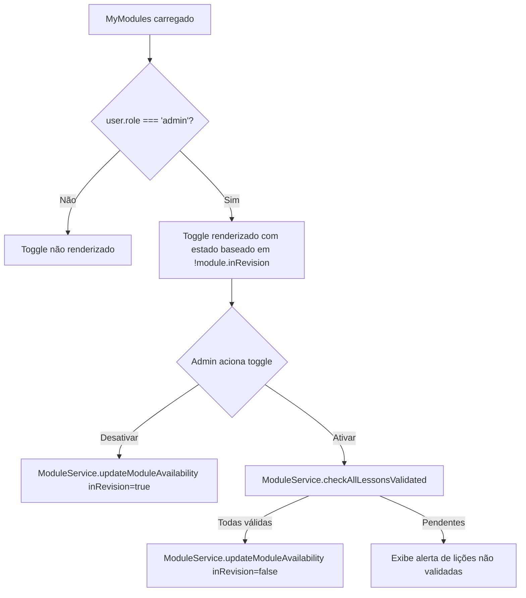
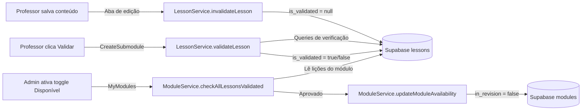
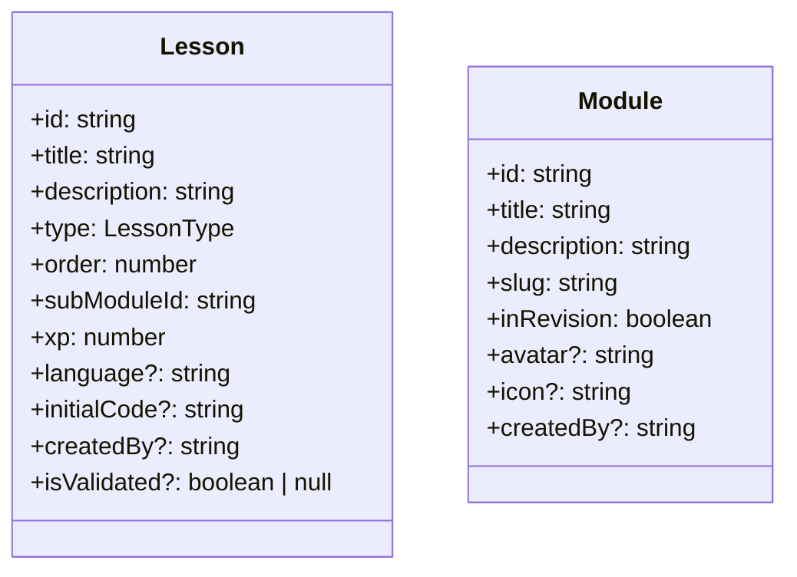

# Design Document

## Overview

Esta feature adiciona um mecanismo de validação por lição ao fluxo de autoria de conteúdo do professor, e um controle de disponibilidade de módulo restrito a administradores. O design é aditivo: não há remoção de comportamentos existentes, apenas novos campos no banco de dados, novos métodos nos serviços existentes e ajustes de template nos componentes já em uso.

A lógica de validação será centralizada em um novo método `validateLesson` no `LessonService`, que executa todas as queries de verificação no Supabase e persiste o resultado no campo `is_validated` da tabela `lessons`. O reset automático de `is_validated` para `null` será aplicado dentro dos métodos de save já existentes nos componentes `TabContent`, `TabExtraMaterial`, `TabQuiz` e `TabCode`, via chamada ao `LessonService`. O toggle de disponibilidade do módulo será renderizado condicionalmente com base no `user.role` e atualizará o campo `in_revision` via `ModuleService`.

Toda a persistência ocorre exclusivamente via Supabase. Nenhuma lógica de validação reside nos componentes; eles apenas acionam o serviço e exibem o resultado.

### Change Type

`new-feature`

### Design Goals

1. Centralizar a lógica de validação de lições em um único método de serviço para garantir consistência e testabilidade.
2. Manter a coesão dos componentes existentes: as abas de edição apenas chamam `LessonService.invalidateLesson()` após cada save, sem duplicar lógica de negócio.
3. Preservar a visibilidade do toggle de disponibilidade estritamente no lado do cliente, baseando-se no `user.role === 'admin'` já disponível no `UserService`.
4. Adicionar o campo `is_validated` à tabela `lessons` via migration do Supabase, e atualizar o modelo TypeScript correspondente.

### References

- **REQ-1**: Botão de Validar na Listagem de Lições
- **REQ-2**: Regras de Validação para Lição do Tipo LESSON
- **REQ-3**: Regras de Validação para Lição do Tipo CHALLENGE
- **REQ-4**: Reset Automático do Campo `is_validated`
- **REQ-5**: Indicador Visual de Status de Validação na Listagem
- **REQ-6**: Toggle de Disponibilidade do Módulo
- **REQ-7**: Validação de Lições ao Disponibilizar um Módulo

---

## System Architecture

### DES-1: Campo `is_validated` no Modelo de Dados

O campo `is_validated` é um booleano nullable adicionado à tabela `lessons` no Supabase. O valor padrão é `NULL` (sem validação prévia). O modelo TypeScript `Lesson` é estendido com o campo `isValidated?: boolean | null`. Uma migration SQL é criada em `supabase/migrations/` para aplicar a alteração.

_Implements: REQ-1.3, REQ-1.4, REQ-1.5, REQ-4.1, REQ-4.2, REQ-4.3, REQ-4.4_

---

### DES-2: LessonService — validateLesson e invalidateLesson

Dois novos métodos são adicionados ao `LessonService`:

- **`validateLesson(lessonId, lessonType)`**: executa as queries de verificação no Supabase (section contents, extra materials, questions, quiz, answers) conforme o tipo da lição, e persiste `is_validated = true` ou `false` conforme o resultado.
- **`invalidateLesson(lessonId)`**: persiste `is_validated = null`, indicando que a validação está pendente de revalidação.

Toda a lógica de regra de negócio de validação reside exclusivamente neste serviço.

_Implements: REQ-2.1, REQ-2.2, REQ-2.3, REQ-2.4, REQ-2.5, REQ-2.6, REQ-2.7, REQ-3.1, REQ-3.2, REQ-3.3, REQ-3.4_

---

### DES-3: Reset Automático em Tabs de Edição

Cada componente de aba de edição (TabContent, TabExtraMaterial, TabQuiz, TabCode) injeta o `LessonService` e chama `invalidateLesson(lessonId)` imediatamente após um save bem-sucedido. Não há lógica adicional nos componentes — a responsabilidade de persistência permanece no serviço.

_Implements: REQ-4.1, REQ-4.2, REQ-4.3, REQ-4.4_

---

### DES-4: CreateSubmodule — Botão Validar e Indicadores Visuais

O componente `CreateSubmodule` recebe o campo `isValidated` nas lições carregadas via `getLessonsBySubModuleId`. A listagem de lições exibe:

- Um ícone de **check verde** quando `isValidated === true`
- Um ícone de **warning** quando `isValidated === false`
- Nenhum ícone quando `isValidated === null`

Um botão **Validar** é exibido ao lado dos botões de editar/excluir para lições do tipo LESSON ou CHALLENGE, somente quando `isValidated !== true`. O clique chama `LessonService.validateLesson()` e atualiza o campo `isValidated` na lista local de lições sem recarregar a página inteira.

_Implements: REQ-1.1, REQ-1.2, REQ-1.3, REQ-1.4, REQ-1.5, REQ-5.1, REQ-5.2, REQ-5.3_

---

### DES-5: ModuleService — checkAllLessonsValidated e updateModuleAvailability

Dois novos métodos são adicionados ao `ModuleService`:

- **`checkAllLessonsValidated(moduleId)`**: busca todas as lições (exceto REVISION) dos submódulos do módulo e verifica se todas têm `is_validated = true`.
- **`updateModuleAvailability(moduleId, available)`**: atualiza o campo `in_revision` no Supabase: `false` quando disponível, `true` quando em revisão. A ativação do toggle só chama este método após confirmação de `checkAllLessonsValidated`.

_Implements: REQ-7.1, REQ-7.2, REQ-7.3, REQ-7.4_

---

### DES-6: MyModules — Toggle Disponível (Admin Only)

O componente `MyModules` injeta o `UserService` e expõe um `computed` `isAdmin` baseado em `user.role === 'admin'`. O toggle "Disponível" é renderizado via `@if (isAdmin())` no template. O estado do toggle reflete `!module.inRevision`. Ao clicar para ativar, chama `ModuleService.toggleAvailability(moduleId, true)`; ao desativar, chama diretamente sem verificação prévia.

Um toast/alerta de erro é exibido ao usuário quando a ativação é bloqueada por lições não validadas.

_Implements: REQ-6.1, REQ-6.2, REQ-6.3, REQ-6.4, REQ-7.1, REQ-7.2, REQ-7.3, REQ-7.4_

---

## Data Flow

---

## Code Anatomy

| File Path | Purpose | Implements |
|-----------|---------|------------|
| `supabase/migrations/<timestamp>_add_is_validated_to_lessons.sql` | Adiciona coluna `is_validated` nullable à tabela `lessons` | DES-1 |
| `src/models/lesson/lesson.ts` | Adiciona campo `isValidated?: boolean \| null` à interface `Lesson` | DES-1 |
| `src/app/services/lesson.ts` | Adiciona `validateLesson()` e `invalidateLesson()`, e atualiza `getLessonsBySubModuleId` para incluir `is_validated` | DES-2, DES-3 |
| `src/app/services/module.ts` | Adiciona `checkAllLessonsValidated()` e `updateModuleAvailability()` | DES-5 |
| `src/app/pages/professor/professor-app/create-submodule/create-submodule.ts` | Adiciona `validateLesson()` handler e atualiza lista de lições localmente | DES-4 |
| `src/app/pages/professor/professor-app/create-submodule/create-submodule.html` | Adiciona botão Validar e ícones de status condicionais por lição | DES-4 |
| `src/app/pages/professor/professor-app/create-lesson/tab-content/tab-content.ts` | Chama `invalidateLesson()` após `saveLesson()` bem-sucedido | DES-3 |
| `src/app/pages/professor/professor-app/create-lesson/tab-extra-material/tab-extra-material.ts` | Chama `invalidateLesson()` após `save()` bem-sucedido | DES-3 |
| `src/app/pages/professor/professor-app/create-lesson/tab-quiz/tab-quiz.ts` | Chama `invalidateLesson()` após `saveQuestion()` bem-sucedido | DES-3 |
| `src/app/pages/professor/professor-app/create-lesson/tab-code/tab-code.ts` | Chama `invalidateLesson()` após `saveCode()` bem-sucedido | DES-3 |
| `src/app/pages/professor/professor-app/my-modules/my-modules.ts` | Adiciona `isAdmin` computed, `toggleAvailability()` handler e alerta de erro | DES-6 |
| `src/app/pages/professor/professor-app/my-modules/my-modules.html` | Adiciona toggle "Disponível" condicional por `isAdmin` | DES-6 |

---

## Data Models

---

## Error Handling

| Error Condition | Response | Recovery |
|-----------------|----------|----------|
| Validação falha (lição incompleta) | `is_validated` persiste como `false`; ícone warning exibido na listagem | Professor corrige o conteúdo e aciona Validar novamente |
| Ativação do toggle com lições não validadas | Toggle não altera estado; alerta informativo exibido ao admin | Admin valida as lições pendentes antes de tentar novamente |
| Falha de rede na chamada de validação | Exibe mensagem de erro na listagem; `is_validated` permanece inalterado | Professor tenta novamente |
| Falha ao chamar `invalidateLesson` após save | Erro silencioso no console (não bloqueia o fluxo de save) | Próximo save ou clique em Validar corrige o estado |

---

## Impact Analysis

| Affected Area | Impact Level | Notes |
|---------------|--------------|-------|
| `src/app/services/lesson.ts` | Medium | Novos métodos adicionados; `getLessonsBySubModuleId` atualizado para incluir `is_validated` |
| `src/app/services/module.ts` | Medium | Dois novos métodos adicionados sem alterar os existentes |
| `tab-content.ts`, `tab-extra-material.ts`, `tab-quiz.ts`, `tab-code.ts` | Low | Uma única chamada `invalidateLesson()` adicionada ao fluxo de save |
| `create-submodule.ts` e `.html` | Medium | Novo botão e ícones de status; novo handler de validação |
| `my-modules.ts` e `.html` | Medium | Toggle novo com lógica de admin; novos handlers |
| `src/models/lesson/lesson.ts` | Low | Campo opcional adicionado; sem breaking change |
| Supabase `lessons` table | Low | Nova coluna nullable; dados existentes recebem `NULL` por padrão |

### Testing Requirements

| Test Type | Coverage Goal | Notes |
|-----------|---------------|-------|
| Unit | `validateLesson()` e `invalidateLesson()` no `LessonService` | Mockar Supabase; testar cada caso de LESSON e CHALLENGE |
| Unit | `checkAllLessonsValidated()` no `ModuleService` | Testar cenário de todas válidas e de pelo menos uma inválida |
| Unit | `CreateSubmodule` — exibição condicional de botão e ícones | Simular lições com `isValidated` null/true/false |
| Unit | `MyModules` — visibilidade do toggle por `user.role` | Testar com role admin e não-admin |

---

## Traceability Matrix

| Design Element | Requirements |
|----------------|--------------|
| DES-1 | REQ-1.3, REQ-1.4, REQ-1.5, REQ-4.1, REQ-4.2, REQ-4.3, REQ-4.4 |
| DES-2 | REQ-2.1, REQ-2.2, REQ-2.3, REQ-2.4, REQ-2.5, REQ-2.6, REQ-2.7, REQ-3.1, REQ-3.2, REQ-3.3, REQ-3.4 |
| DES-3 | REQ-4.1, REQ-4.2, REQ-4.3, REQ-4.4 |
| DES-4 | REQ-1.1, REQ-1.2, REQ-1.3, REQ-1.4, REQ-1.5, REQ-5.1, REQ-5.2, REQ-5.3 |
| DES-5 | REQ-7.1, REQ-7.2, REQ-7.3, REQ-7.4 |
| DES-6 | REQ-6.1, REQ-6.2, REQ-6.3, REQ-6.4, REQ-7.1, REQ-7.2, REQ-7.3, REQ-7.4 |
