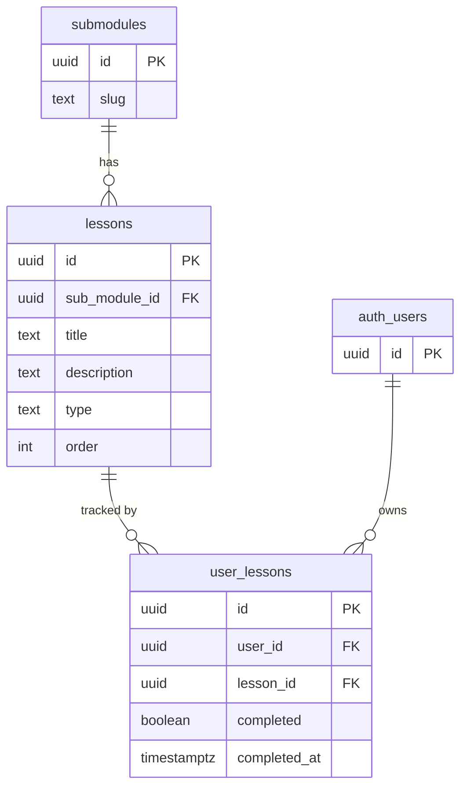
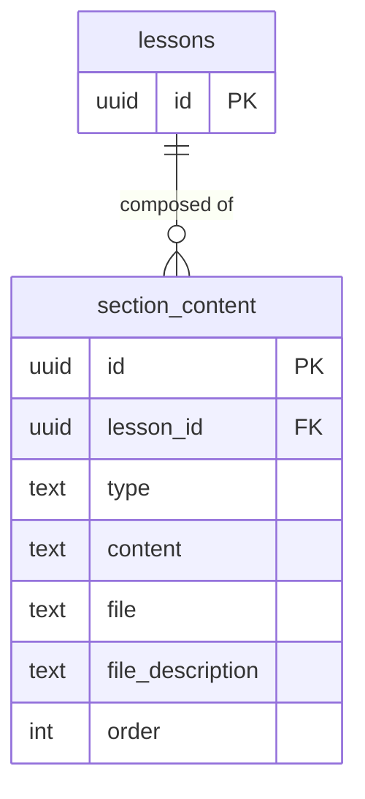
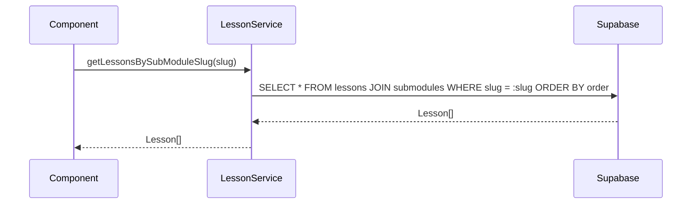
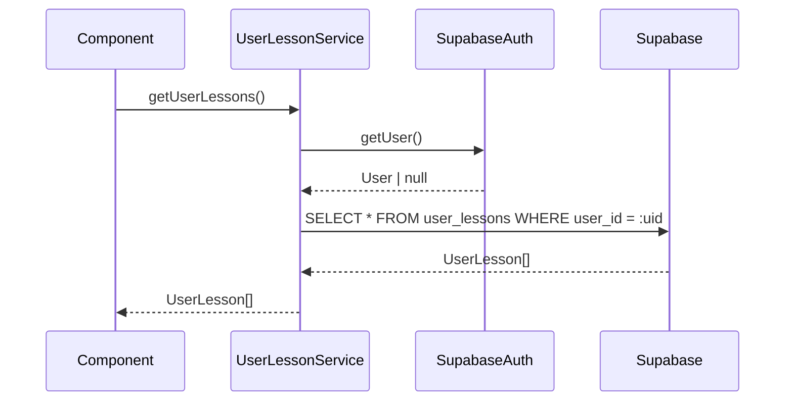
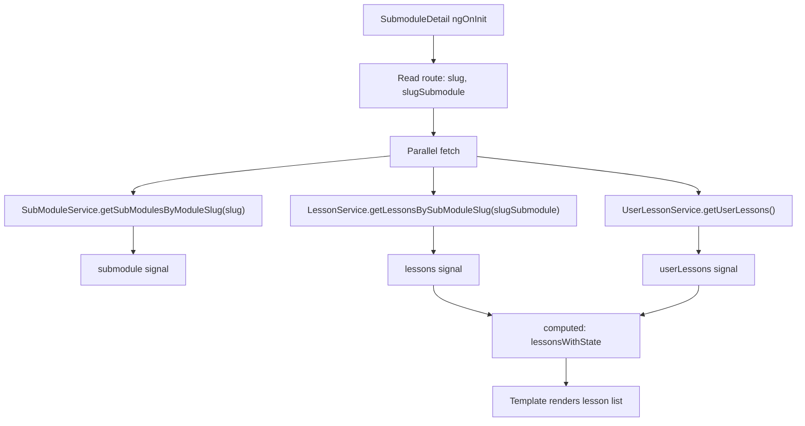
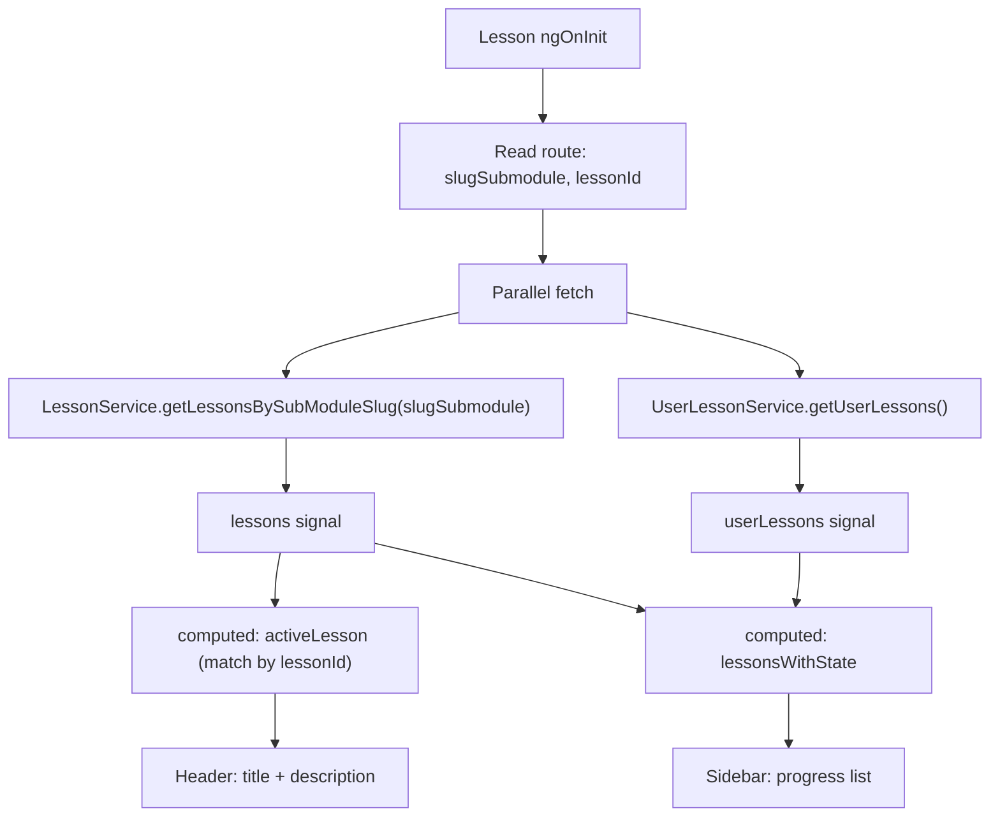
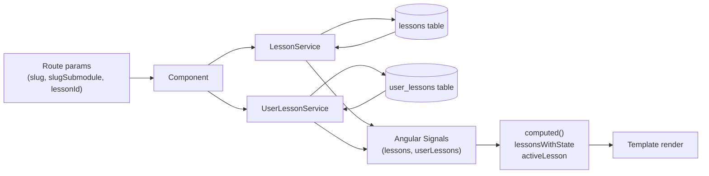
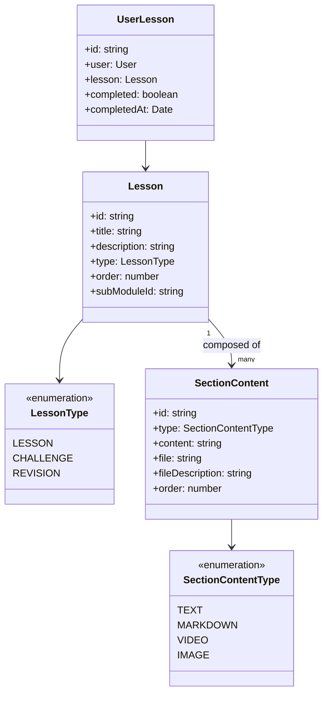

# Design Document

## Overview

This feature extends the Semeando Devs learning platform with a fully dynamic Lessons layer. It introduces three new Supabase database tables (`lessons`, `user_lessons`, `section_content`), three corresponding Angular singleton services, and wires real data into two existing page components: `SubmoduleDetail` and `Lesson`.

The design follows the established pattern used by the Modules → SubModules stack: a data table paired with a user-progress join table, each backed by a service that isolates Supabase access, composed inside a page component that holds reactive signals for loading, error, and data state. No new routing is required; the existing routes already expose all necessary parameters (`slug`, `slugSubmodule`, `lessonId`).

Because `section_content` is introduced purely as a database and model layer for future use, no Angular service or UI integration is required for it in this iteration — only the migration file and the TypeScript model, which already exists at `src/models/section-content/section-content.ts`.

### Change Type

new-feature

### Design Goals

1. Persist and query lessons and their user-progress via Supabase with proper RLS.
2. Expose lessons and user-progress data through singleton Angular services following the existing sub-module service pattern.
3. Replace static placeholder content in `SubmoduleDetail` and `Lesson` pages with data driven by route parameters.
4. Display per-lesson progress states (not-started, in-progress, completed) on both pages using `computed()` signals.
5. Lay the foundation for dynamic lesson content by creating the `section_content` table and migration.

### References

- **REQ-1**: Lessons Database Table
- **REQ-2**: User Lessons Progress Table
- **REQ-3**: Lesson Migration Files
- **REQ-4**: Lesson Angular Service
- **REQ-5**: User Lesson Angular Service
- **REQ-6**: Lesson Page — Dynamic Data Loading
- **REQ-7**: Lesson Page — Lesson Progress Sidebar
- **REQ-8**: Submodule Detail Page
- **REQ-9**: Section Content Table and Migration

---

## System Architecture

### DES-1: Database Schema — lessons and user_lessons

Two new tables are added to the `public` schema in Supabase. `lessons` stores the lesson entities and references `submodules.id` via a cascading foreign key. `user_lessons` is the user-progress join table referencing both `auth.users.id` and `lessons.id`. Both tables have RLS enabled with role-appropriate policies (public read for lessons, owner-scoped CRUD for user_lessons).

The `lessons.type` column uses a PostgreSQL check constraint (rather than a native enum) to accept the three values: `LESSON`, `CHALLENGE`, `REVISION` — matching the `LessonType` enum in the TypeScript model.

_Implements: REQ-1.1, REQ-1.2, REQ-1.3, REQ-1.4, REQ-1.5, REQ-2.1, REQ-2.2, REQ-2.3, REQ-2.4, REQ-2.5, REQ-3.1, REQ-3.2_

### DES-2: Database Schema — section_content

A third table, `section_content`, provides a block-based content model for lessons. Each row is a typed content block linked to a lesson via a cascading foreign key. The `type` column uses a check constraint accepting `TEXT`, `MARKDOWN`, `VIDEO`, `IMAGE`. The `order` column controls render sequence. RLS is enabled with a permissive SELECT policy for authenticated users.

_Implements: REQ-9.1, REQ-9.2, REQ-9.3, REQ-9.4, REQ-9.5, REQ-9.6_

### DES-3: LessonService

A singleton Angular service (`src/app/services/lesson.ts`) responsible for querying the `lessons` table. It exposes a single method `getLessonsBySubModuleSlug(slug: string): Promise<Lesson[]>` that performs a Supabase join (`lessons` → `submodules`) filtering by slug and ordering by `order ASC`. Errors from Supabase are re-thrown as standard `Error` objects.

This mirrors the shape and responsibility of `SubModuleService.getSubModulesByModuleSlug`.

_Implements: REQ-4.1, REQ-4.2, REQ-4.3_

### DES-4: UserLessonService

A singleton Angular service (`src/app/services/user-lesson.ts`) responsible for querying `user_lessons` for the authenticated user. It exposes `getUserLessons(): Promise<UserLesson[]>` which first resolves `auth.getUser()`, then queries `user_lessons` with a join on `lessons`. If the user is unauthenticated, it throws an auth error. Supabase query errors are re-thrown.

This mirrors the shape and responsibility of `UserSubModuleService.getUserSubModules`.

_Implements: REQ-5.1, REQ-5.2, REQ-5.3, REQ-5.4_

### DES-5: SubmoduleDetail Page — Dynamic Data Integration

The existing `SubmoduleDetail` component (`src/app/pages/app/submodule-detail/submodule-detail.ts`) is refactored to inject `SubModuleService`, `LessonService`, and `UserLessonService`. On `ngOnInit`, it reads `slug` and `slugSubmodule` from `ActivatedRoute` and fetches in parallel: the matching sub-module, the lessons for that sub-module, and the current user's lesson progress records.

A `computed()` signal derives a `LessonWithState[]` list by cross-referencing lessons against user_lessons in a `Map<string, UserLesson>`. Each entry carries a `progressState: 'not-started' | 'in-progress' | 'completed'` field. The template iterates this list to render lesson cards with type badges, progress indicators, a static grade placeholder for completed entries, and router links to the lesson route.

_Implements: REQ-8.1, REQ-8.2, REQ-8.3, REQ-8.4, REQ-8.5, REQ-8.6, REQ-8.7, REQ-8.8, REQ-8.9, REQ-8.10_

### DES-6: Lesson Page — Dynamic Data Integration

The existing `Lesson` component (`src/app/pages/app/lesson/lesson.ts`) is refactored to inject `LessonService` and `UserLessonService`. On `ngOnInit`, it reads `slugSubmodule` and `lessonId` from `ActivatedRoute`. It fetches lessons for the sub-module and user lesson records in parallel. A `computed()` signal derives `lessonsWithState` (same pattern as DES-5). A second `computed()` signal isolates `activeLesson` by matching `lessonId` against the lessons array.

The page header renders from `activeLesson`, while the sidebar checklist iterates `lessonsWithState` and visually highlights the active entry.

_Implements: REQ-6.1, REQ-6.2, REQ-6.3, REQ-6.4, REQ-6.5, REQ-7.1, REQ-7.2, REQ-7.3, REQ-7.4, REQ-7.5_

---

## Data Flow

---

## Code Anatomy

| File Path | Purpose | Implements |
|-----------|---------|------------|
| `supabase/migrations/*_create_lessons.sql` | Creates `lessons` table with columns, FK, RLS | DES-1 |
| `supabase/migrations/*_create_user_lessons.sql` | Creates `user_lessons` table with columns, FKs, RLS | DES-1 |
| `supabase/migrations/*_create_section_content.sql` | Creates `section_content` table with columns, FK, RLS | DES-2 |
| `src/models/lesson/lesson.ts` | `Lesson` interface and `LessonType` enum (already exists, no changes) | DES-1 |
| `src/models/user-lesson/user-lesson.ts` | `UserLesson` interface (already exists, no changes) | DES-1 |
| `src/models/section-content/section-content.ts` | `SectionContent` interface and `SectionContentType` enum (already exists, no changes) | DES-2 |
| `src/app/services/lesson.ts` | `LessonService` — queries `lessons` by sub-module slug | DES-3 |
| `src/app/services/user-lesson.ts` | `UserLessonService` — queries `user_lessons` for the authenticated user | DES-4 |
| `src/app/pages/app/submodule-detail/submodule-detail.ts` | Refactored with signals, services, and `computed()` progress state | DES-5 |
| `src/app/pages/app/submodule-detail/submodule-detail.html` | Updated template with dynamic lesson list, type badges, progress states, navigation | DES-5 |
| `src/app/pages/app/lesson/lesson.ts` | Refactored with signals, services, `activeLesson` and `lessonsWithState` computed | DES-6 |
| `src/app/pages/app/lesson/lesson.html` | Updated template with active lesson header and dynamic sidebar | DES-6 |

---

## Data Models

---

## Error Handling

| Error Condition | Response | Recovery |
|-----------------|----------|----------|
| Missing route parameter (`slug` or `slugSubmodule`) | Set `error` signal with a descriptive message | Template renders error state |
| Supabase query failure in `LessonService` | Re-throw `Error` with Supabase message | Component catches, sets `error` signal |
| Supabase query failure in `UserLessonService` | Re-throw `Error` with Supabase message | Component catches, sets `error` signal |
| Unauthenticated user in `UserLessonService` | Throw `Error('User not authenticated')` | Component catches, sets `error` signal |

---

## Impact Analysis

| Affected Area | Impact Level | Notes |
|---------------|--------------|-------|
| `submodule-detail.ts` / `.html` | High | Full refactor from static to dynamic; template replaced |
| `lesson.ts` / `lesson.html` | High | Full refactor; static `codeSnippet` field removed |

### Testing Requirements

| Test Type | Coverage Goal | Notes |
|-----------|---------------|-------|
| Unit | `LessonService` and `UserLessonService` | Mock Supabase client; verify query shape, error propagation, and auth guard |
| Unit | `SubmoduleDetail` and `Lesson` components | Use `TestBed` with signal assertions; verify loading, error, and data states |

### Risk Assessment

| Risk | Likelihood | Impact | Mitigation |
|------|------------|--------|------------|
| Migration applied out of order | Low | High | `lessons` migration must precede `user_lessons` and `section_content` migrations |
| Supabase RLS blocks authenticated reads | Low | Medium | Verify SELECT policy uses `auth.uid()` only for `user_lessons`; lessons use permissive read |

### Rollback Plan

| Scenario | Rollback Steps | Time to Recovery |
|----------|----------------|------------------|
| Migration failure | Drop affected tables and re-run corrected migration | < 10 minutes |
| Runtime regression in lesson page | Revert component files via git; database tables remain | < 5 minutes |

---

## Traceability Matrix

| Design Element | Requirements |
|----------------|--------------|
| DES-1 | REQ-1.1, REQ-1.2, REQ-1.3, REQ-1.4, REQ-1.5, REQ-2.1, REQ-2.2, REQ-2.3, REQ-2.4, REQ-2.5, REQ-3.1, REQ-3.2 |
| DES-2 | REQ-9.1, REQ-9.2, REQ-9.3, REQ-9.4, REQ-9.5, REQ-9.6 |
| DES-3 | REQ-4.1, REQ-4.2, REQ-4.3 |
| DES-4 | REQ-5.1, REQ-5.2, REQ-5.3, REQ-5.4 |
| DES-5 | REQ-8.1, REQ-8.2, REQ-8.3, REQ-8.4, REQ-8.5, REQ-8.6, REQ-8.7, REQ-8.8, REQ-8.9, REQ-8.10 |
| DES-6 | REQ-6.1, REQ-6.2, REQ-6.3, REQ-6.4, REQ-6.5, REQ-7.1, REQ-7.2, REQ-7.3, REQ-7.4, REQ-7.5 |
