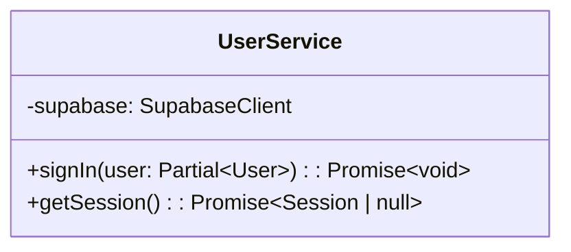
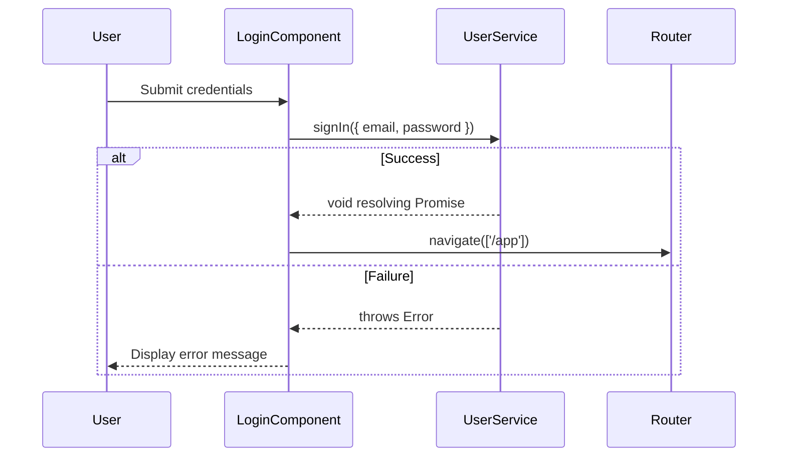
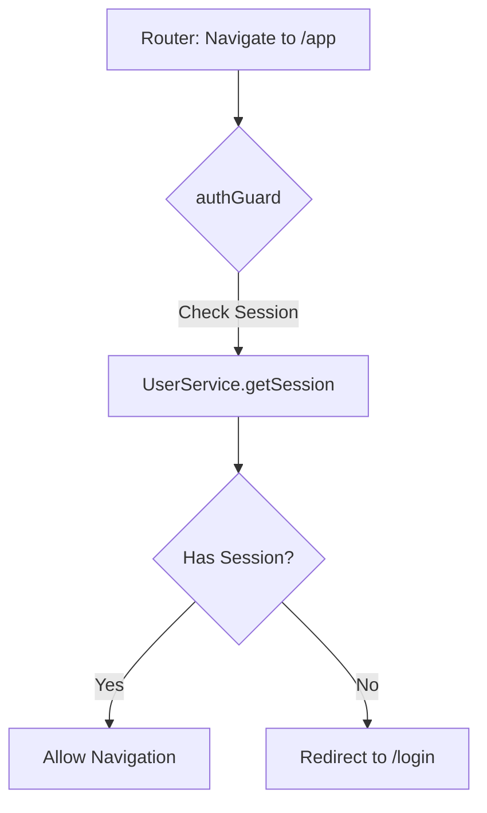

# Design Document

## Overview

This design outlines the implementation of the login functionality and route protection via an Authentication Guard using Angular 20 features and Supabase. The `UserService` will be extended with methods for user sign-in and session checking. An Angular standalone component will handle the user login interface, and a functional guard will protect the `/app` route.

### Change Type

enhancement

### Design Goals

1. Seamlessly authenticate users and redirect them to the `/app` module.
2. Prevent unauthorized access to the `/app` module via client-side routing guards.

### References

- **REQ-1**: User Login Forwarding
- **REQ-2**: Invalid Credentials Handling
- **REQ-3**: Protected Application Route

## System Architecture

### DES-1: User Service Extensions

The existing `UserService` will be extended with two new methods: `signIn` to authenticate via Supabase `signInWithPassword`, and `getSession` to retrieve the current session state.

_Implements: REQ-1.1, REQ-2.1, REQ-3.1, REQ-3.2_

### DES-2: Login Component

The standalone `LoginComponent` will accept email and password, call `UserService.signIn`, and route to `/app` on success. On failure, it will display a feedback error to the user signal.

_Implements: REQ-1.1, REQ-2.1_

### DES-3: Authentication Guard (authGuard)

An Angular functional route guard (`CanActivateFn`) will intercept navigations to `/app`. It will call `UserService.getSession()`. If a valid session exists, navigation proceeds. If not, the user is redirected to the `/login` route.

_Implements: REQ-3.1, REQ-3.2_

## Code Anatomy

| File Path | Purpose | Implements |
|-----------|---------|------------|
| src/app/services/user.ts | Extended to support sign-in and session retrieval | DES-1 |
| src/app/pages/login/login.ts | Standalone component for the login page | DES-2 |
| src/app/pages/login/login.html | View layout and error display | DES-2 |
| src/app/components/guards/auth.guard.ts | Functional route guard | DES-3 |
| src/app/app.routes.ts | Router config applying the Auth Guard to `/app` | DES-3 |

## Error Handling

| Error Condition | Response | Recovery |
|-----------------|----------|----------|
| Invalid Credentials | Supabase throws AuthError | Login component catches and displays user-friendly message |

## Traceability Matrix

| Design Element | Requirements |
|----------------|--------------|
| DES-1 | REQ-1.1, REQ-2.1, REQ-3.1, REQ-3.2 |
| DES-2 | REQ-1.1, REQ-2.1 |
| DES-3 | REQ-3.1, REQ-3.2 |
