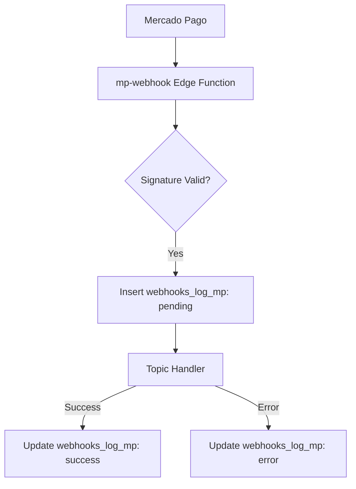
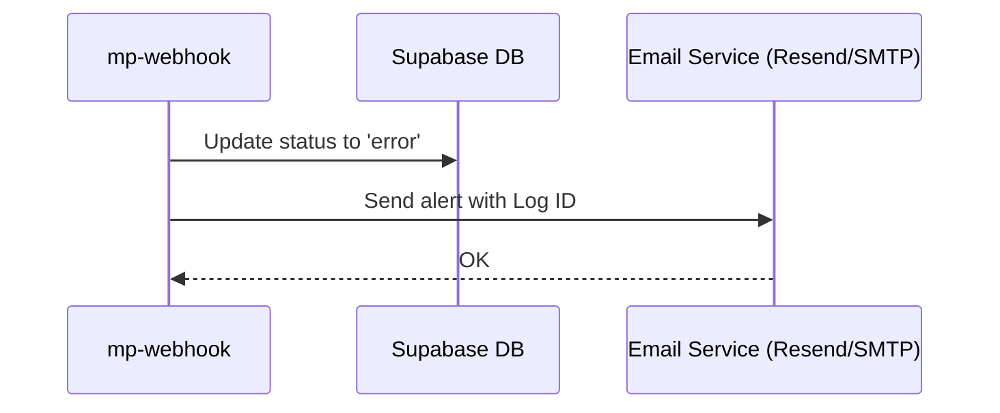
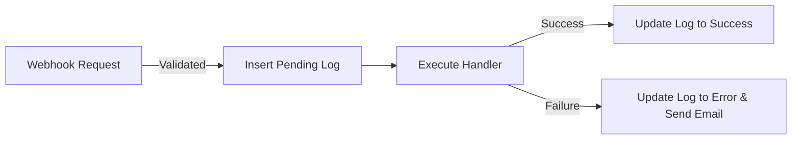
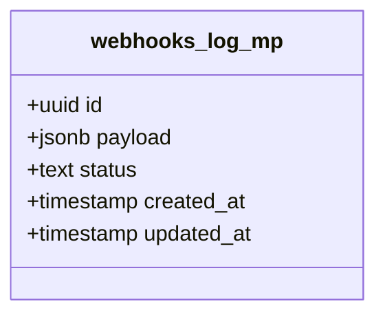

# Design Document

## Overview

To fulfill the webhook logging requirements, we will intercept the webhook payload at the entry point of the `mp-webhook` Supabase edge function. Before routing the payload to specific topic handlers, we will insert a new record into the `webhooks_log_mp` table with a `pending` status. Once the handler resolves, we will update the status to `success`. If the handler throws an error, we will catch it, update the status to `error`, and dispatch an email alert using the Resend API (or SMTP fallback) to the administrator.

### Change Type

enhancement

### Design Goals

1. Ensure all incoming Mercado Pago webhooks are durably logged before processing begins.
2. Accurately track the lifecycle of a webhook (pending, success, error).
3. Alert administrators reliably when webhook processing fails to prevent silent data loss.

### References

- **REQ-1**: Store Webhook Payload
- **REQ-2**: Notify on Webhook Error

## System Architecture

### DES-1: Webhook Lifecycle Logging

The `mp-webhook` edge function will be enhanced to wrap its core logic in a logging flow. After validating the signature and parsing the JSON, it will insert a log entry containing the raw body. It will then pass the payload to the respective topic handler. Upon completion, it updates the log status to `success` or `error`.

_Implements: REQ-1.1, REQ-1.2, REQ-1.3_

### DES-2: Error Notification Mechanism

If an error occurs during handler execution, the `mp-webhook` function catches it, updates the log entry to `error`, and makes an HTTP call to the Resend API (or uses nodemailer fallback) to dispatch an email to the admin with the log ID.

_Implements: REQ-2.1, REQ-2.2_

## Data Flow

## Code Anatomy

| File Path | Purpose | Implements |
|-----------|---------|------------|
| supabase/functions/mp-webhook/index.ts | Orchestrates the logging and email dispatch | DES-1, DES-2 |
| supabase/migrations/<new>.sql | Creates the webhooks_log_mp table | DES-1 |

## Data Models

## Error Handling

| Error Condition | Response | Recovery |
|-----------------|----------|----------|
| Database insert fails | Return 500 error | MP will retry automatically |
| Topic handler fails | Update log to error, send email, return 200 | Administrator manually intervenes using log ID |
| Email dispatch fails | Log error to console | Administrator checks logs |

## Impact Analysis

| Affected Area | Impact Level | Notes |
|---------------|--------------|-------|
| supabase/functions/mp-webhook | Medium | Adds dependency on Resend/Nodemailer and DB calls |

### Testing Requirements

| Test Type | Coverage Goal | Notes |
|-----------|---------------|-------|
| Integration | Critical flow | Verify logging state transitions and email dispatch on error |

## Traceability Matrix

| Design Element | Requirements |
|----------------|--------------|
| DES-1 | REQ-1.1, REQ-1.2, REQ-1.3 |
| DES-2 | REQ-2.1, REQ-2.2 |
