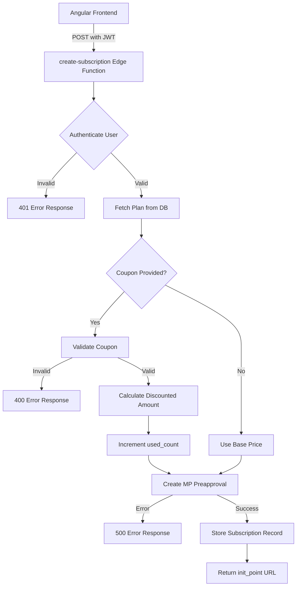
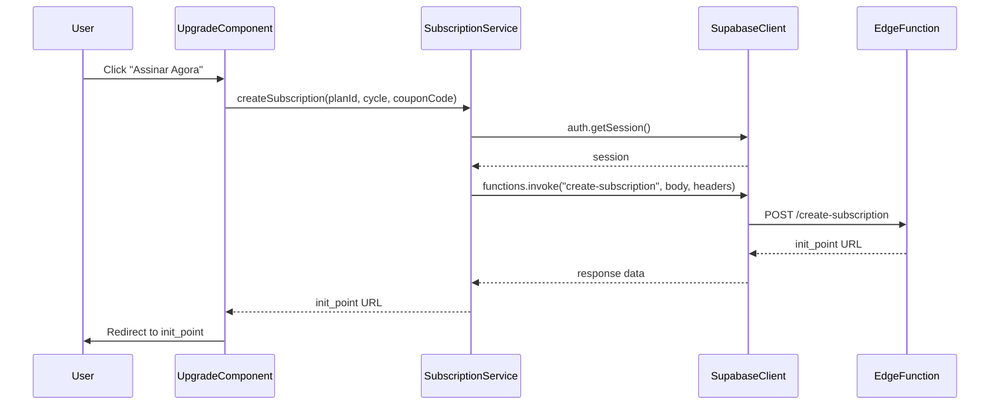
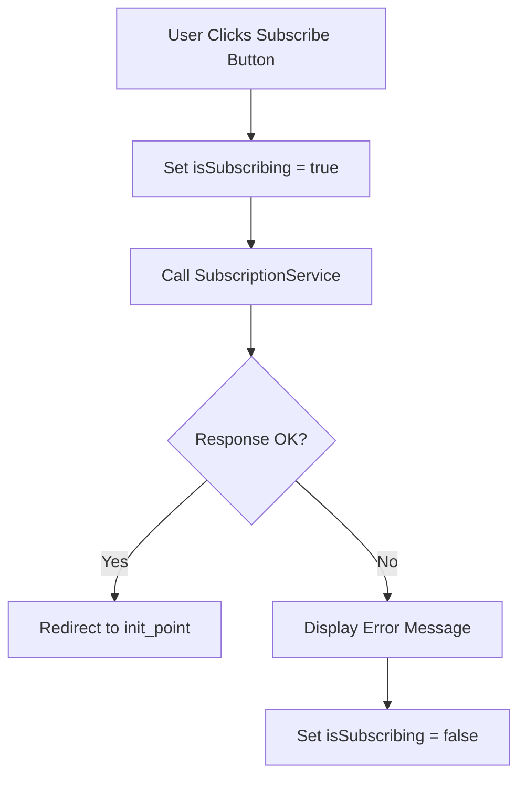
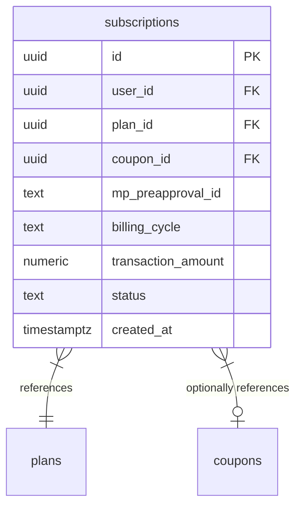
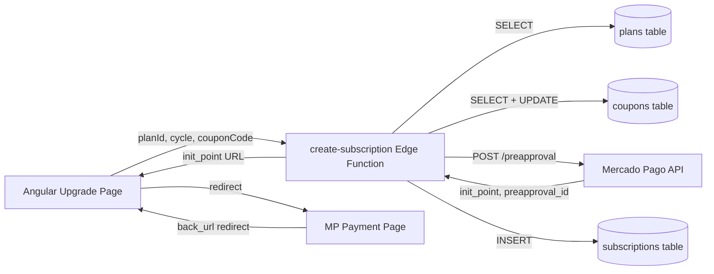
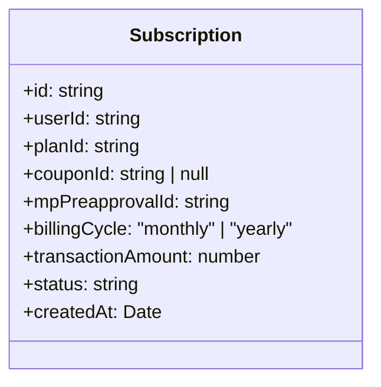

# Design Document

## Overview

This design introduces a Supabase Edge Function (`create-subscription`) that acts as the secure backend for creating Mercado Pago subscriptions. The Edge Function receives a subscription request from the Angular frontend (plan ID, billing cycle, optional coupon code), performs server-side coupon validation, calculates the final price, creates a Mercado Pago preapproval via the `/preapproval` API, records the subscription in a new `subscriptions` table, and returns the `init_point` URL so the frontend can redirect the user to complete payment.

The frontend modifications are limited to the existing `Upgrade` component and a new `SubscriptionService`. The "Assinar" buttons become functional, triggering the subscription flow with loading states and error feedback. The architecture mirrors existing patterns: the `QuizService` → `complete-quiz` Edge Function pattern is reused for the `SubscriptionService` → `create-subscription` Edge Function.

### Change Type

new-feature

### Design Goals

1. Keep Mercado Pago credentials exclusively on the server side (Edge Function reads `ML_ACCESS_TOKEN` from env vars).
2. Reuse the established Edge Function invocation pattern from `QuizService`/`complete-quiz`.
3. Validate coupons server-side to prevent price manipulation, and atomically increment `used_count`.
4. Record every subscription attempt in a `subscriptions` table for auditability.
5. Provide clear loading and error states on the upgrade page during the subscription flow.

### References

- **REQ-1**: Subscription Creation via Edge Function
- **REQ-2**: Server-Side Coupon Validation on Subscription
- **REQ-3**: Secure Credential Isolation
- **REQ-4**: Subscription Payment Records
- **REQ-5**: Upgrade Page Payment Flow
- **REQ-6**: Authentication Enforcement

## System Architecture

### DES-1: Subscription Edge Function

The `create-subscription` Edge Function is a Deno-based Supabase function that orchestrates the entire subscription creation flow. It authenticates the user via the JWT in the `Authorization` header, fetches the plan from the `plans` table, optionally validates and redeems a coupon from the `coupons` table, computes the final `transaction_amount`, calls the Mercado Pago `/preapproval` API, stores the subscription record, and returns the `init_point` URL.

The function reads `ML_ACCESS_TOKEN` from `Deno.env.get()` and uses `SUPABASE_URL` / `SUPABASE_SERVICE_ROLE_KEY` for database access, following the same pattern as `complete-quiz`.

_Implements: REQ-1.2, REQ-1.3, REQ-1.5, REQ-2.1, REQ-2.2, REQ-2.3, REQ-2.4, REQ-2.5, REQ-3.1, REQ-6.1, REQ-6.2_

### DES-2: Subscription Service (Angular)

A new `SubscriptionService` in `src/app/services/subscription.ts` encapsulates the Edge Function invocation. It retrieves the active session, invokes the `create-subscription` function via `supabase.functions.invoke()`, and returns the `init_point` URL or throws on error. This mirrors the `QuizService.completeQuiz()` pattern.

_Implements: REQ-1.1, REQ-1.4, REQ-5.1, REQ-5.2_

### DES-3: Upgrade Component Payment Integration

The existing `Upgrade` component gains a `subscribe(cycle: 'monthly' | 'yearly')` method that invokes `SubscriptionService.createSubscription()`. The component tracks `isSubscribing` and `subscriptionError` signals for UI state management. On success, the user is redirected to the Mercado Pago `init_point` via `window.location.href`. On failure, an error message is displayed below the pricing cards.

_Implements: REQ-5.1, REQ-5.2, REQ-5.3, REQ-5.4_

### DES-4: Subscriptions Database Table

A new `subscriptions` table stores each subscription attempt. The table records the user ID, plan ID, billing cycle, optional coupon ID, the Mercado Pago preapproval ID, the final transaction amount, and a status field (initially `pending`). RLS policies restrict users to reading only their own subscription records, while the service role has full access.

_Implements: REQ-4.1, REQ-4.2_

## Data Flow

## Code Anatomy

| File Path | Purpose | Implements |
|-----------|---------|------------|
| `supabase/functions/create-subscription/index.ts` | Edge Function: auth, coupon validation, MP API call, DB record | DES-1 |
| `supabase/migrations/YYYYMMDD_add_subscriptions_table.sql` | Migration for `subscriptions` table with RLS | DES-4 |
| `src/app/services/subscription.ts` | Angular service wrapping Edge Function invocation | DES-2 |
| `src/app/pages/app/upgrade/upgrade.ts` | Updated component with subscribe method and loading/error signals | DES-3 |
| `src/app/pages/app/upgrade/upgrade.html` | Updated template with functional buttons and feedback UI | DES-3 |

## Data Models

## Error Handling

| Error Condition | Response | Recovery |
|-----------------|----------|----------|
| Missing or invalid JWT | 401 Unauthorized | Frontend prompts re-login |
| Plan not found in database | 400 Bad Request with message | User sees error, can retry |
| Coupon code not found | 400 Bad Request with coupon error | User removes coupon and retries |
| Coupon expired | 400 Bad Request with expiration message | User removes coupon and retries |
| Coupon usage limit exceeded | 400 Bad Request with limit message | User removes coupon and retries |
| Mercado Pago API error | 500 Internal Server Error with MP error details | User retries or contacts support |
| Missing required fields | 400 Bad Request with validation message | Frontend validates before sending |

## Impact Analysis

| Affected Area | Impact Level | Notes |
|---------------|--------------|-------|
| `src/app/pages/app/upgrade/upgrade.ts` | High | Adds subscribe method, new signals, new service import |
| `src/app/pages/app/upgrade/upgrade.html` | High | Buttons become functional, loading/error states added |
| `src/app/services/coupon.ts` | None | Existing client-side validation unchanged; server-side validation is independent |
| `coupons` table | Low | `used_count` is incremented by Edge Function on valid redemption |

### Dependencies

| Dependency | Type | Impact |
|------------|------|--------|
| Mercado Pago API (`/preapproval`) | Runtime, External | Subscription creation depends on API availability |
| `ML_ACCESS_TOKEN` env var | Configuration | Must be set in `.env` for Edge Functions |
| Supabase Edge Functions runtime | Infrastructure | Deno-based runtime for serverless execution |

### Testing Requirements

| Test Type | Coverage Goal | Notes |
|-----------|---------------|-------|
| Manual E2E | Full subscription flow | Click subscribe → Edge Function → MP preapproval → redirect to init_point |
| Manual E2E | Coupon validation on subscribe | Apply valid/invalid/expired coupons and verify server-side behavior |
| Manual E2E | Error states | Simulate missing plan, expired coupon, MP API failure |

## Traceability Matrix

| Design Element | Requirements |
|----------------|--------------|
| DES-1 | REQ-1.2, REQ-1.3, REQ-1.5, REQ-2.1, REQ-2.2, REQ-2.3, REQ-2.4, REQ-2.5, REQ-3.1, REQ-6.1, REQ-6.2 |
| DES-2 | REQ-1.1, REQ-1.4, REQ-5.1, REQ-5.2 |
| DES-3 | REQ-5.1, REQ-5.2, REQ-5.3, REQ-5.4 |
| DES-4 | REQ-4.1, REQ-4.2 |
