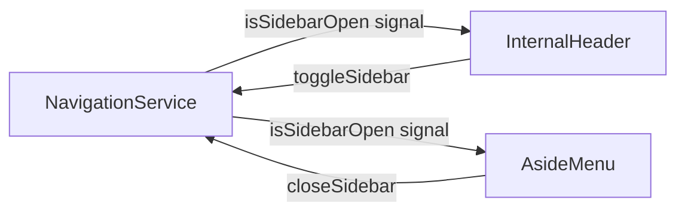
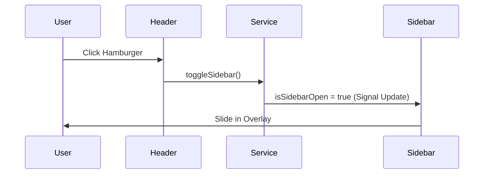

# Design Document

## Overview
The technical approach involves introducing a `NavigationService` to manage the sidebar's open/closed state using Angular Signals. The `InternalHeader` will be updated to include a hamburger toggle button for mobile views and to ensure user stats (XP and Seeds) remain visible in a compact format. The `AsideMenu` will be modified to support a mobile overlay behavior, transitioning in and out based on the navigation state, while maintaining its fixed position on desktop.

### Change Type
enhancement

### Design Goals
1. Enable mobile-friendly navigation via a toggleable sidebar.
2. Ensure XP and Seeds stats are persistently visible and responsive.
3. Use Angular Signals for reactive state management of the navigation UI.

### References
- **REQ-1**: Mobile Sidebar Toggle
- **REQ-2**: Persistent User Stats in Header

## System Architecture

### DES-1: Navigation State Service
A new singleton service `NavigationService` will be created to manage the UI state of the navigation system. This ensures that the header and sidebar can communicate their state without being directly coupled.

_Implements: REQ-1.1, REQ-1.3, REQ-1.4_

### DES-2: Responsive Header and Sidebar Components
The layout will leverage Tailwind CSS utility classes to handle responsiveness. The `InternalHeader` will conditionally show the hamburger menu, and the `AsideMenu` will use CSS transitions to slide in/out on mobile while remaining fixed on desktop.

_Implements: REQ-1.2, REQ-1.3, REQ-2.1, REQ-2.2_

## Code Anatomy

| File Path | Purpose | Implements |
|-----------|---------|------------|
| src/app/services/navigation.ts | [NEW] Manages sidebar toggle state with Signals | DES-1 |
| src/app/components/internal-header/internal-header.ts | Injects NavigationService and manages stats display | DES-2 |
| src/app/components/internal-header/internal-header.html | Adds hamburger button and updates stats layout | DES-2 |
| src/app/components/aside-menu/aside-menu.ts | Injects NavigationService to react to state changes | DES-2 |
| src/app/components/aside-menu/aside-menu.html | Implements mobile-first classes and overlay behavior | DES-2 |

## Impact Analysis

| Affected Area | Impact Level | Notes |
|---------------|--------------|-------|
| Layout | Low | Sidebar transitions on mobile will overlap content. |
| User Stats | Low | Layout change for XP/Seeds display on mobile to ensure persistence. |

### Testing Requirements

| Test Type | Coverage Goal | Notes |
|-----------|---------------|-------|
| Manual | Mobile Responsiveness | Verify hamburger menu works and stats are visible on small screens (< 768px). |
| Manual | Navigation Flow | Verify sidebar closes on link click or clicking outside the menu area. |

## Traceability Matrix

| Design Element | Requirements |
|----------------|--------------|
| DES-1 | REQ-1.1, REQ-1.3, REQ-1.4 |
| DES-2 | REQ-1.2, REQ-1.3, REQ-2.1, REQ-2.2 |
