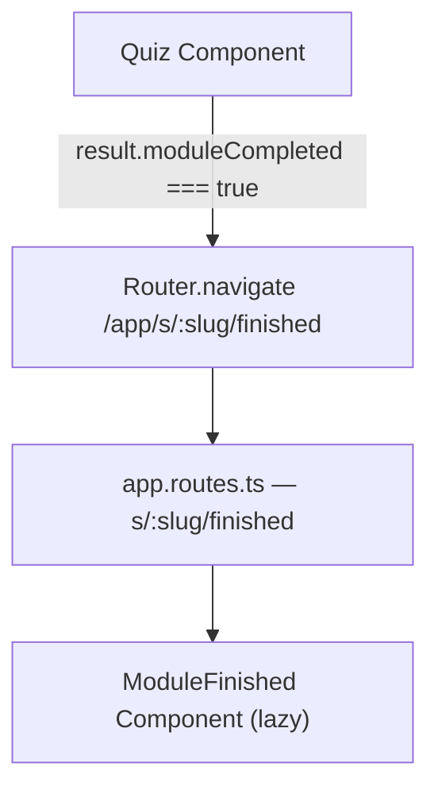
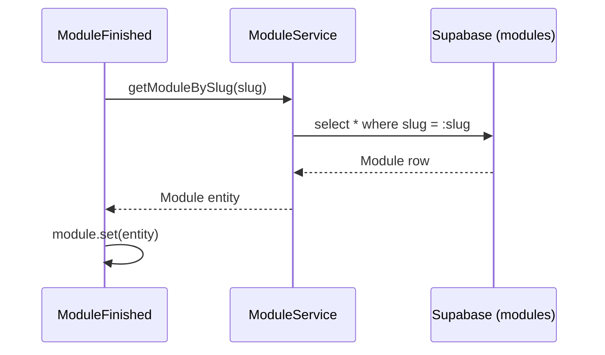
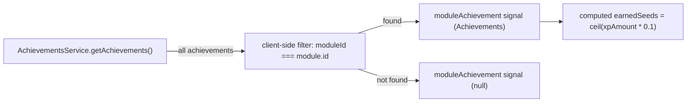
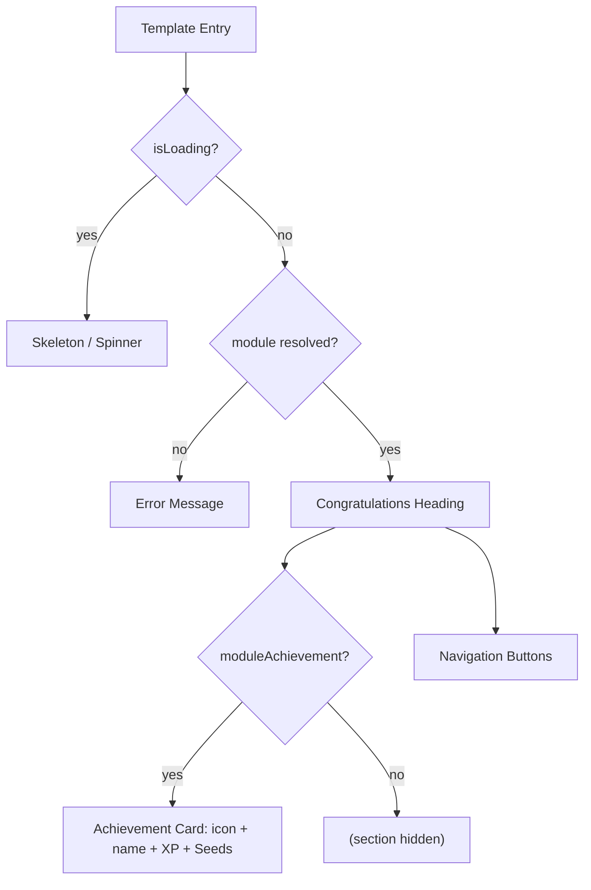
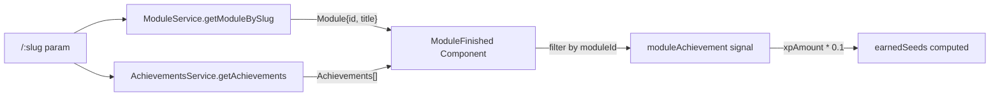

# Design Document

## Overview

This feature adds a dedicated `ModuleFinished` standalone page component rendered at the child route `/app/s/:slug/finished`. The component is loaded lazily and sits under the existing authenticated `app` layout shell, inheriting the top navigation bar automatically.

On initialisation, the component reads the `:slug` route parameter and performs two parallel data fetches: one to `ModuleService` to resolve the module entity (providing the module name and `id`), and one to `AchievementsService` to retrieve all achievements. It then filters achievements client-side to find the one whose `moduleId` matches the loaded module's `id`. Seeds are computed in the component from `Math.ceil(achievement.xpAmount * 0.1)` and displayed alongside the achievement. Two navigation buttons allow the student to proceed to the modules list or the achievements page.

The design follows the existing Angular 20+ standalone, signals, and `OnPush` change-detection conventions used throughout the project. No new services are required; `ModuleService` needs one new method (`getModuleBySlug`) added to its existing surface.

### Change Type

new-feature

### Design Goals

1. Provide a celebratory, immersive closure screen that fits the Neon Terminal design system.
2. Reuse existing services (`ModuleService`, `AchievementsService`) and introduce minimal new code.
3. Keep the component self-contained with signals for local state and `OnPush` for performance.

### References

- **REQ-1**: Module Completion Route
- **REQ-2**: Congratulations Screen Display
- **REQ-3**: Achievement Showcase
- **REQ-4**: Seeds Reward Display
- **REQ-5**: Post-Completion Navigation

---

## System Architecture

### DES-1: `finished` Route Registration

A new child route `s/:slug/finished` is added inside the authenticated `app` children array in `app.routes.ts`. It lazily loads the `ModuleFinished` component and carries the title `Conclusão de Módulo - Semeando Devs`.

_Implements: REQ-1.1, REQ-1.2_

---

### DES-2: Module Data Resolution

On `ngOnInit`, the `ModuleFinished` component reads the `slug` parameter and calls `ModuleService.getModuleBySlug(slug)`. A new `getModuleBySlug(slug: string): Promise<Module>` method is added to `ModuleService` that queries Supabase with `.eq('slug', slug).single()`. The result populates the `module` signal; the `isLoading` signal gates the template between skeleton and content states.

_Implements: REQ-2.1, REQ-2.2, REQ-2.3_

---

### DES-3: Achievement Matching

In parallel with DES-2, the component calls `AchievementsService.getAchievements()` and, once both fetches complete, filters the result to find `achievement.moduleId === module.id`. The matched achievement (or `null`) is stored in the `moduleAchievement` signal. A `computed()` signal `earnedSeeds` derives the Seeds value as `Math.ceil(moduleAchievement()?.xpAmount ?? 0 * 0.1)`.

_Implements: REQ-3.1, REQ-3.2, REQ-3.3, REQ-4.1, REQ-4.2_

---

### DES-4: Completion Screen Template

The template is split into three conditional regions driven by signals:

1. **Loading state** — shown while `isLoading()` is `true`.
2. **Error state** — shown when `module()` is `null` after loading.
3. **Success state** — shown when the module is resolved; conditionally renders the achievement block when `moduleAchievement()` is non-null.

Two `[routerLink]` buttons are always rendered within the success state.

_Implements: REQ-2.1, REQ-2.2, REQ-2.3, REQ-3.2, REQ-3.3, REQ-4.1, REQ-4.2, REQ-5.1, REQ-5.2_

---

## Data Flow

## Code Anatomy

| File Path | Purpose | Implements |
|-----------|---------|------------|
| `src/app/app.routes.ts` | Register `s/:slug/finished` child route | DES-1 |
| `src/app/pages/app/module-finished/module-finished.ts` | Standalone component: state signals, `ngOnInit`, parallel fetches, navigation | DES-2, DES-3 |
| `src/app/pages/app/module-finished/module-finished.html` | Template: loading / error / success states, achievement block, navigation buttons | DES-4 |
| `src/app/pages/app/module-finished/module-finished.scss` | Component-scoped styles (minimal; Tailwind handles layout) | DES-4 |
| `src/app/pages/app/module-finished/module-finished.spec.ts` | Unit tests for state transitions and achievement matching | DES-2, DES-3, DES-4 |
| `src/app/services/module.ts` | Add `getModuleBySlug(slug): Promise<Module>` method | DES-2 |

## Error Handling

| Error Condition | Response | Recovery |
|-----------------|----------|----------|
| `getModuleBySlug` returns null or throws | `module` signal stays `null`; template shows generic Portuguese error message | User can navigate back via browser |
| `getAchievements` throws | `moduleAchievement` signal stays `null`; achievement section is hidden | Graceful degradation — rest of screen renders normally |
| Slug parameter missing from route | Component sets `module` to `null` immediately | Error state rendered |

## Impact Analysis

| Affected Area | Impact Level | Notes |
|---------------|--------------|-------|
| `src/app/app.routes.ts` | Low | Additive: one new child route entry |
| `src/app/services/module.ts` | Low | Additive: one new method, no change to existing API |

### Testing Requirements

| Test Type | Coverage Goal | Notes |
|-----------|---------------|-------|
| Unit | Module resolution, achievement matching, Seeds calculation | Test `ModuleFinished` component with mock services |
| Unit | `getModuleBySlug` success and not-found paths | Test `ModuleService` new method |

## Traceability Matrix

| Design Element | Requirements |
|----------------|--------------|
| DES-1 | REQ-1.1, REQ-1.2 |
| DES-2 | REQ-2.1, REQ-2.2, REQ-2.3 |
| DES-3 | REQ-3.1, REQ-3.2, REQ-3.3, REQ-4.1, REQ-4.2 |
| DES-4 | REQ-2.1, REQ-2.2, REQ-2.3, REQ-3.2, REQ-3.3, REQ-4.1, REQ-4.2, REQ-5.1, REQ-5.2 |
