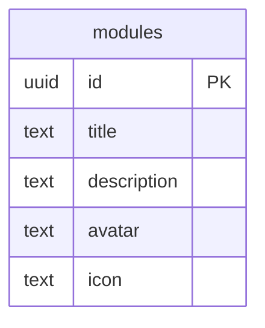
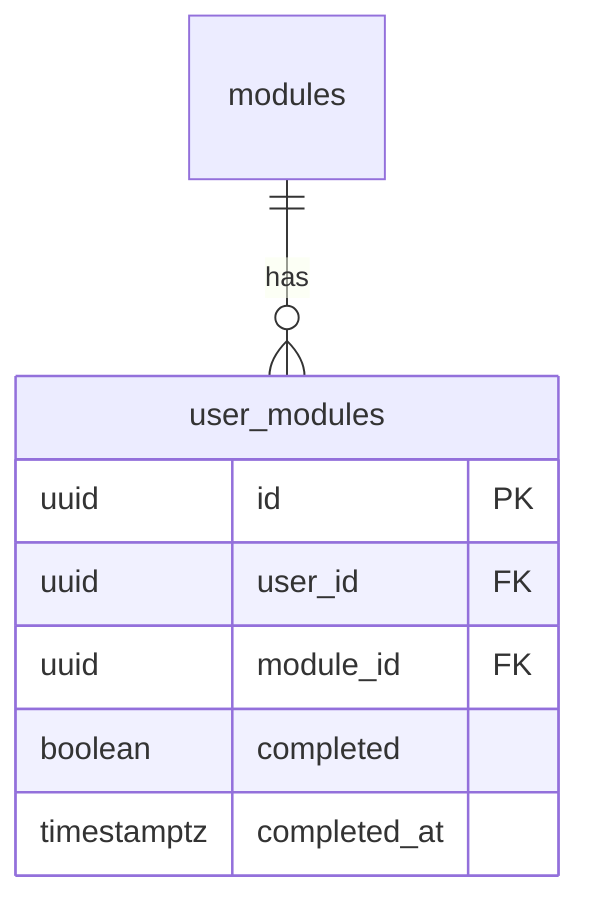
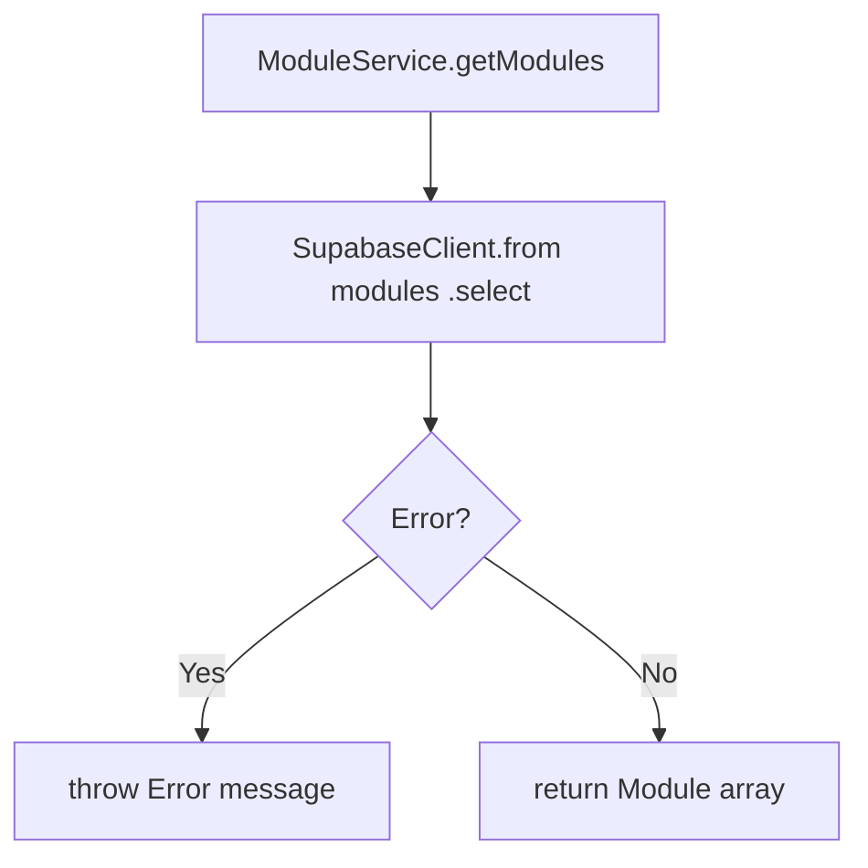
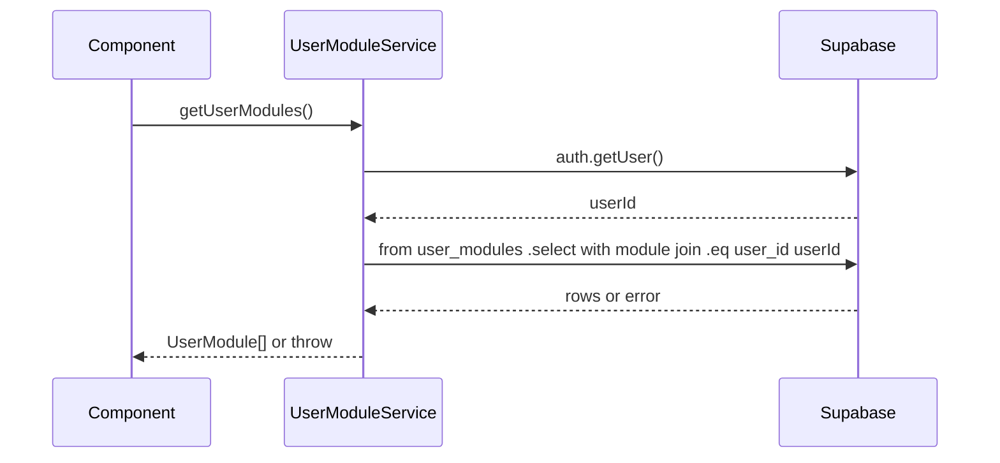
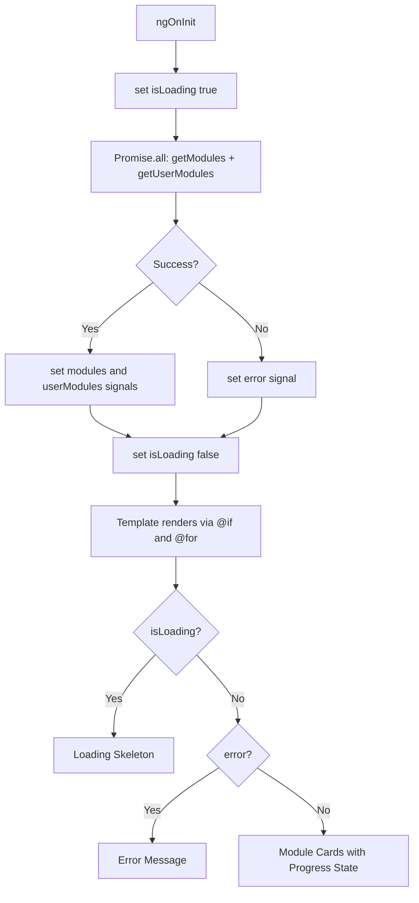
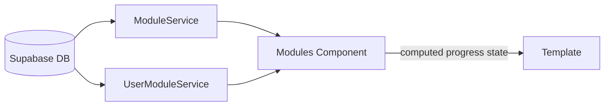
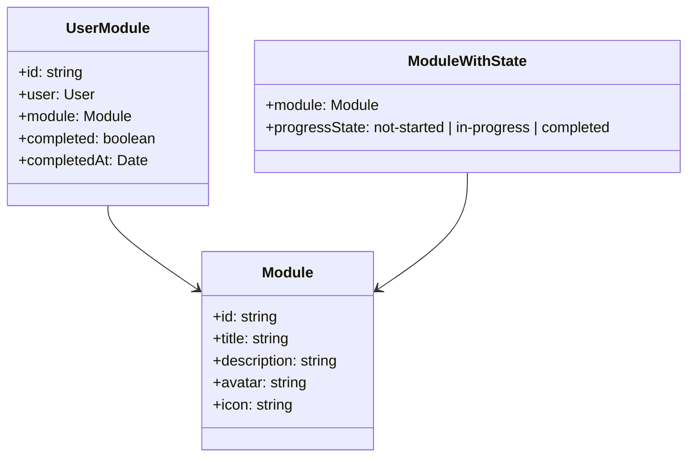

# Design Document

## Overview

This feature adds a persistence layer for learning modules and user-specific module progress to the Semeando Devs Angular application. Two new Supabase tables are introduced — `modules` and `user_modules` — each protected by Row-Level Security policies aligned with the project's existing security posture. Versioned SQL migration files will be created for both tables.

Two dedicated Angular services, `ModuleService` and `UserModuleService`, encapsulate all Supabase interactions for their respective domains following the same pattern established by `UserService`. Both services use `providedIn: 'root'` dependency injection and a standalone Supabase client initialized from the shared environment configuration.

The `Modules` page component is refactored from a fully static template to a signal-driven component that fetches real data on initialization, correlates module records with the current user's progress, and renders a dynamic, per-module card with the correct progress state and action button. Loading and error states are handled explicitly.

### Change Type

`new-feature`

### Design Goals

1. Establish a normalized, RLS-protected database schema for `modules` and `user_modules` with migration traceability.
2. Provide reusable, testable Angular services for each table domain following the existing `UserService` pattern.
3. Replace the hardcoded Modules page with a signal-driven, reactive component that reflects real user progress.
4. Preserve the existing UI design while replacing static content with live data.

### References

- **REQ-1**: Modules Database Table
- **REQ-2**: User Modules Database Table
- **REQ-3**: Module Service
- **REQ-4**: User Module Service
- **REQ-5**: Modules Page — Dynamic Data

---

## System Architecture

### DES-1: Database Schema — `modules` Table

The `modules` table stores the catalog of top-level learning tracks. Each row maps directly to a `Module` TypeScript interface (`id`, `title`, `description`, `avatar`, `icon`). RLS is enabled and a `SELECT` policy grants read access to all authenticated users, consistent with the existing `xp` and related tables in the project.

A versioned migration file (`create_modules_table`) is applied via the Supabase MCP to ensure schema changes are tracked and reproducible.

_Implements: REQ-1.1, REQ-1.2, REQ-1.3_

---

### DES-2: Database Schema — `user_modules` Table

The `user_modules` table records the relationship between an authenticated user and a module. It holds the `completed` flag and an optional `completed_at` timestamp. `user_id` references `auth.users(id)` and `module_id` references `modules(id)`.

RLS is enabled with two policies: a `SELECT` policy scoped to `auth.uid() = user_id` and an `INSERT` policy with the same constraint, ensuring users can only read and create their own records. A versioned migration file (`create_user_modules_table`) is applied via the Supabase MCP.

_Implements: REQ-2.1, REQ-2.2, REQ-2.3, REQ-2.4_

---

### DES-3: ModuleService

`ModuleService` is a singleton Angular service (`providedIn: 'root'`) that initializes a `SupabaseClient` from the shared environment configuration — identical to the pattern used in `UserService`. It exposes one public async method, `getModules()`, which queries the `modules` table and returns a `Module[]` array. On a Supabase error, it throws with the error message.

_Implements: REQ-3.1, REQ-3.2_

---

### DES-4: UserModuleService

`UserModuleService` is a singleton Angular service (`providedIn: 'root'`) that initializes a `SupabaseClient` from the shared environment configuration. It exposes one public async method, `getUserModules()`, which resolves the current authenticated user's ID via `supabase.auth.getUser()`, then queries `user_modules` filtered by `user_id` with a nested select of the related `module` row. The result is typed as `UserModule[]`. An empty array is returned when no records exist. On a Supabase error, it throws with the error message.

_Implements: REQ-4.1, REQ-4.2, REQ-4.3_

---

### DES-5: Modules Page — Signal-Driven Reactive Component

The `Modules` component is refactored to use Angular signals for local state. Three signals are introduced: `modules` (`Module[]`), `userModules` (`UserModule[]`), and `isLoading` (`boolean`), plus an `error` signal (`string | null`). On `ngOnInit`, both services are called concurrently via `Promise.all`. A `computed()` signal resolves each module's progress state by looking up its `id` in the `userModules` array.

The template replaces static cards with `@for` over the computed module-with-state list. An `@if` block handles the loading skeleton, an error message, and the resolved list. Each card renders `title`, `description`, and `icon` from the live `Module` data. The action button is conditionally rendered based on progress state: "Começar" (not started), "Continuar" (in progress), or a "Concluído" badge (completed).

_Implements: REQ-5.1, REQ-5.2, REQ-5.3, REQ-5.4, REQ-5.5, REQ-5.6, REQ-5.7, REQ-5.8_

---

## Data Flow

---

## Data Models

---

## Code Anatomy

| File Path | Purpose | Implements |
|-----------|---------|------------|
| `supabase/migrations/*_create_modules_table.sql` | DDL for `modules` table with RLS | DES-1 |
| `supabase/migrations/*_create_user_modules_table.sql` | DDL for `user_modules` table with RLS | DES-2 |
| `src/app/services/module.ts` | `ModuleService` — fetches all modules | DES-3 |
| `src/app/services/module.spec.ts` | Unit tests for `ModuleService` | DES-3 |
| `src/app/services/user-module.ts` | `UserModuleService` — fetches user-specific module progress | DES-4 |
| `src/app/services/user-module.spec.ts` | Unit tests for `UserModuleService` | DES-4 |
| `src/app/pages/app/modules/modules.ts` | Refactored `Modules` component — signal-driven, calls both services | DES-5 |
| `src/app/pages/app/modules/modules.html` | Dynamic template with `@for`, `@if`, progress-state buttons | DES-5 |

---

## Error Handling

| Error Condition | Response | Recovery |
|-----------------|----------|----------|
| Supabase query fails in `getModules()` | `ModuleService` throws with Supabase error message | `Modules` component catches and sets `error` signal |
| Supabase query fails in `getUserModules()` | `UserModuleService` throws with Supabase error message | `Modules` component catches and sets `error` signal |
| No `user_modules` records for user | `UserModuleService` returns empty array | All modules display with "Começar" state |
| Auth session missing in `getUserModules()` | `UserModuleService` throws "User not authenticated" | `Modules` component catches and sets `error` signal |

---

## Impact Analysis

| Affected Area | Impact Level | Notes |
|---------------|--------------|-------|
| `src/app/pages/app/modules/modules.ts` | High | Full refactor from static to signal-driven |
| `src/app/pages/app/modules/modules.html` | High | All static cards replaced with `@for` driven loop |
| Supabase database | Medium | Two new tables and migration files added |

### Testing Requirements

| Test Type | Coverage Goal | Notes |
|-----------|---------------|-------|
| Unit | `ModuleService.getModules` success and error paths | Mock Supabase client |
| Unit | `UserModuleService.getUserModules` success, empty, and error paths | Mock Supabase client and auth |

### Risk Assessment

| Risk | Likelihood | Impact | Mitigation |
|------|------------|--------|------------|
| RLS policy misconfiguration | Low | High | Verify policies with Supabase MCP advisors after migration |
| `user_modules` join query shape mismatch | Low | Medium | Type the Supabase response explicitly against `UserModule` interface |

### Rollback Plan

| Scenario | Rollback Steps | Time to Recovery |
|----------|----------------|------------------|
| Migration error | Drop new tables via Supabase SQL editor | < 10 minutes |
| Component regression | Revert `modules.ts` and `modules.html` to previous static version | < 5 minutes |

---

## Traceability Matrix

| Design Element | Requirements |
|----------------|--------------|
| DES-1 | REQ-1.1, REQ-1.2, REQ-1.3 |
| DES-2 | REQ-2.1, REQ-2.2, REQ-2.3, REQ-2.4 |
| DES-3 | REQ-3.1, REQ-3.2 |
| DES-4 | REQ-4.1, REQ-4.2, REQ-4.3 |
| DES-5 | REQ-5.1, REQ-5.2, REQ-5.3, REQ-5.4, REQ-5.5, REQ-5.6, REQ-5.7, REQ-5.8 |
