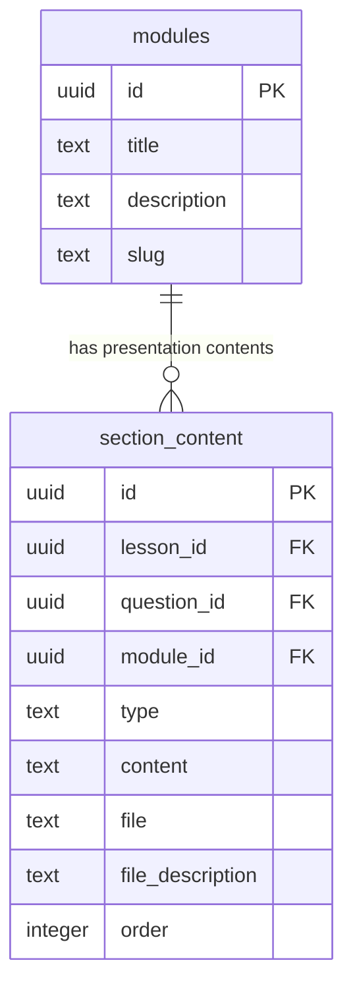
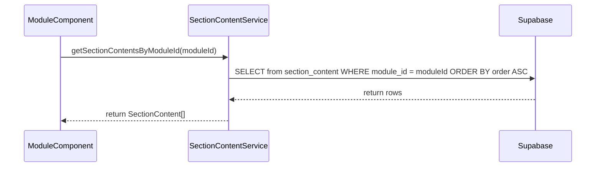
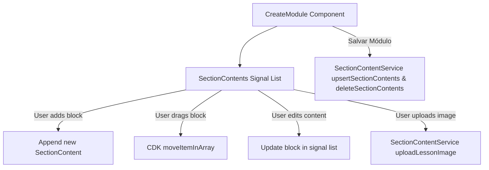
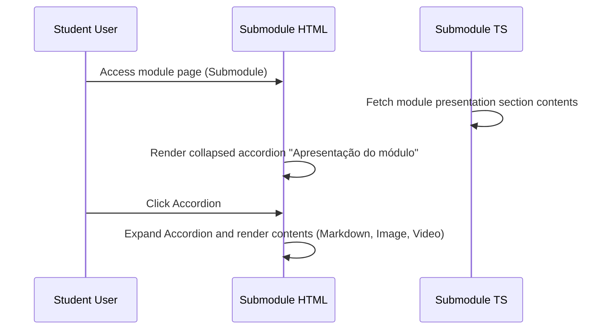
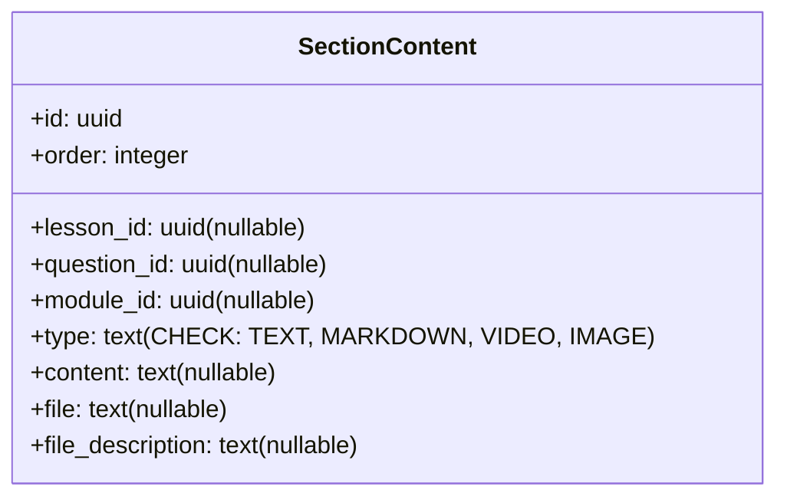

# Design Document

## Overview
This design document details the technical approach for implementing the "Module Presentation" ("Apresentação do módulo") feature on the Semeando Devs platform. The feature allows course authors to create, edit, remove, and reorder rich content sections (Markdown, Image, Video) that outline course module goals. It also enables students to view this presentation inside a modern, gamified, collapsible accordion on the module details page.

The design utilizes our existing signals-based state architecture in Angular 20+, adheres strictly to the "Neon Terminal" design philosophy (eschewing generic borders in favor of background tonal layering and glowing accents), and integrates seamlessly with our existing Supabase data layer.

### Change Type
`new-feature`

### Design Goals
1. Extend the `section_content` data model to allow linking text, image, and video blocks directly to a module.
2. Build an asymmetrical, premium authoring layout in the module edition screen to manage these blocks with real-time, side-by-side previews.
3. Deliver a high-performance, WCAG AA compliant collapsible presentation accordion for students that preserves page loading speeds by being lazy-rendered and closed by default.
4. Maintain RLS security bounds so that only authorized teachers or admins can update a module's presentation.

### References
- **REQ-1**: Database Schema Extension
- **REQ-2**: Module Presentation Authoring Interface
- **REQ-3**: Module Presentation Display for Students

---

## System Architecture

### DES-1: Database Schema Expansion
The Supabase relational schema will be extended to support direct links from the `section_content` table to the `modules` table. A nullable foreign key `module_id` will be added to `section_content`. The row-level security (RLS) policies on `section_content` will be revised so that admins and assigned teachers can execute read, write, and delete operations on module presentation section contents.

_Implements: REQ-1.1, REQ-1.2_

### DES-2: Section Content Service Extension
The `SectionContent` model and the `SectionContentService` will be updated to handle module-related operations. The service will fetch section contents by `module_id` sorted by `order`, and will handle upserting/deleting these records, reusing existing patterns for file uploads (such as images to the `image-lessons` bucket).

_Implements: REQ-1.1, REQ-1.2, REQ-2.6_

### DES-3: Module Presentation Authoring Panel
Inside the `CreateModule` component, when editing an existing module (`savedModuleId` is set), a new presentation editor panel will be displayed below the submodule list. It will use a split columns layout:
- **Left Column**: Interactive form using Angular CDK drag-and-drop. It supports appending new sections of type `MARKDOWN`, `IMAGE`, and `VIDEO`, modifying text contents or URLs, uploading image assets, deleting sections, and drag-and-drop reordering.
- **Right Column**: A real-time visual preview displaying the content blocks exactly as they will appear to the student, styled according to the design system.
Upon clicking the main "Salvar Módulo" button, all modified, new, and deleted section contents will be flushed to the database.

_Implements: REQ-2.1, REQ-2.2, REQ-2.3, REQ-2.4, REQ-2.5, REQ-2.6_

### DES-4: Collapsible Student Module Presentation Accordion
Inside the `Submodule` content page (which renders the submodule list for a module), a collapsible accordion titled "Apresentação do módulo" will be added between the module header description and the submodule grid. It will be closed by default. Toggling it open will dynamically load and render the module's section contents sorted by their order. The styling will adhere to the "Neon Terminal" design (glassmorphic backdrop blur, primary-to-tertiary glows, standard editorial typography).

_Implements: REQ-3.1, REQ-3.2, REQ-3.3_

---

## Code Anatomy

| File Path | Purpose | Implements |
|-----------|---------|------------|
| `supabase/migrations/[TIMESTAMP]_add_module_id_to_section_content.sql` | SQL migration adding `module_id` foreign key and updating RLS policies | DES-1 |
| `src/models/section-content/section-content.ts` | Extends `SectionContent` model with `moduleId` and `module` properties | DES-2 |
| `src/app/services/section-content.ts` | Adds service routines `getSectionContentsByModuleId` and module upsert capability | DES-2 |
| `src/app/pages/professor/professor-app/create-module/create-module.ts` | Component logic for presentation authoring, drag-and-drop, asset uploading, and database saving | DES-3 |
| `src/app/pages/professor/professor-app/create-module/create-module.html` | Split-view editor panel structure with drag-and-drop form and real-time preview columns | DES-3 |
| `src/app/pages/professor/professor-app/create-module/create-module.scss` | Rich aesthetic styling for the presentation authoring layout | DES-3 |
| `src/app/pages/app/submodule/submodule.ts` | Page logic to fetch presentation contents and maintain toggle states | DES-4 |
| `src/app/pages/app/submodule/submodule.html` | Collapsible Neon Terminal accordion structure rendering markdown, image, and video blocks | DES-4 |

---

## Data Models

### Updated Database Schema: `public.section_content`
The table schema will be updated to incorporate the `module_id` field.

---

## Impact Analysis

### Affected Areas
- **Supabase section_content Table**: Column `module_id` is appended. This is fully backward-compatible as the field is nullable.
- **SectionContent Model & Service**: Extended to handle modules.
- **Module Edition Screen**: UI modified to add the presentation authoring dashboard at the bottom.
- **Student Submodule Page**: Collapsible accordion inserted between description and submodule grid.

### Testing Requirements
- **Integration**: Verify database RLS policies. Non-assigned teachers must be blocked from writing module presentation records.
- **Unit**: Verify that `SectionContentService` correctly formats payloads and fetches sorted records.
- **E2E/Browser**: Confirm drag-and-drop ordering preserves layout changes and correctly saves to database.
- **A11y**: Ensure accordion controls are focusable and screen-reader accessible (using appropriate ARIA states).

### Rollback Plan
- Revert the SQL migration using standard Supabase DDL operations (dropping column `module_id` and restoring original RLS policy).
- Revert the frontend code changes.

---

## Traceability Matrix

| Design Element | Requirements |
|----------------|--------------|
| DES-1 | REQ-1.1, REQ-1.2 |
| DES-2 | REQ-1.1, REQ-1.2, REQ-2.6 |
| DES-3 | REQ-2.1, REQ-2.2, REQ-2.3, REQ-2.4, REQ-2.5, REQ-2.6 |
| DES-4 | REQ-3.1, REQ-3.2, REQ-3.3 |
