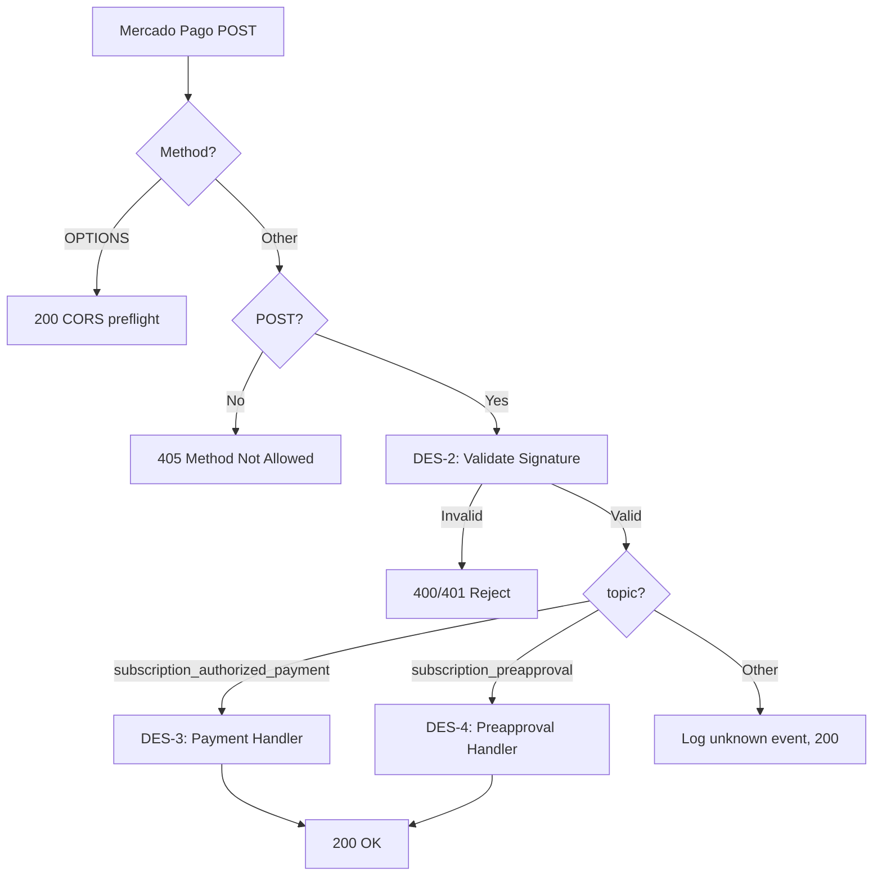
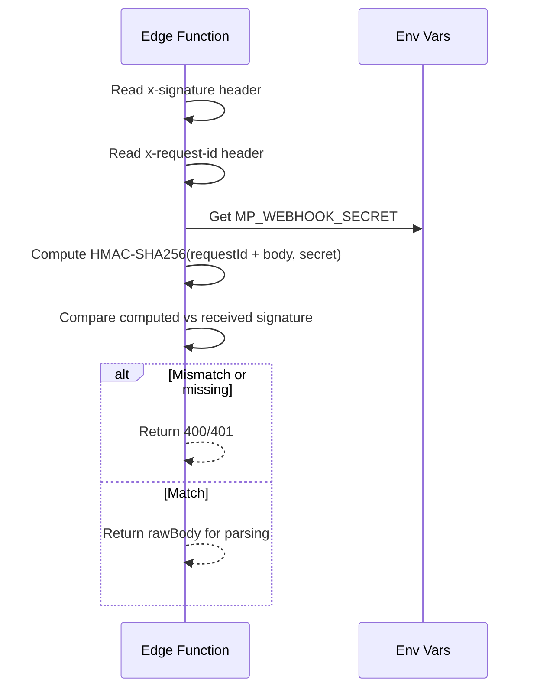
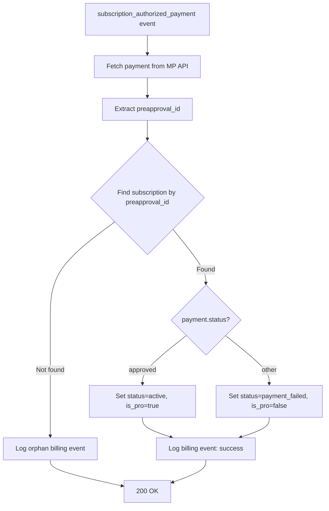
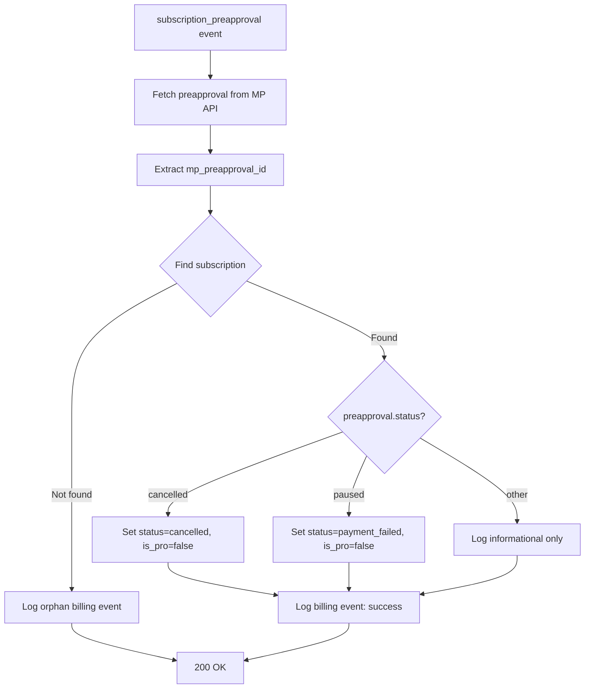
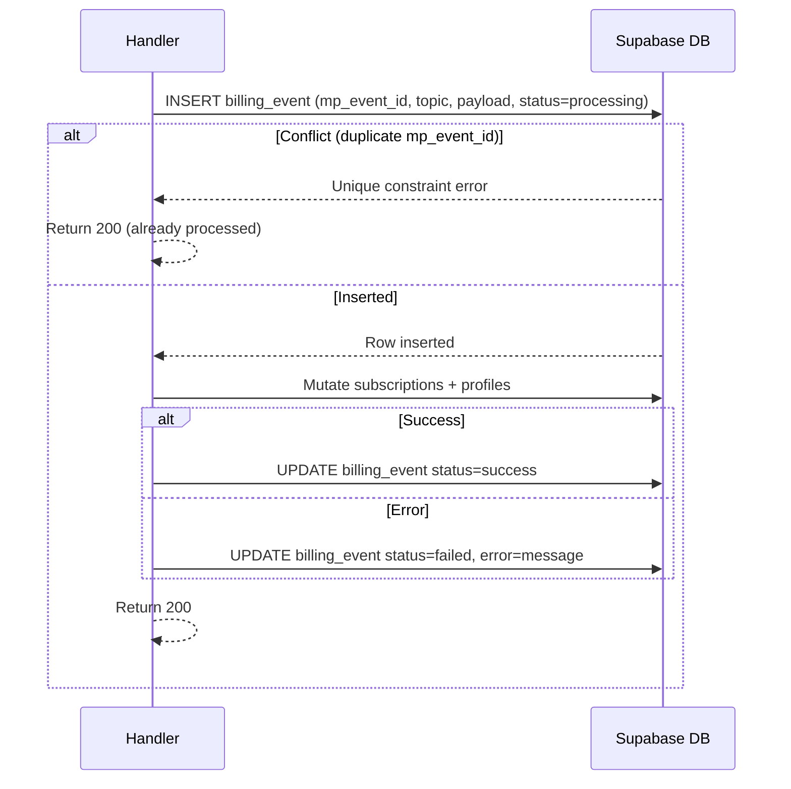
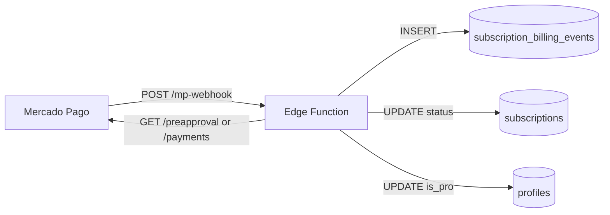
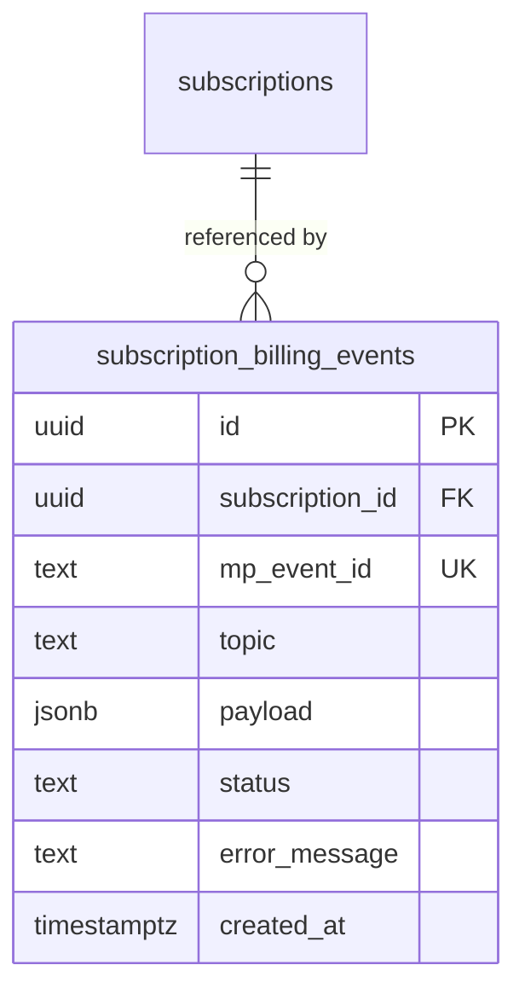

# Design Document

## Overview

The Mercado Pago Webhook Handler is a new Supabase Edge Function (`mp-webhook`) that acts as the single listener for all asynchronous billing events emitted by Mercado Pago. The function is stateless and event-driven: it receives an HTTP POST, validates the request's authenticity using HMAC-SHA256 signature verification, classifies the event topic, and dispatches the appropriate database mutations to keep the `subscriptions` and `profiles` tables in sync with the true billing state.

The design follows the existing Edge Function conventions in this project: a single `index.ts` entry point using the Deno `serve` runtime, a `serviceRoleClient` created with `SUPABASE_SERVICE_ROLE_KEY` for all database writes (bypassing RLS for stability), and a shared `corsHeaders` object for preflight handling. No new framework or runtime dependency is introduced.

Two supporting changes accompany the function: a database migration that creates the `subscription_billing_events` audit table and adds a `payment_failed` status value to the `subscriptions` table check constraint, and a registration step in the Mercado Pago developer dashboard where the function's deployed URL is configured as the notification webhook.

### Change Type

new-feature

### Design Goals

1. Receive and authenticate Mercado Pago webhook events with zero trust (signature-first).
2. Keep `subscriptions.status` and `profiles.is_pro` strictly consistent with MP billing state.
3. Guarantee idempotent processing so duplicate deliveries are silently absorbed.
4. Produce a queryable audit trail in `subscription_billing_events` for every event received.

### References

- **REQ-1**: Webhook Endpoint Creation
- **REQ-2**: Signature Validation
- **REQ-3**: Authorized Payment Processing
- **REQ-4**: Subscription Cancellation Processing
- **REQ-5**: Billing Event Audit Log
- **REQ-6**: Idempotent Event Processing

---

## System Architecture

### DES-1: Edge Function Entry Point and Request Routing

The `mp-webhook` Edge Function is the sole entry point for all Mercado Pago notifications. On receipt of a POST request it reads the raw body as text (required for signature validation before JSON parsing), then delegates to the signature validator (DES-2). If validation passes, the event payload is parsed and routed to the correct event handler (DES-3 or DES-4) based on the `topic` field. The function always responds with HTTP 200 for any request that passes signature validation, regardless of the downstream processing outcome, to prevent Mercado Pago from queuing retries for already-received events.

_Implements: REQ-1.1, REQ-1.2, REQ-1.3_

---

### DES-2: HMAC-SHA256 Signature Validator

Mercado Pago signs every webhook request with an HMAC-SHA256 digest computed over a canonical string composed of the `x-request-id` header value and the raw request body, using the webhook secret as the key. The validator reads both headers (`x-signature` and `x-request-id`), rejects immediately if either is absent, then computes the expected digest using the `MP_WEBHOOK_SECRET` environment variable and compares it with the value in `x-signature`. The comparison is done with a constant-time approach to prevent timing attacks. The raw body text is returned to the caller for JSON parsing after successful validation.

_Implements: REQ-2.1, REQ-2.2, REQ-2.3_

---

### DES-3: Authorized Payment Event Handler

When the topic is `subscription_authorized_payment`, the handler fetches the full payment object from the Mercado Pago REST API using the event's `data.id` field and the `ML_ACCESS_TOKEN` env var. It extracts the `preapproval_id` from the payment response, looks up the matching row in `subscriptions`, and applies the following state machine:

- `status === 'approved'` → set `subscriptions.status = 'active'`, set `profiles.is_pro = true`
- any other status (e.g. `rejected`, `cancelled`) → set `subscriptions.status = 'payment_failed'`, set `profiles.is_pro = false`

If no subscription row is found for the `preapproval_id`, the event is still logged as a billing event with status `orphan` and processing continues to return 200.

_Implements: REQ-3.1, REQ-3.2, REQ-3.3, REQ-3.4, REQ-3.5_

---

### DES-4: Preapproval Status Change Handler

When the topic is `subscription_preapproval`, the handler fetches the preapproval object from the Mercado Pago REST API using the event's `data.id`. It looks up the matching `subscriptions` row via `mp_preapproval_id` and applies the following state machine:

- `preapproval.status === 'cancelled'` → set `subscriptions.status = 'cancelled'`, set `profiles.is_pro = false`
- `preapproval.status === 'paused'` → set `subscriptions.status = 'payment_failed'`, set `profiles.is_pro = false`
- any other status change (e.g. `authorized`) → log as informational billing event only, no profile mutation

_Implements: REQ-4.1, REQ-4.2, REQ-4.3_

---

### DES-5: Billing Event Audit and Idempotency Guard

Before any database mutation occurs, the handler attempts to insert a row into `subscription_billing_events` with the `mp_event_id` (from the webhook's `data.id` field) and an initial status of `processing`. Because `mp_event_id` has a unique constraint, a duplicate delivery will produce an insert conflict which is caught and treated as an already-processed event — the function returns 200 immediately without further work. After successful processing, the billing event row is updated to `success`. On processing failure, it is updated to `failed` with an error message.

_Implements: REQ-5.1, REQ-5.2, REQ-6.1, REQ-6.2_

---

## Data Flow

---

## Data Models

### New Table: `subscription_billing_events`

**`status` values:** `processing`, `success`, `failed`, `orphan`

### Modified: `subscriptions.status` check constraint

The existing check constraint must be updated to allow `payment_failed` in addition to the existing `pending`, `active`, `cancelled` values.

---

## Code Anatomy

| File Path | Purpose | Implements |
|-----------|---------|------------|
| `supabase/functions/mp-webhook/index.ts` | Edge Function entry point: request routing, CORS, signature validation orchestration | DES-1, DES-2 |
| `supabase/functions/mp-webhook/handlers.ts` | `handleAuthorizedPayment` and `handlePreapproval` event handler functions | DES-3, DES-4 |
| `supabase/functions/mp-webhook/billing-events.ts` | `insertBillingEvent`, `updateBillingEvent`, and idempotency guard utilities | DES-5 |
| `supabase/migrations/<timestamp>_add_billing_events_table.sql` | Creates `subscription_billing_events` table; updates `subscriptions.status` check constraint | DES-5, Data Models |

---

## Error Handling

| Error Condition | Response | Recovery |
|-----------------|----------|----------|
| Missing `x-signature` or `x-request-id` header | 400 Bad Request | MP will not retry (request is malformed) |
| Signature mismatch | 401 Unauthorized | MP will not retry (treated as rejected) |
| Invalid HTTP method | 405 Method Not Allowed | No retry needed |
| MP API call to fetch payment/preapproval fails | 200 OK; billing event marked `failed` | MP will retry the webhook; idempotency guard prevents double-processing |
| Subscription not found for `preapproval_id` | 200 OK; billing event marked `orphan` | No retry; event is preserved for manual investigation |
| Supabase write error on `subscriptions` or `profiles` | 200 OK; billing event marked `failed` | MP will retry; idempotency guard (on `mp_event_id`) must be cleared manually or via a separate recovery job |

---

## Impact Analysis

| Affected Area | Impact Level | Notes |
|---------------|--------------|-------|
| `subscriptions` table | Medium | Check constraint updated to allow `payment_failed` status |
| `profiles` table | Low | Read/write pattern unchanged; only `is_pro` column is touched |
| `create-subscription` Edge Function | None | No changes required; `mp_preapproval_id` column already populated |
| Mercado Pago developer dashboard | Low | Requires manual configuration of the webhook URL post-deployment |

### Dependencies

| Dependency | Type | Impact |
|------------|------|--------|
| `ML_ACCESS_TOKEN` env var | Runtime | Required to call MP REST API to fetch payment details |
| `MP_WEBHOOK_SECRET` env var | Runtime | Required for HMAC-SHA256 signature validation; must be copied from MP dashboard |
| Supabase `SUPABASE_SERVICE_ROLE_KEY` | Runtime | Already present in all Edge Functions; used for bypassing RLS |

### Risk Assessment

| Risk | Likelihood | Impact | Mitigation |
|------|------------|--------|------------|
| `MP_WEBHOOK_SECRET` misconfiguration | Medium | High | All events will be rejected with 401; surfaced immediately in MP dashboard retry logs |
| Supabase write failure leaves billing event in `processing` state | Low | Medium | MP retries will be absorbed by idempotency guard; requires manual recovery of stuck `processing` rows |
| `subscriptions` migration breaks existing status checks | Low | High | Migration uses `DROP CONSTRAINT + ADD CONSTRAINT` in a single transaction; test locally before deploying |

### Rollback Plan

| Scenario | Rollback Steps | Time to Recovery |
|----------|----------------|------------------|
| Edge Function deployment failure | Delete `mp-webhook` function via Supabase dashboard; remove webhook URL from MP panel | < 10 minutes |
| Migration causes instability | `ALTER TABLE subscriptions DROP CONSTRAINT` and re-add without `payment_failed`; redeploy prior function version | < 15 minutes |

### Testing Requirements

| Test Type | Coverage Goal | Notes |
|-----------|---------------|-------|
| Manual (local functions serve) | Signature validation, approved payment, cancellation, duplicate event | Use `curl` with a test webhook payload and a locally generated HMAC |
| Integration (Supabase sandbox) | End-to-end from MP sandbox event to DB state change | Trigger events from MP sandbox dashboard after configuring ngrok URL |

---

## Traceability Matrix

| Design Element | Requirements |
|----------------|--------------|
| DES-1 | REQ-1.1, REQ-1.2, REQ-1.3 |
| DES-2 | REQ-2.1, REQ-2.2, REQ-2.3 |
| DES-3 | REQ-3.1, REQ-3.2, REQ-3.3, REQ-3.4, REQ-3.5 |
| DES-4 | REQ-4.1, REQ-4.2, REQ-4.3 |
| DES-5 | REQ-5.1, REQ-5.2, REQ-5.3, REQ-6.1, REQ-6.2 |
