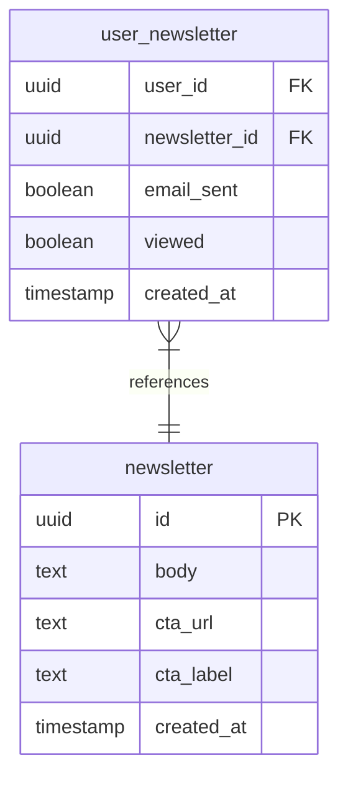
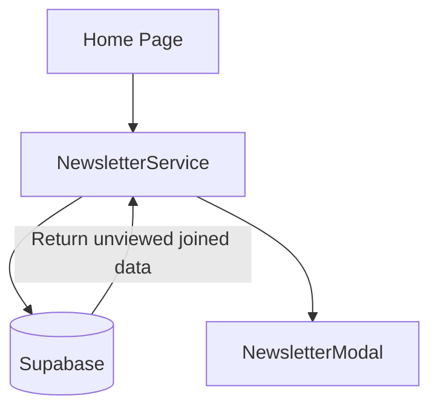
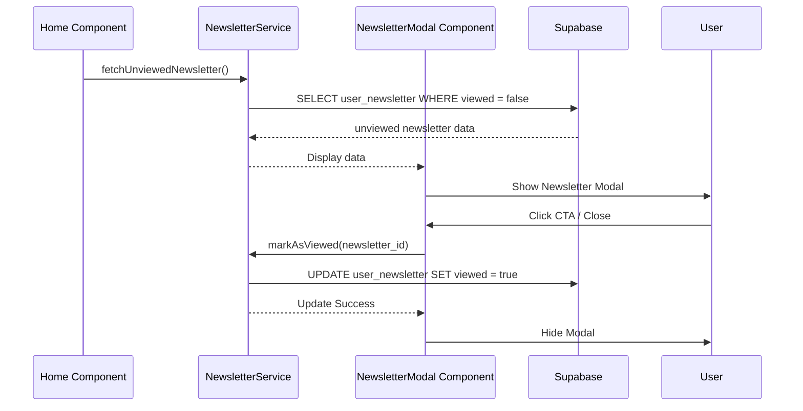
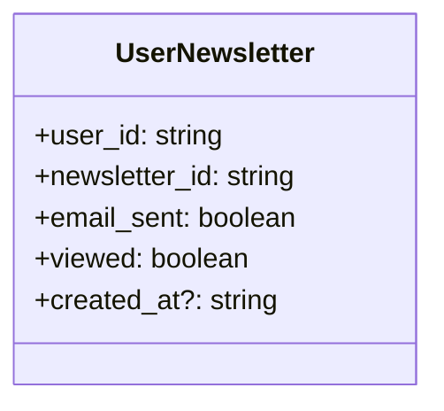

# Design Document

## Overview

The newsletter home modal feature will display unviewed newsletters to users when they access the platform's home screen. This provides a direct channel for announcements without overwhelming the user, as each newsletter is only shown once and requires explicit acknowledgment.

### Change Type

new-feature

### Design Goals

1. Ensure users see important platform updates exactly once.
2. Provide a flexible UI for announcements that aligns with the established design system.
3. Separate the display logic into a reusable modal component and encapsulate data access in a dedicated service.

### References

- **REQ-1**: Display Unviewed Newsletter
- **REQ-2**: Newsletter Modal Interface
- **REQ-3**: Acknowledge Newsletter

## System Architecture

### DES-1: Newsletter Database Expansion

The existing `user_newsletter` relationship table will be expanded to track user acknowledgment. A new boolean column `viewed` will be added to the schema.

_Implements: REQ-1.1, REQ-3.1, REQ-3.2, REQ-3.3_

### DES-2: Newsletter Service 

A new Angular service (`NewsletterService`) will encapsulate Supabase data fetching and state mutation. It will query the `user_newsletter` table, joining with the `newsletter` table, filtering for `viewed = false` for the authenticated user.

_Implements: REQ-1.1_

### DES-3: Newsletter Modal Component

A new standalone Angular component `NewsletterModal` will handle the UI display. It will check the service for any unviewed newsletter upon initialization. If one exists, it will render the modal with the newsletter body and CTA options. Clicking the close icon or CTA will trigger an update via the service and dismiss the modal.

_Implements: REQ-1.2, REQ-1.3, REQ-2.1, REQ-2.2, REQ-2.3, REQ-3.4_

## Code Anatomy

| File Path | Purpose | Implements |
|-----------|---------|------------|
| `supabase/migrations/<timestamp>_add_viewed_to_user_newsletter.sql` | Database schema update | DES-1 |
| `src/models/user-newsletter/user-newsletter.ts` | TS Interface update | DES-1 |
| `src/app/services/newsletter.ts` | Data fetching and mutation | DES-2 |
| `src/app/components/newsletter-modal/` | UI Component | DES-3 |
| `src/app/pages/app/app.component.ts` (or similar home component) | Integration point | DES-3 |

## Data Models

## Traceability Matrix

| Design Element | Requirements |
|----------------|--------------|
| DES-1 | REQ-1.1, REQ-3.1, REQ-3.2, REQ-3.3 |
| DES-2 | REQ-1.1 |
| DES-3 | REQ-1.2, REQ-1.3, REQ-2.1, REQ-2.2, REQ-2.3, REQ-3.4 |
