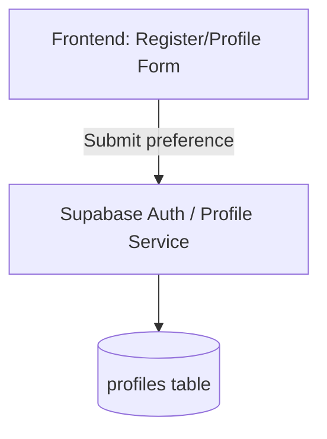
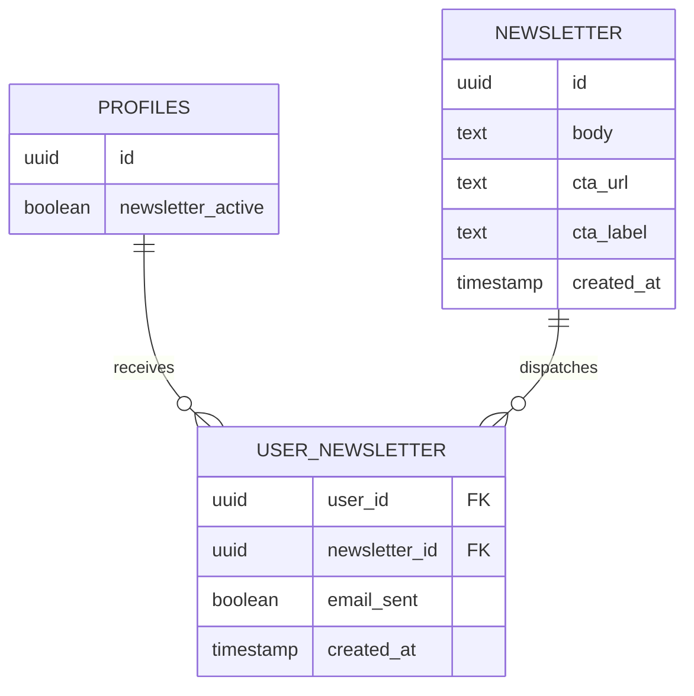
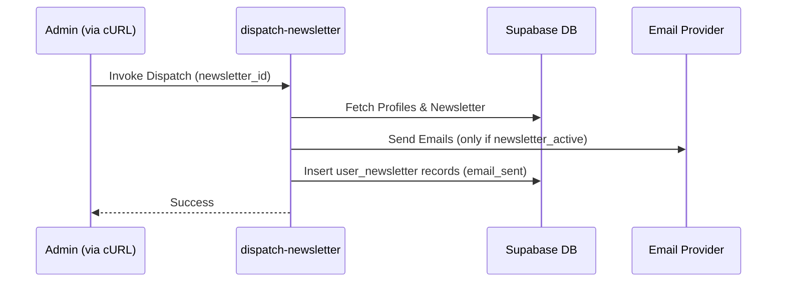
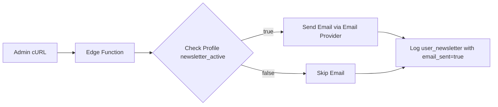

# Design Document

## Overview
This document outlines the technical design for the Newsletter Subscription feature. It introduces the ability for users to opt-in to newsletters during registration and from their profile settings. It also defines the database structures and operational logic required to manage newsletter content and dispatch emails.

### Change Type
new-feature

### Design Goals
1. Provide a seamless opt-in experience in the frontend registration and profile forms.
2. Establish a scalable database schema for newsletter management and tracking user dispatches.
3. Implement an efficient mechanism to dispatch newsletters using Supabase Edge Functions.

### References
- **REQ-1**: Newsletter Opt-In on Registration
- **REQ-2**: Newsletter Opt-In on Profile Settings
- **REQ-3**: Newsletter Content Management
- **REQ-4**: Newsletter Dispatch Processing

## System Architecture

### DES-1: User Profile Opt-in
The `profiles` table and corresponding frontend model will be extended to include a `newsletter_active` boolean field. The `Register` and `Profile` frontend components will be updated to handle this preference.

_Implements: REQ-1.1, REQ-1.2, REQ-2.1, REQ-2.2_

### DES-2: Newsletter Database Schema
Two new tables will be created: `newsletter` to store the HTML body and CTA details, and `user_newsletter` to track dispatch history and relationships to profiles.

_Implements: REQ-3.1, REQ-4.2, REQ-4.3_

### DES-3: Newsletter Dispatch Mechanism
A Supabase Edge Function (`dispatch-newsletter`) will be introduced to handle the mass mailing. It will retrieve the list of users based on `newsletter_active` status, invoke the email service for opted-in users, and record the event in `user_newsletter`.

_Implements: REQ-4.1, REQ-4.2, REQ-4.3_

## Data Flow

## Code Anatomy

| File Path | Purpose | Implements |
|-----------|---------|------------|
| src/app/pages/register/register.* | Update UI and submission logic for opt-in | DES-1 |
| src/app/pages/app/profile/profile.* | Update UI and submission logic for opt-in | DES-1 |
| src/models/profile/profile.ts | Add newsletter_active property | DES-1 |
| supabase/migrations/timestamp_newsletter.sql | Create newsletter schema & update profiles | DES-1, DES-2 |
| src/models/newsletter/newsletter.ts | Data model for newsletter | DES-2 |
| src/models/user-newsletter/user-newsletter.ts | Data model for tracking user emails | DES-2 |
| supabase/functions/dispatch-newsletter/index.ts | Edge function to send emails and track | DES-3 |
| supabase/functions/dispatch-newsletter/README.md | Documentation with example cURL command | DES-3 |

## Traceability Matrix

| Design Element | Requirements |
|----------------|--------------|
| DES-1 | REQ-1.1, REQ-1.2, REQ-2.1, REQ-2.2 |
| DES-2 | REQ-3.1, REQ-4.2, REQ-4.3 |
| DES-3 | REQ-4.1, REQ-4.2, REQ-4.3 |
