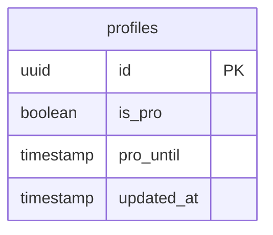
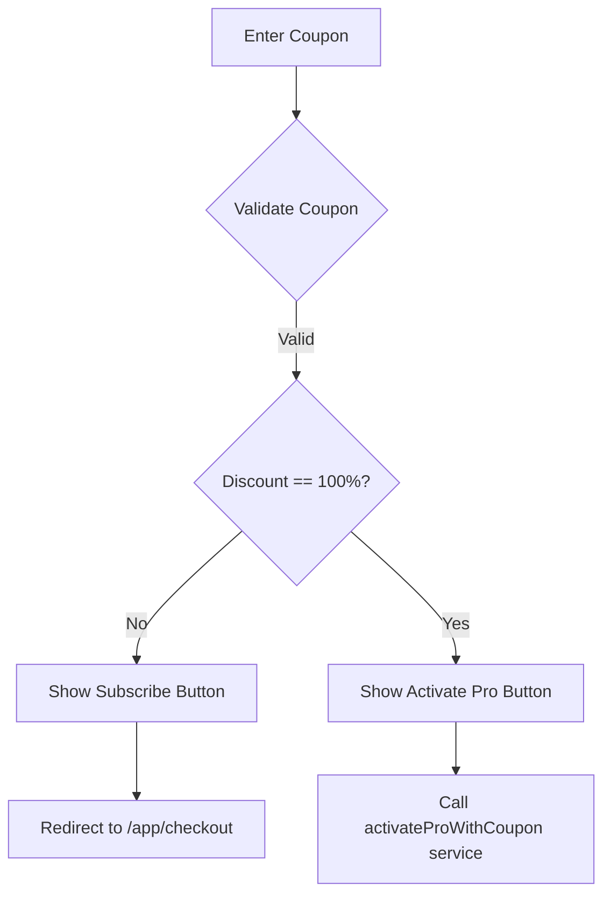
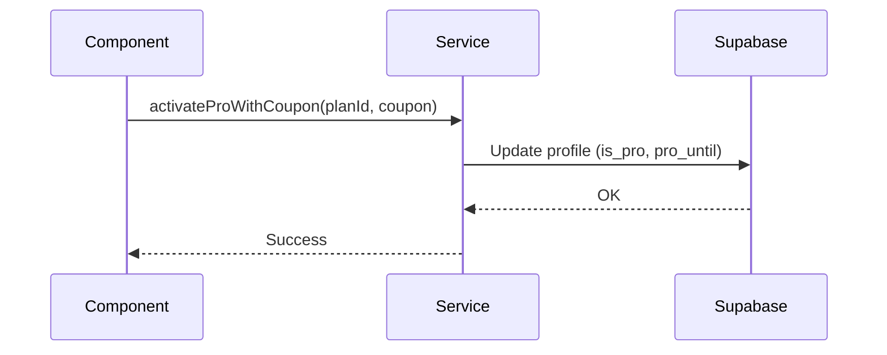
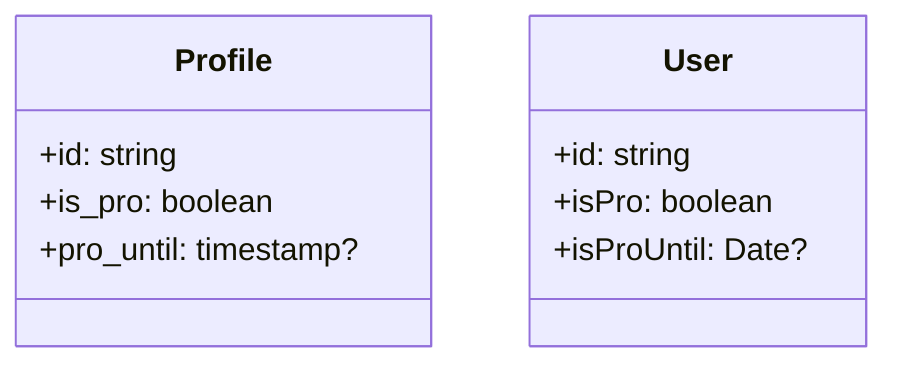

# Design Document

## Overview
This design outlines the technical changes required to support a 100% discount coupon flow. The system will bypass external payment gateways for zero-cost subscriptions and directly activate "Pro" status. The architecture involves adding an expiration timestamp to the user profile, updating the frontend logic to recognize 100% coupons, and implementing a background cleanup process via a database cron job.

### Change Type
new-feature

### Design Goals
1. Provide a frictionless experience for users with full-discount coupons.
2. Ensure Pro status is accurately tracked and automatically revoked upon expiration.
3. Maintain data consistency between the user profile and the actual subscription status.

### References
- **REQ-1**: Identification of 100% Discount Coupons
- **REQ-2**: Direct Pro Activation
- **REQ-3**: Pro Status Persistence and Retrieval
- **REQ-4**: Automated Pro Status Expiration

## System Architecture

### DES-1: Pro Status Database Extension
The `profiles` table in Supabase will be extended to include a `pro_until` timestamp. This field will specifically track the end date of Pro access granted via coupons or manual overrides, independent of standard recurring subscriptions.



_Implements: REQ-3.1_

### DES-2: Conditional Frontend Upgrade Flow
The `Upgrade` component logic will be enhanced to check the `discountValue` and `discountType` of the applied coupon. If the discount is 100% via percentage, the UI will transition from a "Subscribe" flow (redirecting to checkout) to a "Direct Activation" flow.



_Implements: REQ-1.1, REQ-1.2_

### DES-3: Direct Activation Service Method
A new method `activateProWithCoupon` will be added to the `SubscriptionService`. This method will handle the server-side update of the `profiles` table, setting `is_pro` to `true` and calculating the `pro_until` date based on the current time and the coupon's `duration_months`.



_Implements: REQ-2.1, REQ-2.2, REQ-3.2_

### DES-4: Automated Expiration Mechanism
A Supabase SQL function will be created to identify and update profiles where `pro_until` has passed. This function will be scheduled to run daily using the `pg_cron` extension.

```mermaid
flowchart LR
    A[Daily Cron] --> B[Execute revoke_expired_pro()]
    B --> C{Expired Profiles?}
    C -->|Yes| D[SET is_pro=false, pro_until=NULL]
    C -->|No| E[Exit]
```

_Implements: REQ-4.1, REQ-4.2_

## Code Anatomy

| File Path | Purpose | Implements |
|-----------|---------|------------|
| src/models/profile/profile.ts | Update interface to include pro_until | DES-1 |
| src/models/user/user.ts | Update interface to include isProUntil | DES-1 |
| src/app/pages/app/upgrade/upgrade.ts | Logic to detect 100% discount and switch buttons | DES-2 |
| src/app/pages/app/upgrade/upgrade.html | Toggle between Subscribe and Activate buttons | DES-2 |
| src/app/services/subscription.ts | Implement activateProWithCoupon method | DES-3 |
| supabase/migrations/ | SQL migration for pro_until column and cron job | DES-1, DES-4 |

## Data Models



## Impact Analysis

| Affected Area | Impact Level | Notes |
|---------------|--------------|-------|
| profiles table | Medium | Requires new column and data migration/cleanup |
| upgrade page | Medium | Changes the user flow for specific coupon types |
| user service | Low | Requires updating profile retrieval to include new field |

### Testing Requirements

| Test Type | Coverage Goal | Notes |
|-----------|---------------|-------|
| Unit | Coupon detection logic | Verify 100% vs partial discount logic |
| Integration | Pro activation service | Ensure database updates correctly with pro_until |
| E2E | 100% Discount Flow | Verify user can activate pro and see results without payment |

## Traceability Matrix

| Design Element | Requirements |
|----------------|--------------|
| DES-1 | REQ-3.1 |
| DES-2 | REQ-1.1, REQ-1.2 |
| DES-3 | REQ-2.1, REQ-2.2, REQ-3.2 |
| DES-4 | REQ-4.1, REQ-4.2 |
