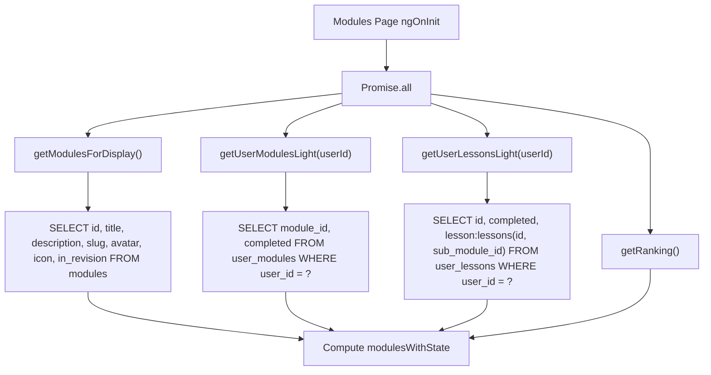
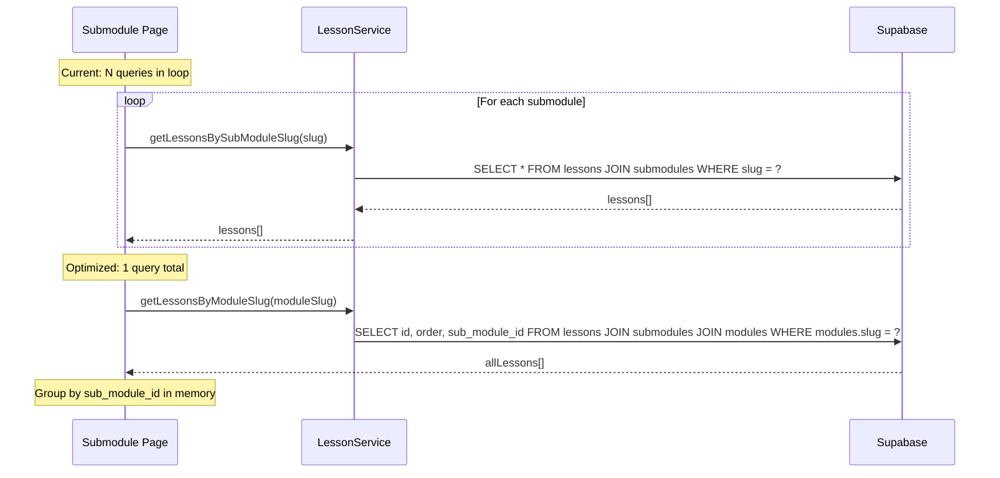
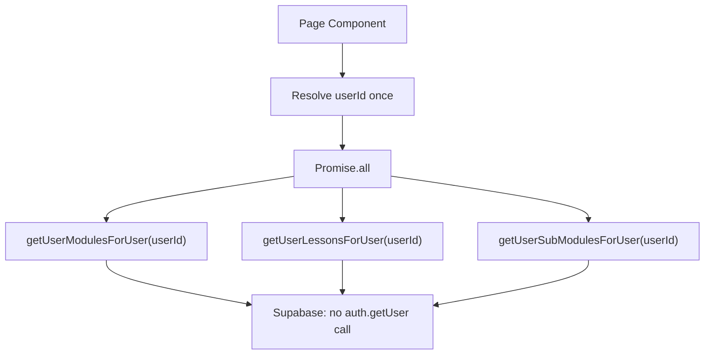
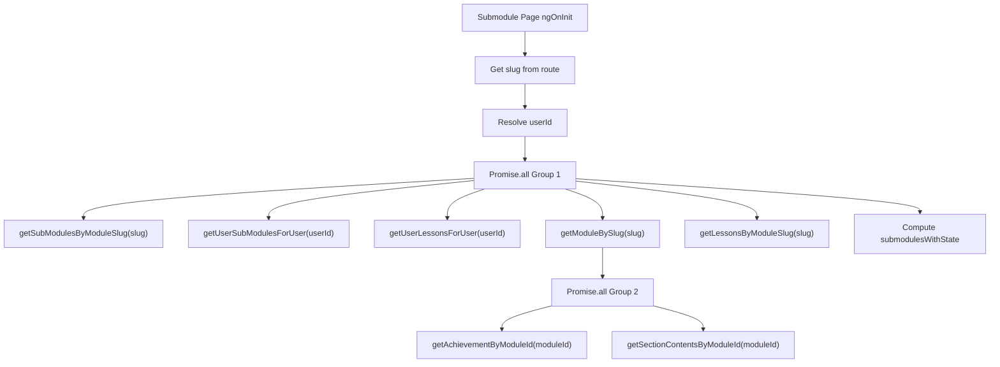

# Design Document

## Overview

This design optimizes the Supabase query patterns on the Modules page (`/app`) and Submodule page (`/app/s/:slug`) to reduce production load times. The approach focuses on three axes: **eliminating unnecessary data fetching** (removing the `getAllLessons()` deep-join and the N+1 per-submodule loop), **reducing auth round-trips** (passing the user ID from a single resolved auth call instead of each service independently calling `auth.getUser()`), and **parallelizing independent requests** on the Submodule page.

All changes are scoped to the two page components and their direct service method signatures. Existing service methods that are used by other pages remain untouched—new overloaded or alternative methods are added instead. No database schema, RLS, or stored procedure changes are required.

### Change Type

performance

### Design Goals

1. Remove the `getAllLessons()` call from the Modules page and replace progress computation with data already available from `user_lessons` and `user_modules`.
2. Replace the N+1 `getLessonsBySubModuleSlug()` loop on the Submodule page with a single batch query fetching all lessons for a module's submodules.
3. Reduce redundant `supabase.auth.getUser()` calls to at most one per page load by resolving the user ID once and passing it to service methods.
4. Select only the columns needed for display on the Modules page.
5. Parallelize independent fetches on the Submodule page using `Promise.all`.

### References

- **REQ-1**: Eliminate the all-lessons deep-join query on the Modules page
- **REQ-2**: Eliminate the N+1 lessons query on the Submodule page
- **REQ-3**: Reduce redundant authentication round-trips
- **REQ-4**: Reduce over-fetched columns on the Modules page
- **REQ-5**: Parallelize sequential requests on the Submodule page

## System Architecture

### DES-1: Simplified Modules page progress computation

Currently the Modules page calls `getAllLessons()` which does `SELECT *, subModule:submodules(*, module:modules(*))` from the entire `lessons` table—just to cross-reference with `user_lessons` and compute per-module progress percentages. This deep-join is the heaviest query on the page.

The redesigned approach removes `getAllLessons()` entirely. Instead, progress is computed from data already fetched:
- **Completed modules** (`userModule.completed === true`): progress is 100%.
- **In-progress modules**: the `user_lessons` query already joins `lesson:lessons(*)`, which includes `sub_module_id`. A new lightweight query `getLessonCountsBySubModuleIds()` fetches only the total lesson counts per submodule (using `SELECT sub_module_id, count(*)` with a `GROUP BY`), allowing progress to be computed as `completedLessonsInModule / totalLessonsInModule`.

Alternatively, since `user_lessons` already includes the joined lesson data with `sub_module_id`, and we can fetch `submodules` filtered by module, we can compute progress without any new query by counting total lessons via an existing count-based method or a new batch count method.

_Implements: REQ-1.1, REQ-1.2, REQ-1.3, REQ-4.1, REQ-4.2_

### DES-2: Batch lessons fetch on the Submodule page

The current Submodule page iterates over each submodule and calls `getLessonsBySubModuleSlug(sm.slug)` inside a `for` loop, creating N+1 queries. The fix is a new service method `getLessonsByModuleSlug(moduleSlug)` that fetches all lessons for the given module in a single query using the join path `lessons → submodules → modules` filtered by the module slug.

The component then groups the results by `sub_module_id` in memory and iterates over submodules to compute state without any additional queries.

_Implements: REQ-2.1, REQ-2.2, REQ-2.3_

### DES-3: Centralized auth resolution

Currently, `UserModuleService.getUserModules()`, `UserLessonService.getUserLessons()`, and `UserSubModuleService.getUserSubModules()` each independently call `this.supabase.auth.getUser()`. When called via `Promise.all`, this creates 2–3 concurrent auth round-trips to Supabase.

The design introduces lightweight overloaded methods that accept a pre-resolved `userId` parameter. The page component resolves the user ID once (from `UserService.currentUser()` which is already loaded by the auth guard) and passes it to all service calls.

The existing zero-argument methods remain unchanged for backward compatibility with other pages.

_Implements: REQ-3.1, REQ-3.2_

### DES-4: Parallelized Submodule page data loading

The current Submodule page loads data in a serial chain: submodules → userSubmodules → userLessons → (loop: lessons per submodule) → module → achievement → sectionContents. Many of these have no data dependency and can run concurrently.

The redesigned flow splits into two parallel groups:
- **Group 1** (no dependencies): `getSubModulesByModuleSlug`, `getUserSubModulesForUser`, `getUserLessonsForUser`, `getModuleBySlug`
- **Group 2** (depends on module ID from Group 1): `getAchievementByModuleId`, `getSectionContentsByModuleId`
- **Batch lessons** (`getLessonsByModuleSlug`) joins Group 1 since it only depends on the slug (already available from the route).

_Implements: REQ-5.1, REQ-5.2_

## Code Anatomy

| File Path | Purpose | Implements |
|-----------|---------|------------|
| `src/app/services/module.ts` | Add `getModulesForDisplay()` method that selects only display columns | DES-1 |
| `src/app/services/user-module.ts` | Add `getUserModulesForUser(userId)` method that skips `auth.getUser()` and selects only `module_id, completed` | DES-1, DES-3 |
| `src/app/services/user-lesson.ts` | Add `getUserLessonsForUser(userId)` method that skips `auth.getUser()` and selects only `id, completed, lesson:lessons(id, sub_module_id)` | DES-1, DES-3 |
| `src/app/services/user-sub-module.ts` | Add `getUserSubModulesForUser(userId)` method that skips `auth.getUser()` | DES-3 |
| `src/app/services/lesson.ts` | Add `getLessonsByModuleSlug(slug)` method that batch-fetches all lessons for a module | DES-2 |
| `src/app/pages/app/modules/modules.ts` | Rewrite `loadData()` to use optimized methods, remove `getAllLessons()` call, rewrite `modulesWithState` computed | DES-1, DES-3, DES-4 |
| `src/app/pages/app/submodule/submodule.ts` | Rewrite `loadData()` to use batch lessons fetch, parallelized `Promise.all`, and pre-resolved userId | DES-2, DES-3, DES-4 |

## Impact Analysis

| Affected Area | Impact Level | Notes |
|---------------|--------------|-------|
| `src/app/services/module.ts` | Low | New method added; existing methods unchanged |
| `src/app/services/user-module.ts` | Low | New method added; existing `getUserModules()` unchanged |
| `src/app/services/user-lesson.ts` | Low | New method added; existing `getUserLessons()` unchanged |
| `src/app/services/user-sub-module.ts` | Low | New method added; existing `getUserSubModules()` unchanged |
| `src/app/services/lesson.ts` | Low | New method added; existing methods unchanged |
| `src/app/pages/app/modules/modules.ts` | Medium | `loadData()` and `modulesWithState` computed rewritten |
| `src/app/pages/app/submodule/submodule.ts` | Medium | `loadData()` rewritten; state computation logic unchanged |
| Other pages using `getUserLessons()`, `getUserModules()` | None | Original methods preserved |

### Testing Requirements

| Test Type | Coverage Goal | Notes |
|-----------|---------------|-------|
| Manual | Modules page | Verify progress bars and module states match current behavior |
| Manual | Submodule page | Verify submodule states, progress, and target lesson links match current behavior |
| Unit | Service methods | Verify new methods return correct data shapes |
| Existing specs | `submodule.spec.ts` | Verify existing tests still pass |

## Traceability Matrix

| Design Element | Requirements |
|----------------|--------------|
| DES-1 | REQ-1.1, REQ-1.2, REQ-1.3, REQ-4.1, REQ-4.2 |
| DES-2 | REQ-2.1, REQ-2.2, REQ-2.3 |
| DES-3 | REQ-3.1, REQ-3.2 |
| DES-4 | REQ-5.1, REQ-5.2 |
