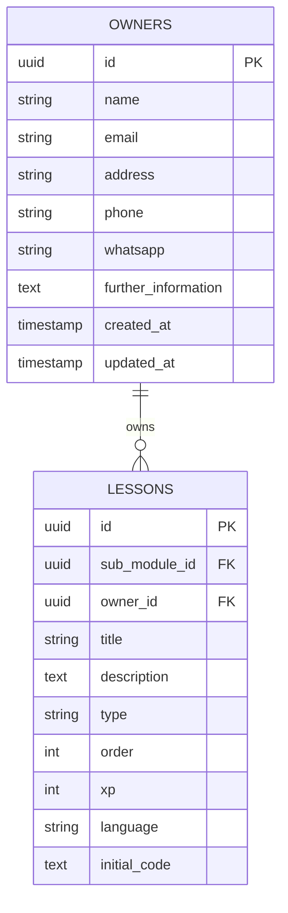

# Design: Owner Entity Management

Establish the technical architecture and data structures required to support content owners and their association with lessons.

## Architecture Diagram

## Design Elements

### DES-1: Database Schema Implementation
- **Description**: Creation of the `owners` table and modification of the `lessons` table.
- **Details**:
    - `owners` table fields: `id` (primary key, uuid, default: gen_random_uuid()), `name`, `email`, `address`, `phone`, `whatsapp`, `further_information`, `created_at` (default: now()), `updated_at` (default: now()).
    - `lessons` table modification: Add `owner_id` column (uuid).
    - Constraint: `ALTER TABLE lessons ADD CONSTRAINT lessons_owner_id_fkey FOREIGN KEY (owner_id) REFERENCES owners(id);`.
- **Traceability**: REQ-1, REQ-2

### DES-2: Row Level Security (RLS)
- **Description**: Secure the `owners` table.
- **Details**:
    - Enable RLS on `owners`.
    - Create a policy allowing authenticated users to read owner information (since lessons are public or semi-public, owner attribution should be readable).
    - Restrict write operations (INSERT, UPDATE, DELETE) to service role or specific admin roles (to be determined by platform standards, default to restrictive).
- **Traceability**: REQ-1.2

### DES-3: Migration and Data Seeding
- **Description**: SQL migration file for deployment.
- **Details**:
    - Script order:
        1. Create `owners` table.
        2. Insert default owner "Joisson José de Mello".
        3. Add `owner_id` column to `lessons` (nullable initially).
        4. Update all existing `lessons` to set `owner_id` to the new owner's ID.
        5. Set `owner_id` as NOT NULL and add foreign key constraint.
- **Traceability**: REQ-3, REQ-4

### DES-4: TypeScript Model Definitions
- **Description**: Update application models to match the database.
- **Details**:
    - Create `src/models/owner/owner.ts` with `Owner` interface.
    - Update `src/models/lesson/lesson.ts` to include `ownerId`.
- **Traceability**: REQ-5

### DES-5: Update Trigger for `updated_at`
- **Description**: Automatic timestamp management for the `owners` table.
- **Details**:
    - Implement a PostgreSQL trigger to update the `updated_at` column on record modification.
- **Traceability**: REQ-1.1
