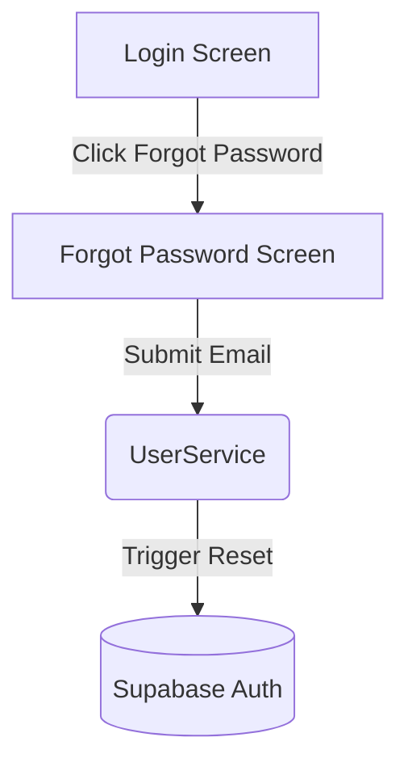
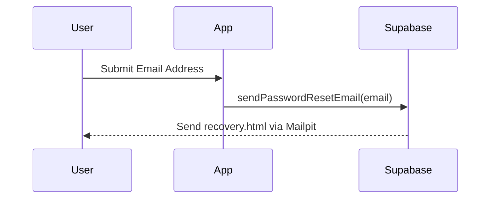
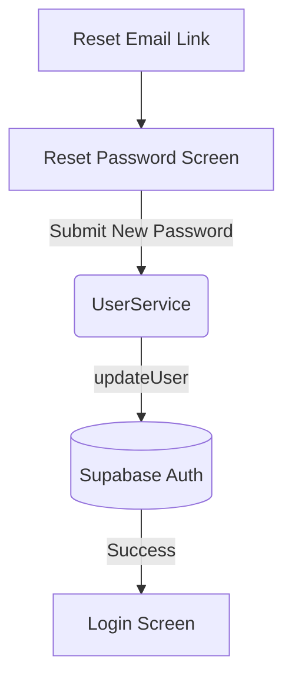

# Design Document

## Overview

The password recovery feature enables unauthenticated users to regain access to their accounts. This involves extending the Login UI to redirect to a new Forgot Password screen, configuring Supabase to send a standardized reset email via Mailpit, and providing a Reset Password screen to validate and update the user's credentials securely.

### Change Type

enhancement

### Design Goals

1. Seamless user experience for requesting a password reset email.
2. Ensure the recovery process uses the platform's standardized styling.
3. Securely handle password resets using Supabase Auth.

### References

- **REQ-1**: Initiate Password Recovery
- **REQ-2**: Request Password Reset
- **REQ-3**: Deliver Standardized Reset Email
- **REQ-4**: Reset Password

## System Architecture

### DES-1: Password Recovery Navigation Flow

Adds a "Esqueci minha senha" link to the `Login` component navigating to the `ForgotPassword` component.

_Implements: REQ-1.1, REQ-1.2, REQ-2.1_

### DES-2: Password Reset Email Dispatch

Extends the `UserService` and `supabase/config.toml` to support the delivery of a password reset link to the user's email formatted with `supabase/templates/recovery.html`.

_Implements: REQ-2.2, REQ-2.3, REQ-2.4, REQ-3.1, REQ-3.2_

### DES-3: Password Reset Execution

Provides a `ResetPassword` component where users enter their new password after following the link in the email. It updates the password via the `UserService` and redirects to the login screen.

_Implements: REQ-3.3, REQ-4.1, REQ-4.2, REQ-4.3, REQ-4.4_

## Code Anatomy

| File Path | Purpose | Implements |
|-----------|---------|------------|
| src/app/pages/login/login.html | Add "Esqueci minha senha" link | DES-1 |
| src/app/pages/forgot-password/ | New component for requesting reset | DES-1 |
| src/app/pages/reset-password/ | New component for setting new password | DES-3 |
| src/app/app.routes.ts | Register new routes for recovery pages | DES-1, DES-3 |
| src/app/services/user.ts | Add `resetPasswordForEmail` and `updatePassword` | DES-2, DES-3 |
| supabase/config.toml | Map `recovery.html` template | DES-2 |
| supabase/templates/recovery.html | Standardized email template | DES-2 |

## Error Handling

| Error Condition | Response | Recovery |
|-----------------|----------|----------|
| Invalid email format | Form validation error | User corrects input |
| Passwords do not match | Form validation error | User corrects input |
| Supabase Auth error | Surface error from mapAuthError | Display to user |

## Impact Analysis

| Affected Area | Impact Level | Notes |
|---------------|--------------|-------|
| Login Component | Low | Add a single navigation link |
| UserService | Low | Add isolated auth methods |
| Routing | Low | Two new top-level routes |
| Supabase Auth Config | Medium | Require recovery template configuration |

### Dependencies

| Dependency | Type | Impact |
|------------|------|--------|
| Supabase Auth | Runtime | Handles email dispatch and token validation |

### Testing Requirements

| Test Type | Coverage Goal | Notes |
|-----------|---------------|-------|
| Integration | Forms and Routing | Test form validations and route navigation |
| Integration | UserService | Test the newly added password reset methods |

## Traceability Matrix

| Design Element | Requirements |
|----------------|--------------|
| DES-1 | REQ-1.1, REQ-1.2, REQ-2.1 |
| DES-2 | REQ-2.2, REQ-2.3, REQ-2.4, REQ-3.1, REQ-3.2 |
| DES-3 | REQ-3.3, REQ-4.1, REQ-4.2, REQ-4.3, REQ-4.4 |
