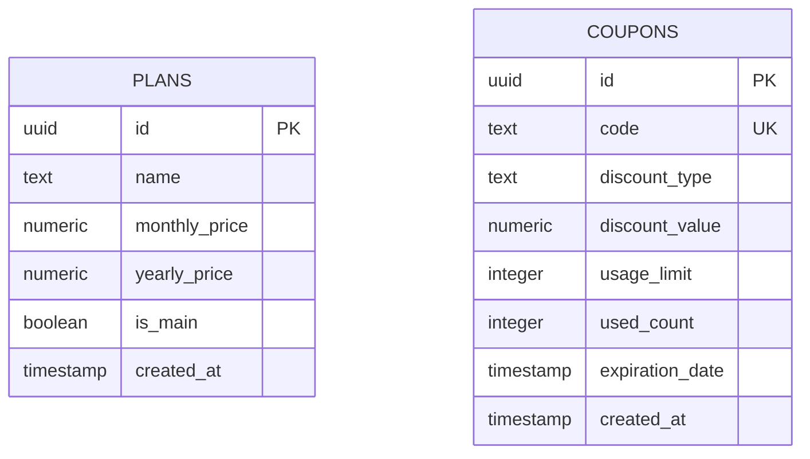
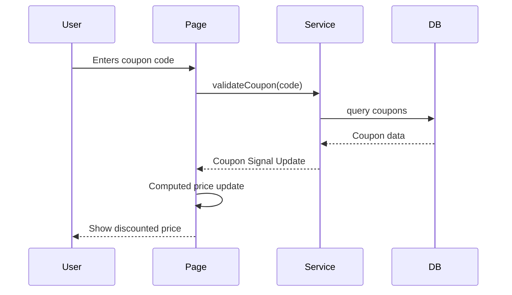
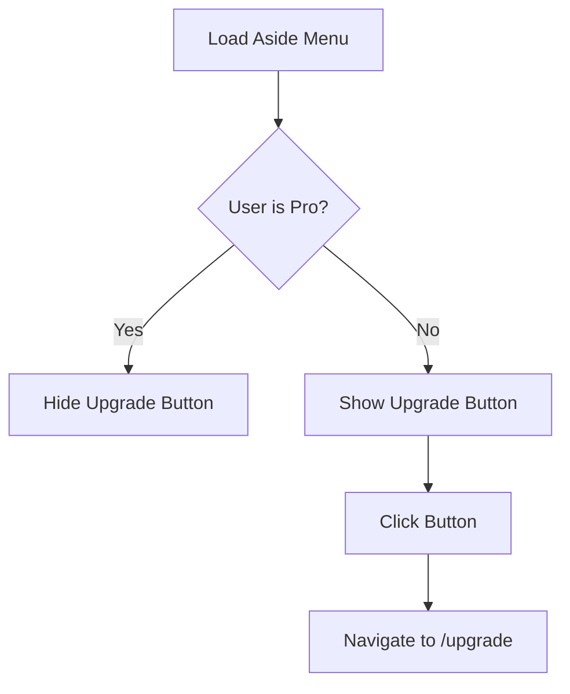
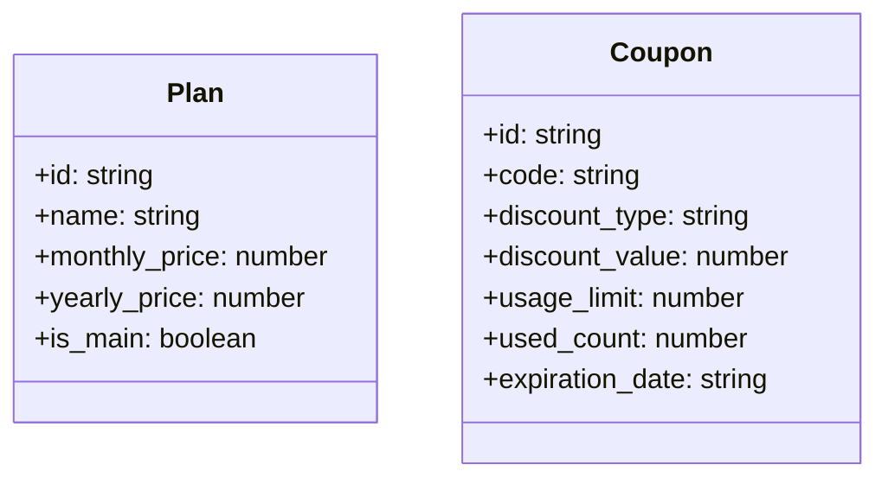

# Design Document

## Overview
This design covers the data structures and component logic for the "Semeando Devs" upgrade system. It focuses on the database schema, models, and the reactive frontend logic using Angular Signals. The scope is limited to data structure and display, with actual payment integration being out of scope.

### Change Type
new-feature

### Design Goals
1. Establish a scalable database schema for plans and coupons.
2. Implement reactive price calculation logic using Angular Signals.
3. Enhance the user navigation to promote "Pro" upgrades.

### References
- **REQ-1**: Subscription Plan Management
- **REQ-2**: Plan Seeding
- **REQ-3**: Discount Coupon System
- **REQ-4**: Upgrade Page Display
- **REQ-5**: Coupon Validation and Application
- **REQ-6**: Upgrade Navigation

## Frontend Architecture

### 3.1 Models
We will create interfaces in separate files:
- `src/app/models/plan.ts`
- `src/app/models/coupon.ts`

```typescript
// plan.ts
export interface Plan {
  id: string;
  name: string;
  monthly_price: number;
  yearly_price: number;
  is_main: boolean;
}

// coupon.ts
export interface Coupon {
  id: string;
  code: string;
  discount_type: 'percentage' | 'fixed';
  discount_value: number;
  usage_limit: number | null;
  used_count: number;
  expiration_date: string | null;
}
```

### 3.2 Services
We will create separate services:
- `src/app/services/plan.ts`: Handles plan fetching.
- `src/app/services/coupon.ts`: Handles coupon validation.

- `PlanService.getMainPlan()`: Fetches the plan with `is_main = true`.
- `CouponService.validateCoupon(code: string)`: Checks if a coupon exists and is valid.

## System Architecture

### DES-1: Database Schema and Seeding
Responsibility: Define the persistence layer for plans and coupons and provide default pricing data.



_Implements: REQ-1.1, REQ-1.2, REQ-2.1, REQ-3.1, REQ-3.2, REQ-5.1_

### DES-2: Frontend Reactive Logic
Responsibility: Handle data fetching, coupon validation, and dynamic price calculation using Angular Signals and Computed properties.



_Implements: REQ-3.2, REQ-4.1, REQ-5.1, REQ-5.2, REQ-5.3, REQ-6.2_

### DES-3: User Navigation and Promotion
Responsibility: Dynamically show or hide upgrade incentives based on the user's current subscription status.



_Implements: REQ-6.1, REQ-6.2_

## Code Anatomy

| File Path | Purpose | Implements |
|-----------|---------|------------|
| supabase/migrations/[timestamp]_add_payment_tables.sql | Database schema and seed data | DES-1 |
| src/app/models/plan.ts | Plan interface | DES-2 |
| src/app/models/coupon.ts | Coupon interface | DES-2 |
| src/app/services/plan.ts | Plan retrieval service | DES-2 |
| src/app/services/coupon.ts | Coupon validation service | DES-2 |
| src/app/pages/app/upgrade/upgrade.ts | Component logic for the upgrade page | DES-2 |
| src/app/pages/app/upgrade/upgrade.html | Template for the upgrade page | DES-3 |
| src/app/components/aside-menu/aside-menu.ts | Logic for upgrade button visibility | DES-3 |

## Data Models



_Implements: REQ-1.1, REQ-3.1_

## Traceability Matrix

| Design Element | Requirements |
|----------------|--------------|
| DES-1 | REQ-1.1, REQ-1.2, REQ-2.1, REQ-3.1, REQ-3.2, REQ-5.1 |
| DES-2 | REQ-3.2, REQ-4.1, REQ-5.1, REQ-5.2, REQ-5.3, REQ-6.2 |
| DES-3 | REQ-4.1, REQ-6.1, REQ-6.2 |
