# Design Document

## Overview
This design document describes the implementation of a PRO user tier. The system will use a new `public.profiles` table to store the PRO status, which will be synchronized with `auth.users` via database triggers and updated by the subscription Edge Function. The frontend will reactively update the UI based on this status using Angular Signals.

### Change Type
new-feature

### Design Goals
1. Provide a reliable and queryable source for user PRO status.
2. Ensure automated provisioning of profile records for all users.
3. Deliver a premium, reactive UI experience for PRO users.

### References
- **REQ-1**: PRO Status Management
- **REQ-2**: Navigation and Subscription Management
- **REQ-3**: Visual PRO Indicators
- **REQ-4**: Content Access Control

## System Architecture

### DES-1: Database Profile Management
The database will be extended with a `public.profiles` table to store the `is_pro` status. This table is linked to `auth.users` and is automatically populated via triggers to ensure consistency.

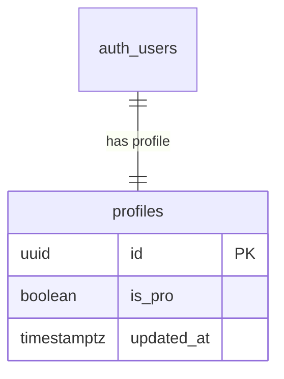
_Implements: REQ-1.1, REQ-1.2_

### DES-2: SQL Migration for Profile Management
Create the `profiles` table, the `handle_new_user()` function, and the `on_auth_user_created` trigger.

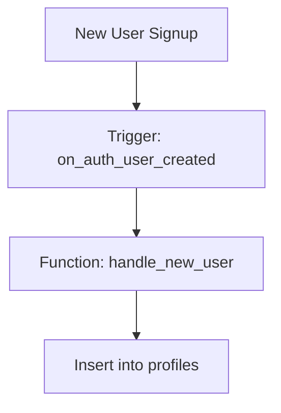
_Implements: REQ-1.2_

### DES-3: Update Ranking RPCs to include PRO status
The `get_ranking_overall`, `get_ranking_weekly`, and `get_ranking_monthly` RPCs will be modified to join the `xp` tables with the `profiles` table.

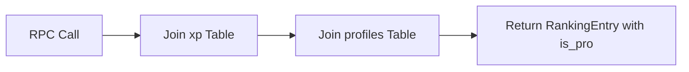
_Implements: REQ-1.4_

### DES-4: Subscription Success Handler in `create-subscription`
The `create-subscription` Edge Function will be responsible for updating the `is_pro` status in the `profiles` table upon successful payment processing.

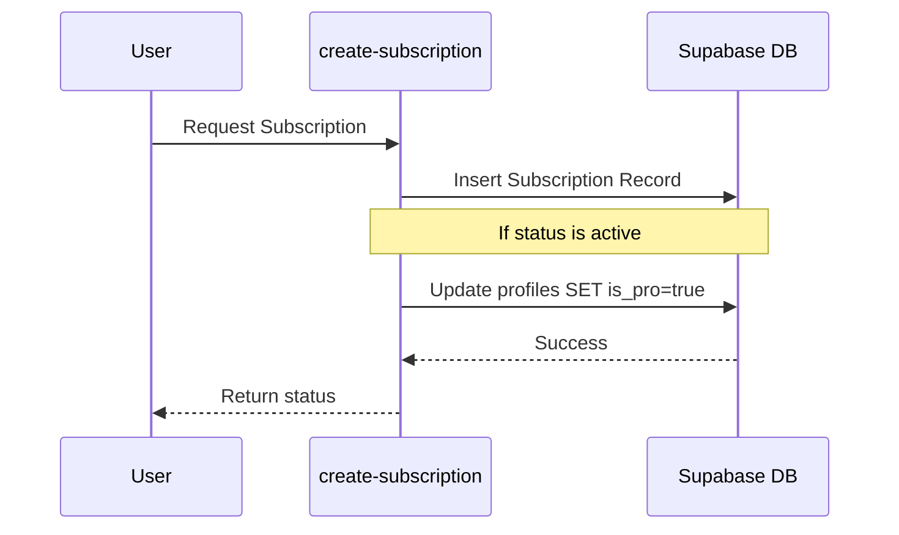
_Implements: REQ-1.3_

### DES-5: User Model Extension
Add `isPro: boolean` to the `User` interface in `src/models/user/user.ts`.

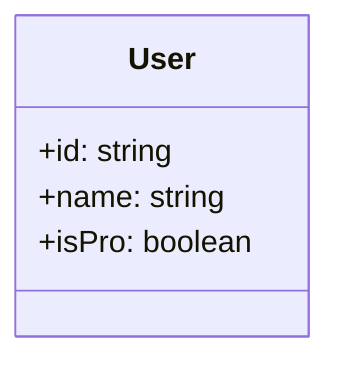
_Implements: REQ-3.1_

### DES-6: Ranking Entry Model Extension
Add `isPro?: boolean` to the `RankingEntry` interface in `src/models/ranking/ranking.ts`.

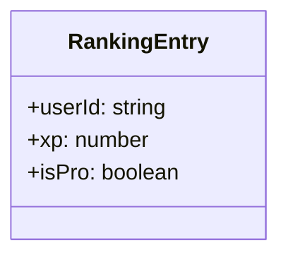
_Implements: REQ-1.4_

### DES-7: UserService Profile Fetching
Update `getUserProfile()` in `src/app/services/user.ts` to select from `profiles` table along with `auth.getUser()`.

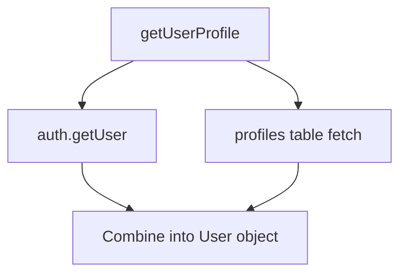
_Implements: REQ-3.1, REQ-3.2_

### DES-8: Aside Menu Logic
Use `userService.currentUser().isPro` in `AsideMenu` to toggle between upgrade and management buttons.

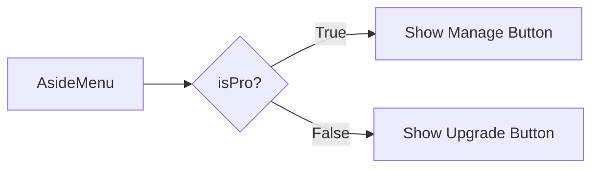
_Implements: REQ-2.1, REQ-2.2, REQ-2.3_

### DES-9: Header PRO Star
Add a star icon next to the user's avatar in `InternalHeader` if `isPro` is true.

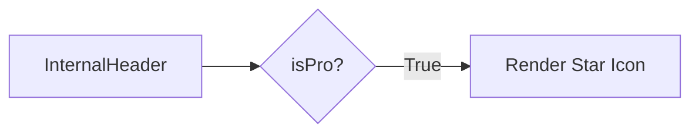
_Implements: REQ-3.1_

### DES-10: Ranking Page PRO Star
Add a star icon next to user names/avatars in the ranking list.

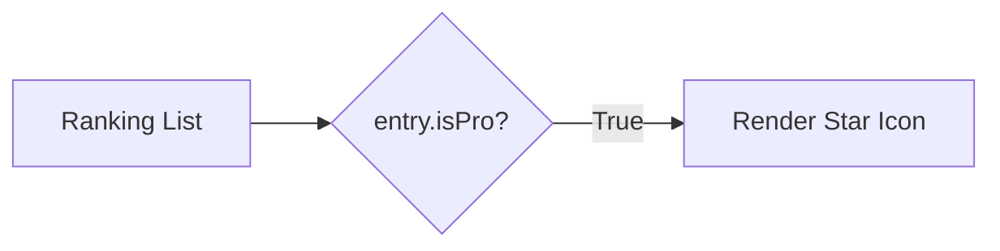
_Implements: REQ-3.2_

### DES-11: Module Page Ranking Star
Add a star icon in the module ranking list for PRO users in `modules.html`.

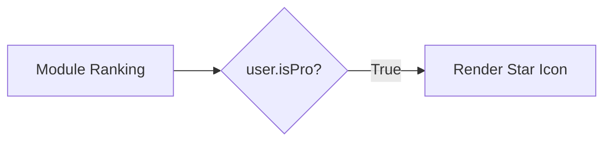
_Implements: REQ-3.3_

### DES-12: Submodule Access Logic
Update the loop in `loadData()` in `submodule.ts` to enforce tier-based gating.

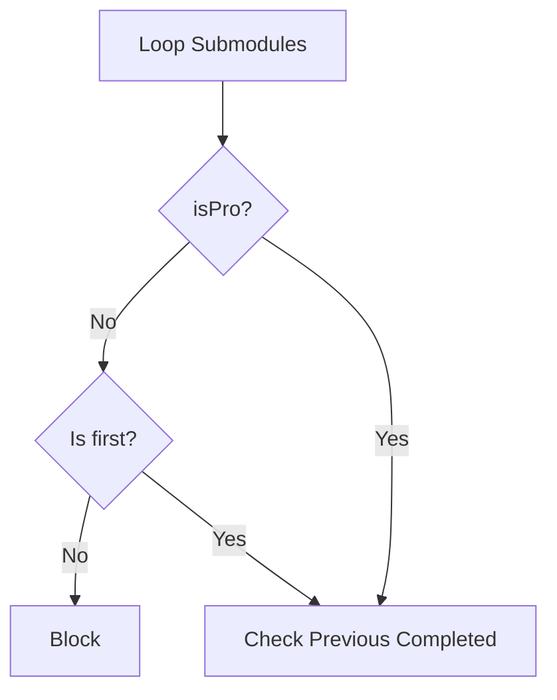
_Implements: REQ-4.1, REQ-4.2_

## Code Anatomy

| File Path | Purpose | Implements |
|-----------|---------|------------|
| supabase/migrations/ | Create profiles table, trigger, and update RPCs | DES-1, DES-2, DES-3 |
| supabase/functions/create-subscription/index.ts | Update PRO status on success | DES-4 |
| src/models/user/user.ts | Define isPro in User interface | DES-5 |
| src/models/ranking/ranking.ts | Define isPro in RankingEntry interface | DES-6 |
| src/app/services/user.ts | Fetch and expose PRO status via signals | DES-7 |
| src/app/components/aside-menu/aside-menu.ts | Toggle buttons based on isPro | DES-8 |
| src/app/components/internal-header/internal-header.html | Render star if isPro | DES-9 |
| src/app/pages/app/ranking/ranking.html | Render star if isPro | DES-10 |
| src/app/pages/app/modules/modules.html | Render star if isPro | DES-11 |
| src/app/pages/app/submodule/submodule.ts | Enforce access rules | DES-12 |

## Traceability Matrix

| Design Element | Requirements |
|----------------|--------------|
| DES-1 | REQ-1.1, REQ-1.2 |
| DES-2 | REQ-1.2 |
| DES-3 | REQ-1.4 |
| DES-4 | REQ-1.3 |
| DES-5 | REQ-3.1 |
| DES-6 | REQ-1.4 |
| DES-7 | REQ-3.1, REQ-3.2 |
| DES-8 | REQ-2.1, REQ-2.2, REQ-2.3 |
| DES-9 | REQ-3.1 |
| DES-10 | REQ-3.2 |
| DES-11 | REQ-3.3 |
| DES-12 | REQ-4.1, REQ-4.2 |
