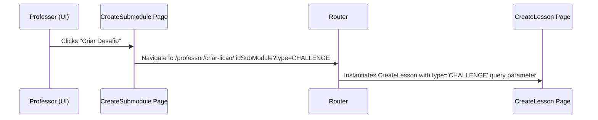
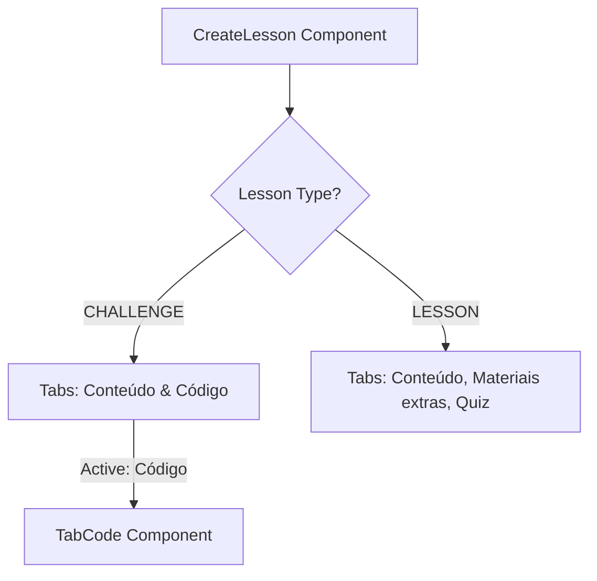
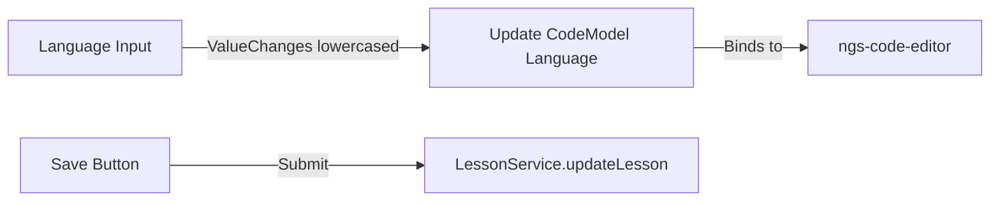

# Design Document

## Overview
This design document defines the technical design to allow professors to author coding challenges. The design focuses on updating the submodule interface with a "Criar Desafio" trigger, modifying the lesson editor to render only the "Conteúdo" and "Código" tabs for challenge lessons, and implementing the new `TabCode` component that hosts a language input field and an instance of `ngs-code-editor` for initial template code configuration.

### Change Type
new-feature

### Design Goals
1. Allow professors to create and configure challenges of type `CHALLENGE`.
2. Restrict the tab view of challenge lessons to relevant content and code, ensuring a focused user experience.
3. Automatically lowercase and synchronize the challenge language settings with the code editor syntax highlighting.
4. Persist challenge code settings securely via the existing `LessonService` layer.

### References
- **REQ-1**: Challenge Creation Trigger
- **REQ-2**: Challenge Editing and Tab Navigation
- **REQ-3**: Challenge Code Configuration

## System Architecture

### DES-1: Challenge Navigation and Triggering
Adds the creation option for challenges on the submodule page. The router initiates the new lesson configuration by specifying `type=CHALLENGE` as a query parameter when routing to the lesson creation page.

_Implements: REQ-1.1, REQ-1.2, REQ-1.3_

### DES-2: Challenge Tabs Layout and Component Routing
The `CreateLesson` component reads the lesson type (either from the query parameter during creation or the database during editing) and updates the navigation tab visibility. If the lesson type is `CHALLENGE`, it restricts the available tabs to "Conteúdo" and "Código" and displays the `TabCode` component when the "Código" tab is selected.

_Implements: REQ-2.1, REQ-2.2, REQ-2.3_

### DES-3: Challenge Code Authoring (TabCode Component)
The `TabCode` component manages challenge-specific input fields: language (forced to lowercase) and initial code (configured in the `ngs-code-editor`). It interacts with the `LessonService` to fetch and update the challenge configuration in the backend.

_Implements: REQ-3.1, REQ-3.2, REQ-3.3, REQ-3.4, REQ-3.5_

## Code Anatomy

| File Path | Purpose | Implements |
|-----------|---------|------------|
| src/app/pages/professor/professor-app/create-submodule/create-submodule.html | Add "Criar Desafio" button next to "Criar Lição" | DES-1 |
| src/app/pages/professor/professor-app/create-lesson/create-lesson.ts | Parse query params/lesson type and manage active tab state | DES-2 |
| src/app/pages/professor/professor-app/create-lesson/create-lesson.html | Conditionally show "Código" tab instead of extra materials and quiz | DES-2 |
| src/app/pages/professor/professor-app/create-lesson/tab-content/tab-content.ts | Dynamic lesson creation using input lessonType signal | DES-2 |
| src/app/pages/professor/professor-app/create-lesson/tab-code/tab-code.ts | [NEW] Code Tab Component managing form state and ngs-code-editor configuration | DES-3 |
| src/app/pages/professor/professor-app/create-lesson/tab-code/tab-code.html | [NEW] Markup for the Code Tab Component containing inputs and editor | DES-3 |
| src/app/pages/professor/professor-app/create-lesson/tab-code/tab-code.scss | [NEW] Layout styles for the Code Tab Component | DES-3 |

## Traceability Matrix

| Design Element | Requirements |
|----------------|--------------|
| DES-1 | REQ-1.1, REQ-1.2, REQ-1.3 |
| DES-2 | REQ-2.1, REQ-2.2, REQ-2.3 |
| DES-3 | REQ-3.1, REQ-3.2, REQ-3.3, REQ-3.4, REQ-3.5 |
