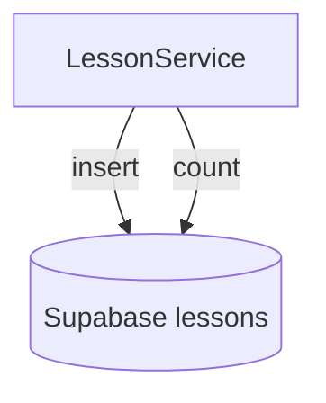
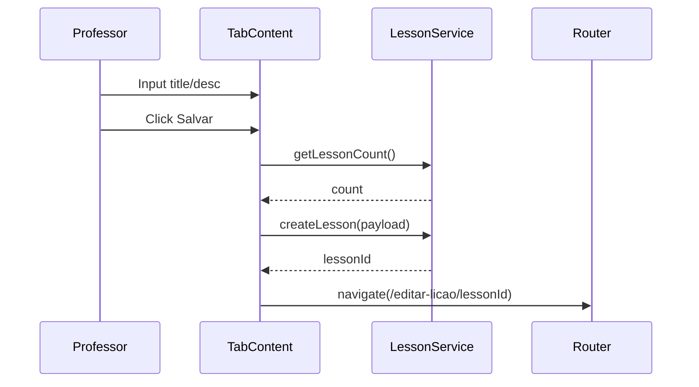
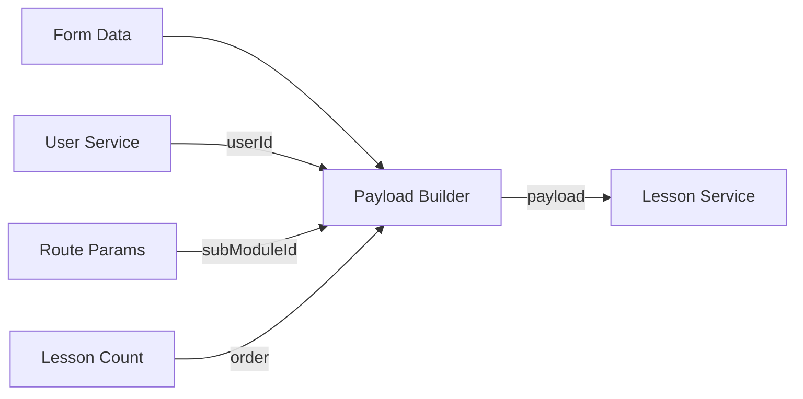
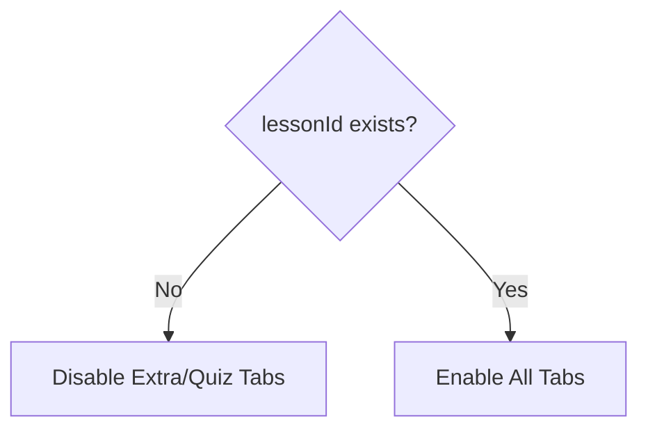
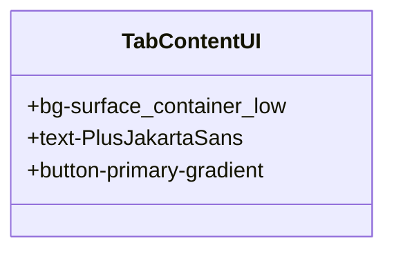

# Design Document

## Overview
This design outlines the technical approach for implementing lesson content authoring in the professor dashboard. It focuses on the `TabContent` component for initial lesson metadata creation and the integration with `LessonService`.

### Change Type
new-feature

### Design Goals
1. Provide a reactive form for lesson metadata (title, description).
2. Automate background fields (type, xp, order, ownerId).
3. Ensure secure persistence and navigation after creation.
4. Manage tab access based on lesson existence.

### References
- **REQ-001**: Lesson Metadata Form
- **REQ-002**: Automated Field Population
- **REQ-003**: Save and Redirect
- **REQ-004**: UI Tab Access Control
- **REQ-005**: Design Alignment
- **REQ-006**: Accessibility

## System Architecture

### DES-1: LessonService Extension
The `LessonService` will be enhanced to support lesson creation and count retrieval for ordering.

_Implements: REQ-002, REQ-003_

### DES-2: Reactive Metadata Form
The `TabContent` component implements a reactive form for metadata entry and submission logic.

_Implements: REQ-001, REQ-003_

### DES-3: Automated Payload Construction
Logic to populate non-user-facing fields before service invocation.

_Implements: REQ-002_

### DES-4: Conditional Tab Navigation
UI logic in the parent `CreateLesson` component to control tab interactivity.

_Implements: REQ-004_

### DES-5: UI and Styling Patterns
Alignment with the Neon Terminal design system and accessibility standards.

_Implements: REQ-005, REQ-006_

## Code Anatomy

| File Path | Purpose | Implements |
|-----------|---------|------------|
| src/app/services/lesson.ts | Data persistence and count retrieval | DES-1 |
| src/app/pages/professor/professor-app/create-lesson/tab-content/tab-content.ts | Form logic and workflow orchestration | DES-2, DES-3 |
| src/app/pages/professor/professor-app/create-lesson/create-lesson.ts | Parent container and tab state management | DES-4 |
| src/app/pages/professor/professor-app/create-lesson/tab-content/tab-content.html | Declarative UI following design system | DES-5 |

## Traceability Matrix

| Design Element | Requirements |
|----------------|--------------|
| DES-1 | REQ-002, REQ-003 |
| DES-2 | REQ-001, REQ-003 |
| DES-3 | REQ-002 |
| DES-4 | REQ-004 |
| DES-5 | REQ-005, REQ-006 |
