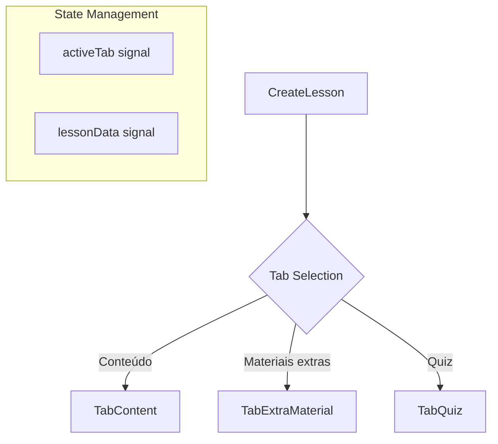
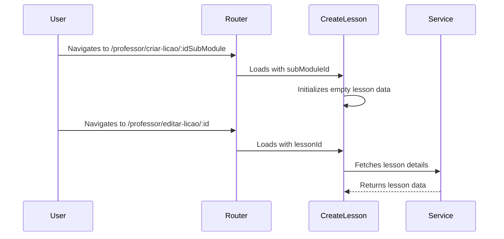
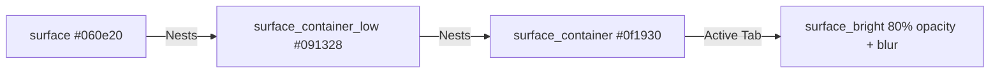
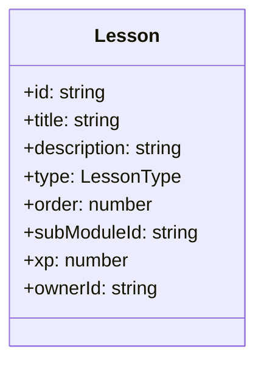

# Design Document

## Overview

The "Professor Create Lesson" feature is a multi-step authoring tool designed to streamline the creation of complex educational units. It uses a tabbed navigation system to separate core content, supplementary materials, and assessment (quizzes), ensuring a focused and organized workflow for educators. The interface adheres to the "Neon Terminal" design system, prioritizing depth through tonal layering and elimination of standard borders.

### Change Type

new-feature

### Design Goals

1. Provide a clear, organized authoring flow using a 3-tab navigation system.
2. Ensure consistent branding and aesthetics using the Neon Terminal design system.
3. Enable easy navigation from the submodule management page.
4. Support both creation (with parent submodule ID) and editing (with lesson ID) scenarios.

### References

- **REQ-1**: Lesson Authoring Navigation
- **REQ-2**: Tabbed Authoring Interface
- **REQ-3**: Lesson Creation Entry Point
- **REQ-4**: Layout Aesthetics

## System Architecture

### DES-1: Tabbed Authoring Shell

The `CreateLesson` component acts as the main container, managing the routing state and the active tab selection. It uses a reactive signal to track the current tab and conditionally renders the child components.

_Implements: REQ-2.1, REQ-2.2, REQ-2.3, REQ-2.4_

### DES-2: Routing & Integration

The feature is integrated into the Professor Area via dedicated routes. The routes share the same component but handle different parameters for creation vs. editing.

_Implements: REQ-1.1, REQ-1.2, REQ-1.3, REQ-3.1, REQ-3.2_

### DES-3: Visual Hierarchy (Neon Terminal)

The UI uses `surface_container` tokens to create depth. Tabs are styled with glassmorphism and subtle glows for the active state.

_Implements: REQ-4.1, REQ-4.2, REQ-4.3_

## Code Anatomy

| File Path | Purpose | Implements |
|-----------|---------|------------|
| src/app/pages/professor/professor-app/create-lesson/create-lesson.ts | Main container component and tab logic | DES-1, DES-2 |
| src/app/pages/professor/professor-app/create-lesson/tab-content/tab-content.ts | Lesson content authoring (Title, Type, XP, Markdown/Video) | DES-1 |
| src/app/pages/professor/professor-app/create-lesson/tab-extra-material/tab-extra-material.ts | Supplementary resources management | DES-1 |
| src/app/pages/professor/professor-app/create-lesson/tab-quiz/tab-quiz.ts | Quiz questions and answers management | DES-1 |
| src/app/app.routes.ts | Route definitions for lesson creation and editing | DES-2 |

## Data Models

## Traceability Matrix

| Design Element | Requirements |
|----------------|--------------|
| DES-1 | REQ-2.1, REQ-2.2, REQ-2.3, REQ-2.4 |
| DES-2 | REQ-1.1, REQ-1.2, REQ-1.3, REQ-3.1, REQ-3.2 |
| DES-3 | REQ-4.1, REQ-4.2, REQ-4.3 |
