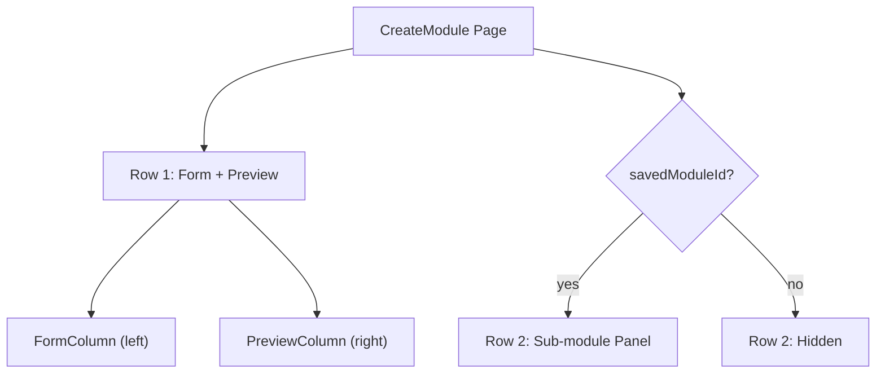
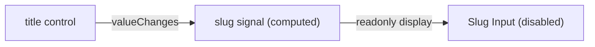
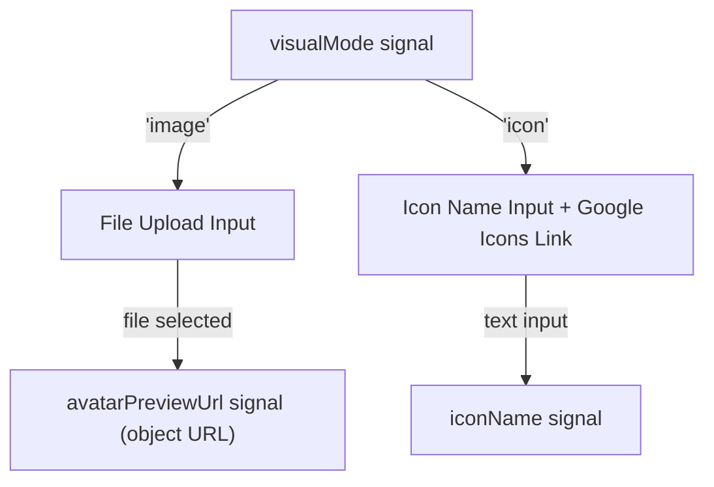
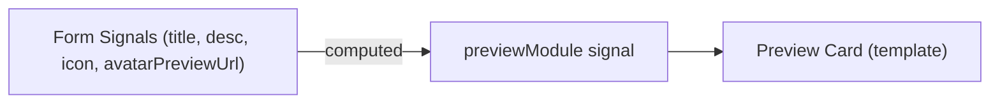
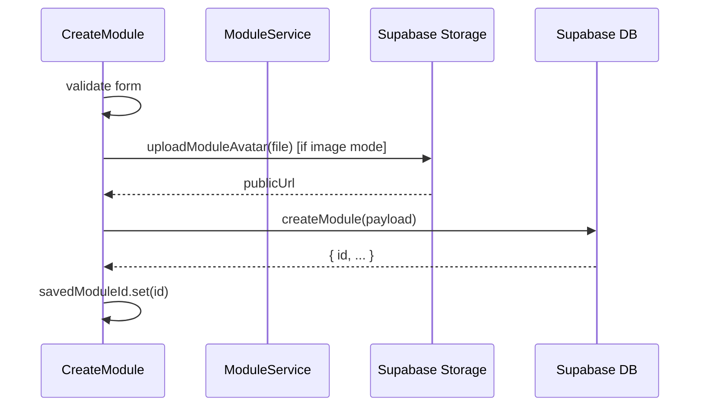
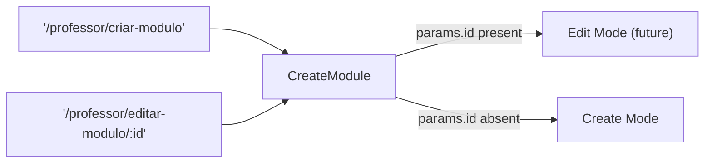
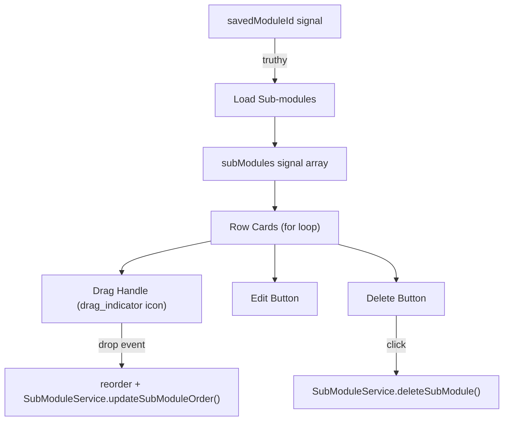
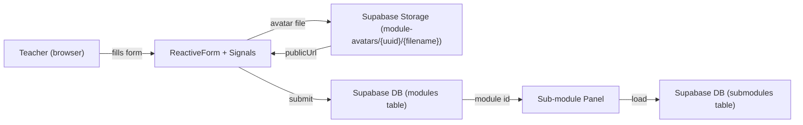
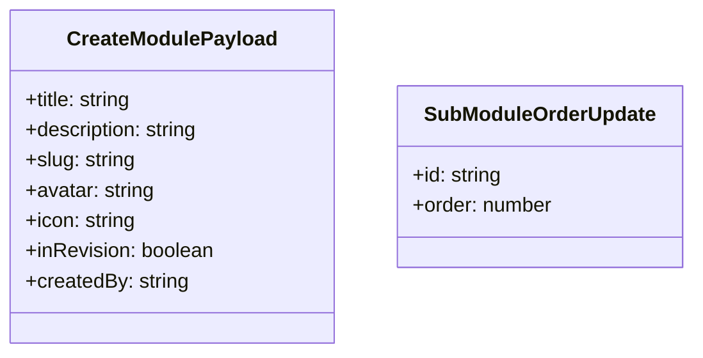

# Design Document

## Overview

The `CreateModule` page is extended from a shell component into a fully functional module authoring experience. The page is split into two logical zones: a top zone containing the creation form (left) and a live module card preview (right), and a bottom zone containing the sub-module list panel that is hidden until a module record has been saved. The same component is also registered under a parameterized edit route for future reuse.

All Supabase interactions follow the existing project pattern: a dedicated Angular `ModuleService` handles data operations, and a new `ModuleStorageService` (or extension of `ModuleService`) handles avatar uploads to Supabase Storage. The component itself is a standalone Angular 20 component using Signals for reactivity, `ReactiveFormsModule` for the form, and `ChangeDetectionStrategy.OnPush`.

Avatar files are stored under a namespaced path in the `module-avatars` Supabase Storage bucket using the pattern `{uuid}/{originalFilename}`, where `uuid` is generated client-side at upload time. This guarantees collision-free storage regardless of the filename chosen by the teacher.

### Change Type

`new-feature`

### Design Goals

1. Deliver a reactive, signal-driven authoring form that respects the existing Supabase service layer pattern.
2. Ensure avatar uploads are collision-free by prefixing every file path with a unique identifier.
3. Keep the `CreateModule` component reusable for the future edit flow (`/professor/editar-modulo/:id`).
4. Expose sub-module ordering to the server using the existing `order` field on the `submodules` table.

### References

- **REQ-1**: Module Creation Form
- **REQ-2**: Automatic Slug Generation
- **REQ-3**: Avatar or Icon Selection
- **REQ-4**: Live Module Card Preview
- **REQ-5**: Module Persistence
- **REQ-6**: Edit Module Route
- **REQ-7**: Sub-module List Panel

---

## System Architecture

### DES-1: CreateModule Page Layout

The `CreateModule` component renders two stacked rows. **Row 1** uses a two-column responsive grid (form left, preview right). **Row 2** is the sub-module panel, rendered only when the `savedModuleId` signal is truthy. The component detects whether it is in "create" or "edit" mode by reading the `id` route parameter via `ActivatedRoute`; if present, the component is in edit mode (data loading is out of scope for this iteration but the route infrastructure is in place).

_Implements: REQ-1.1, REQ-5.2, REQ-7.1_

---

### DES-2: Reactive Form and Slug Auto-Generation

The component declares a `FormGroup` with controls: `title` (required), `description` (required), `visualMode` (`'image' | 'icon'`), `iconName` (conditional), and `avatarFile` (conditional). The `slug` field is a read-only `computed()` signal derived from the `title` control value — it is not part of the `FormGroup`. Slug derivation normalizes the title using `String.normalize('NFD')` to strip accents, removes non-alphanumeric characters, collapses whitespace to hyphens, and trims leading/trailing hyphens.

_Implements: REQ-2.1, REQ-2.2, REQ-2.3_

---

### DES-3: Visual Identity Toggle (Avatar / Icon)

A two-button toggle controls the `visualMode` signal. When `visualMode === 'image'`, a file `<input accept="image/*">` is shown. When `visualMode === 'icon'`, a text input for the icon name and a link to Google Icons are shown. A local `avatarPreviewUrl` signal holds an object URL created via `URL.createObjectURL()` for the selected file, enabling the live preview without uploading. Validation at submit time checks that at least one of `iconName` or a selected file is present.

_Implements: REQ-3.1, REQ-3.2, REQ-3.3, REQ-3.4, REQ-3.5_

---

### DES-4: Live Module Card Preview

A `previewModule` computed signal assembles a partial `Module` object from current form values. This signal is passed to an inline preview block that mirrors the card markup from the student-facing modules list (`modules.html`). No child component is extracted; the preview markup lives directly in the `create-module.html` template to avoid prop threading overhead. The preview updates reactively through normal Angular signal binding.

_Implements: REQ-4.1, REQ-4.2, REQ-4.3_

---

### DES-5: Module Persistence and Avatar Upload

On form submission the component:
1. Validates the `FormGroup`; marks all controls as touched and aborts if invalid.
2. If `visualMode === 'image'` and a file is selected, calls `ModuleService.uploadModuleAvatar(file)` which uploads to the `module-avatars` Storage bucket under path `{crypto.randomUUID()}/{file.name}` and returns the public URL.
3. Calls `ModuleService.createModule(payload)` with the assembled module data including `created_by` from `UserService.currentUser()`.
4. On success, sets `savedModuleId` signal to the returned record's `id`.
5. On failure, sets `saveError` signal with the error message; form data is preserved.

`isSaving` signal drives the disabled/loading state of the save button during the async operation.

_Implements: REQ-5.1, REQ-5.3, REQ-5.4, REQ-3.6_

---

### DES-6: Edit Route Registration

A second route entry `{ path: 'editar-modulo/:id', ... }` is added inside the `professor` children array in `app.routes.ts`, pointing to the same `CreateModule` component. The component reads `ActivatedRoute.snapshot.params['id']` to determine mode.

_Implements: REQ-6.1, REQ-6.2_

---

### DES-7: Sub-module List Panel

The sub-module panel becomes visible when `savedModuleId` is truthy. It loads sub-modules via `SubModuleService.getSubModulesByModuleId(id)` (a new method added to the existing service). Each sub-module renders as a full-width row card. The drag-handle icon uses the Material Symbol `drag_indicator`; the row uses the HTML5 Drag and Drop API to reorder items in the `subModules` signal array. After a drop event, `SubModuleService.updateSubModuleOrder(updates)` is called with an array of `{ id, order }` pairs. Delete calls `SubModuleService.deleteSubModule(id)` and removes the item from the signal array on success.

_Implements: REQ-7.2, REQ-7.3, REQ-7.4, REQ-7.5, REQ-7.6_

---

## Data Flow

---

## Code Anatomy

| File Path | Purpose | Implements |
|-----------|---------|------------|
| `src/app/pages/professor/professor-app/create-module/create-module.ts` | Main page component: form logic, signals, slug derivation, save orchestration | DES-1, DES-2, DES-3, DES-4, DES-5, DES-7 |
| `src/app/pages/professor/professor-app/create-module/create-module.html` | Two-row layout: form + preview (row 1), sub-module panel (row 2) | DES-1, DES-4, DES-7 |
| `src/app/pages/professor/professor-app/create-module/create-module.scss` | Component-scoped styles | DES-1 |
| `src/app/services/module.ts` | Extended with `createModule()` and `uploadModuleAvatar()` methods | DES-5 |
| `src/app/services/sub-module.ts` | Extended with `getSubModulesByModuleId()`, `updateSubModuleOrder()`, `deleteSubModule()` | DES-7 |
| `src/app/app.routes.ts` | New `editar-modulo/:id` child route under `professor` | DES-6 |

---

## Data Models

The existing `Module` interface requires no changes. The existing `SubModule` interface requires no changes. The `createModule` service method accepts a new input type:

---

## Error Handling

| Error Condition | Response | Recovery |
|-----------------|----------|----------|
| Required field empty at submit | Inline validation message next to field; save blocked | Teacher corrects field and resubmits |
| No visual identity at submit | Error message below the toggle | Teacher selects icon or uploads image |
| Avatar upload failure | `saveError` signal set; form data preserved | Teacher retries or switches to icon mode |
| Module DB insert failure | `saveError` signal set; sub-module panel stays hidden | Teacher retries; form data preserved |
| Sub-module load failure | Error state displayed inside sub-module panel | Retry button or page reload |
| Sub-module delete failure | Toast/inline error; item remains in list | Teacher retries |
| Sub-module reorder failure | Optimistic UI reverted; error shown | Drag reverted to previous order |

---

## Impact Analysis

| Affected Area | Impact Level | Notes |
|---------------|--------------|-------|
| `src/app/services/module.ts` | Medium | Two new methods added; existing methods unchanged |
| `src/app/services/sub-module.ts` | Medium | Three new methods added; existing method unchanged |
| `src/app/app.routes.ts` | Low | One new child route added; no existing route changed |

### Testing Requirements

| Test Type | Coverage Goal | Notes |
|-----------|---------------|-------|
| Unit | Slug derivation logic | Accent stripping, special characters, hyphen trimming |
| Unit | `createModule` service method | Mock Supabase; verify payload shape and error propagation |
| Unit | `uploadModuleAvatar` service method | Verify UUID-prefixed path is used; mock Storage |
| Unit | `updateSubModuleOrder` service method | Verify correct `{ id, order }` pairs sent |

---

## Traceability Matrix

| Design Element | Requirements |
|----------------|--------------|
| DES-1 | REQ-1.1, REQ-5.2, REQ-7.1 |
| DES-2 | REQ-2.1, REQ-2.2, REQ-2.3 |
| DES-3 | REQ-3.1, REQ-3.2, REQ-3.3, REQ-3.4, REQ-3.5 |
| DES-4 | REQ-4.1, REQ-4.2, REQ-4.3 |
| DES-5 | REQ-3.6, REQ-5.1, REQ-5.3, REQ-5.4 |
| DES-6 | REQ-6.1, REQ-6.2 |
| DES-7 | REQ-7.2, REQ-7.3, REQ-7.4, REQ-7.5, REQ-7.6 |
