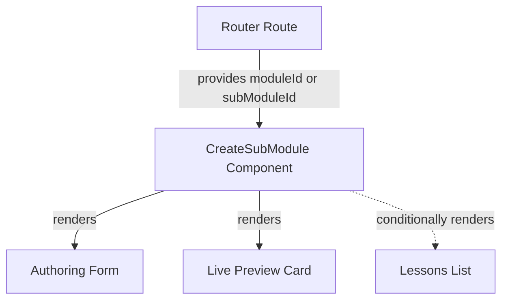
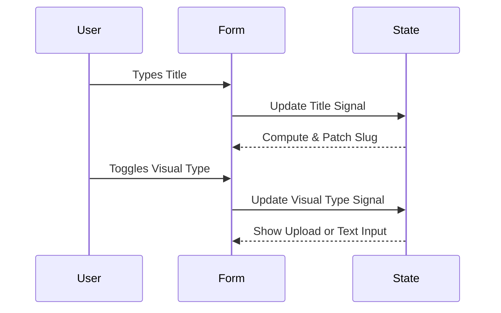
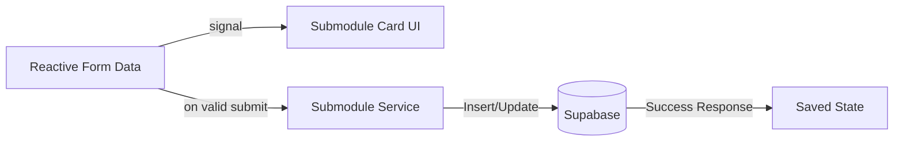
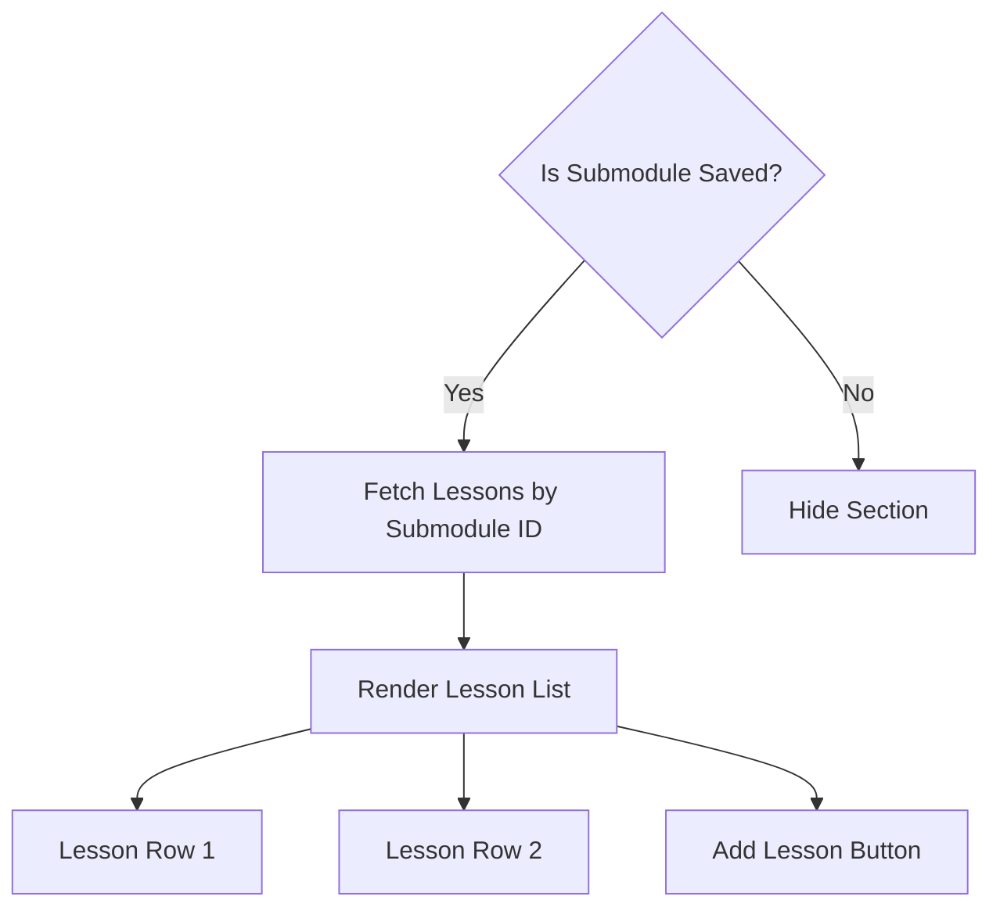

# Design Document

## Overview

This document outlines the technical design for the professor's submodule creation and editing interface. The feature extends the course building capabilities, allowing educators to attach submodules to existing modules. The architecture relies on Angular's modern reactive features (Signals, Reactive Forms) to provide a fluid, real-time authoring experience including live previews and seamless transitions between creation and editing modes.

### Change Type

new-feature

### Design Goals

1. Implement a responsive, two-column layout for authoring and previewing submodules.
2. Provide a seamless transition between creating a new submodule and editing an existing one using the same component.
3. Manage visual identity uploads (images) and icon selections securely via Supabase integration.
4. Establish a foundation for lesson management within a submodule context.

### References

- **REQ-1**: Submodule Form Initialization and Layout
- **REQ-2**: Auto-generating Submodule Slug
- **REQ-3**: Submodule Visual Identity Selection
- **REQ-4**: Submodule Live Preview
- **REQ-5**: Submodule Creation and Validation
- **REQ-6**: Submodule Edit Mode
- **REQ-7**: Lesson List Management

## System Architecture

### DES-1: Submodule Authoring Component

This component acts as the main container for the submodule creation and edit route. It manages the two-column layout, fetching the `moduleId` from the route or query parameters for creation, or fetching the submodule details for editing. It provides the "Back to Module" navigation and controls the conditional display of the lessons list based on the submodule's saved state.

_Implements: REQ-1.1, REQ-1.2, REQ-1.3, REQ-1.4, REQ-6.1_

### DES-2: Reactive Form State and Slug Generation

The form utilizes Angular Reactive Forms combined with Signals for derived state. The slug generation automatically listens to changes in the title field, transforming the string into a URL-friendly format and patching the read-only slug field. A signal tracks the toggle state between "image" and "icon" modes to dynamically render the corresponding input fields.

_Implements: REQ-2.1, REQ-3.1, REQ-3.2, REQ-3.3_

### DES-3: Live Preview and Persistence

The component passes its reactive form values directly into the existing `SubmoduleCard` component via signal inputs. Upon clicking save, the component triggers validation. Valid data is sent to the `SubmoduleService`, which interacts with Supabase to insert a new record (using the parent `moduleId`) or update an existing one. Success updates the internal state to "saved", enabling the lessons view.

_Implements: REQ-4.1, REQ-5.1, REQ-5.2, REQ-5.3, REQ-6.2_

### DES-4: Lessons List Integration

Once the submodule exists (either freshly saved or in edit mode), the lessons list section becomes visible. It fetches existing lessons tied to the `submodule_id`. Each lesson is rendered as a full-width row with a drag handle, visual identity, title, and action buttons (Edit/Delete). The "Add Lesson" button provides routing to a future lesson creation flow.

_Implements: REQ-7.1, REQ-7.2, REQ-7.3_

## Code Anatomy

| File Path | Purpose | Implements |
|-----------|---------|------------|
| src/app/pages/professor/professor-app/create-submodule/create-submodule.ts | Core orchestration, layout, form state, and persistence | DES-1, DES-2, DES-3, DES-4 |
| src/app/pages/professor/professor-app/create-submodule/create-submodule.html | UI template containing form, preview, and lessons list | DES-1, DES-2, DES-3, DES-4 |
| src/app/services/submodule/submodule.service.ts | Supabase integration for CRUD operations on submodules | DES-3 |

## Traceability Matrix

| Design Element | Requirements |
|----------------|--------------|
| DES-1 | REQ-1.1, REQ-1.2, REQ-1.3, REQ-1.4, REQ-6.1 |
| DES-2 | REQ-2.1, REQ-3.1, REQ-3.2, REQ-3.3 |
| DES-3 | REQ-4.1, REQ-5.1, REQ-5.2, REQ-5.3, REQ-6.2 |
| DES-4 | REQ-7.1, REQ-7.2, REQ-7.3 |
