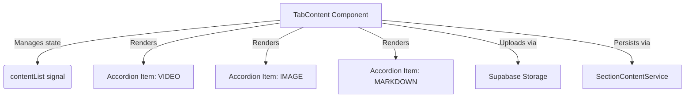
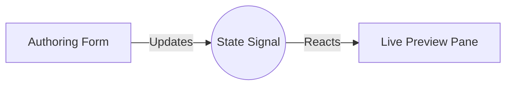
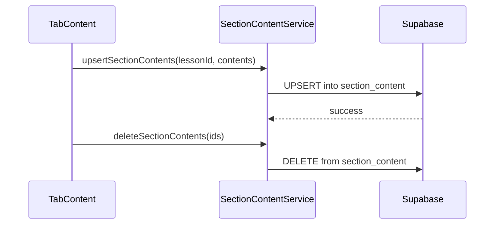

# Design Document

## Overview

This enhancement introduces a dynamic lesson content authoring interface within the existing professor dashboard. It allows professors to append, reorder, edit, and remove `VIDEO`, `IMAGE`, and `MARKDOWN` blocks for a specific lesson. The design features a two-column responsive layout where the left column is dedicated to authoring the lesson metadata and content, while the right column provides a live student preview. 

### Change Type

enhancement

### Design Goals

1. Seamlessly integrate the content authoring block between the lesson info and the save button.
2. Provide a reactive, draggable interface for content reordering.
3. Ensure a real-time preview of the content is visible alongside the editor for immediate feedback.

### References

- **REQ-1**: Add Lesson Content
- **REQ-2**: Manage Content Blocks
- **REQ-3**: Content Specific Inputs
- **REQ-4**: Layout and Preview

## System Architecture

### DES-1: Content Authoring Interface

The `TabContent` component will be updated to include an array of `SectionContent` signals. It will render an accordion-style list for each content block, utilizing `@angular/cdk/drag-drop` for reordering capabilities. It will also manage the upload of images to Supabase Storage and bind the text editor for markdown content.

_Implements: REQ-1.1, REQ-1.2, REQ-1.3, REQ-2.1, REQ-2.2, REQ-2.3, REQ-2.4, REQ-3.1, REQ-3.2, REQ-3.3_

### DES-2: Live Student Preview

The layout of `TabContent` (or its parent container) will be modified into a two-column grid on desktop screens. The right column will render a live preview using the existing lesson content rendering mechanism, reacting to changes in the `contentList` signal from `DES-1`.

_Implements: REQ-4.1, REQ-4.2_

### DES-3: SectionContent Persistence

The `SectionContentService` will be expanded to support the upsert and deletion of multiple `SectionContent` records. The save action in `TabContent` will orchestrate saving the lesson metadata and then sync the state of the content blocks.

_Implements: REQ-2.3_

## Code Anatomy

| File Path | Purpose | Implements |
|-----------|---------|------------|
| src/app/pages/professor/professor-app/create-lesson/tab-content/tab-content.ts | Manages the dynamic array of section contents, drag/drop, and layout | DES-1, DES-2 |
| src/app/pages/professor/professor-app/create-lesson/tab-content/tab-content.html | Contains the UI for accordions, inputs, and the two-column preview layout | DES-1, DES-2 |
| src/app/services/section-content.ts | Exposes methods for upserting and deleting content blocks | DES-3 |

## Traceability Matrix

| Design Element | Requirements |
|----------------|--------------|
| DES-1 | REQ-1.1, REQ-1.2, REQ-1.3, REQ-2.1, REQ-2.2, REQ-2.3, REQ-2.4, REQ-3.1, REQ-3.2, REQ-3.3 |
| DES-2 | REQ-4.1, REQ-4.2 |
| DES-3 | REQ-2.3 |
